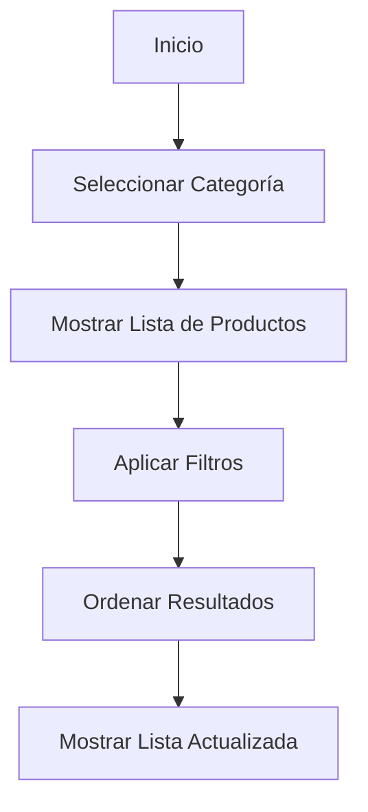
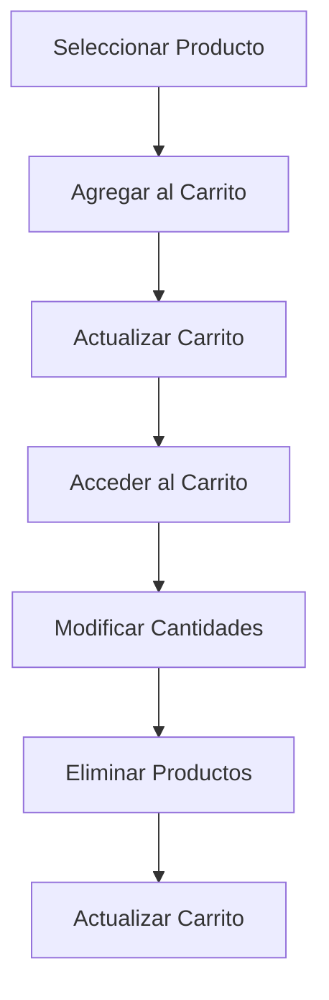
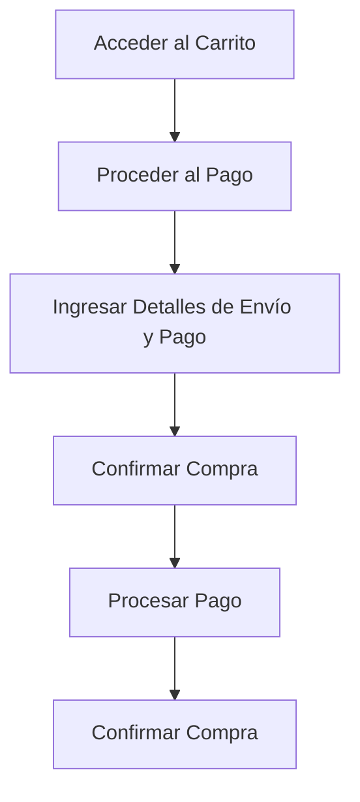

# Visión General del Proyecto: Sistema de Carrito de Compras con Django

## Introducción a la Unidad y Objetivos de Aprendizaje

En esta unidad, nos enfocaremos en proporcionar una visión general del proyecto "Sistema de Carrito de Compras con Django". Este capítulo es fundamental para entender el alcance y los objetivos del sistema, así como para establecer una base sólida para el desarrollo de las funcionalidades específicas en las unidades posteriores. Al final de esta unidad, los lectores deberían ser capaces de:

1. Comprender la estructura general y los componentes principales del sistema de carrito de compras.
2. Identificar los casos de uso más relevantes y cómo se interrelacionan.
3. Interpretar diagramas de flujo que describen los procesos clave del sistema.
4. Reconocer los requisitos no funcionales que deben ser considerados durante el desarrollo.
5. Implementar una base de código inicial en Python utilizando Django.

## Documento Funcional de Requerimientos

### Descripción Detallada de la Funcionalidad

El sistema de carrito de compras es una aplicación web que permite a los usuarios navegar por un catálogo de productos, agregar productos a un carrito de compras, modificar las cantidades de los productos en el carrito y proceder al pago. La funcionalidad principal del sistema incluye:

1. **Navegación de Productos**: Los usuarios pueden ver una lista de productos disponibles, filtrarlos por categoría, precio, popularidad, etc.
2. **Gestión del Carrito de Compras**: Los usuarios pueden agregar productos al carrito, eliminar productos del carrito y actualizar las cantidades de los productos en el carrito.
3. **Proceso de Pago**: Los usuarios pueden proceder al pago, ingresar detalles de envío y pago, y confirmar la compra.
4. **Gestión de Usuarios**: Registro, inicio de sesión y gestión de perfiles de usuario.
5. **Administración del Sistema**: Los administradores pueden agregar, modificar y eliminar productos, así como gestionar pedidos y usuarios.

### Casos de Uso

#### Caso de Uso 1: Navegación de Productos

**Descripción**: Un usuario navega por el catálogo de productos, aplicando filtros y ordenando los resultados según sus preferencias.

**Actores**: Usuario

**Flujo Principal**:
1. El usuario accede a la página principal.
2. El usuario selecciona una categoría de productos.
3. El sistema muestra una lista de productos de la categoría seleccionada.
4. El usuario aplica filtros y ordena los resultados.
5. El sistema actualiza la lista de productos según los filtros aplicados.

#### Caso de Uso 2: Gestión del Carrito de Compras

**Descripción**: Un usuario agrega productos al carrito, modifica las cantidades y elimina productos del carrito.

**Actores**: Usuario

**Flujo Principal**:
1. El usuario selecciona un producto de la lista.
2. El usuario agrega el producto al carrito.
3. El sistema actualiza el carrito de compras.
4. El usuario accede al carrito de compras.
5. El usuario modifica las cantidades o elimina productos del carrito.
6. El sistema actualiza el carrito de compras.

#### Caso de Uso 3: Proceso de Pago

**Descripción**: Un usuario procede al pago, ingresa detalles de envío y pago, y confirma la compra.

**Actores**: Usuario

**Flujo Principal**:
1. El usuario accede al carrito de compras.
2. El usuario procede al pago.
3. El usuario ingresa detalles de envío y pago.
4. El usuario confirma la compra.
5. El sistema procesa el pago y confirma la compra.

### Diagramas de Flujo

#### Diagrama de Flujo: Navegación de Productos



#### Diagrama de Flujo: Gestión del Carrito de Compras



#### Diagrama de Flujo: Proceso de Pago



### Requisitos No Funcionales

1. **Rendimiento**: El sistema debe ser capaz de manejar hasta 1000 usuarios concurrentes sin degradación significativa del rendimiento.
2. **Seguridad**: Los datos de los usuarios y las transacciones deben ser protegidos mediante cifrado SSL y otras medidas de seguridad.
3. **Escalabilidad**: El sistema debe ser escalable para soportar un aumento en el número de usuarios y productos sin requerir cambios significativos en la arquitectura.
4. **Usabilidad**: La interfaz de usuario debe ser intuitiva y fácil de usar, con tiempos de respuesta rápidos.
5. **Mantenibilidad**: El código debe ser modular y bien documentado para facilitar su mantenimiento y actualización.

## Implementación en Python

### Explicación Paso a Paso del Código

Para implementar un sistema de carrito de compras en Django, comenzaremos con la configuración básica del proyecto y la creación de los modelos necesarios. Django es un framework de alto nivel que facilita el desarrollo rápido de aplicaciones web seguras y mantenibles.

#### Paso 1: Configuración del Proyecto

Primero, instalaremos Django y crearemos un nuevo proyecto.

```bash
pip install django
django-admin startproject carrito_compras
cd carrito_compras
```

#### Paso 2: Creación de la Aplicación

Dentro del proyecto, crearemos una nueva aplicación llamada `tienda`.

```bash
python manage.py startapp tienda
```

#### Paso 3: Definición de Modelos

Definiremos los modelos para los productos y el carrito de compras en `tienda/models.py`.

```python
from django.db import models

class Producto(models.Model):
    nombre = models.CharField(max_length=200)
    descripcion = models.TextField()
    precio = models.DecimalField(max_digits=10, decimal_places=2)
    stock = models.IntegerField()
    categoria = models.CharField(max_length=100)

    def __str__(self):
        return self.nombre

class Carrito(models.Model):
    usuario = models.ForeignKey('auth.User', on_delete=models.CASCADE)
    creado = models.DateTimeField(auto_now_add=True)

class ItemCarrito(models.Model):
    carrito = models.ForeignKey(Carrito, on_delete=models.CASCADE)
    producto = models.ForeignKey(Producto, on_delete=models.CASCADE)
    cantidad = models.IntegerField()

    def __str__(self):
        return f'{self.cantidad} x {self.producto.nombre}'
```

#### Paso 4: Migraciones y Administración

Aplicaremos las migraciones y registraremos los modelos en el administrador de Django.

```bash
python manage.py makemigrations
python manage.py migrate
```

En `tienda/admin.py`:

```python
from django.contrib import admin
from .models import Producto, Carrito, ItemCarrito

admin.site.register(Producto)
admin.site.register(Carrito)
admin.site.register(ItemCarrito)
```

### Código Fuente Completo y Comentado

A continuación, se presenta el código fuente completo y comentado para la configuración inicial del sistema de carrito de compras.

```python
# tienda/models.py

from django.db import models

class Producto(models.Model):
    """
    Modelo que representa un producto en la tienda.
    """
    nombre = models.CharField(max_length=200)
    descripcion = models.TextField()
    precio = models.DecimalField(max_digits=10, decimal_places=2)
    stock = models.IntegerField()
    categoria = models.CharField(max_length=100)

    def __str__(self):
        return self.nombre

class Carrito(models.Model):
    """
    Modelo que representa un carrito de compras.
    """
    usuario = models.ForeignKey('auth.User', on_delete=models.CASCADE)
    creado = models.DateTimeField(auto_now_add=True)

class ItemCarrito(models.Model):
    """
    Modelo que representa un ítem en el carrito de compras.
    """
    carrito = models.ForeignKey(Carrito, on_delete=models.CASCADE)
    producto = models.ForeignKey(Producto, on_delete=models.CASCADE)
    cantidad = models.IntegerField()

    def __str__(self):
        return f'{self.cantidad} x {self.producto.nombre}'
```

### Ejemplos de Uso y Pruebas Unitarias

Para verificar que nuestros modelos funcionan correctamente, podemos escribir algunas pruebas unitarias en `tienda/tests.py`.

```python
from django.test import TestCase
from .models import Producto, Carrito, ItemCarrito
from django.contrib.auth.models import User

class ModeloTests(TestCase):

    def setUp(self):
        self.usuario = User.objects.create_user(username='testuser', password='12345')
        self.producto = Producto.objects.create(
            nombre='Producto de Prueba',
            descripcion='Descripción del producto de prueba',
            precio=100.00,
            stock=10,
            categoria='Categoría de Prueba'
        )
        self.carrito = Carrito.objects.create(usuario=self.usuario)

    def test_crear_producto(self):
        self.assertEqual(self.producto.nombre, 'Producto de Prueba')

    def test_agregar_producto_al_carrito(self):
        item_carrito = ItemCarrito.objects.create(carrito=self.carrito, producto=self.producto, cantidad=2)
        self.assertEqual(item_carrito.cantidad, 2)
        self.assertEqual(item_carrito.producto.nombre, 'Producto de Prueba')
```

### Mejores Prácticas y Consideraciones de Diseño

1. **Modularidad**: Mantener el código modular facilita su mantenimiento y escalabilidad. Dividir las funcionalidades en aplicaciones separadas dentro del proyecto Django puede ayudar a mantener el código organizado.
2. **Seguridad**: Asegurarse de que todas las transacciones y datos sensibles estén protegidos mediante cifrado SSL. Utilizar las herramientas de autenticación y autorización de Django para proteger las rutas y datos.
3. **Rendimiento**: Utilizar técnicas de caché y optimización de consultas para mejorar el rendimiento del sistema. Django ofrece varias opciones para caché que pueden ser útiles.
4. **Pruebas**: Escribir pruebas unitarias y de integración para asegurar que todas las funcionalidades del sistema funcionan correctamente. Django proporciona un framework de pruebas robusto que facilita esta tarea.
5. **Documentación**: Mantener una buena documentación del código y de las funcionalidades del sistema. Esto no solo ayuda a los desarrolladores actuales, sino también a futuros desarrolladores que trabajen en el proyecto.

En resumen, esta unidad proporciona una visión general del sistema de carrito de compras con Django, desde la definición de los requisitos funcionales y no funcionales hasta la implementación inicial y las mejores prácticas de diseño. Con esta base, los desarrolladores pueden avanzar hacia la implementación de funcionalidades más específicas y complejas en las unidades siguientes.