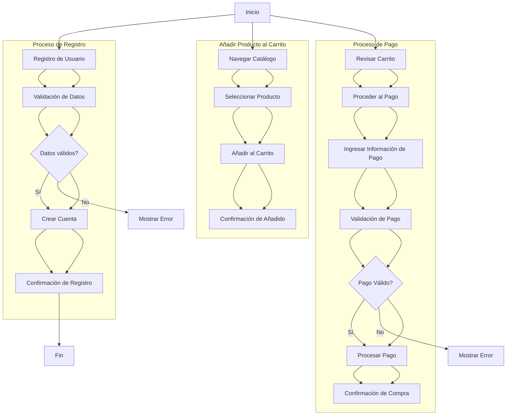

# Unidad: Alcance del Proyecto Django

## Introducción a la Unidad y Objetivos de Aprendizaje

En esta unidad, exploraremos el alcance del proyecto Django en el contexto del desarrollo de un sistema de carrito de compras. Este capítulo es fundamental para comprender las limitaciones y las capacidades del proyecto, así como para establecer expectativas claras sobre lo que se puede lograr con Django. Al finalizar esta unidad, los lectores serán capaces de:

1. Definir el alcance del proyecto Django en el desarrollo de un sistema de carrito de compras.
2. Identificar las funcionalidades clave que se implementarán.
3. Comprender los casos de uso y los flujos de trabajo principales.
4. Reconocer los requisitos no funcionales que impactan el proyecto.
5. Implementar un prototipo básico del sistema utilizando Django.

## Documento Funcional de Requerimientos

### a. Descripción Detallada de la Funcionalidad

El sistema de carrito de compras con Django tiene como objetivo proporcionar una plataforma en línea donde los usuarios puedan navegar por productos, añadirlos a un carrito de compras, y proceder a la compra. Las funcionalidades clave incluyen:

1. **Gestión de Usuarios**: Registro, inicio de sesión, y gestión de perfiles.
2. **Catálogo de Productos**: Visualización de productos, búsqueda y filtrado.
3. **Carrito de Compras**: Añadir, eliminar y actualizar productos en el carrito.
4. **Proceso de Pago**: Integración con pasarelas de pago para completar compras.
5. **Historial de Pedidos**: Visualización de pedidos anteriores y su estado.
6. **Administración**: Panel de administración para gestionar productos, usuarios y pedidos.

### b. Casos de Uso

#### Caso de Uso 1: Registro de Usuario

**Descripción**: Un nuevo usuario se registra en la plataforma proporcionando su información básica.

**Actor Principal**: Usuario

**Flujo Principal**:
1. El usuario accede a la página de registro.
2. El usuario completa el formulario de registro con su información.
3. El sistema valida la información y crea una nueva cuenta.
4. El usuario recibe una confirmación de registro.

#### Caso de Uso 2: Añadir Producto al Carrito

**Descripción**: Un usuario añade un producto a su carrito de compras.

**Actor Principal**: Usuario

**Flujo Principal**:
1. El usuario navega por el catálogo de productos.
2. El usuario selecciona un producto y hace clic en "Añadir al carrito".
3. El sistema añade el producto al carrito del usuario.
4. El usuario recibe una notificación de que el producto ha sido añadido.

#### Caso de Uso 3: Proceso de Pago

**Descripción**: Un usuario completa el proceso de pago para los productos en su carrito.

**Actor Principal**: Usuario

**Flujo Principal**:
1. El usuario revisa su carrito y procede al pago.
2. El usuario ingresa la información de pago.
3. El sistema valida la información y procesa el pago.
4. El usuario recibe una confirmación de compra.

### c. Diagramas de Flujo



### d. Requisitos No Funcionales

1. **Seguridad**: El sistema debe proteger la información del usuario y las transacciones financieras mediante encriptación y autenticación segura.
2. **Rendimiento**: El sistema debe ser capaz de manejar múltiples usuarios simultáneamente sin degradar el rendimiento.
3. **Escalabilidad**: El sistema debe ser escalable para soportar un aumento en el número de usuarios y productos.
4. **Usabilidad**: La interfaz de usuario debe ser intuitiva y fácil de usar.
5. **Mantenibilidad**: El código debe ser modular y bien documentado para facilitar el mantenimiento y la actualización.

## Implementación en Python

### a. Explicación Paso a Paso del Código

Para implementar el sistema de carrito de compras, utilizaremos el framework Django debido a su robustez y facilidad de uso. A continuación, se presenta una implementación básica de algunas de las funcionalidades descritas.

### b. Código Fuente Completo y Comentado

#### Configuración Inicial

Primero, instalamos Django y creamos un nuevo proyecto:

```bash
pip install django
django-admin startproject carrito_compras
cd carrito_compras
django-admin startapp tienda
```

#### Modelos

Definimos los modelos para los productos y el carrito de compras en `tienda/models.py`:

```python
from django.db import models
from django.contrib.auth.models import User

class Producto(models.Model):
    nombre = models.CharField(max_length=100)
    descripcion = models.TextField()
    precio = models.DecimalField(max_digits=10, decimal_places=2)
    stock = models.IntegerField()

    def __str__(self):
        return self.nombre

class Carrito(models.Model):
    usuario = models.OneToOneField(User, on_delete=models.CASCADE)
    productos = models.ManyToManyField(Producto, through='CarritoProducto')

class CarritoProducto(models.Model):
    carrito = models.ForeignKey(Carrito, on_delete=models.CASCADE)
    producto = models.ForeignKey(Producto, on_delete=models.CASCADE)
    cantidad = models.IntegerField()

    def __str__(self):
        return f'{self.producto.nombre} en {self.carrito.usuario.username}'
```

#### Vistas

Creamos vistas para manejar las operaciones del carrito en `tienda/views.py`:

```python
from django.shortcuts import render, get_object_or_404, redirect
from .models import Producto, Carrito, CarritoProducto
from django.contrib.auth.decorators import login_required

@login_required
def agregar_al_carrito(request, producto_id):
    producto = get_object_or_404(Producto, id=producto_id)
    carrito, created = Carrito.objects.get_or_create(usuario=request.user)
    carrito_producto, created = CarritoProducto.objects.get_or_create(carrito=carrito, producto=producto)
    if not created:
        carrito_producto.cantidad += 1
    carrito_producto.save()
    return redirect('ver_carrito')

@login_required
def ver_carrito(request):
    carrito, created = Carrito.objects.get_or_create(usuario=request.user)
    return render(request, 'tienda/ver_carrito.html', {'carrito': carrito})
```

#### Plantillas

Creamos plantillas para mostrar el carrito en `tienda/templates/tienda/ver_carrito.html`:

```html
<!DOCTYPE html>
<html>
<head>
    <title>Carrito de Compras</title>
</head>
<body>
    <h1>Carrito de Compras</h1>
    <ul>
        
            <li>{{ item.producto.nombre }} - Cantidad: {{ item.cantidad }}</li>
        
    </ul>
    <a href="">Seguir comprando</a>
</body>
</html>
```

### c. Ejemplos de Uso y Pruebas Unitarias

#### Ejemplo de Uso

Para probar la funcionalidad, primero debemos crear algunos productos desde el panel de administración de Django. Luego, un usuario registrado puede añadir productos a su carrito y verlos.

#### Pruebas Unitarias

Creamos pruebas unitarias para verificar la funcionalidad en `tienda/tests.py`:

```python
from django.test import TestCase
from django.contrib.auth.models import User
from .models import Producto, Carrito, CarritoProducto

class CarritoTests(TestCase):

    def setUp(self):
        self.usuario = User.objects.create_user(username='testuser', password='12345')
        self.producto = Producto.objects.create(nombre='Producto 1', descripcion='Descripción del producto 1', precio=100.00, stock=10)

    def test_agregar_al_carrito(self):
        self.client.login(username='testuser', password='12345')
        response = self.client.get(f'/agregar_al_carrito/{self.producto.id}/')
        self.assertEqual(response.status_code, 302)
        carrito = Carrito.objects.get(usuario=self.usuario)
        self.assertEqual(carrito.carritoproducto_set.count(), 1)
        self.assertEqual(carrito.carritoproducto_set.first().producto, self.producto)
```

## Mejores Prácticas y Consideraciones de Diseño

### Seguridad

1. **Autenticación y Autorización**: Utilizar el sistema de autenticación de Django para proteger las rutas sensibles.
2. **Encriptación**: Asegurarse de que todas las transacciones financieras estén encriptadas utilizando HTTPS.

### Rendimiento

1. **Optimización de Consultas**: Utilizar `select_related` y `prefetch_related` para optimizar las consultas a la base de datos.
2. **Caching**: Implementar caching para reducir la carga en la base de datos y mejorar el tiempo de respuesta.

### Escalabilidad

1. **Despliegue en la Nube**: Considerar el uso de servicios en la nube como AWS o Heroku para escalar la aplicación según la demanda.
2. **Microservicios**: Dividir la aplicación en microservicios para mejorar la escalabilidad y la mantenibilidad.

### Usabilidad

1. **Interfaz Intuitiva**: Diseñar una interfaz de usuario que sea fácil de navegar y utilizar.
2. **Accesibilidad**: Asegurarse de que la aplicación sea accesible para usuarios con discapacidades.

### Mantenibilidad

1. **Código Modular**: Escribir código modular y reutilizable.
2. **Documentación**: Documentar el código y las funcionalidades de manera exhaustiva para facilitar futuras actualizaciones y mantenimiento.

### Depuración y Solución de Problemas Comunes

1. **Logs**: Utilizar logs para rastrear y solucionar errores.
2. **Pruebas**: Implementar pruebas unitarias y de integración para asegurar que el sistema funcione correctamente.
3. **Herramientas de Depuración**: Utilizar herramientas de depuración como `pdb` y Django Debug Toolbar para identificar y solucionar problemas.

En resumen, el alcance del proyecto Django para un sistema de carrito de compras abarca una amplia gama de funcionalidades y consideraciones técnicas. Siguiendo las mejores prácticas y utilizando las herramientas adecuadas, es posible desarrollar una aplicación robusta, segura y escalable que cumpla con las expectativas de los usuarios.