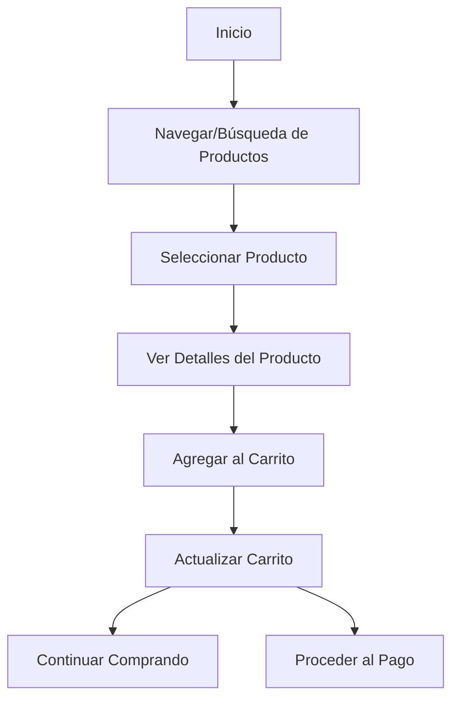

# Unidad: Stakeholders y Usuarios Finales

## Introducción a la Unidad y Objetivos de Aprendizaje

En esta unidad, nos enfocaremos en identificar y comprender a los stakeholders y usuarios finales de un sistema de carrito de compras desarrollado con Django. Entender quiénes son las partes interesadas y los usuarios finales es crucial para el éxito del proyecto, ya que sus necesidades y expectativas deben ser consideradas durante todo el ciclo de vida del desarrollo. Al finalizar esta unidad, deberías ser capaz de:

1. Identificar y categorizar a los stakeholders y usuarios finales.
2. Comprender sus roles y expectativas.
3. Integrar sus necesidades en el diseño y desarrollo del sistema.
4. Crear un documento funcional de requerimientos que refleje estas necesidades.

## Documento Funcional de Requerimientos

### Descripción Detallada de la Funcionalidad

El sistema de carrito de compras es una aplicación web que permite a los usuarios navegar por un catálogo de productos, agregar productos a un carrito, y proceder al pago. Para asegurar que el sistema cumpla con las expectativas de todos los stakeholders y usuarios finales, es esencial definir claramente quiénes son y qué esperan del sistema.

#### Stakeholders

1. **Propietario del Negocio**: Persona o entidad que posee la tienda en línea. Su interés principal es maximizar las ventas y la satisfacción del cliente.
2. **Desarrolladores**: Equipo encargado de construir y mantener el sistema. Su objetivo es crear una aplicación funcional, escalable y segura.
3. **Equipo de Marketing**: Encargados de atraer tráfico al sitio y convertir visitantes en clientes. Necesitan herramientas para analizar el comportamiento del usuario y ejecutar campañas de marketing.
4. **Equipo de Soporte al Cliente**: Personal que asiste a los clientes con problemas o consultas. Necesitan acceso a información del cliente y herramientas para resolver problemas rápidamente.
5. **Proveedores**: Entidades que suministran los productos vendidos en la tienda. Necesitan información sobre inventarios y ventas.

#### Usuarios Finales

1. **Clientes Registrados**: Usuarios que han creado una cuenta en la tienda. Pueden acceder a funcionalidades adicionales como historial de compras y listas de deseos.
2. **Clientes Invitados**: Usuarios que realizan compras sin registrarse. Necesitan un proceso de compra rápido y sencillo.
3. **Administradores del Sistema**: Usuarios con permisos para gestionar el catálogo de productos, usuarios y pedidos. Necesitan interfaces intuitivas y seguras para realizar sus tareas.

### Casos de Uso

#### Caso de Uso 1: Navegación y Búsqueda de Productos

**Descripción**: Un cliente puede navegar por las categorías de productos y buscar productos específicos utilizando una barra de búsqueda.

**Actores**: Clientes Registrados, Clientes Invitados

**Flujo Principal**:
1. El usuario accede a la página principal.
2. El usuario selecciona una categoría de productos o utiliza la barra de búsqueda.
3. El sistema muestra una lista de productos que coinciden con la categoría o términos de búsqueda.
4. El usuario selecciona un producto para ver más detalles.

**Flujo Alternativo**:
- Si no se encuentran productos que coincidan con los términos de búsqueda, el sistema muestra un mensaje indicando que no hay resultados.

#### Caso de Uso 2: Agregar Productos al Carrito

**Descripción**: Un cliente puede agregar productos a su carrito de compras.

**Actores**: Clientes Registrados, Clientes Invitados

**Flujo Principal**:
1. El usuario visualiza los detalles de un producto.
2. El usuario selecciona la cantidad deseada y hace clic en "Agregar al Carrito".
3. El sistema actualiza el carrito de compras del usuario.

**Flujo Alternativo**:
- Si el producto no está disponible en la cantidad deseada, el sistema muestra un mensaje indicando la disponibilidad.

### Diagramas de Flujo



### Requisitos No Funcionales

1. **Seguridad**: El sistema debe proteger la información personal y de pago de los usuarios mediante cifrado y otras medidas de seguridad.
2. **Rendimiento**: El sistema debe ser capaz de manejar múltiples usuarios simultáneamente sin degradar el rendimiento.
3. **Escalabilidad**: El sistema debe ser escalable para soportar un crecimiento en el número de usuarios y productos.
4. **Usabilidad**: La interfaz de usuario debe ser intuitiva y fácil de usar.
5. **Mantenibilidad**: El código debe ser limpio y bien documentado para facilitar el mantenimiento y las actualizaciones.

## Implementación en Python

### Explicación Paso a Paso del Código

Para implementar el sistema de carrito de compras en Django, seguiremos estos pasos:

1. **Configuración del Proyecto**: Crear un nuevo proyecto Django y configurar las aplicaciones necesarias.
2. **Modelado de Datos**: Definir los modelos para productos, carritos y pedidos.
3. **Vistas y URLs**: Crear vistas para la navegación, búsqueda, y gestión del carrito.
4. **Plantillas**: Diseñar las plantillas HTML para las páginas del sistema.
5. **Autenticación y Autorización**: Implementar el sistema de registro y login de usuarios.
6. **Pruebas Unitarias**: Escribir pruebas para asegurar que el sistema funciona correctamente.

### Código Fuente Completo y Comentado

#### Configuración del Proyecto

```python
# Crear un nuevo proyecto Django
django-admin startproject carrito_compras

# Navegar al directorio del proyecto
cd carrito_compras

# Crear una nueva aplicación para la tienda
python manage.py startapp tienda
```

#### Modelado de Datos

```python
# tienda/models.py
from django.db import models
from django.contrib.auth.models import User

class Producto(models.Model):
    nombre = models.CharField(max_length=100)
    descripcion = models.TextField()
    precio = models.DecimalField(max_digits=10, decimal_places=2)
    stock = models.IntegerField()
    imagen = models.ImageField(upload_to='productos/')

    def __str__(self):
        return self.nombre

class Carrito(models.Model):
    usuario = models.OneToOneField(User, on_delete=models.CASCADE)
    productos = models.ManyToManyField(Producto, through='CarritoProducto')

class CarritoProducto(models.Model):
    carrito = models.ForeignKey(Carrito, on_delete=models.CASCADE)
    producto = models.ForeignKey(Producto, on_delete=models.CASCADE)
    cantidad = models.IntegerField()

class Pedido(models.Model):
    usuario = models.ForeignKey(User, on_delete=models.CASCADE)
    productos = models.ManyToManyField(Producto, through='PedidoProducto')
    fecha = models.DateTimeField(auto_now_add=True)
    total = models.DecimalField(max_digits=10, decimal_places=2)

class PedidoProducto(models.Model):
    pedido = models.ForeignKey(Pedido, on_delete=models.CASCADE)
    producto = models.ForeignKey(Producto, on_delete=models.CASCADE)
    cantidad = models.IntegerField()
```

#### Vistas y URLs

```python
# tienda/views.py
from django.shortcuts import render, get_object_or_404
from .models import Producto, Carrito, CarritoProducto

def lista_productos(request):
    productos = Producto.objects.all()
    return render(request, 'tienda/lista_productos.html', {'productos': productos})

def detalle_producto(request, producto_id):
    producto = get_object_or_404(Producto, id=producto_id)
    return render(request, 'tienda/detalle_producto.html', {'producto': producto})

def agregar_al_carrito(request, producto_id):
    producto = get_object_or_404(Producto, id=producto_id)
    carrito, created = Carrito.objects.get_or_create(usuario=request.user)
    carrito_producto, created = CarritoProducto.objects.get_or_create(carrito=carrito, producto=producto)
    carrito_producto.cantidad += 1
    carrito_producto.save()
    return redirect('detalle_producto', producto_id=producto.id)

# tienda/urls.py
from django.urls import path
from . import views

urlpatterns = [
    path('', views.lista_productos, name='lista_productos'),
    path('producto/<int:producto_id>/', views.detalle_producto, name='detalle_producto'),
    path('agregar/<int:producto_id>/', views.agregar_al_carrito, name='agregar_al_carrito'),
]
```

#### Plantillas

```html
<!-- tienda/templates/tienda/lista_productos.html -->
<!DOCTYPE html>
<html>
<head>
    <title>Lista de Productos</title>
</head>
<body>
    <h1>Productos</h1>
    <ul>
        
            <li>
                <a href="">{{ producto.nombre }}</a>
                - ${{ producto.precio }}
            </li>
        
    </ul>
</body>
</html>
```

```html
<!-- tienda/templates/tienda/detalle_producto.html -->
<!DOCTYPE html>
<html>
<head>
    <title>{{ producto.nombre }}</title>
</head>
<body>
    <h1>{{ producto.nombre }}</h1>
    <p>{{ producto.descripcion }}</p>
    <p>Precio: ${{ producto.precio }}</p>
    <p>Stock: {{ producto.stock }}</p>
    <form action="" method="post">
        
        <button type="submit">Agregar al Carrito</button>
    </form>
</body>
</html>
```

#### Autenticación y Autorización

```python
# tienda/views.py (continuación)
from django.contrib.auth.decorators import login_required

@login_required
def agregar_al_carrito(request, producto_id):
    producto = get_object_or_404(Producto, id=producto_id)
    carrito, created = Carrito.objects.get_or_create(usuario=request.user)
    carrito_producto, created = CarritoProducto.objects.get_or_create(carrito=carrito, producto=producto)
    carrito_producto.cantidad += 1
    carrito_producto.save()
    return redirect('detalle_producto', producto_id=producto.id)
```

#### Pruebas Unitarias

```python
# tienda/tests.py
from django.test import TestCase
from django.contrib.auth.models import User
from .models import Producto, Carrito, CarritoProducto

class CarritoTestCase(TestCase):
    def setUp(self):
        self.user = User.objects.create_user(username='testuser', password='12345')
        self.producto = Producto.objects.create(nombre='Producto 1', descripcion='Descripción del producto 1', precio=10.00, stock=100)

    def test_agregar_al_carrito(self):
        self.client.login(username='testuser', password='12345')
        response = self.client.post(f'/agregar/{self.producto.id}/')
        self.assertEqual(response.status_code, 302)
        carrito = Carrito.objects.get(usuario=self.user)
        carrito_producto = CarritoProducto.objects.get(carrito=carrito, producto=self.producto)
        self.assertEqual(carrito_producto.cantidad, 1)
```

### Ejemplos de Uso y Pruebas Unitarias

Para probar el sistema, puedes ejecutar el servidor de desarrollo de Django y navegar a las URLs definidas. Asegúrate de crear algunos productos en la base de datos para probar la funcionalidad de navegación y agregar al carrito.

```bash
# Ejecutar el servidor de desarrollo
python manage.py runserver
```

Luego, abre un navegador web y navega a `http://localhost:8000/` para ver la lista de productos. Haz clic en un producto para ver sus detalles y agregarlo al carrito.

## Mejores Prácticas y Consideraciones de Diseño

1. **Modularidad**: Mantén el código modular separando las responsabilidades en diferentes aplicaciones dentro del proyecto Django.
2. **Seguridad**: Utiliza las herramientas de Django para manejar la autenticación y autorización de usuarios, y asegúrate de proteger las rutas sensibles con decoradores como `@login_required`.
3. **Pruebas**: Escribe pruebas unitarias y de integración para asegurar que todas las funcionalidades del sistema funcionan correctamente.
4. **Documentación**: Documenta el código y las decisiones de diseño para facilitar el mantenimiento y la colaboración con otros desarrolladores.
5. **Optimización**: Optimiza las consultas a la base de datos utilizando select_related y prefetch_related para mejorar el rendimiento.
6. **Escalabilidad**: Diseña el sistema pensando en la escalabilidad, utilizando técnicas como la paginación para manejar grandes volúmenes de datos.

En resumen, identificar y comprender a los stakeholders y usuarios finales es esencial para el éxito de un sistema de carrito de compras. Al seguir las mejores prácticas y considerar las necesidades de todas las partes interesadas, puedes crear una aplicación robusta y eficiente que satisfaga las expectativas de todos.