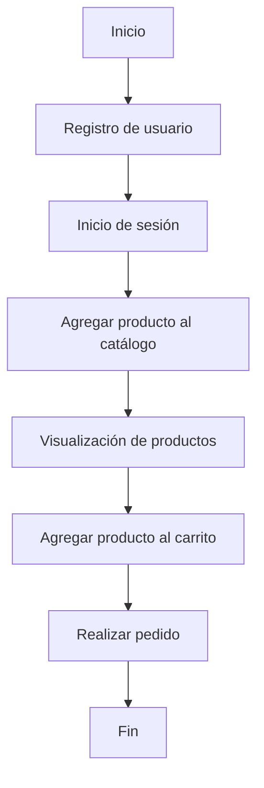

# Sistema de Carrito de Compras con Django

## Unidad: Tecnologías principales: Django, Django REST framework

### Introducción a la unidad y objetivos de aprendizaje

En esta unidad, nos enfocaremos en las tecnologías principales que utilizaremos para el desarrollo del sistema de carrito de compras: Django y Django REST framework (DRF). Django es un framework de alto nivel para el desarrollo de aplicaciones web en Python, conocido por su simplicidad y rapidez en el desarrollo. Django REST framework, por otro lado, es una poderosa y flexible herramienta para construir APIs web. Al finalizar esta unidad, los lectores deberán ser capaces de:

1. Comprender las características y beneficios de Django y Django REST framework.
2. Configurar un entorno de desarrollo para Django y DRF.
3. Implementar funcionalidades básicas de un sistema de carrito de compras utilizando Django y DRF.
4. Aplicar mejores prácticas en el desarrollo con Django y DRF.

### Documento funcional de requerimientos

#### a. Descripción detallada de la funcionalidad

El sistema de carrito de compras que desarrollaremos permitirá a los usuarios realizar las siguientes acciones:

1. **Registro y autenticación de usuarios**: Los usuarios podrán registrarse, iniciar sesión y cerrar sesión en el sistema.
2. **Gestión de productos**: Los administradores podrán agregar, editar y eliminar productos del catálogo.
3. **Visualización de productos**: Los usuarios podrán ver una lista de productos disponibles y detalles de cada producto.
4. **Gestión del carrito de compras**: Los usuarios podrán agregar productos a su carrito, actualizar la cantidad de productos y eliminar productos del carrito.
5. **Realización de pedidos**: Los usuarios podrán realizar pedidos basados en los productos en su carrito de compras.

#### b. Casos de uso

1. **Registro de usuario**:
   - **Actor**: Usuario
   - **Descripción**: Un usuario se registra en el sistema proporcionando su información personal.
   - **Precondición**: El usuario no debe estar registrado previamente.
   - **Postcondición**: El usuario es registrado y puede iniciar sesión.

2. **Inicio de sesión**:
   - **Actor**: Usuario
   - **Descripción**: Un usuario inicia sesión en el sistema proporcionando sus credenciales.
   - **Precondición**: El usuario debe estar registrado.
   - **Postcondición**: El usuario es autenticado y puede acceder a las funcionalidades del sistema.

3. **Agregar producto al catálogo**:
   - **Actor**: Administrador
   - **Descripción**: Un administrador agrega un nuevo producto al catálogo.
   - **Precondición**: El administrador debe estar autenticado.
   - **Postcondición**: El producto es agregado al catálogo y está disponible para los usuarios.

4. **Agregar producto al carrito**:
   - **Actor**: Usuario
   - **Descripción**: Un usuario agrega un producto a su carrito de compras.
   - **Precondición**: El usuario debe estar autenticado.
   - **Postcondición**: El producto es agregado al carrito del usuario.

5. **Realizar pedido**:
   - **Actor**: Usuario
   - **Descripción**: Un usuario realiza un pedido basado en los productos en su carrito de compras.
   - **Precondición**: El usuario debe tener productos en su carrito.
   - **Postcondición**: El pedido es registrado en el sistema.

#### c. Diagramas de flujo (en mermaid)



#### d. Requisitos no funcionales

1. **Rendimiento**: El sistema debe ser capaz de manejar al menos 1000 usuarios concurrentes sin degradación significativa del rendimiento.
2. **Seguridad**: El sistema debe proteger los datos de los usuarios mediante el uso de HTTPS y almacenamiento seguro de contraseñas.
3. **Escalabilidad**: El sistema debe ser escalable para soportar un crecimiento futuro en el número de usuarios y productos.
4. **Usabilidad**: La interfaz de usuario debe ser intuitiva y fácil de usar para garantizar una buena experiencia de usuario.
5. **Mantenibilidad**: El código debe ser modular y seguir las mejores prácticas de desarrollo para facilitar el mantenimiento y la evolución del sistema.

### Implementación en Python

#### a. Explicación paso a paso del código

Para implementar el sistema de carrito de compras, seguiremos los siguientes pasos:

1. **Configuración del entorno de desarrollo**: Instalación de Django y Django REST framework.
2. **Creación del proyecto Django**: Inicialización del proyecto y configuración básica.
3. **Definición de modelos**: Creación de modelos para usuarios, productos, carritos y pedidos.
4. **Implementación de vistas y serializadores**: Creación de vistas y serializadores para manejar las operaciones CRUD.
5. **Configuración de URLs**: Definición de rutas para las diferentes funcionalidades del sistema.
6. **Autenticación y permisos**: Implementación de autenticación y permisos para asegurar el acceso a las funcionalidades.

#### b. Código fuente completo y comentado

##### 1. Configuración del entorno de desarrollo

Para comenzar, necesitamos instalar Django y Django REST framework. Esto se puede hacer utilizando `pip`:

```bash
pip install django djangorestframework
```

##### 2. Creación del proyecto Django

Iniciamos un nuevo proyecto Django:

```bash
django-admin startproject carrito_compras
cd carrito_compras
```

Luego, creamos una nueva aplicación dentro del proyecto:

```bash
python manage.py startapp tienda
```

##### 3. Definición de modelos

En el archivo `models.py` de la aplicación `tienda`, definimos los modelos para usuarios, productos, carritos y pedidos:

```python
from django.db import models
from django.contrib.auth.models import User

class Producto(models.Model):
    nombre = models.CharField(max_length=100)
    descripcion = models.TextField()
    precio = models.DecimalField(max_digits=10, decimal_places=2)
    stock = models.IntegerField()

    def __str__(self):
        return self.nombre

class Carrito(models.Model):
    usuario = models.OneToOneField(User, on_delete=models.CASCADE)
    productos = models.ManyToManyField(Producto, through='CarritoProducto')

class CarritoProducto(models.Model):
    carrito = models.ForeignKey(Carrito, on_delete=models.CASCADE)
    producto = models.ForeignKey(Producto, on_delete=models.CASCADE)
    cantidad = models.IntegerField()

class Pedido(models.Model):
    usuario = models.ForeignKey(User, on_delete=models.CASCADE)
    productos = models.ManyToManyField(Producto, through='PedidoProducto')
    fecha = models.DateTimeField(auto_now_add=True)
    total = models.DecimalField(max_digits=10, decimal_places=2)

class PedidoProducto(models.Model):
    pedido = models.ForeignKey(Pedido, on_delete=models.CASCADE)
    producto = models.ForeignKey(Producto, on_delete=models.CASCADE)
    cantidad = models.IntegerField()
```

##### 4. Implementación de vistas y serializadores

Creamos serializadores en un archivo `serializers.py`:

```python
from rest_framework import serializers
from .models import Producto, Carrito, Pedido

class ProductoSerializer(serializers.ModelSerializer):
    class Meta:
        model = Producto
        fields = '__all__'

class CarritoSerializer(serializers.ModelSerializer):
    class Meta:
        model = Carrito
        fields = '__all__'

class PedidoSerializer(serializers.ModelSerializer):
    class Meta:
        model = Pedido
        fields = '__all__'
```

Luego, creamos vistas en el archivo `views.py`:

```python
from rest_framework import viewsets
from .models import Producto, Carrito, Pedido
from .serializers import ProductoSerializer, CarritoSerializer, PedidoSerializer

class ProductoViewSet(viewsets.ModelViewSet):
    queryset = Producto.objects.all()
    serializer_class = ProductoSerializer

class CarritoViewSet(viewsets.ModelViewSet):
    queryset = Carrito.objects.all()
    serializer_class = CarritoSerializer

class PedidoViewSet(viewsets.ModelViewSet):
    queryset = Pedido.objects.all()
    serializer_class = PedidoSerializer
```

##### 5. Configuración de URLs

En el archivo `urls.py` del proyecto, configuramos las rutas:

```python
from django.contrib import admin
from django.urls import path, include
from rest_framework.routers import DefaultRouter
from tienda import views

router = DefaultRouter()
router.register(r'productos', views.ProductoViewSet)
router.register(r'carritos', views.CarritoViewSet)
router.register(r'pedidos', views.PedidoViewSet)

urlpatterns = [
    path('admin/', admin.site.urls),
    path('api/', include(router.urls)),
]
```

##### 6. Autenticación y permisos

Para manejar la autenticación, agregamos `rest_framework` y `rest_framework.authtoken` a `INSTALLED_APPS` en `settings.py` y configuramos los permisos:

```python
INSTALLED_APPS = [
    ...
    'rest_framework',
    'rest_framework.authtoken',
    'tienda',
]

REST_FRAMEWORK = {
    'DEFAULT_AUTHENTICATION_CLASSES': [
        'rest_framework.authentication.TokenAuthentication',
    ],
    'DEFAULT_PERMISSION_CLASSES': [
        'rest_framework.permissions.IsAuthenticated',
    ],
}
```

Finalmente, creamos vistas para el registro e inicio de sesión en `views.py`:

```python
from rest_framework.authtoken.models import Token
from rest_framework.decorators import api_view
from rest_framework.response import Response
from django.contrib.auth.models import User
from django.contrib.auth import authenticate

@api_view(['POST'])
def registro(request):
    username = request.data.get('username')
    password = request.data.get('password')
    user = User.objects.create_user(username=username, password=password)
    token, created = Token.objects.get_or_create(user=user)
    return Response({'token': token.key})

@api_view(['POST'])
def inicio_sesion(request):
    username = request.data.get('username')
    password = request.data.get('password')
    user = authenticate(username=username, password=password)
    if user:
        token, created = Token.objects.get_or_create(user=user)
        return Response({'token': token.key})
    else:
        return Response({'error': 'Credenciales inválidas'}, status=400)
```

Actualizamos `urls.py` para incluir las rutas de registro e inicio de sesión:

```python
urlpatterns += [
    path('api/registro/', views.registro),
    path('api/inicio_sesion/', views.inicio_sesion),
]
```

#### c. Ejemplos de uso y pruebas unitarias

Para probar las funcionalidades, podemos utilizar herramientas como `curl` o Postman para realizar solicitudes HTTP a las rutas definidas.

Ejemplo de registro de usuario:

```bash
curl -X POST http://localhost:8000/api/registro/ -d "username=usuario&password=contraseña"
```

Ejemplo de inicio de sesión:

```bash
curl -X POST http://localhost:8000/api/inicio_sesion/ -d "username=usuario&password=contraseña"
```

Ejemplo de agregar un producto (requiere autenticación):

```bash
curl -X POST http://localhost:8000/api/productos/ -H "Authorization: Token <token>" -d "nombre=Producto1&descripcion=Descripción&precio=100.00&stock=10"
```

Para las pruebas unitarias, podemos utilizar el módulo `unittest` de Python. Creamos un archivo `tests.py` en la aplicación `tienda`:

```python
from django.test import TestCase
from django.contrib.auth.models import User
from .models import Producto, Carrito, Pedido

class ModeloTests(TestCase):

    def test_crear_producto(self):
        producto = Producto.objects.create(nombre='Producto1', descripcion='Descripción', precio=100.00, stock=10)
        self.assertEqual(producto.nombre, 'Producto1')

    def test_crear_carrito(self):
        usuario = User.objects.create_user(username='usuario', password='contraseña')
        carrito = Carrito.objects.create(usuario=usuario)
        self.assertEqual(carrito.usuario.username, 'usuario')

    def test_crear_pedido(self):
        usuario = User.objects.create_user(username='usuario', password='contraseña')
        pedido = Pedido.objects.create(usuario=usuario, total=100.00)
        self.assertEqual(pedido.usuario.username, 'usuario')
```

### Mejores prácticas y consideraciones de diseño

1. **Modularidad**: Mantener el código modular y organizado en diferentes aplicaciones dentro del proyecto Django.
2. **Seguridad**: Utilizar autenticación y permisos adecuados para proteger los datos de los usuarios.
3. **Validación de datos**: Implementar validaciones en los serializadores para garantizar la integridad de los datos.
4. **Pruebas**: Escribir pruebas unitarias y de integración para asegurar la calidad del código.
5. **Documentación**: Mantener una buena documentación del código y de las APIs para facilitar el mantenimiento y la colaboración.

En resumen, Django y Django REST framework proporcionan una base sólida para el desarrollo de un sistema de carrito de compras. Siguiendo las mejores prácticas y consideraciones de diseño, podemos construir una aplicación robusta, segura y escalable que cumpla con los requisitos funcionales y no funcionales definidos.