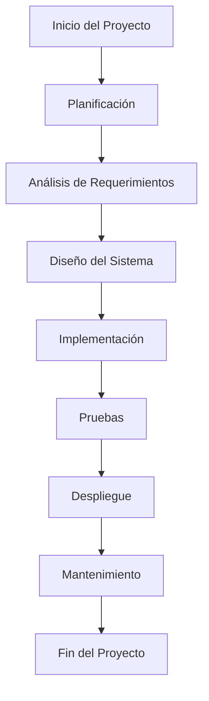

# Unidad: Cronograma y Fases del Proyecto

## Introducción a la Unidad y Objetivos de Aprendizaje

En esta unidad, exploraremos en detalle el cronograma y las fases del proyecto para el desarrollo de un sistema de carrito de compras utilizando Django. El objetivo principal es proporcionar una comprensión clara y estructurada del proceso de desarrollo, desde la planificación inicial hasta la implementación y el despliegue final. Al finalizar esta unidad, los lectores deberán ser capaces de:

1. Comprender las diferentes fases del ciclo de vida del proyecto.
2. Elaborar un cronograma detallado que contemple todas las actividades y entregables del proyecto.
3. Identificar los hitos clave y los puntos de control.
4. Implementar técnicas de gestión de proyectos para asegurar el cumplimiento de plazos y objetivos.
5. Aplicar mejores prácticas en la planificación y ejecución de proyectos de desarrollo de software.

## Documento Funcional de Requerimientos

### Descripción Detallada de la Funcionalidad

El cronograma y las fases del proyecto son fundamentales para garantizar que el desarrollo del sistema de carrito de compras se realice de manera organizada y eficiente. Estas fases incluyen la planificación, el análisis de requerimientos, el diseño, la implementación, las pruebas, el despliegue y el mantenimiento. Cada fase tiene sus propias actividades y entregables específicos, que deben ser gestionados y monitoreados cuidadosamente.

### Casos de Uso

#### Caso de Uso 1: Planificación del Proyecto

**Descripción:** Definir el alcance del proyecto, identificar los recursos necesarios y establecer un cronograma preliminar.

**Actores:** Gerente de Proyecto, Equipo de Desarrollo.

**Flujo Principal:**
1. El Gerente de Proyecto se reúne con los stakeholders para definir el alcance del proyecto.
2. Se identifican y asignan los recursos necesarios.
3. Se elabora un cronograma preliminar con las fases y actividades del proyecto.

#### Caso de Uso 2: Análisis de Requerimientos

**Descripción:** Recopilar y documentar los requisitos funcionales y no funcionales del sistema de carrito de compras.

**Actores:** Analista de Requerimientos, Stakeholders, Usuarios Finales.

**Flujo Principal:**
1. El Analista de Requerimientos se reúne con los stakeholders y usuarios finales.
2. Se documentan los requisitos funcionales y no funcionales.
3. Se revisa y aprueba el documento de requerimientos.

#### Caso de Uso 3: Diseño del Sistema

**Descripción:** Crear los modelos de datos, la arquitectura del sistema y los diseños de interfaz de usuario.

**Actores:** Arquitecto de Software, Diseñador de UI/UX.

**Flujo Principal:**
1. El Arquitecto de Software diseña la arquitectura del sistema.
2. El Diseñador de UI/UX crea los diseños de interfaz de usuario.
3. Se revisan y aprueban los diseños.

#### Caso de Uso 4: Implementación

**Descripción:** Desarrollar el código del sistema de carrito de compras según los diseños aprobados.

**Actores:** Desarrolladores.

**Flujo Principal:**
1. Los Desarrolladores escriben el código según los diseños y requerimientos.
2. Se realizan revisiones de código y pruebas unitarias.
3. Se integra el código en el repositorio principal.

#### Caso de Uso 5: Pruebas

**Descripción:** Realizar pruebas funcionales, de integración y de aceptación para asegurar la calidad del sistema.

**Actores:** Equipo de QA, Usuarios Finales.

**Flujo Principal:**
1. El Equipo de QA realiza pruebas funcionales y de integración.
2. Los Usuarios Finales realizan pruebas de aceptación.
3. Se documentan y corrigen los defectos encontrados.

#### Caso de Uso 6: Despliegue

**Descripción:** Implementar el sistema de carrito de compras en el entorno de producción.

**Actores:** Equipo de DevOps.

**Flujo Principal:**
1. El Equipo de DevOps prepara el entorno de producción.
2. Se despliega el sistema en producción.
3. Se monitorea el sistema para asegurar su correcto funcionamiento.

#### Caso de Uso 7: Mantenimiento

**Descripción:** Realizar mantenimiento y actualizaciones del sistema de carrito de compras.

**Actores:** Equipo de Soporte, Desarrolladores.

**Flujo Principal:**
1. El Equipo de Soporte monitorea el sistema y recibe reportes de incidencias.
2. Los Desarrolladores corrigen errores y realizan actualizaciones.
3. Se despliegan las actualizaciones en producción.

### Diagramas de Flujo



### Requisitos No Funcionales

1. **Escalabilidad:** El sistema debe ser capaz de manejar un aumento en la carga de usuarios y transacciones sin degradar el rendimiento.
2. **Seguridad:** El sistema debe proteger los datos de los usuarios y las transacciones contra accesos no autorizados y ataques.
3. **Rendimiento:** El sistema debe responder a las solicitudes de los usuarios en un tiempo razonable.
4. **Usabilidad:** La interfaz de usuario debe ser intuitiva y fácil de usar.
5. **Mantenibilidad:** El código del sistema debe ser modular y bien documentado para facilitar el mantenimiento y las actualizaciones.

## Implementación en Python

### Explicación Paso a Paso del Código

Para ilustrar cómo se puede implementar una parte del cronograma y las fases del proyecto en Python, vamos a desarrollar un script que ayude a gestionar las tareas y los hitos del proyecto. Este script permitirá crear, actualizar y visualizar tareas y hitos, y asignarles fechas de inicio y fin.

### Código Fuente Completo y Comentado

```python
import datetime

class Tarea:
    def __init__(self, nombre, descripcion, fecha_inicio, fecha_fin):
        self.nombre = nombre
        self.descripcion = descripcion
        self.fecha_inicio = fecha_inicio
        self.fecha_fin = fecha_fin
        self.completada = False

    def marcar_completada(self):
        self.completada = True

    def __str__(self):
        estado = "Completada" if self.completada else "Pendiente"
        return f"Tarea: {self.nombre}\nDescripción: {self.descripcion}\nInicio: {self.fecha_inicio}\nFin: {self.fecha_fin}\nEstado: {estado}"

class Proyecto:
    def __init__(self, nombre):
        self.nombre = nombre
        self.tareas = []

    def agregar_tarea(self, tarea):
        self.tareas.append(tarea)

    def listar_tareas(self):
        for tarea in self.tareas:
            print(tarea)

    def tareas_pendientes(self):
        return [tarea for tarea in self.tareas if not tarea.completada]

    def tareas_completadas(self):
        return [tarea for tarea in self.tareas if tarea.completada]

# Ejemplo de uso
if __name__ == "__main__":
    proyecto = Proyecto("Desarrollo del Sistema de Carrito de Compras")

    tarea1 = Tarea(
        nombre="Definir Alcance",
        descripcion="Reunión con stakeholders para definir el alcance del proyecto",
        fecha_inicio=datetime.date(2023, 10, 1),
        fecha_fin=datetime.date(2023, 10, 3)
    )

    tarea2 = Tarea(
        nombre="Análisis de Requerimientos",
        descripcion="Recopilar y documentar los requisitos del sistema",
        fecha_inicio=datetime.date(2023, 10, 4),
        fecha_fin=datetime.date(2023, 10, 10)
    )

    proyecto.agregar_tarea(tarea1)
    proyecto.agregar_tarea(tarea2)

    print("Tareas del Proyecto:")
    proyecto.listar_tareas()

    print("\nTareas Pendientes:")
    for tarea in proyecto.tareas_pendientes():
        print(tarea)

    tarea1.marcar_completada()

    print("\nTareas Completadas:")
    for tarea in proyecto.tareas_completadas():
        print(tarea)
```

### Ejemplos de Uso y Pruebas Unitarias

#### Ejemplo de Uso

El ejemplo de uso incluido en el código fuente muestra cómo crear un proyecto, agregar tareas y marcar tareas como completadas. Este ejemplo ayuda a visualizar cómo se puede gestionar el cronograma y las fases del proyecto de manera programática.

#### Pruebas Unitarias

Para asegurar la calidad del código, es importante escribir pruebas unitarias. A continuación, se presentan algunas pruebas unitarias básicas utilizando el módulo `unittest` de Python.

```python
import unittest

class TestProyecto(unittest.TestCase):
    def setUp(self):
        self.proyecto = Proyecto("Desarrollo del Sistema de Carrito de Compras")
        self.tarea1 = Tarea(
            nombre="Definir Alcance",
            descripcion="Reunión con stakeholders para definir el alcance del proyecto",
            fecha_inicio=datetime.date(2023, 10, 1),
            fecha_fin=datetime.date(2023, 10, 3)
        )
        self.tarea2 = Tarea(
            nombre="Análisis de Requerimientos",
            descripcion="Recopilar y documentar los requisitos del sistema",
            fecha_inicio=datetime.date(2023, 10, 4),
            fecha_fin=datetime.date(2023, 10, 10)
        )
        self.proyecto.agregar_tarea(self.tarea1)
        self.proyecto.agregar_tarea(self.tarea2)

    def test_agregar_tarea(self):
        self.assertEqual(len(self.proyecto.tareas), 2)

    def test_tareas_pendientes(self):
        self.assertEqual(len(self.proyecto.tareas_pendientes()), 2)
        self.tarea1.marcar_completada()
        self.assertEqual(len(self.proyecto.tareas_pendientes()), 1)

    def test_tareas_completadas(self):
        self.assertEqual(len(self.proyecto.tareas_completadas()), 0)
        self.tarea1.marcar_completada()
        self.assertEqual(len(self.proyecto.tareas_completadas()), 1)

if __name__ == "__main__":
    unittest.main()
```

## Mejores Prácticas y Consideraciones de Diseño

### Mejores Prácticas

1. **Planificación Detallada:** Dedicar tiempo suficiente a la planificación inicial del proyecto para evitar problemas durante la implementación.
2. **Comunicación Constante:** Mantener una comunicación constante y clara con todos los stakeholders y miembros del equipo.
3. **Gestión de Riesgos:** Identificar y gestionar los riesgos potenciales desde el inicio del proyecto.
4. **Revisiones Periódicas:** Realizar revisiones periódicas del progreso del proyecto y ajustar el cronograma según sea necesario.
5. **Documentación Completa:** Mantener una documentación completa y actualizada de todas las fases del proyecto.

### Consideraciones de Diseño

1. **Modularidad:** Diseñar el sistema de manera modular para facilitar el mantenimiento y las actualizaciones.
2. **Escalabilidad:** Asegurar que el diseño del sistema permita escalar fácilmente en respuesta a un aumento en la carga de usuarios y transacciones.
3. **Seguridad:** Implementar medidas de seguridad desde el diseño inicial para proteger los datos y las transacciones de los usuarios.
4. **Usabilidad:** Diseñar una interfaz de usuario intuitiva y fácil de usar para mejorar la experiencia del usuario final.
5. **Rendimiento:** Optimizar el rendimiento del sistema para asegurar tiempos de respuesta rápidos y eficientes.

### Consejos para la Depuración y Solución de Problemas Comunes

1. **Registro de Errores:** Implementar un sistema de registro de errores para facilitar la identificación y solución de problemas.
2. **Pruebas Unitarias:** Escribir pruebas unitarias para asegurar la calidad del código y detectar errores temprano.
3. **Revisiones de Código:** Realizar revisiones de código periódicas para identificar y corregir problemas de manera colaborativa.
4. **Monitoreo del Sistema:** Implementar herramientas de monitoreo para detectar problemas de rendimiento y disponibilidad en tiempo real.
5. **Documentación de Problemas:** Documentar los problemas encontrados y las soluciones implementadas para futuras referencias.

Con esta unidad, hemos cubierto en detalle el cronograma y las fases del proyecto para el desarrollo de un sistema de carrito de compras con Django. Al seguir estas directrices y mejores prácticas, los equipos de desarrollo pueden asegurar un proceso de desarrollo eficiente y exitoso.