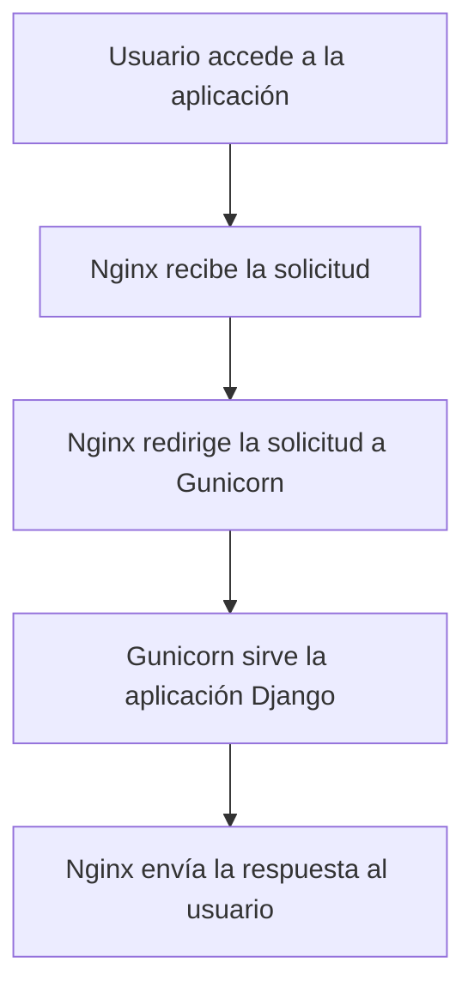

# Unidad: Configuración de Gunicorn y Nginx

## Introducción a la unidad y objetivos de aprendizaje

En esta unidad, nos enfocaremos en la configuración de Gunicorn y Nginx para el despliegue de un sistema de carrito de compras desarrollado con Django. Gunicorn es un servidor WSGI para aplicaciones web en Python, mientras que Nginx es un servidor web y proxy inverso que se utiliza para manejar solicitudes HTTP y servir archivos estáticos. Al final de esta unidad, serás capaz de:

1. Configurar Gunicorn para servir una aplicación Django.
2. Configurar Nginx como un proxy inverso para Gunicorn.
3. Entender cómo optimizar y asegurar la configuración de Gunicorn y Nginx.
4. Realizar pruebas para asegurar que la configuración funciona correctamente.

## Documento funcional de requerimientos

### a. Descripción detallada de la funcionalidad

La funcionalidad principal de esta unidad es configurar Gunicorn y Nginx para desplegar un sistema de carrito de compras desarrollado con Django. Esto incluye:

1. **Configuración de Gunicorn**: Preparar Gunicorn para servir la aplicación Django.
2. **Configuración de Nginx**: Configurar Nginx como un proxy inverso que redirige las solicitudes HTTP a Gunicorn.
3. **Optimización y seguridad**: Ajustar las configuraciones para mejorar el rendimiento y la seguridad del sistema.

### b. Casos de uso

1. **Desarrollador despliega la aplicación**: Un desarrollador configura Gunicorn y Nginx para desplegar la aplicación Django en un servidor de producción.
2. **Usuario accede a la aplicación**: Un usuario accede a la aplicación web a través de un navegador, y Nginx redirige la solicitud a Gunicorn, que sirve la aplicación Django.
3. **Administrador ajusta configuraciones**: Un administrador del sistema ajusta las configuraciones de Gunicorn y Nginx para mejorar el rendimiento y la seguridad.

### c. Diagramas de flujo (en mermaid)



### d. Requisitos no funcionales

1. **Rendimiento**: La configuración debe ser capaz de manejar múltiples solicitudes concurrentes sin degradar el rendimiento.
2. **Seguridad**: La configuración debe proteger la aplicación contra ataques comunes como DDoS y SQL injection.
3. **Escalabilidad**: La configuración debe permitir la fácil escalabilidad de la aplicación para manejar un aumento en el tráfico.
4. **Mantenibilidad**: La configuración debe ser fácil de mantener y actualizar.

## Implementación en Python

### a. Explicación paso a paso del código

#### 1. Instalación de Gunicorn y Nginx

Primero, debemos instalar Gunicorn y Nginx en nuestro servidor. Esto se puede hacer utilizando el gestor de paquetes `apt` en sistemas basados en Debian (como Ubuntu).

```bash
sudo apt update
sudo apt install gunicorn nginx
```

#### 2. Configuración de Gunicorn

Creamos un archivo de configuración para Gunicorn que especifica los detalles de cómo debe servir nuestra aplicación Django. Guardamos este archivo como `gunicorn_config.py`.

```python
# gunicorn_config.py

command = '/usr/local/bin/gunicorn'
pythonpath = '/path/to/your/project'
bind = '127.0.0.1:8000'
workers = 3
user = 'youruser'
```

#### 3. Configuración de Nginx

Creamos un archivo de configuración para Nginx que especifica cómo debe manejar las solicitudes y redirigirlas a Gunicorn. Guardamos este archivo en `/etc/nginx/sites-available/yourproject`.

```nginx
# /etc/nginx/sites-available/yourproject

server {
    listen 80;
    server_name yourdomain.com;

    location / {
        proxy_pass http://127.0.0.1:8000;
        proxy_set_header Host $host;
        proxy_set_header X-Real-IP $remote_addr;
        proxy_set_header X-Forwarded-For $proxy_add_x_forwarded_for;
        proxy_set_header X-Forwarded-Proto $scheme;
    }

    location /static/ {
        alias /path/to/your/project/static/;
    }

    location /media/ {
        alias /path/to/your/project/media/;
    }
}
```

Luego, creamos un enlace simbólico en `/etc/nginx/sites-enabled/` para habilitar esta configuración.

```bash
sudo ln -s /etc/nginx/sites-available/yourproject /etc/nginx/sites-enabled/
```

#### 4. Iniciar y habilitar los servicios

Iniciamos y habilitamos los servicios de Gunicorn y Nginx para que se ejecuten al iniciar el sistema.

```bash
sudo systemctl start gunicorn
sudo systemctl enable gunicorn
sudo systemctl restart nginx
```

### b. Código fuente completo y comentado

A continuación, se presenta el código completo y comentado para la configuración de Gunicorn y Nginx:

#### gunicorn_config.py

```python
# gunicorn_config.py

# Comando para ejecutar Gunicorn
command = '/usr/local/bin/gunicorn'

# Ruta al directorio del proyecto Django
pythonpath = '/path/to/your/project'

# Dirección y puerto en los que Gunicorn escuchará
bind = '127.0.0.1:8000'

# Número de trabajadores (procesos) que Gunicorn utilizará
workers = 3

# Usuario bajo el cual se ejecutará Gunicorn
user = 'youruser'
```

#### Configuración de Nginx

```nginx
# /etc/nginx/sites-available/yourproject

# Configuración del servidor
server {
    # Puerto en el que Nginx escuchará
    listen 80;

    # Nombre del servidor (dominio)
    server_name yourdomain.com;

    # Configuración para redirigir solicitudes a Gunicorn
    location / {
        proxy_pass http://127.0.0.1:8000;
        proxy_set_header Host $host;
        proxy_set_header X-Real-IP $remote_addr;
        proxy_set_header X-Forwarded-For $proxy_add_x_forwarded_for;
        proxy_set_header X-Forwarded-Proto $scheme;
    }

    # Configuración para servir archivos estáticos
    location /static/ {
        alias /path/to/your/project/static/;
    }

    # Configuración para servir archivos multimedia
    location /media/ {
        alias /path/to/your/project/media/;
    }
}
```

### c. Ejemplos de uso y pruebas unitarias

#### Ejemplo de uso

Una vez configurados Gunicorn y Nginx, podemos acceder a nuestra aplicación Django a través del navegador utilizando el dominio configurado (`yourdomain.com`). Nginx redirigirá la solicitud a Gunicorn, que servirá la aplicación Django.

#### Pruebas unitarias

Para asegurar que la configuración funciona correctamente, podemos realizar las siguientes pruebas:

1. **Prueba de acceso**: Acceder a la aplicación a través del navegador y verificar que se carga correctamente.
2. **Prueba de archivos estáticos**: Acceder a un archivo estático (por ejemplo, una imagen) y verificar que se carga correctamente.
3. **Prueba de archivos multimedia**: Acceder a un archivo multimedia (por ejemplo, un archivo subido por el usuario) y verificar que se carga correctamente.
4. **Prueba de carga**: Utilizar una herramienta de prueba de carga (como `ab` o `siege`) para simular múltiples solicitudes concurrentes y verificar que la aplicación maneja la carga sin problemas.

### d. Mejores prácticas y consideraciones de diseño

#### Optimización del rendimiento

1. **Ajuste de trabajadores**: El número de trabajadores en Gunicorn debe ajustarse según los recursos del servidor y la carga esperada. Una regla general es utilizar 2-4 trabajadores por núcleo de CPU.
2. **Compresión**: Habilitar la compresión en Nginx para reducir el tamaño de las respuestas y mejorar el tiempo de carga.
3. **Caching**: Configurar el caching en Nginx para reducir la carga en el servidor y mejorar el rendimiento.

#### Seguridad

1. **TLS/SSL**: Configurar TLS/SSL en Nginx para asegurar las comunicaciones entre el servidor y los usuarios.
2. **Cabeceras de seguridad**: Configurar cabeceras de seguridad en Nginx (como `Content-Security-Policy` y `X-Content-Type-Options`) para proteger contra ataques comunes.
3. **Firewall**: Utilizar un firewall para proteger el servidor contra accesos no autorizados.

#### Escalabilidad

1. **Balanceo de carga**: Utilizar un balanceador de carga para distribuir las solicitudes entre múltiples instancias de Gunicorn.
2. **Autoescalado**: Configurar autoescalado para añadir o remover instancias de Gunicorn según la carga del servidor.

#### Mantenibilidad

1. **Documentación**: Mantener una documentación clara y detallada de la configuración de Gunicorn y Nginx.
2. **Automatización**: Utilizar herramientas de automatización (como Ansible o Terraform) para gestionar la configuración y el despliegue.

#### Depuración y solución de problemas comunes

1. **Logs**: Revisar los logs de Gunicorn y Nginx para identificar y solucionar problemas.
2. **Errores comunes**: Solucionar errores comunes como `502 Bad Gateway` (generalmente causado por problemas de comunicación entre Nginx y Gunicorn) y `504 Gateway Timeout` (generalmente causado por tiempos de respuesta largos en Gunicorn).
3. **Monitoreo**: Utilizar herramientas de monitoreo (como Prometheus o Grafana) para supervisar el rendimiento y la salud del sistema.

En resumen, esta unidad proporciona una guía completa para configurar Gunicorn y Nginx para el despliegue de un sistema de carrito de compras desarrollado con Django. Al seguir estas instrucciones y aplicar las mejores prácticas, podrás asegurar que tu aplicación es segura, escalable y de alto rendimiento.