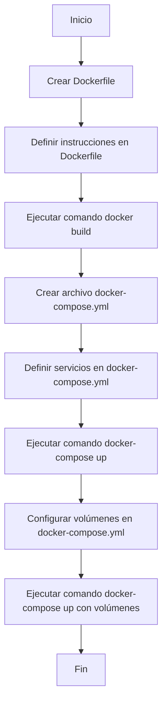

# Unidad: Uso de Docker y docker-compose

## Introducción a la unidad y objetivos de aprendizaje

En esta unidad, nos enfocaremos en el uso de Docker y docker-compose para el despliegue y la gestión de un sistema de carrito de compras desarrollado con Django. Docker es una plataforma que permite empaquetar aplicaciones y sus dependencias en contenedores, asegurando que se ejecuten de manera consistente en cualquier entorno. Docker-compose, por otro lado, es una herramienta que facilita la definición y ejecución de aplicaciones multicontenedor.

### Objetivos de aprendizaje

1. Comprender los conceptos básicos de Docker y docker-compose.
2. Aprender a crear y configurar archivos Dockerfile y docker-compose.yml.
3. Desarrollar habilidades para construir, ejecutar y gestionar contenedores Docker.
4. Implementar un sistema de carrito de compras con Django utilizando Docker y docker-compose.
5. Aplicar mejores prácticas en el uso de Docker para el despliegue y la gestión de aplicaciones.

## Documento funcional de requerimientos

### Descripción detallada de la funcionalidad

El objetivo principal de esta unidad es desplegar un sistema de carrito de compras con Django utilizando Docker y docker-compose. La funcionalidad incluye:

1. **Creación de un Dockerfile**: Definir un archivo Dockerfile que contenga las instrucciones necesarias para construir una imagen Docker de la aplicación Django.
2. **Configuración de docker-compose**: Crear un archivo docker-compose.yml para definir y gestionar los servicios necesarios, como la base de datos y la aplicación web.
3. **Construcción y ejecución de contenedores**: Construir las imágenes Docker y ejecutar los contenedores utilizando docker-compose.
4. **Persistencia de datos**: Configurar volúmenes para asegurar la persistencia de los datos de la base de datos.
5. **Escalabilidad**: Configurar docker-compose para escalar los servicios según sea necesario.

### Casos de uso

#### Caso de uso 1: Construcción de la imagen Docker

**Actor**: Desarrollador

**Descripción**: El desarrollador crea un Dockerfile que especifica las instrucciones para construir una imagen Docker de la aplicación Django.

**Flujo de eventos**:
1. El desarrollador crea un archivo Dockerfile en el directorio raíz del proyecto Django.
2. El desarrollador define las instrucciones necesarias en el Dockerfile.
3. El desarrollador ejecuta el comando `docker build` para construir la imagen Docker.

#### Caso de uso 2: Configuración y ejecución de docker-compose

**Actor**: Desarrollador

**Descripción**: El desarrollador crea un archivo docker-compose.yml para definir y gestionar los servicios necesarios para la aplicación.

**Flujo de eventos**:
1. El desarrollador crea un archivo docker-compose.yml en el directorio raíz del proyecto.
2. El desarrollador define los servicios necesarios en el archivo docker-compose.yml.
3. El desarrollador ejecuta el comando `docker-compose up` para iniciar los servicios.

#### Caso de uso 3: Persistencia de datos

**Actor**: Desarrollador

**Descripción**: El desarrollador configura volúmenes en docker-compose.yml para asegurar la persistencia de los datos de la base de datos.

**Flujo de eventos**:
1. El desarrollador define volúmenes en el archivo docker-compose.yml.
2. El desarrollador ejecuta el comando `docker-compose up` para iniciar los servicios con volúmenes configurados.

### Diagramas de flujo



### Requisitos no funcionales

1. **Rendimiento**: La construcción y ejecución de contenedores debe ser eficiente y rápida.
2. **Escalabilidad**: La configuración de docker-compose debe permitir escalar los servicios según sea necesario.
3. **Seguridad**: Asegurar que las imágenes Docker no contengan vulnerabilidades y que los datos sensibles estén protegidos.
4. **Mantenibilidad**: El Dockerfile y el archivo docker-compose.yml deben ser fáciles de entender y mantener.

## Implementación en Python

### Explicación paso a paso del código

#### Paso 1: Creación del Dockerfile

El Dockerfile es un archivo de texto que contiene las instrucciones para construir una imagen Docker. A continuación, se muestra un ejemplo de Dockerfile para una aplicación Django:

```Dockerfile
# Usar una imagen base oficial de Python
FROM python:3.9-slim

# Establecer el directorio de trabajo en el contenedor
WORKDIR /app

# Copiar los archivos de requerimientos al contenedor
COPY requirements.txt .

# Instalar las dependencias
RUN pip install --no-cache-dir -r requirements.txt

# Copiar el código de la aplicación al contenedor
COPY . .

# Exponer el puerto en el que la aplicación escuchará
EXPOSE 8000

# Definir el comando por defecto para ejecutar la aplicación
CMD ["gunicorn", "--bind", "0.0.0.0:8000", "myproject.wsgi:application"]
```

#### Paso 2: Configuración de docker-compose

El archivo docker-compose.yml define los servicios necesarios para la aplicación. A continuación, se muestra un ejemplo de archivo docker-compose.yml:

```yaml
version: '3.8'

services:
  db:
    image: postgres:13
    volumes:
      - postgres_data:/var/lib/postgresql/data
    environment:
      POSTGRES_DB: mydatabase
      POSTGRES_USER: myuser
      POSTGRES_PASSWORD: mypassword

  web:
    build: .
    command: gunicorn --bind 0.0.0.0:8000 myproject.wsgi:application
    volumes:
      - .:/app
    ports:
      - "8000:8000"
    depends_on:
      - db

volumes:
  postgres_data:
```

#### Paso 3: Construcción y ejecución de contenedores

Para construir y ejecutar los contenedores, se utilizan los siguientes comandos:

```bash
# Construir la imagen Docker
docker build -t my-django-app .

# Ejecutar los servicios definidos en docker-compose.yml
docker-compose up
```

### Código fuente completo y comentado

A continuación, se presenta el código fuente completo y comentado para la implementación de Docker y docker-compose en la aplicación Django.

#### Dockerfile

```Dockerfile
# Usar una imagen base oficial de Python
FROM python:3.9-slim

# Establecer el directorio de trabajo en el contenedor
WORKDIR /app

# Copiar los archivos de requerimientos al contenedor
COPY requirements.txt .

# Instalar las dependencias
RUN pip install --no-cache-dir -r requirements.txt

# Copiar el código de la aplicación al contenedor
COPY . .

# Exponer el puerto en el que la aplicación escuchará
EXPOSE 8000

# Definir el comando por defecto para ejecutar la aplicación
CMD ["gunicorn", "--bind", "0.0.0.0:8000", "myproject.wsgi:application"]
```

#### docker-compose.yml

```yaml
version: '3.8'

services:
  db:
    image: postgres:13
    volumes:
      - postgres_data:/var/lib/postgresql/data
    environment:
      POSTGRES_DB: mydatabase
      POSTGRES_USER: myuser
      POSTGRES_PASSWORD: mypassword

  web:
    build: .
    command: gunicorn --bind 0.0.0.0:8000 myproject.wsgi:application
    volumes:
      - .:/app
    ports:
      - "8000:8000"
    depends_on:
      - db

volumes:
  postgres_data:
```

### Ejemplos de uso y pruebas unitarias

#### Ejemplo de uso

Para construir y ejecutar los contenedores, se deben seguir los siguientes pasos:

1. Crear el archivo Dockerfile y docker-compose.yml en el directorio raíz del proyecto Django.
2. Ejecutar el comando `docker-compose up` para iniciar los servicios.

```bash
# Construir la imagen Docker
docker build -t my-django-app .

# Ejecutar los servicios definidos en docker-compose.yml
docker-compose up
```

#### Pruebas unitarias

Para asegurar que la configuración de Docker y docker-compose funciona correctamente, se pueden realizar las siguientes pruebas:

1. **Prueba de construcción de la imagen Docker**: Ejecutar el comando `docker build` y verificar que la imagen se construya sin errores.
2. **Prueba de ejecución de contenedores**: Ejecutar el comando `docker-compose up` y verificar que los contenedores se inicien correctamente.
3. **Prueba de persistencia de datos**: Verificar que los datos de la base de datos se mantengan después de reiniciar los contenedores.

### Mejores prácticas y consideraciones de diseño

1. **Mantener el Dockerfile limpio y organizado**: Utilizar comentarios y dividir las instrucciones en pasos lógicos.
2. **Utilizar imágenes base ligeras**: Elegir imágenes base que sean ligeras y seguras para reducir el tamaño de la imagen Docker.
3. **Configurar volúmenes para la persistencia de datos**: Asegurar que los datos importantes se almacenen en volúmenes para evitar la pérdida de datos.
4. **Utilizar variables de entorno para la configuración**: Evitar hardcodear valores sensibles en el Dockerfile y docker-compose.yml. Utilizar variables de entorno para configurar la base de datos y otros servicios.
5. **Seguridad**: Asegurar que las imágenes Docker no contengan vulnerabilidades y que los datos sensibles estén protegidos. Utilizar herramientas como Docker Bench for Security para auditar la seguridad de las imágenes y contenedores.
6. **Automatización**: Integrar la construcción y despliegue de contenedores en el pipeline de CI/CD para asegurar una entrega continua y eficiente.

## Conclusión

En esta unidad, hemos explorado el uso de Docker y docker-compose para el despliegue y la gestión de un sistema de carrito de compras desarrollado con Django. Hemos aprendido a crear y configurar archivos Dockerfile y docker-compose.yml, construir y ejecutar contenedores, y aplicar mejores prácticas en el uso de Docker. Con estas habilidades, estamos mejor preparados para desplegar y gestionar aplicaciones de manera eficiente y escalable utilizando contenedores Docker.