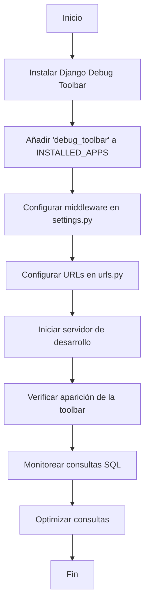

# Unidad: Monitoreo con Django Debug Toolbar en desarrollo

## Introducción a la unidad y objetivos de aprendizaje

En esta unidad, exploraremos en profundidad el uso de Django Debug Toolbar para el monitoreo y depuración de aplicaciones Django durante el desarrollo. Este tema es parte del capítulo "Despliegue y DevOps" del libro "Sistema de Carrito de Compras con Django". La Django Debug Toolbar es una herramienta poderosa que permite a los desarrolladores obtener información detallada sobre las consultas SQL, las solicitudes HTTP, el tiempo de carga de las páginas y otros aspectos críticos de una aplicación Django. Al finalizar esta unidad, los lectores serán capaces de:

1. **Instalar y configurar Django Debug Toolbar en un proyecto Django.**
2. **Utilizar las funcionalidades de Django Debug Toolbar para identificar y resolver problemas de rendimiento y errores en el código.**
3. **Comprender los diferentes paneles y métricas que proporciona la herramienta.**
4. **Implementar mejores prácticas para el uso de herramientas de depuración en entornos de desarrollo.**

## Documento funcional de requerimientos

### Descripción detallada de la funcionalidad

La Django Debug Toolbar es una herramienta de depuración que se integra con Django para proporcionar una interfaz visual que muestra información detallada sobre las solicitudes y respuestas HTTP, las consultas SQL ejecutadas, el tiempo de procesamiento de las vistas, y otros aspectos importantes del rendimiento de la aplicación. Esta herramienta es especialmente útil durante el desarrollo, ya que permite a los desarrolladores identificar y solucionar problemas de manera rápida y eficiente.

### Casos de uso

#### Caso de uso 1: Instalación y configuración de Django Debug Toolbar

**Actor:** Desarrollador

**Descripción:** El desarrollador instala y configura Django Debug Toolbar en un proyecto Django para comenzar a monitorear y depurar la aplicación.

**Precondiciones:**
- El proyecto Django está configurado y en funcionamiento.
- El entorno de desarrollo está correctamente configurado.

**Flujo de eventos:**
1. El desarrollador instala Django Debug Toolbar utilizando pip.
2. El desarrollador añade 'debug_toolbar' a la lista de aplicaciones instaladas en `settings.py`.
3. El desarrollador configura las URLs de la toolbar en `urls.py`.
4. El desarrollador ajusta la configuración de middleware y otras opciones necesarias.

**Postcondiciones:**
- Django Debug Toolbar está instalada y configurada correctamente.
- La toolbar aparece en las páginas de la aplicación durante el desarrollo.

#### Caso de uso 2: Monitoreo de consultas SQL

**Actor:** Desarrollador

**Descripción:** El desarrollador utiliza Django Debug Toolbar para monitorear y optimizar las consultas SQL ejecutadas por la aplicación.

**Precondiciones:**
- Django Debug Toolbar está instalada y configurada.
- La aplicación está en funcionamiento en el entorno de desarrollo.

**Flujo de eventos:**
1. El desarrollador navega a una página de la aplicación.
2. La toolbar muestra un panel con las consultas SQL ejecutadas.
3. El desarrollador revisa las consultas para identificar posibles problemas de rendimiento.
4. El desarrollador optimiza las consultas según sea necesario.

**Postcondiciones:**
- Las consultas SQL problemáticas son identificadas y optimizadas.
- El rendimiento de la aplicación mejora.

### Diagramas de flujo



### Requisitos no funcionales

1. **Rendimiento:** La Django Debug Toolbar debe tener un impacto mínimo en el rendimiento del entorno de desarrollo.
2. **Usabilidad:** La interfaz de la toolbar debe ser intuitiva y fácil de usar para los desarrolladores.
3. **Compatibilidad:** La herramienta debe ser compatible con la versión de Django utilizada en el proyecto.
4. **Seguridad:** La toolbar debe estar deshabilitada en entornos de producción para evitar la exposición de información sensible.

## Implementación en Python

### Explicación paso a paso del código

#### Paso 1: Instalación de Django Debug Toolbar

Para instalar Django Debug Toolbar, utilizamos pip, el gestor de paquetes de Python. Ejecuta el siguiente comando en la terminal:

```bash
pip install django-debug-toolbar
```

#### Paso 2: Configuración en `settings.py`

Añade 'debug_toolbar' a la lista de aplicaciones instaladas en `settings.py`:

```python
INSTALLED_APPS = [
    ...
    'debug_toolbar',
    ...
]
```

Luego, añade el middleware de Django Debug Toolbar:

```python
MIDDLEWARE = [
    ...
    'debug_toolbar.middleware.DebugToolbarMiddleware',
    ...
]
```

Configura las direcciones IP internas para permitir la visualización de la toolbar:

```python
INTERNAL_IPS = [
    '127.0.0.1',
]
```

#### Paso 3: Configuración de URLs en `urls.py`

Añade las URLs de Django Debug Toolbar en `urls.py`:

```python
from django.conf import settings
from django.conf.urls import include, url

if settings.DEBUG:
    import debug_toolbar
    urlpatterns = [
        url(r'^__debug__/', include(debug_toolbar.urls)),
    ] + urlpatterns
```

### Código fuente completo y comentado

```python
# settings.py

INSTALLED_APPS = [
    ...
    'debug_toolbar',  # Añadir la aplicación de Django Debug Toolbar
    ...
]

MIDDLEWARE = [
    ...
    'debug_toolbar.middleware.DebugToolbarMiddleware',  # Añadir el middleware de Django Debug Toolbar
    ...
]

INTERNAL_IPS = [
    '127.0.0.1',  # Configurar las IPs internas permitidas
]

# urls.py

from django.conf import settings
from django.conf.urls import include, url

urlpatterns = [
    ...
]

if settings.DEBUG:
    import debug_toolbar
    urlpatterns = [
        url(r'^__debug__/', include(debug_toolbar.urls)),  # Añadir las URLs de Django Debug Toolbar
    ] + urlpatterns
```

### Ejemplos de uso y pruebas unitarias

#### Ejemplo de uso: Monitoreo de consultas SQL

1. Inicia el servidor de desarrollo:

```bash
python manage.py runserver
```

2. Navega a una página de la aplicación. La Django Debug Toolbar debería aparecer en el lado derecho de la página.
3. Haz clic en el panel "SQL" para ver las consultas SQL ejecutadas.
4. Revisa las consultas para identificar posibles problemas de rendimiento.

#### Pruebas unitarias

Para probar que Django Debug Toolbar está correctamente configurada, puedes crear una prueba unitaria que verifique la presencia de la toolbar en una página de la aplicación.

```python
from django.test import TestCase, Client
from django.conf import settings

class DebugToolbarTest(TestCase):
    def setUp(self):
        self.client = Client()

    def test_debug_toolbar_presence(self):
        if settings.DEBUG:
            response = self.client.get('/')
            self.assertContains(response, 'djDebug', status_code=200)
```

## Mejores prácticas y consideraciones de diseño

1. **Deshabilitar en producción:** Asegúrate de que Django Debug Toolbar esté deshabilitada en entornos de producción para evitar la exposición de información sensible.
2. **Optimización continua:** Utiliza la información proporcionada por la toolbar para identificar y solucionar problemas de rendimiento de manera continua durante el desarrollo.
3. **Documentación:** Mantén una documentación clara sobre cómo utilizar la toolbar y qué métricas observar para los nuevos miembros del equipo.
4. **Configuración personalizada:** Ajusta la configuración de Django Debug Toolbar según las necesidades específicas de tu proyecto para obtener la información más relevante.

### Consideraciones de seguridad

- **Acceso restringido:** Configura `INTERNAL_IPS` para restringir el acceso a la toolbar solo a direcciones IP internas.
- **Deshabilitar en producción:** Asegúrate de que la configuración de la toolbar esté condicionada por el entorno de desarrollo (`DEBUG = True`).

### Consideraciones de rendimiento

- **Impacto mínimo:** La toolbar debe tener un impacto mínimo en el rendimiento del entorno de desarrollo. Si notas una disminución significativa en el rendimiento, revisa la configuración y desactiva paneles innecesarios.

### Consejos para la depuración y solución de problemas comunes

1. **Toolbar no aparece:** Verifica que `DEBUG` esté configurado en `True` y que la dirección IP esté en `INTERNAL_IPS`.
2. **Problemas de compatibilidad:** Asegúrate de que la versión de Django Debug Toolbar sea compatible con la versión de Django utilizada en tu proyecto.
3. **Errores en consultas SQL:** Utiliza el panel "SQL" para identificar consultas lentas o ineficientes y optimízalas.

Con esta unidad, hemos cubierto en detalle cómo instalar, configurar y utilizar Django Debug Toolbar para monitorear y depurar aplicaciones Django durante el desarrollo. Esta herramienta es esencial para identificar y solucionar problemas de rendimiento, lo que resulta en una aplicación más eficiente y robusta.