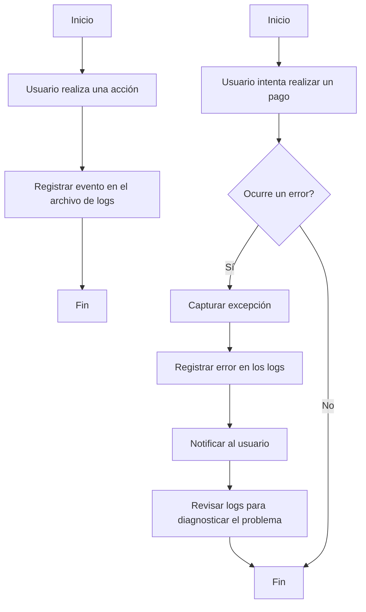

# Unidad: Logging y Manejo de Errores en Producción

## 1. Introducción a la Unidad y Objetivos de Aprendizaje

En esta unidad, nos enfocaremos en el logging y el manejo de errores en un entorno de producción para un sistema de carrito de compras desarrollado con Django. El objetivo es proporcionar una comprensión profunda de cómo registrar eventos y manejar errores de manera efectiva para garantizar la estabilidad y la capacidad de mantenimiento del sistema en producción. Al final de esta unidad, los lectores deberían ser capaces de:

1. Comprender la importancia del logging y el manejo de errores en producción.
2. Configurar el logging en Django para registrar eventos importantes.
3. Implementar estrategias de manejo de errores para capturar y gestionar excepciones.
4. Utilizar herramientas y técnicas para monitorear y analizar los logs.
5. Aplicar mejores prácticas para el logging y el manejo de errores en un entorno de producción.

## 2. Documento Funcional de Requerimientos

### a. Descripción Detallada de la Funcionalidad

El logging y el manejo de errores son componentes críticos en cualquier aplicación de producción. En el contexto de un sistema de carrito de compras con Django, estas funcionalidades permiten registrar eventos importantes, detectar y gestionar errores, y proporcionar información valiosa para la resolución de problemas y la mejora continua del sistema.

#### Logging

El logging implica registrar eventos que ocurren durante la ejecución de la aplicación. Estos eventos pueden incluir información, advertencias, errores y eventos críticos. El objetivo es proporcionar un registro detallado de la actividad del sistema que pueda ser utilizado para monitorear el rendimiento, diagnosticar problemas y realizar auditorías.

#### Manejo de Errores

El manejo de errores implica capturar y gestionar excepciones que ocurren durante la ejecución de la aplicación. Esto incluye la detección de errores, la notificación a los desarrolladores o administradores del sistema, y la implementación de estrategias para mitigar el impacto de los errores en los usuarios finales.

### b. Casos de Uso

#### Caso de Uso 1: Registro de Eventos de Usuario

**Descripción:** El sistema debe registrar eventos importantes relacionados con las acciones de los usuarios, como iniciar sesión, agregar productos al carrito, realizar una compra, etc.

**Actores:** Usuario, Administrador del Sistema

**Flujo Principal:**
1. El usuario realiza una acción en el sistema (por ejemplo, inicia sesión).
2. El sistema registra el evento en el archivo de logs.
3. El administrador del sistema puede revisar los logs para monitorear la actividad del usuario.

#### Caso de Uso 2: Manejo de Errores en el Proceso de Pago

**Descripción:** El sistema debe capturar y gestionar errores que ocurren durante el proceso de pago, como errores de conexión con el proveedor de pagos o fallos en la validación de la tarjeta de crédito.

**Actores:** Usuario, Administrador del Sistema, Proveedor de Pagos

**Flujo Principal:**
1. El usuario intenta realizar un pago.
2. Ocurre un error durante el proceso de pago.
3. El sistema captura la excepción y registra el error en los logs.
4. El sistema notifica al usuario sobre el error y proporciona instrucciones para resolverlo.
5. El administrador del sistema revisa los logs para diagnosticar y solucionar el problema.

### c. Diagramas de Flujo



### d. Requisitos No Funcionales

1. **Rendimiento:** El sistema de logging debe ser eficiente y no debe afectar significativamente el rendimiento de la aplicación.
2. **Escalabilidad:** El sistema debe ser capaz de manejar un gran volumen de logs y errores a medida que la aplicación escala.
3. **Seguridad:** Los logs deben ser almacenados de manera segura y deben ser accesibles solo para usuarios autorizados.
4. **Mantenibilidad:** El sistema de logging y manejo de errores debe ser fácil de mantener y actualizar.

## 3. Implementación en Python

### a. Explicación Paso a Paso del Código

Para implementar el logging y el manejo de errores en Django, seguiremos los siguientes pasos:

1. **Configurar el Logging en Django:**
   Django proporciona una configuración de logging basada en el módulo `logging` de Python. Configuraremos el logging en el archivo `settings.py`.

2. **Registrar Eventos Importantes:**
   Utilizaremos el módulo `logging` para registrar eventos importantes en diferentes partes de la aplicación.

3. **Capturar y Gestionar Excepciones:**
   Implementaremos middleware y manejadores de excepciones personalizados para capturar y gestionar errores.

4. **Monitorear y Analizar los Logs:**
   Utilizaremos herramientas como `Sentry` para monitorear y analizar los logs en producción.

### b. Código Fuente Completo y Comentado

#### Configuración del Logging en `settings.py`

```python
# settings.py

import os
import logging
import logging.config

LOGGING = {
    'version': 1,
    'disable_existing_loggers': False,
    'formatters': {
        'verbose': {
            'format': '{levelname} {asctime} {module} {message}',
            'style': '{',
        },
        'simple': {
            'format': '{levelname} {message}',
            'style': '{',
        },
    },
    'handlers': {
        'file': {
            'level': 'DEBUG',
            'class': 'logging.FileHandler',
            'filename': os.path.join(BASE_DIR, 'logs/debug.log'),
            'formatter': 'verbose',
        },
        'console': {
            'level': 'DEBUG',
            'class': 'logging.StreamHandler',
            'formatter': 'simple',
        },
    },
    'loggers': {
        'django': {
            'handlers': ['file', 'console'],
            'level': 'DEBUG',
            'propagate': True,
        },
        'myapp': {
            'handlers': ['file', 'console'],
            'level': 'DEBUG',
            'propagate': False,
        },
    },
}
```

#### Registrar Eventos Importantes

```python
# views.py

import logging

logger = logging.getLogger('myapp')

def user_login(request):
    # Código para manejar el inicio de sesión del usuario
    logger.info(f'Usuario {request.user.username} ha iniciado sesión')
    # Resto del código

def add_to_cart(request, product_id):
    # Código para agregar un producto al carrito
    logger.info(f'Producto {product_id} agregado al carrito por el usuario {request.user.username}')
    # Resto del código

def process_payment(request):
    try:
        # Código para procesar el pago
        logger.info(f'Pago procesado para el usuario {request.user.username}')
    except Exception as e:
        logger.error(f'Error al procesar el pago para el usuario {request.user.username}: {str(e)}')
        # Manejo del error
```

#### Capturar y Gestionar Excepciones

```python
# middleware.py

import logging

logger = logging.getLogger('myapp')

class CustomExceptionMiddleware:
    def __init__(self, get_response):
        self.get_response = get_response

    def __call__(self, request):
        response = self.get_response(request)
        return response

    def process_exception(self, request, exception):
        logger.error(f'Excepción no manejada: {str(exception)}', exc_info=True)
        # Aquí podríamos redirigir a una página de error personalizada
        return None
```

#### Monitorear y Analizar los Logs con Sentry

Primero, instalamos Sentry:

```bash
pip install sentry-sdk
```

Luego, configuramos Sentry en `settings.py`:

```python
# settings.py

import sentry_sdk
from sentry_sdk.integrations.django import DjangoIntegration

sentry_sdk.init(
    dsn='YOUR_SENTRY_DSN',
    integrations=[DjangoIntegration()],
    traces_sample_rate=1.0,
    send_default_pii=True
)
```

### c. Ejemplos de Uso y Pruebas Unitarias

#### Ejemplo de Uso

```python
# Ejemplo de uso en una vista

def checkout(request):
    try:
        process_payment(request)
        return HttpResponse('Pago realizado con éxito')
    except Exception as e:
        logger.error(f'Error en el checkout: {str(e)}')
        return HttpResponse('Error al realizar el pago', status=500)
```

#### Pruebas Unitarias

```python
# tests.py

from django.test import TestCase
from django.urls import reverse
import logging

logger = logging.getLogger('myapp')

class LoggingTests(TestCase):
    def test_user_login_logging(self):
        response = self.client.post(reverse('login'), {'username': 'testuser', 'password': 'password'})
        self.assertEqual(response.status_code, 200)
        # Aquí podríamos verificar que el log se haya registrado correctamente

    def test_add_to_cart_logging(self):
        response = self.client.post(reverse('add_to_cart'), {'product_id': 1})
        self.assertEqual(response.status_code, 200)
        # Aquí podríamos verificar que el log se haya registrado correctamente

    def test_process_payment_logging(self):
        response = self.client.post(reverse('checkout'))
        self.assertEqual(response.status_code, 200)
        # Aquí podríamos verificar que el log se haya registrado correctamente
```

## 4. Mejores Prácticas y Consideraciones de Diseño

### Mejores Prácticas

1. **Registrar Eventos Importantes:** Asegúrate de registrar eventos importantes que puedan ayudar a diagnosticar problemas y monitorear la actividad del sistema.
2. **Usar Niveles de Logging Apropiados:** Utiliza niveles de logging apropiados (DEBUG, INFO, WARNING, ERROR, CRITICAL) para diferenciar la importancia de los eventos registrados.
3. **Proteger Información Sensible:** No registres información sensible como contraseñas o datos de tarjetas de crédito en los logs.
4. **Monitorear los Logs Regularmente:** Revisa los logs regularmente para detectar y solucionar problemas de manera proactiva.
5. **Configurar Alertas:** Configura alertas para eventos críticos que requieran atención inmediata.

### Consideraciones de Diseño

1. **Rendimiento:** Asegúrate de que el sistema de logging no afecte significativamente el rendimiento de la aplicación.
2. **Escalabilidad:** Diseña el sistema de logging para manejar un gran volumen de eventos a medida que la aplicación escala.
3. **Seguridad:** Protege los logs para evitar accesos no autorizados y asegúrate de que se almacenen de manera segura.
4. **Mantenibilidad:** Mantén la configuración de logging y manejo de errores bien documentada y fácil de mantener.

### Consejos para la Depuración y Solución de Problemas Comunes

1. **Verificar la Configuración de Logging:** Asegúrate de que la configuración de logging en `settings.py` esté correcta y que los handlers y loggers estén configurados adecuadamente.
2. **Revisar los Logs:** Revisa los logs para obtener pistas sobre la causa de los problemas. Los mensajes de error y las trazas de pila pueden proporcionar información valiosa.
3. **Utilizar Herramientas de Monitoreo:** Utiliza herramientas como Sentry para monitorear y analizar los logs en producción. Estas herramientas pueden proporcionar información adicional y alertas en tiempo real.
4. **Probar en un Entorno de Desarrollo:** Realiza pruebas exhaustivas en un entorno de desarrollo antes de desplegar cambios en producción. Esto puede ayudar a detectar y solucionar problemas antes de que afecten a los usuarios finales.

En resumen, el logging y el manejo de errores son componentes esenciales para garantizar la estabilidad y la capacidad de mantenimiento de un sistema de carrito de compras en producción. Al seguir las mejores prácticas y considerar aspectos de rendimiento, escalabilidad y seguridad, podemos implementar un sistema robusto y eficiente para registrar eventos y gestionar errores en Django.