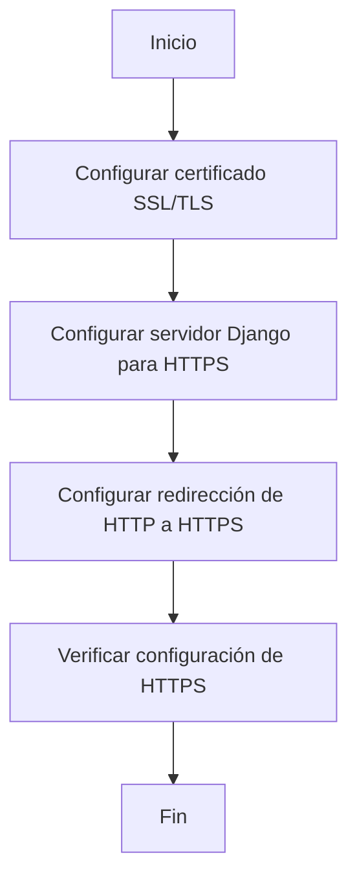

# Unidad: Implementación de HTTPS

## 1. Introducción a la unidad y objetivos de aprendizaje

En esta unidad, nos enfocaremos en la implementación de HTTPS en un sistema de carrito de compras desarrollado con Django. HTTPS (HyperText Transfer Protocol Secure) es una extensión de HTTP que utiliza SSL/TLS para cifrar la comunicación entre el cliente y el servidor, garantizando la integridad y confidencialidad de los datos transmitidos. Dado que nuestro sistema de carrito de compras maneja información sensible, como datos de usuarios y transacciones, es crucial asegurar que esta información esté protegida contra posibles ataques.

### Objetivos de aprendizaje

Al finalizar esta unidad, los lectores serán capaces de:

1. Comprender la importancia de HTTPS en aplicaciones web.
2. Configurar un certificado SSL/TLS en un servidor Django.
3. Implementar redirecciones automáticas de HTTP a HTTPS.
4. Verificar la correcta configuración y funcionamiento de HTTPS.
5. Aplicar mejores prácticas de seguridad en la implementación de HTTPS.

## 2. Documento funcional de requerimientos

### a. Descripción detallada de la funcionalidad

La funcionalidad principal de esta unidad es asegurar que todas las comunicaciones entre el cliente y el servidor del sistema de carrito de compras se realicen a través de HTTPS. Esto incluye la configuración de un certificado SSL/TLS, la redirección automática de HTTP a HTTPS y la verificación de la correcta implementación de HTTPS.

### b. Casos de uso

#### Caso de uso 1: Configuración del certificado SSL/TLS

**Actor:** Administrador del sistema

**Descripción:** El administrador del sistema configura un certificado SSL/TLS en el servidor Django para habilitar HTTPS.

**Precondiciones:** El servidor Django está configurado y en funcionamiento.

**Postcondiciones:** El servidor Django acepta conexiones HTTPS.

#### Caso de uso 2: Redirección automática de HTTP a HTTPS

**Actor:** Usuario final

**Descripción:** Cuando un usuario intenta acceder al sistema de carrito de compras a través de HTTP, es redirigido automáticamente a la versión HTTPS del sitio.

**Precondiciones:** El servidor Django está configurado para aceptar conexiones HTTPS.

**Postcondiciones:** Todas las solicitudes HTTP son redirigidas a HTTPS.

#### Caso de uso 3: Verificación de la configuración de HTTPS

**Actor:** Administrador del sistema

**Descripción:** El administrador del sistema verifica que todas las comunicaciones entre el cliente y el servidor se realicen a través de HTTPS.

**Precondiciones:** El servidor Django está configurado para aceptar conexiones HTTPS y redirigir automáticamente HTTP a HTTPS.

**Postcondiciones:** Todas las comunicaciones entre el cliente y el servidor están cifradas y se realizan a través de HTTPS.

### c. Diagramas de flujo (en mermaid)



### d. Requisitos no funcionales

1. **Seguridad:** Todas las comunicaciones entre el cliente y el servidor deben estar cifradas utilizando HTTPS.
2. **Rendimiento:** La implementación de HTTPS no debe introducir una latencia significativa en las comunicaciones.
3. **Escalabilidad:** La configuración de HTTPS debe ser capaz de manejar un gran número de conexiones simultáneas.
4. **Compatibilidad:** La implementación debe ser compatible con los navegadores web modernos y dispositivos móviles.
5. **Mantenibilidad:** La configuración de HTTPS debe ser fácil de mantener y actualizar.

## 3. Implementación en Python

### a. Explicación paso a paso del código

Para implementar HTTPS en nuestro sistema de carrito de compras con Django, seguiremos los siguientes pasos:

1. **Obtener un certificado SSL/TLS:** Podemos obtener un certificado SSL/TLS de una autoridad certificadora (CA) como Let's Encrypt.
2. **Configurar el servidor Django para HTTPS:** Modificaremos la configuración de Django para aceptar conexiones HTTPS.
3. **Configurar redirección de HTTP a HTTPS:** Aseguraremos que todas las solicitudes HTTP sean redirigidas a HTTPS.
4. **Verificar la configuración:** Comprobaremos que todas las comunicaciones se realicen a través de HTTPS.

### b. Código fuente completo y comentado

#### Paso 1: Obtener un certificado SSL/TLS

Para obtener un certificado SSL/TLS gratuito de Let's Encrypt, podemos utilizar Certbot. Certbot es una herramienta que automatiza el proceso de obtención y renovación de certificados SSL/TLS.

Primero, instalamos Certbot en nuestro servidor:

```bash
sudo apt-get update
sudo apt-get install certbot
```

Luego, obtenemos el certificado SSL/TLS:

```bash
sudo certbot certonly --standalone -d example.com -d www.example.com
```

#### Paso 2: Configurar el servidor Django para HTTPS

Modificamos la configuración de Django para aceptar conexiones HTTPS. En el archivo `settings.py`, añadimos las siguientes configuraciones:

```python
# settings.py

# Importamos las librerías necesarias
import os

# Configuramos la ruta del certificado y la clave privada
BASE_DIR = os.path.dirname(os.path.dirname(os.path.abspath(__file__)))
CERT_FILE = os.path.join(BASE_DIR, 'path/to/fullchain.pem')
KEY_FILE = os.path.join(BASE_DIR, 'path/to/privkey.pem')

# Configuramos Django para usar HTTPS
SECURE_SSL_REDIRECT = True
SECURE_HSTS_SECONDS = 31536000
SECURE_HSTS_INCLUDE_SUBDOMAINS = True
SECURE_HSTS_PRELOAD = True
SECURE_CONTENT_TYPE_NOSNIFF = True
SECURE_BROWSER_XSS_FILTER = True
SESSION_COOKIE_SECURE = True
CSRF_COOKIE_SECURE = True
```

#### Paso 3: Configurar redirección de HTTP a HTTPS

Para redirigir automáticamente todas las solicitudes HTTP a HTTPS, podemos utilizar un middleware personalizado. Creamos un archivo llamado `middleware.py` en nuestra aplicación Django y añadimos el siguiente código:

```python
# middleware.py

from django.conf import settings
from django.http import HttpResponsePermanentRedirect

class SSLRedirectMiddleware:
    def __init__(self, get_response):
        self.get_response = get_response

    def __call__(self, request):
        if not request.is_secure() and not settings.DEBUG:
            url = request.build_absolute_uri(request.get_full_path())
            secure_url = url.replace("http://", "https://")
            return HttpResponsePermanentRedirect(secure_url)
        response = self.get_response(request)
        return response
```

Luego, añadimos el middleware a la lista de middlewares en `settings.py`:

```python
# settings.py

MIDDLEWARE = [
    # Otros middlewares
    'path.to.middleware.SSLRedirectMiddleware',
    # Otros middlewares
]
```

#### Paso 4: Verificar la configuración

Para verificar que todas las comunicaciones se realicen a través de HTTPS, podemos utilizar herramientas como `curl` o navegadores web. Por ejemplo, podemos ejecutar el siguiente comando `curl` para comprobar la redirección:

```bash
curl -I http://example.com
```

La respuesta debe ser una redirección 301 a la versión HTTPS del sitio:

```bash
HTTP/1.1 301 Moved Permanently
Location: https://example.com/
```

### c. Ejemplos de uso y pruebas unitarias

#### Ejemplo de uso

Supongamos que hemos configurado nuestro servidor Django para HTTPS y hemos implementado la redirección automática de HTTP a HTTPS. Ahora, cuando un usuario intenta acceder al sistema de carrito de compras a través de HTTP, será redirigido automáticamente a la versión HTTPS del sitio.

#### Pruebas unitarias

Podemos escribir pruebas unitarias para verificar que la redirección de HTTP a HTTPS funciona correctamente. Utilizamos el framework de pruebas de Django para escribir nuestras pruebas.

```python
# tests.py

from django.test import TestCase, Client

class SSLRedirectMiddlewareTest(TestCase):
    def setUp(self):
        self.client = Client()

    def test_http_to_https_redirect(self):
        response = self.client.get('http://example.com')
        self.assertEqual(response.status_code, 301)
        self.assertTrue(response['Location'].startswith('https://'))
```

### d. Mejores prácticas y consideraciones de diseño

1. **Renovación automática del certificado:** Utiliza Certbot para configurar la renovación automática del certificado SSL/TLS, asegurando que tu sitio web siempre tenga un certificado válido.
2. **Configuración de HSTS:** Habilita HTTP Strict Transport Security (HSTS) para indicar a los navegadores que solo deben comunicarse con tu sitio a través de HTTPS.
3. **Seguridad adicional:** Configura encabezados de seguridad adicionales, como `Content-Security-Policy` y `X-Frame-Options`, para proteger tu sitio contra ataques comunes.
4. **Monitoreo y alertas:** Implementa monitoreo y alertas para detectar y responder rápidamente a cualquier problema relacionado con HTTPS.
5. **Pruebas exhaustivas:** Realiza pruebas exhaustivas para asegurarte de que todas las rutas y recursos de tu sitio están accesibles a través de HTTPS.

## Conclusión

En esta unidad, hemos aprendido a implementar HTTPS en un sistema de carrito de compras desarrollado con Django. Hemos cubierto la obtención de un certificado SSL/TLS, la configuración del servidor Django para HTTPS, la redirección automática de HTTP a HTTPS y la verificación de la configuración. Además, hemos discutido las mejores prácticas y consideraciones de diseño para asegurar que nuestra implementación de HTTPS sea segura y eficiente. Con estos conocimientos, estamos mejor preparados para proteger la información sensible de nuestros usuarios y garantizar la seguridad de nuestro sistema de carrito de compras.