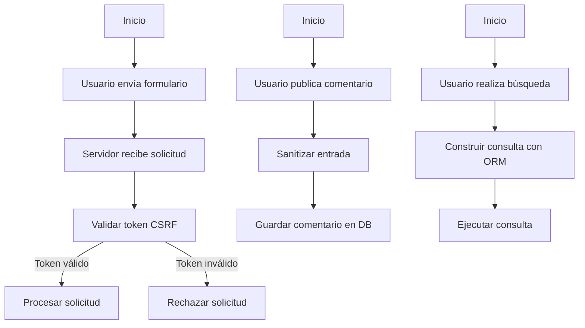

### Unidad: Protección contra CSRF, XSS y SQL Injection

#### Introducción a la Unidad y Objetivos de Aprendizaje

En esta unidad, profundizaremos en las técnicas avanzadas para proteger un sistema de carrito de compras desarrollado con Django contra tres de las amenazas más comunes en aplicaciones web: Cross-Site Request Forgery (CSRF), Cross-Site Scripting (XSS) y SQL Injection. Aunque ya se han abordado estos temas en unidades anteriores, aquí exploraremos estrategias más avanzadas y específicas para Django, con el objetivo de garantizar un sistema robusto y seguro.

**Objetivos de Aprendizaje:**

1. Comprender en profundidad las amenazas de CSRF, XSS y SQL Injection.
2. Implementar medidas avanzadas de protección contra estas amenazas en un sistema de carrito de compras con Django.
3. Aprender a utilizar las herramientas y librerías de Django para mejorar la seguridad de la aplicación.
4. Realizar pruebas de seguridad para verificar la efectividad de las medidas implementadas.

#### Documento Funcional de Requerimientos

##### a. Descripción Detallada de la Funcionalidad

La funcionalidad principal de esta unidad es asegurar que el sistema de carrito de compras sea resistente a ataques de CSRF, XSS y SQL Injection. Esto se logrará mediante la implementación de prácticas de codificación segura y el uso de herramientas proporcionadas por Django.

**CSRF (Cross-Site Request Forgery):**
- Implementar tokens CSRF en formularios y solicitudes AJAX.
- Verificar la validez de los tokens en el servidor.

**XSS (Cross-Site Scripting):**
- Escapar y sanitizar todas las entradas de usuario.
- Utilizar plantillas seguras en Django para evitar la inserción de scripts maliciosos.

**SQL Injection:**
- Utilizar el ORM de Django para todas las interacciones con la base de datos.
- Evitar la construcción de consultas SQL dinámicas con entradas de usuario.

##### b. Casos de Uso

**Caso de Uso 1: Protección contra CSRF en Formularios**
- **Actor:** Usuario
- **Descripción:** Un usuario envía un formulario de compra en el sistema de carrito de compras.
- **Precondición:** El usuario debe estar autenticado.
- **Postcondición:** El servidor valida el token CSRF y procesa la solicitud si es válida.

**Caso de Uso 2: Protección contra XSS en Comentarios de Productos**
- **Actor:** Usuario
- **Descripción:** Un usuario publica un comentario en la página de un producto.
- **Precondición:** El usuario debe estar autenticado.
- **Postcondición:** El comentario se guarda en la base de datos después de ser sanitizado.

**Caso de Uso 3: Protección contra SQL Injection en Búsquedas de Productos**
- **Actor:** Usuario
- **Descripción:** Un usuario realiza una búsqueda de productos en el sistema.
- **Precondición:** El usuario debe estar autenticado.
- **Postcondición:** La consulta se ejecuta de manera segura utilizando el ORM de Django.

##### c. Diagramas de Flujo



##### d. Requisitos No Funcionales

- **Seguridad:** La aplicación debe ser resistente a ataques CSRF, XSS y SQL Injection.
- **Rendimiento:** Las medidas de seguridad no deben afectar significativamente el rendimiento de la aplicación.
- **Escalabilidad:** La aplicación debe ser capaz de manejar un aumento en el número de usuarios sin comprometer la seguridad.
- **Mantenibilidad:** El código debe ser claro y bien documentado para facilitar futuras actualizaciones y mantenimientos.

#### Implementación en Python

##### a. Explicación Paso a Paso del Código

**Protección contra CSRF:**

Django proporciona protección contra CSRF de manera predeterminada. Sin embargo, es importante asegurarse de que todos los formularios y solicitudes AJAX incluyan el token CSRF.

1. **Incluir el Middleware de CSRF:**
   Django incluye `CsrfViewMiddleware` por defecto. Asegúrate de que esté habilitado en `MIDDLEWARE` en `settings.py`.

2. **Incluir el Token CSRF en Formularios:**
   En las plantillas de Django, utiliza `` dentro de los formularios para incluir el token CSRF.

   ```html
   <form method="post" action="/comprar/">
       
       <!-- otros campos del formulario -->
       <button type="submit">Comprar</button>
   </form>
   ```

3. **Incluir el Token CSRF en Solicitudes AJAX:**
   Para solicitudes AJAX, el token CSRF debe ser incluido en los encabezados de la solicitud.

   ```javascript
   function getCookie(name) {
       var cookieValue = null;
       if (document.cookie && document.cookie !== '') {
           var cookies = document.cookie.split(';');
           for (var i = 0; i < cookies.length; i++) {
               var cookie = cookies[i].trim();
               if (cookie.substring(0, name.length + 1) === (name + '=')) {
                   cookieValue = decodeURIComponent(cookie.substring(name.length + 1));
                   break;
               }
           }
       }
       return cookieValue;
   }
   var csrftoken = getCookie('csrftoken');

   function csrfSafeMethod(method) {
       return (/^(GET|HEAD|OPTIONS|TRACE)$/.test(method));
   }

   $.ajaxSetup({
       beforeSend: function(xhr, settings) {
           if (!csrfSafeMethod(settings.type) && !this.crossDomain) {
               xhr.setRequestHeader("X-CSRFToken", csrftoken);
           }
       }
   });
   ```

**Protección contra XSS:**

1. **Escapar y Sanitizar Entradas de Usuario:**
   Utiliza las funciones de Django para escapar y sanitizar entradas de usuario antes de mostrarlas en las plantillas.

   ```python
   from django.utils.html import escape

   def publicar_comentario(request):
       if request.method == "POST":
           comentario = escape(request.POST.get('comentario'))
           # Guardar el comentario en la base de datos
   ```

2. **Utilizar Plantillas Seguras:**
   Django automáticamente escapa las variables en las plantillas. Asegúrate de no desactivar esta funcionalidad.

   ```html
   <p>{{ comentario }}</p>
   ```

**Protección contra SQL Injection:**

1. **Utilizar el ORM de Django:**
   Evita construir consultas SQL dinámicas con entradas de usuario. Utiliza el ORM de Django para todas las interacciones con la base de datos.

   ```python
   from .models import Producto

   def buscar_productos(request):
       query = request.GET.get('q')
       productos = Producto.objects.filter(nombre__icontains=query)
       return render(request, 'resultados.html', {'productos': productos})
   ```

##### b. Código Fuente Completo y Comentado

```python
# views.py

from django.shortcuts import render, redirect
from django.utils.html import escape
from .models import Producto, Comentario

def comprar_producto(request):
    if request.method == "POST":
        # Validar token CSRF
        # Django lo hace automáticamente si CSRF middleware está habilitado
        # Procesar la compra
        return redirect('compra_exitosa')
    return render(request, 'comprar.html')

def publicar_comentario(request):
    if request.method == "POST":
        comentario = escape(request.POST.get('comentario'))
        nuevo_comentario = Comentario(texto=comentario, usuario=request.user)
        nuevo_comentario.save()
        return redirect('producto_detalle', id=nuevo_comentario.producto.id)
    return render(request, 'publicar_comentario.html')

def buscar_productos(request):
    query = request.GET.get('q')
    productos = Producto.objects.filter(nombre__icontains=query)
    return render(request, 'resultados.html', {'productos': productos})
```

##### c. Ejemplos de Uso y Pruebas Unitarias

**Ejemplo de Uso:**

1. **Comprar Producto:**
   - El usuario accede a la página de compra, llena el formulario y envía la solicitud.
   - El servidor valida el token CSRF y procesa la compra.

2. **Publicar Comentario:**
   - El usuario publica un comentario en la página de un producto.
   - El comentario se sanitiza y se guarda en la base de datos.

3. **Buscar Productos:**
   - El usuario realiza una búsqueda de productos.
   - La consulta se ejecuta de manera segura utilizando el ORM de Django.

**Pruebas Unitarias:**

```python
# tests.py

from django.test import TestCase, Client
from django.urls import reverse
from .models import Producto, Comentario
from django.contrib.auth.models import User

class SeguridadTestCase(TestCase):
    def setUp(self):
        self.client = Client()
        self.user = User.objects.create_user(username='testuser', password='12345')
        self.client.login(username='testuser', password='12345')
        self.producto = Producto.objects.create(nombre='Producto Test', precio=100)

    def test_csrf_proteccion(self):
        response = self.client.post(reverse('comprar_producto'), {'producto_id': self.producto.id})
        self.assertEqual(response.status_code, 403)  # CSRF token missing or incorrect

    def test_xss_proteccion(self):
        comentario = '<script>alert("XSS")</script>'
        response = self.client.post(reverse('publicar_comentario'), {'comentario': comentario})
        self.assertNotIn(comentario, response.content.decode())
        self.assertIn('&lt;script&gt;alert(&quot;XSS&quot;)&lt;/script&gt;', response.content.decode())

    def test_sql_injection_proteccion(self):
        query = 'Producto Test" OR "1"="1'
        response = self.client.get(reverse('buscar_productos'), {'q': query})
        self.assertEqual(response.status_code, 200)
        self.assertContains(response, 'Producto Test')
```

#### Mejores Prácticas y Consideraciones de Diseño

1. **Mantener el Middleware de CSRF Habilitado:**
   Asegúrate de que el middleware de CSRF esté siempre habilitado en tu configuración de Django.

2. **Sanitizar Todas las Entradas de Usuario:**
   Nunca confíes en las entradas de usuario. Siempre escapa y sanitiza antes de procesarlas o almacenarlas.

3. **Utilizar el ORM de Django:**
   El ORM de Django no solo facilita las consultas a la base de datos, sino que también protege contra inyecciones SQL.

4. **Revisar y Actualizar Regularmente:**
   La seguridad es un proceso continuo. Revisa y actualiza regularmente tu código y dependencias para protegerte contra nuevas vulnerabilidades.

5. **Realizar Pruebas de Seguridad:**
   Implementa pruebas de seguridad automatizadas como parte de tu proceso de desarrollo para detectar y corregir vulnerabilidades de manera temprana.

6. **Consideraciones de Rendimiento:**
   Asegúrate de que las medidas de seguridad no afecten significativamente el rendimiento de la aplicación. Realiza pruebas de carga para identificar posibles cuellos de botella.

7. **Documentación y Mantenibilidad:**
   Documenta todas las medidas de seguridad implementadas y asegúrate de que el código sea claro y fácil de mantener.

En resumen, la protección contra CSRF, XSS y SQL Injection es crucial para la seguridad de cualquier aplicación web. Al seguir las mejores prácticas y utilizar las herramientas proporcionadas por Django, puedes crear un sistema de carrito de compras seguro y robusto.