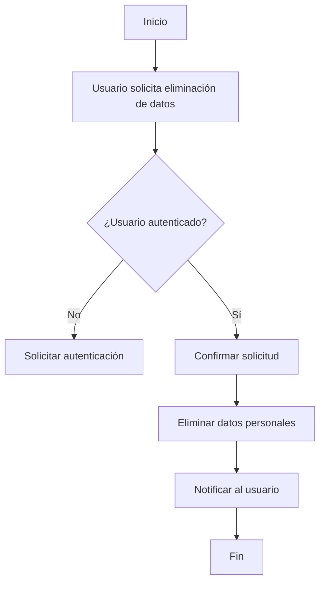
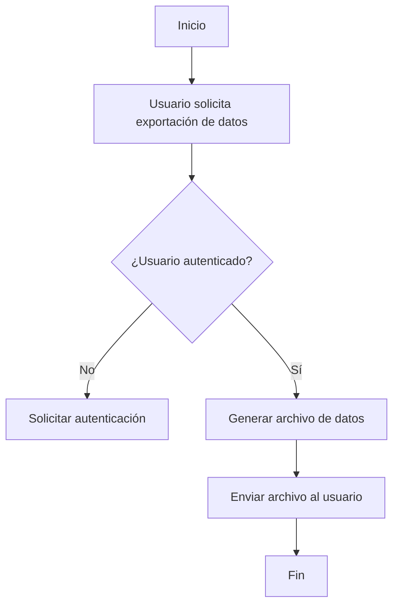

# Unidad: Cumplimiento GDPR con django-gdpr-assist

## Introducción a la unidad y objetivos de aprendizaje

En esta unidad, nos enfocaremos en el cumplimiento del Reglamento General de Protección de Datos (GDPR) utilizando la librería `django-gdpr-assist` en el contexto de un sistema de carrito de compras desarrollado con Django. El GDPR es una regulación de la Unión Europea que establece directrices estrictas sobre la recopilación, almacenamiento y procesamiento de datos personales. Cumplir con estas regulaciones es crucial para evitar sanciones legales y mantener la confianza de los usuarios.

### Objetivos de aprendizaje

1. Comprender los principios fundamentales del GDPR y su aplicación en un sistema de carrito de compras.
2. Aprender a integrar y utilizar la librería `django-gdpr-assist` para facilitar el cumplimiento del GDPR.
3. Implementar funcionalidades específicas como la anonimización y eliminación de datos personales.
4. Realizar pruebas para asegurar que las implementaciones cumplen con los requisitos del GDPR.
5. Adoptar mejores prácticas y consideraciones de diseño para mantener la seguridad y el cumplimiento a largo plazo.

## Documento funcional de requerimientos

### Descripción detallada de la funcionalidad

El objetivo principal es asegurar que nuestro sistema de carrito de compras cumple con las regulaciones del GDPR. Esto incluye:

1. **Anonimización de datos**: Proceso mediante el cual los datos personales se transforman de manera que no se pueda identificar a una persona específica.
2. **Eliminación de datos**: Capacidad de eliminar completamente los datos personales de un usuario a petición.
3. **Portabilidad de datos**: Permitir a los usuarios exportar sus datos personales en un formato estructurado y comúnmente utilizado.
4. **Consentimiento informado**: Asegurar que los usuarios den su consentimiento explícito para la recopilación y procesamiento de sus datos personales.

### Casos de uso

1. **Anonimización de datos personales**:
   - **Actor**: Administrador del sistema.
   - **Descripción**: El administrador puede anonimizar los datos personales de usuarios inactivos para cumplir con las políticas de retención de datos.
   - **Precondiciones**: El usuario debe estar inactivo durante un período específico.
   - **Postcondiciones**: Los datos personales del usuario se anonimizarán y no se podrán utilizar para identificar al usuario.

2. **Eliminación de datos personales**:
   - **Actor**: Usuario registrado.
   - **Descripción**: Un usuario puede solicitar la eliminación completa de sus datos personales.
   - **Precondiciones**: El usuario debe autenticarse y confirmar su solicitud.
   - **Postcondiciones**: Todos los datos personales del usuario se eliminarán del sistema.

3. **Exportación de datos personales**:
   - **Actor**: Usuario registrado.
   - **Descripción**: Un usuario puede solicitar una copia de sus datos personales en un formato estructurado.
   - **Precondiciones**: El usuario debe autenticarse y solicitar la exportación.
   - **Postcondiciones**: El usuario recibirá un archivo con sus datos personales.

4. **Consentimiento informado**:
   - **Actor**: Usuario visitante.
   - **Descripción**: El sistema debe obtener el consentimiento explícito del usuario antes de recopilar y procesar sus datos personales.
   - **Precondiciones**: El usuario visita el sitio web por primera vez o después de que se hayan realizado cambios en la política de privacidad.
   - **Postcondiciones**: El consentimiento del usuario se almacena y se utiliza para futuras referencias.

### Diagramas de flujo (en mermaid)





### Requisitos no funcionales

1. **Seguridad**: Los datos personales deben ser manejados de manera segura, utilizando cifrado tanto en tránsito como en reposo.
2. **Rendimiento**: Las operaciones de anonimización y eliminación de datos deben ser eficientes y no afectar el rendimiento general del sistema.
3. **Escalabilidad**: La solución debe ser escalable para manejar un gran número de solicitudes de anonimización y eliminación de datos.
4. **Auditoría**: Debe haber un registro de todas las operaciones de anonimización y eliminación de datos para fines de auditoría.
5. **Usabilidad**: La interfaz para solicitar la eliminación y exportación de datos debe ser intuitiva y fácil de usar.

## Implementación en Python

### Explicación paso a paso del código

Para implementar el cumplimiento del GDPR en nuestro sistema de carrito de compras, utilizaremos la librería `django-gdpr-assist`. Esta librería proporciona herramientas para anonimizar y eliminar datos personales de manera sencilla.

#### Paso 1: Instalación de django-gdpr-assist

Primero, necesitamos instalar la librería `django-gdpr-assist`:

```bash
pip install django-gdpr-assist
```

Luego, agregamos `gdpr_assist` a la lista de aplicaciones instaladas en `settings.py`:

```python
INSTALLED_APPS = [
    ...
    'gdpr_assist',
    ...
]
```

#### Paso 2: Configuración de modelos para GDPR

Para que `django-gdpr-assist` pueda manejar los datos personales, debemos configurar nuestros modelos. Supongamos que tenemos un modelo `Usuario` que almacena datos personales:

```python
from django.db import models
from gdpr_assist.models import PrivacyMeta

class Usuario(models.Model):
    nombre = models.CharField(max_length=100)
    email = models.EmailField(unique=True)
    direccion = models.CharField(max_length=255)
    telefono = models.CharField(max_length=15)
    fecha_registro = models.DateTimeField(auto_now_add=True)

    class Meta:
        privacy_meta = PrivacyMeta(
            fields = [
                'nombre',
                'email',
                'direccion',
                'telefono'
            ],
            search_fields = [
                'email'
            ]
        )
```

#### Paso 3: Anonimización de datos

Para anonimizar los datos personales de un usuario, podemos utilizar el siguiente método:

```python
from gdpr_assist.models import PrivacyManager

def anonimizar_usuario(usuario_id):
    try:
        usuario = Usuario.objects.get(id=usuario_id)
        usuario.anonimizar()
        usuario.save()
        return True
    except Usuario.DoesNotExist:
        return False
```

#### Paso 4: Eliminación de datos

Para eliminar los datos personales de un usuario, podemos definir el siguiente método:

```python
def eliminar_usuario(usuario_id):
    try:
        usuario = Usuario.objects.get(id=usuario_id)
        usuario.delete()
        return True
    except Usuario.DoesNotExist:
        return False
```

#### Paso 5: Exportación de datos

Para permitir la exportación de datos personales, podemos definir un método que genere un archivo JSON con los datos del usuario:

```python
import json
from django.http import JsonResponse

def exportar_datos_usuario(usuario_id):
    try:
        usuario = Usuario.objects.get(id=usuario_id)
        datos = {
            'nombre': usuario.nombre,
            'email': usuario.email,
            'direccion': usuario.direccion,
            'telefono': usuario.telefono,
            'fecha_registro': usuario.fecha_registro.isoformat()
        }
        return JsonResponse(datos)
    except Usuario.DoesNotExist:
        return JsonResponse({'error': 'Usuario no encontrado'}, status=404)
```

### Código fuente completo y comentado

```python
from django.db import models
from gdpr_assist.models import PrivacyMeta

class Usuario(models.Model):
    nombre = models.CharField(max_length=100)
    email = models.EmailField(unique=True)
    direccion = models.CharField(max_length=255)
    telefono = models.CharField(max_length=15)
    fecha_registro = models.DateTimeField(auto_now_add=True)

    class Meta:
        privacy_meta = PrivacyMeta(
            fields = [
                'nombre',
                'email',
                'direccion',
                'telefono'
            ],
            search_fields = [
                'email'
            ]
        )

# Función para anonimizar los datos de un usuario
def anonimizar_usuario(usuario_id):
    try:
        usuario = Usuario.objects.get(id=usuario_id)
        usuario.anonimizar()
        usuario.save()
        return True
    except Usuario.DoesNotExist:
        return False

# Función para eliminar los datos de un usuario
def eliminar_usuario(usuario_id):
    try:
        usuario = Usuario.objects.get(id=usuario_id)
        usuario.delete()
        return True
    except Usuario.DoesNotExist:
        return False

# Función para exportar los datos de un usuario en formato JSON
import json
from django.http import JsonResponse

def exportar_datos_usuario(usuario_id):
    try:
        usuario = Usuario.objects.get(id=usuario_id)
        datos = {
            'nombre': usuario.nombre,
            'email': usuario.email,
            'direccion': usuario.direccion,
            'telefono': usuario.telefono,
            'fecha_registro': usuario.fecha_registro.isoformat()
        }
        return JsonResponse(datos)
    except Usuario.DoesNotExist:
        return JsonResponse({'error': 'Usuario no encontrado'}, status=404)
```

### Ejemplos de uso y pruebas unitarias

#### Ejemplo de uso

Supongamos que queremos anonimizar los datos de un usuario con ID 1. Podemos llamar a la función `anonimizar_usuario` de la siguiente manera:

```python
resultado = anonimizar_usuario(1)
if resultado:
    print("Datos anonimizados exitosamente.")
else:
    print("Usuario no encontrado.")
```

#### Pruebas unitarias

Para asegurar que nuestras funciones funcionan correctamente, podemos escribir pruebas unitarias utilizando `unittest`:

```python
import unittest
from django.test import TestCase
from .models import Usuario, anonimizar_usuario, eliminar_usuario, exportar_datos_usuario

class GDPRTests(TestCase):

    def setUp(self):
        self.usuario = Usuario.objects.create(
            nombre="Juan Perez",
            email="juan.perez@example.com",
            direccion="Calle Falsa 123",
            telefono="123456789",
            fecha_registro="2023-01-01T00:00:00Z"
        )

    def test_anonimizar_usuario(self):
        resultado = anonimizar_usuario(self.usuario.id)
        self.assertTrue(resultado)
        usuario = Usuario.objects.get(id=self.usuario.id)
        self.assertEqual(usuario.nombre, "")
        self.assertEqual(usuario.email, "")
        self.assertEqual(usuario.direccion, "")
        self.assertEqual(usuario.telefono, "")

    def test_eliminar_usuario(self):
        resultado = eliminar_usuario(self.usuario.id)
        self.assertTrue(resultado)
        with self.assertRaises(Usuario.DoesNotExist):
            Usuario.objects.get(id=self.usuario.id)

    def test_exportar_datos_usuario(self):
        response = exportar_datos_usuario(self.usuario.id)
        self.assertEqual(response.status_code, 200)
        datos = response.json()
        self.assertEqual(datos['nombre'], "Juan Perez")
        self.assertEqual(datos['email'], "juan.perez@example.com")
        self.assertEqual(datos['direccion'], "Calle Falsa 123")
        self.assertEqual(datos['telefono'], "123456789")
        self.assertEqual(datos['fecha_registro'], "2023-01-01T00:00:00Z")
```

## Mejores prácticas y consideraciones de diseño

### Seguridad

1. **Cifrado de datos**: Asegúrate de que todos los datos personales estén cifrados tanto en tránsito como en reposo.
2. **Autenticación y autorización**: Implementa mecanismos robustos de autenticación y autorización para asegurar que solo los usuarios autorizados puedan acceder y modificar datos personales.
3. **Registro de auditoría**: Mantén un registro de todas las operaciones de anonimización y eliminación de datos para fines de auditoría y cumplimiento.

### Rendimiento

1. **Optimización de consultas**: Asegúrate de que las consultas a la base de datos estén optimizadas para minimizar el impacto en el rendimiento.
2. **Procesamiento en segundo plano**: Considera utilizar colas de tareas para manejar operaciones de anonimización y eliminación de datos en segundo plano, especialmente si se espera un alto volumen de solicitudes.

### Escalabilidad

1. **Diseño modular**: Diseña tu sistema de manera modular para facilitar la escalabilidad y el mantenimiento.
2. **Uso de caché**: Implementa mecanismos de caché para mejorar el rendimiento y reducir la carga en la base de datos.

### Usabilidad

1. **Interfaz intuitiva**: Asegúrate de que la interfaz para solicitar la eliminación y exportación de datos sea intuitiva y fácil de usar.
2. **Mensajes claros**: Proporciona mensajes claros y concisos para guiar a los usuarios a través del proceso de solicitud de eliminación y exportación de datos.

### Depuración y solución de problemas comunes

1. **Manejo de excepciones**: Implementa un manejo adecuado de excepciones para capturar y registrar errores.
2. **Pruebas exhaustivas**: Realiza pruebas exhaustivas para asegurar que todas las funcionalidades cumplen con los requisitos del GDPR.
3. **Documentación**: Mantén una documentación clara y actualizada para facilitar la comprensión y el mantenimiento del sistema.

En resumen, el cumplimiento del GDPR es un aspecto crucial en el desarrollo de un sistema de carrito de compras. Utilizando `django-gdpr-assist`, podemos implementar funcionalidades clave como la anonimización, eliminación y exportación de datos personales de manera eficiente y segura. Siguiendo las mejores prácticas y consideraciones de diseño, podemos asegurar que nuestro sistema no solo cumple con las regulaciones, sino que también ofrece una experiencia segura y confiable para los usuarios.