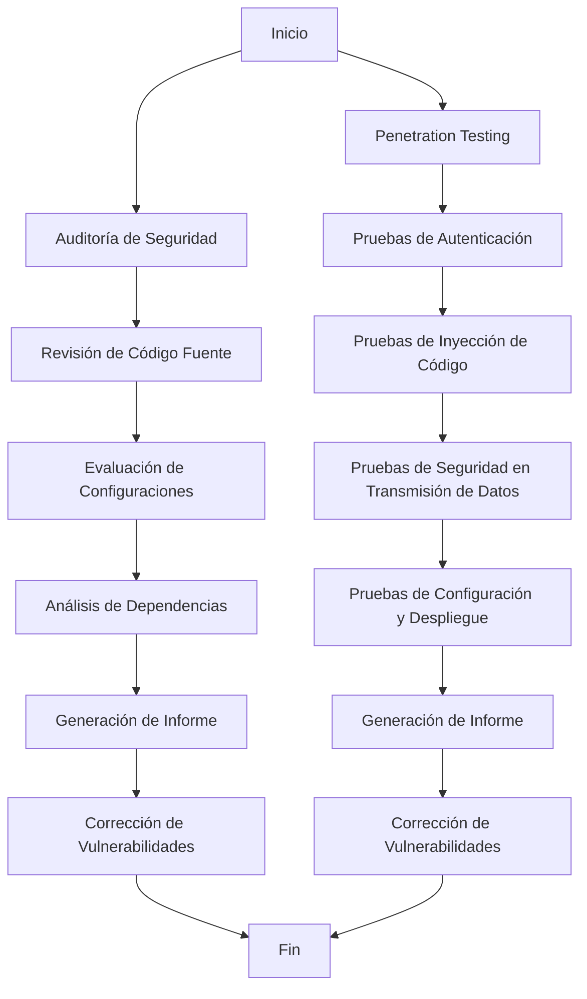

# Unidad: Auditoría de Seguridad y Penetration Testing

## Introducción a la Unidad y Objetivos de Aprendizaje

En esta unidad, nos enfocaremos en la auditoría de seguridad y el penetration testing (pruebas de penetración) en el contexto de un sistema de carrito de compras desarrollado con Django. La seguridad es un aspecto crítico en cualquier aplicación web, especialmente en aquellas que manejan información sensible como datos de usuarios y transacciones financieras. A través de esta unidad, aprenderás a identificar y mitigar vulnerabilidades en tu aplicación, asegurando que cumpla con los más altos estándares de seguridad.

### Objetivos de Aprendizaje
1. Comprender los conceptos fundamentales de auditoría de seguridad y penetration testing.
2. Aprender a realizar una auditoría de seguridad en una aplicación Django.
3. Implementar pruebas de penetración para identificar vulnerabilidades en el sistema de carrito de compras.
4. Aplicar mejores prácticas de seguridad y considerar aspectos de rendimiento y escalabilidad.
5. Desarrollar habilidades para la depuración y solución de problemas comunes en el contexto de la seguridad.

## Documento Funcional de Requerimientos

### Descripción Detallada de la Funcionalidad

La auditoría de seguridad y las pruebas de penetración son procesos esenciales para garantizar que una aplicación web sea segura y resistente a ataques maliciosos. En el contexto de nuestro sistema de carrito de compras con Django, estas prácticas nos permitirán identificar y corregir vulnerabilidades antes de que puedan ser explotadas por atacantes.

#### Auditoría de Seguridad
La auditoría de seguridad implica una revisión exhaustiva del código fuente, configuraciones y dependencias de la aplicación para identificar posibles vulnerabilidades. Este proceso puede incluir:
- Revisión de permisos y autenticación.
- Evaluación de la configuración del servidor y la base de datos.
- Análisis de dependencias y bibliotecas externas.
- Revisión de la implementación de medidas de seguridad como HTTPS, protección contra CSRF, XSS y SQL Injection.

#### Penetration Testing
El penetration testing, o pruebas de penetración, consiste en simular ataques reales contra la aplicación para identificar vulnerabilidades que podrían ser explotadas. Este proceso puede incluir:
- Pruebas de autenticación y autorización.
- Pruebas de inyección de código.
- Pruebas de seguridad en la transmisión de datos.
- Pruebas de configuración y despliegue.

### Casos de Uso

#### Caso de Uso 1: Auditoría de Seguridad
**Actor:** Auditor de Seguridad
**Descripción:** El auditor de seguridad revisa el código fuente, configuraciones y dependencias de la aplicación para identificar vulnerabilidades.
**Precondiciones:** El auditor tiene acceso al repositorio de código y a las configuraciones del servidor.
**Postcondiciones:** Se genera un informe detallado con las vulnerabilidades encontradas y recomendaciones para corregirlas.

#### Caso de Uso 2: Penetration Testing
**Actor:** Penetration Tester
**Descripción:** El penetration tester realiza pruebas de penetración en la aplicación para identificar vulnerabilidades explotables.
**Precondiciones:** El tester tiene acceso a un entorno de prueba que replica el entorno de producción.
**Postcondiciones:** Se genera un informe detallado con las vulnerabilidades encontradas y recomendaciones para mitigarlas.

### Diagramas de Flujo



### Requisitos No Funcionales

1. **Seguridad:** La aplicación debe ser resistente a ataques comunes como inyección de código, XSS, CSRF y otros.
2. **Rendimiento:** Las auditorías y pruebas de penetración no deben afectar significativamente el rendimiento de la aplicación en producción.
3. **Escalabilidad:** Las prácticas de seguridad implementadas deben ser escalables y aplicables a futuras versiones de la aplicación.
4. **Mantenibilidad:** El código y las configuraciones deben ser fáciles de mantener y actualizar para asegurar la continuidad de las medidas de seguridad.

## Implementación en Python

### Explicación Paso a Paso del Código

Para realizar una auditoría de seguridad y pruebas de penetración en una aplicación Django, utilizaremos varias herramientas y técnicas. A continuación, se presenta una guía paso a paso para implementar estas prácticas.

#### Paso 1: Configuración del Entorno de Auditoría

Primero, necesitamos configurar un entorno de auditoría que nos permita revisar el código fuente y las configuraciones de la aplicación. Para ello, clonaremos el repositorio de la aplicación y configuraremos un entorno virtual.

```bash
# Clonar el repositorio
git clone https://github.com/tu_usuario/sistema_carrito_compras.git

# Crear y activar un entorno virtual
cd sistema_carrito_compras
python3 -m venv venv
source venv/bin/activate

# Instalar las dependencias
pip install -r requirements.txt
```

#### Paso 2: Revisión de Código Fuente

Utilizaremos herramientas como Bandit y pylint para revisar el código fuente en busca de vulnerabilidades y malas prácticas.

```bash
# Instalar Bandit y pylint
pip install bandit pylint

# Ejecutar Bandit para análisis de seguridad
bandit -r .

# Ejecutar pylint para análisis de calidad de código
pylint sistema_carrito_compras/
```

#### Paso 3: Evaluación de Configuraciones

Revisaremos las configuraciones de Django para asegurar que se siguen las mejores prácticas de seguridad.

```python
# settings.py

# Asegurarse de que DEBUG está desactivado en producción
DEBUG = False

# Configurar una lista de hosts permitidos
ALLOWED_HOSTS = ['tu_dominio.com']

# Configurar la seguridad de las cookies
CSRF_COOKIE_SECURE = True
SESSION_COOKIE_SECURE = True

# Configurar HTTPS
SECURE_SSL_REDIRECT = True
SECURE_HSTS_SECONDS = 3600
SECURE_HSTS_INCLUDE_SUBDOMAINS = True
SECURE_HSTS_PRELOAD = True
```

#### Paso 4: Análisis de Dependencias

Utilizaremos Safety para analizar las dependencias y detectar vulnerabilidades conocidas.

```bash
# Instalar Safety
pip install safety

# Ejecutar Safety para análisis de dependencias
safety check
```

#### Paso 5: Pruebas de Penetración

Para las pruebas de penetración, utilizaremos herramientas como OWASP ZAP y sqlmap.

##### Pruebas de Autenticación

Utilizaremos OWASP ZAP para realizar pruebas de autenticación y detectar vulnerabilidades como fuerza bruta y enumeración de usuarios.

```bash
# Ejecutar OWASP ZAP
zap.sh
```

##### Pruebas de Inyección de Código

Utilizaremos sqlmap para detectar vulnerabilidades de inyección SQL.

```bash
# Ejecutar sqlmap
sqlmap -u "http://tu_dominio.com/producto?id=1" --batch
```

### Código Fuente Completo y Comentado

A continuación, se presenta un ejemplo de cómo integrar algunas de estas prácticas en el código de la aplicación.

```python
# settings.py

# Configuraciones de seguridad
DEBUG = False
ALLOWED_HOSTS = ['tu_dominio.com']

# Seguridad de las cookies
CSRF_COOKIE_SECURE = True
SESSION_COOKIE_SECURE = True

# Configuración de HTTPS
SECURE_SSL_REDIRECT = True
SECURE_HSTS_SECONDS = 3600
SECURE_HSTS_INCLUDE_SUBDOMAINS = True
SECURE_HSTS_PRELOAD = True

# Middleware de seguridad
MIDDLEWARE = [
    'django.middleware.security.SecurityMiddleware',
    'django.contrib.sessions.middleware.SessionMiddleware',
    'django.middleware.common.CommonMiddleware',
    'django.middleware.csrf.CsrfViewMiddleware',
    'django.contrib.auth.middleware.AuthenticationMiddleware',
    'django.contrib.messages.middleware.MessageMiddleware',
    'django.middleware.clickjacking.XFrameOptionsMiddleware',
]

# Auditoría de seguridad con Bandit y pylint
# Ejecutar los siguientes comandos desde la terminal
# bandit -r .
# pylint sistema_carrito_compras/

# Análisis de dependencias con Safety
# Ejecutar el siguiente comando desde la terminal
# safety check
```

### Ejemplos de Uso y Pruebas Unitarias

Para asegurar que las configuraciones de seguridad funcionan correctamente, podemos implementar pruebas unitarias.

```python
# tests.py

from django.test import TestCase
from django.urls import reverse

class SecurityTests(TestCase):
    def test_https_redirect(self):
        response = self.client.get(reverse('home'), secure=False)
        self.assertEqual(response.status_code, 301)
        self.assertTrue(response.url.startswith('https://'))

    def test_csrf_cookie_secure(self):
        response = self.client.get(reverse('home'))
        self.assertTrue(response.cookies['csrftoken'].secure)

    def test_session_cookie_secure(self):
        response = self.client.get(reverse('home'))
        self.assertTrue(response.cookies['sessionid'].secure)
```

### Mejores Prácticas y Consideraciones de Diseño

#### Seguridad

1. **Revisión Continua:** Realiza auditorías de seguridad y pruebas de penetración de manera regular, especialmente después de realizar cambios significativos en la aplicación.
2. **Actualización de Dependencias:** Mantén las dependencias actualizadas para evitar vulnerabilidades conocidas.
3. **Principio de Mínimos Privilegios:** Configura los permisos y accesos siguiendo el principio de mínimos privilegios.

#### Rendimiento

1. **Entorno de Pruebas:** Realiza auditorías y pruebas de penetración en un entorno de pruebas que replique el entorno de producción para evitar afectar el rendimiento de la aplicación en producción.
2. **Optimización de Código:** Asegúrate de que las medidas de seguridad no introduzcan cuellos de botella en el rendimiento de la aplicación.

#### Escalabilidad

1. **Automatización:** Automatiza las auditorías de seguridad y pruebas de penetración utilizando herramientas de integración continua (CI) para asegurar que se realicen de manera consistente.
2. **Documentación:** Documenta las configuraciones y prácticas de seguridad para facilitar la escalabilidad y mantenimiento de la aplicación.

#### Depuración y Solución de Problemas Comunes

1. **Logs de Seguridad:** Configura logs detallados para registrar eventos de seguridad y facilitar la depuración de problemas.
2. **Monitoreo:** Implementa herramientas de monitoreo para detectar y responder rápidamente a incidentes de seguridad.

En conclusión, la auditoría de seguridad y las pruebas de penetración son prácticas esenciales para asegurar que tu sistema de carrito de compras con Django sea seguro y resistente a ataques. Siguiendo las mejores prácticas y utilizando las herramientas adecuadas, puedes identificar y mitigar vulnerabilidades, asegurando la integridad y confidencialidad de los datos de tus usuarios.