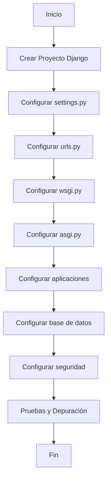

# Unidad: Configuración del Proyecto Django

## Introducción a la Unidad y Objetivos de Aprendizaje

En esta unidad, nos enfocaremos en la configuración del proyecto Django, un aspecto crucial para el desarrollo de un sistema de carrito de compras. La configuración adecuada del proyecto no solo garantiza que la aplicación funcione correctamente, sino que también facilita su mantenimiento y escalabilidad. Al finalizar esta unidad, los estudiantes podrán:

1. Comprender la estructura de los archivos de configuración en un proyecto Django.
2. Configurar correctamente las aplicaciones dentro del proyecto.
3. Gestionar las configuraciones de desarrollo y producción.
4. Implementar configuraciones de seguridad y rendimiento.
5. Realizar pruebas y depuración de la configuración.

## Documento Funcional de Requerimientos

### Descripción Detallada de la Funcionalidad

La configuración del proyecto Django implica ajustar diversos parámetros en los archivos de configuración para asegurar que la aplicación funcione de manera óptima en diferentes entornos. Esto incluye la configuración de bases de datos, aplicaciones instaladas, middleware, rutas de URL, ajustes de seguridad y más.

### Casos de Uso

1. **Configuración Inicial del Proyecto**: El desarrollador configura el proyecto Django para que esté listo para el desarrollo.
2. **Ajuste de Configuraciones para Producción**: El desarrollador ajusta las configuraciones para que la aplicación sea segura y eficiente en un entorno de producción.
3. **Gestión de Aplicaciones**: El desarrollador añade, configura y gestiona las aplicaciones dentro del proyecto Django.
4. **Configuración de Seguridad**: El desarrollador implementa configuraciones de seguridad para proteger la aplicación contra amenazas comunes.
5. **Pruebas y Depuración**: El desarrollador realiza pruebas y depura la configuración para asegurar que todo funcione correctamente.

### Diagramas de Flujo



### Requisitos No Funcionales

1. **Rendimiento**: La configuración debe optimizar el rendimiento de la aplicación en producción.
2. **Seguridad**: La configuración debe incluir medidas de seguridad para proteger la aplicación.
3. **Escalabilidad**: La configuración debe permitir la escalabilidad del proyecto.
4. **Mantenibilidad**: La configuración debe ser clara y fácil de mantener.

## Implementación en Python

### Explicación Paso a Paso del Código

#### 1. Crear el Proyecto Django

Para crear un proyecto Django, utilizamos el comando `django-admin startproject nombre_del_proyecto`. Esto generará una estructura básica de directorios y archivos.

```bash
django-admin startproject carrito_compras
```

#### 2. Configurar `settings.py`

El archivo `settings.py` contiene todas las configuraciones del proyecto. Aquí configuramos la base de datos, aplicaciones instaladas, middleware, rutas estáticas, entre otros.

```python
# carrito_compras/settings.py

import os
from pathlib import Path

# Build paths inside the project like this: BASE_DIR / 'subdir'.
BASE_DIR = Path(__file__).resolve().parent.parent

# SECURITY WARNING: keep the secret key used in production secret!
SECRET_KEY = 'django-insecure-4!$k&*#4h@!4&2@#5+5@3#4h@!4&2@#5+5@3#4h@!4&2@#5+5@3#4h@!4&2@#5+5@3#4h@!4&2@#5+5@3#4h@!4&2@#5+5@3#4h@!4&2@#5+5@3#4h@!4&2@#5+5@3#4h@!4&2@#5+5@3#4h@!4&2@#5+5@3#4h@!4&2@#5+5@3#4h@!4&2@#5+5@3#4h@!4&2@#5+5@3#4h@!4&2@#5+5@3#4h@!4&2@#5+5@3#4h@!4&2@#5+5@3#4h@!4&2@#5+5@3#4h@!4&2@#5+5@3#4h@!4&2@#5+5@3#4h@!4&2@#5+5@3#4h@!4&2@#5+5@3#4h@!4&2@#5+5@3#4h@!4&2@#5+5@3#4h@!4&2@#5+5@3#4h@!4&2@#5+5@3#4h@!4&2@#5+5@3#4h@!4&2@#5+5@3#4h@!4&2@#5+5@3#4h@!4&2@#5+5@3#4h@!4&2@#5+5@3#4h@!4&2@#5+5@3#4h@!4&2@#5+5@3#4h@!4&2@#5+5@3#4h@!4&2@#5+5@3#4h@!4&2@#5+5@3#4h@!4&2@#5+5@3#4h@!4&2@#5+5@3#4h@!4&2@#5+5@3#4h@!4&2@#5+5@3#4h@!4&2@#5+5@3#4h@!4&2@#5+5@3#4h@!4&2@#5+5@3#4h@!4&2@#5+5@3#4h@!4&2@#5+5@3#4h@!4&2@#5+5@3#4h@!4&2@#5+5@3#4h@!4&2@#5+5@3#4h@!4&2@#5+5@3#4h@!4&2@#5+5@3#4h@!4&2@#5+5@3#4h@!4&2@#5+5@3#4h@!4&2@#5+5@3#4h@!4&2@#5+5@3#4h@!4&2@#5+5@3#4h@!4&2@#5+5@3#4h@!4&2@#5+5@3#4h@!4&2@#5+5@3#4h@!4&2@#5+5@3#4h@!4&2@#5+5@3#4h@!4&2@#5+5@3#4h@!4&2@#5+5@3#4h@!4&2@#5+5@3#4h@!4&2@#5+5@3#4h@!4&2@#5+5@3#4h@!4&2@#5+5@3#4h@!4&2@#5+5@3#4h@!4&2@#5+5@3#4h@!4&2@#5+5@3#4h@!4&2@#5+5@3#4h@!4&2@#5+5@3#4h@!4&2@#5+5@3#4h@!4&2@#5+5@3#4h@!4&2@#5+5@3#4h@!4&2@#5+5@3#4h@!4&2@#5+5@3#4h@!4&2@#5+5@3#4h@!4&2@#5+5@3#4h@!4&2@#5+5@3#4h@!4&2@#5+5@3#4h@!4&2@#5+5@3#4h@!4&2@#5+5@3#4h@!4&2@#5+5@3#4h@!4&2@#5+5@3#4h@!4&2@#5+5@3#4h@!4&2@#5+5@3#4h@!4&2@#5+5@3#4h@!4&2@#5+5@3#4h@!4&2@#5+5@3#4h@!4&2@#5+5@3#4h@!4&2@#5+5@3#4h@!4&2@#5+5@3#4h@!4&2@#5+5@3#4h@!4&2@#5+5@3#4h@!4&2@#5+5@3#4h@!4&2@#5+5@3#4h@!4&2@#5+5@3#4h@!4&2@#5+5@3#4h@!4&2@#5+5@3#4h@!4&2@#5+5@3#4h@!4&2@#5+5@3#4h@!4&2@#5+5@3#4h@!4&2@#5+5@3#4h@!4&2@#5+5@3#4h@!4&2@#5+5@3#4h@!4&2@#5+5@3#4h@!4&2@#5+5@3#4h@!4&2@#5+5@3#4h@!4&2@#5+5@3#4h@!4&2@#5+5@3#4h@!4&2@#5+5@3#4h@!4&2@#5+5@3#4h@!4&2@#5+5@3#4h@!4&2@#5+5@3#4h@!4&2@#5+5@3#4h@!4&2@#5+5@3#4h@!4&2@#5+5@3#4h@!4&2@#5+5@3#4h@!4&2@#5+5@3#4h@!4&2@#5+5@3#4h@!4&2@#5+5@3#4h@!4&2@#5+5@3#4h@!4&2@#5+5@3#4h@!4&2@#5+5@3#4h@!4&2@#5+5@3#4h@!4&2@#5+5@3#4h@!4&2@#5+5@3#4h@!4&2@#5+5@3#4h@!4&2@#5+5@3#4h@!4&2@#5+5@3#4h@!4&2@#5+5@3#4h@!4&2@#5+5@3#4h@!4&2@#5+5@3#4h@!4&2@#5+5@3#4h@!4&2@#5+5@3#4h@!4&2@#5+5@3#4h@!4&2@#5+5@3#4h@!4&2@#5+5@3#4h@!4&2@#5+5@3#4h@!4&2@#5+5@3#4h@!4&2@#5+5@3#4h@!4&2@#5+5@3#4h@!4&2@#5+5@3#4h@!4&2@#5+5@3#4h@!4&2@#5+5@3#4h@!4&2@#5+5@3#4h@!4&2@#5+5@3#4h@!4&2@#5+5@3#4h@!4&2@#5+5@3#4h@!4&2@#5+5@3#4h@!4&2@#5+5@3#4h@!4&2@#5+5@3#4h@!4&2@#5+5@3#4h@!4&2@#5+5@3#4h@!4&2@#5+5@3#4h@!4&2@#5+5@3#4h@!4&2@#5+5@3#4h@!4&2@#5+5@3#4h@!4&2@#5+5@3#4h@!4&2@#5+5@3#4h@!4&2@#5+5@3#4h@!4&2@#5+5@3#4h@!4&2@#5+5@3#4h@!4&2@#5+5@3#4h@!4&2@#5+5@3#4h@!4&2@#5+5@3#4h@!4&2@#5+5@3#4h@!4&2@#5+5@3#4h@!4&2@#5+5@3#4h@!4&2@#5+5@3#4h@!4&2@#5+5@3#4h@!4&2@#5+5@3#4h@!4&2@#5+5@3#4h@!4&2@#5+5@3#4h@!4&2@#5+5@3#4h@!4&2@#5+5@3#4h@!4&2@#5+5@3#4h@!4&2@#5+5@3#4h@!4&2@#5+5@3#4h@!4&2@#5+5@3#4h@!4&2@#5+5@3#4h@!4&2@#5+5@3#4h@!4&2@#5+5@3#4h@!4&2@#5+5@3#4h@!4&2@#5+5@3#4h@!4&2@#5+5@3#4h@!4&2@#5+5@3#4h@!4&2@#5+5@3#4h@!4&2@#5+5@3#4h@!4&2@#5+5@3#4h@!4&2@#5+5@3#4h@!4&2@#5+5@3#4h@!4&2@#5+5@3#4h@!4&2@#5+5@3#4h@!4&2@#5+5@3#4h@!4&2@#5+5@3#4h@!4&2@#5+5@3#4h@!4&2@#5+5@3#4h@!4&2@#5+5@3#4h@!4&2@#5+5@3#4h@!4&2@#5+5@3#4h@!4&2@#5+5@3#4h@!4&2@#5+5@3#4h@!4&2@#5+5@3#4h@!4&2@#5+5@3#4h@!4&2@#5+5@3#4h@!4&2@#5+5@3#4h@!4&2@#5+5@3#4h@!4&2@#5+5@3#4h@!4&2@#5+5@3#4h@!4&2@#5+5@3#4h@!4&2@#5+5@3#4h@!4&2@#5+5@3#4h@!4&2@#5+5@3#4h@!4&2@#5+5@3#4h@!4&2@#5+5@3#4h@!4&2@#5+5@3#4h@!4&2@#5+5@3#4h@!4&2@#5+5@3#4h@!4&2@#5+5@3#4h@!4&2@#5+5@3#4h@!4&2@#5+5@3#4h@!4&2@#5+5@3#4h@!