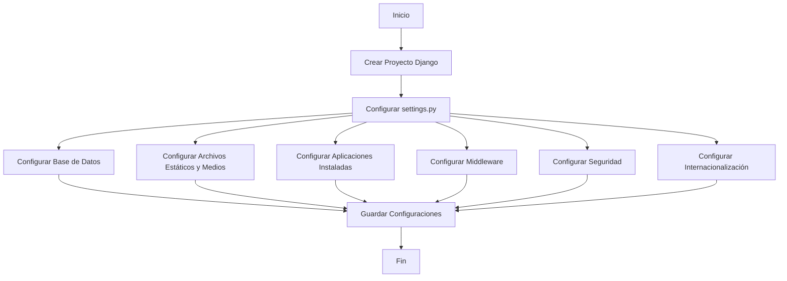

# Unidad: Configuración de `settings.py` en un Proyecto Django

## Introducción a la Unidad y Objetivos de Aprendizaje

En esta unidad, profundizaremos en la configuración del archivo `settings.py` de un proyecto Django, específicamente en el contexto de un sistema de carrito de compras. El archivo `settings.py` es crucial para definir el comportamiento y las características del proyecto, incluyendo la configuración de la base de datos, las aplicaciones instaladas, la gestión de archivos estáticos y medios, y las configuraciones de seguridad.

### Objetivos de Aprendizaje

1. Comprender la estructura y propósito del archivo `settings.py`.
2. Configurar adecuadamente la base de datos para un sistema de carrito de compras.
3. Gestionar archivos estáticos y medios.
4. Configurar aplicaciones instaladas y middleware.
5. Implementar configuraciones de seguridad y rendimiento.
6. Realizar pruebas y depuración de la configuración.

## Documento Funcional de Requerimientos

### Descripción Detallada de la Funcionalidad

El archivo `settings.py` de un proyecto Django contiene todas las configuraciones necesarias para que el proyecto funcione correctamente. En el contexto de un sistema de carrito de compras, es esencial configurar adecuadamente los siguientes aspectos:

- **Base de Datos**: Configuración de la base de datos para almacenar información de productos, usuarios, pedidos, etc.
- **Archivos Estáticos y Medios**: Gestión de archivos estáticos (CSS, JavaScript) y archivos de medios (imágenes de productos, documentos).
- **Aplicaciones Instaladas**: Lista de aplicaciones Django y de terceros necesarias para el funcionamiento del sistema.
- **Middleware**: Configuración de middleware para gestionar solicitudes y respuestas HTTP.
- **Seguridad**: Configuraciones de seguridad como claves secretas, HTTPS, y protección contra ataques comunes.
- **Internacionalización**: Configuración de idiomas y zonas horarias.
- **Otras Configuraciones**: Configuración de plantillas, autenticación, y cualquier otra configuración específica del proyecto.

### Casos de Uso

1. **Configuración Inicial del Proyecto**: Un desarrollador configura el archivo `settings.py` al iniciar un nuevo proyecto de carrito de compras.
2. **Actualización de Configuraciones**: Un desarrollador actualiza las configuraciones para agregar nuevas funcionalidades o mejorar el rendimiento.
3. **Gestión de Archivos Estáticos y Medios**: Un desarrollador configura la gestión de archivos estáticos y medios para asegurar que los recursos se carguen correctamente.
4. **Implementación de Seguridad**: Un desarrollador configura aspectos de seguridad para proteger el sistema contra ataques y vulnerabilidades.

### Diagramas de Flujo



### Requisitos No Funcionales

1. **Rendimiento**: La configuración debe optimizar el rendimiento del sistema, especialmente en la gestión de archivos estáticos y medios.
2. **Seguridad**: La configuración debe seguir las mejores prácticas de seguridad para proteger el sistema y los datos de los usuarios.
3. **Escalabilidad**: La configuración debe permitir la escalabilidad del sistema para manejar un creciente número de usuarios y transacciones.
4. **Mantenibilidad**: La configuración debe ser clara y bien documentada para facilitar futuras actualizaciones y mantenimiento.

## Implementación en Python

### Explicación Paso a Paso del Código

A continuación, se presenta una explicación detallada de cómo configurar el archivo `settings.py` para un sistema de carrito de compras en Django.

#### 1. Configuración Básica

```python
import os
from pathlib import Path

# Ruta base del proyecto
BASE_DIR = Path(__file__).resolve().parent.parent

# Clave secreta para la seguridad del proyecto
SECRET_KEY = 'tu-clave-secreta-aqui'

# Modo de depuración
DEBUG = True

# Hosts permitidos
ALLOWED_HOSTS = []
```

- **BASE_DIR**: Define la ruta base del proyecto.
- **SECRET_KEY**: Clave secreta utilizada por Django para criptografía.
- **DEBUG**: Modo de depuración, debe ser `False` en producción.
- **ALLOWED_HOSTS**: Lista de hosts permitidos para el proyecto.

#### 2. Aplicaciones Instaladas

```python
INSTALLED_APPS = [
    'django.contrib.admin',
    'django.contrib.auth',
    'django.contrib.contenttypes',
    'django.contrib.sessions',
    'django.contrib.messages',
    'django.contrib.staticfiles',
    'carrito',  # Aplicación del carrito de compras
    'productos',  # Aplicación de gestión de productos
    'usuarios',  # Aplicación de gestión de usuarios
    'pedidos',  # Aplicación de gestión de pedidos
    # Aplicaciones de terceros
    'rest_framework',
    'corsheaders',
]
```

- **INSTALLED_APPS**: Lista de aplicaciones Django y de terceros necesarias para el proyecto.

#### 3. Middleware

```python
MIDDLEWARE = [
    'django.middleware.security.SecurityMiddleware',
    'django.contrib.sessions.middleware.SessionMiddleware',
    'django.middleware.common.CommonMiddleware',
    'django.middleware.csrf.CsrfViewMiddleware',
    'django.contrib.auth.middleware.AuthenticationMiddleware',
    'django.contrib.messages.middleware.MessageMiddleware',
    'django.middleware.clickjacking.XFrameOptionsMiddleware',
    'corsheaders.middleware.CorsMiddleware',
]
```

- **MIDDLEWARE**: Lista de middleware para gestionar solicitudes y respuestas HTTP.

#### 4. Configuración de la Base de Datos

```python
DATABASES = {
    'default': {
        'ENGINE': 'django.db.backends.postgresql',
        'NAME': 'carrito_db',
        'USER': 'tu_usuario',
        'PASSWORD': 'tu_contraseña',
        'HOST': 'localhost',
        'PORT': '5432',
    }
}
```

- **DATABASES**: Configuración de la base de datos, en este caso, PostgreSQL.

#### 5. Configuración de Archivos Estáticos y Medios

```python
# Archivos estáticos (CSS, JavaScript)
STATIC_URL = '/static/'
STATICFILES_DIRS = [BASE_DIR / "static"]

# Archivos de medios (imágenes, documentos)
MEDIA_URL = '/media/'
MEDIA_ROOT = BASE_DIR / "media"
```

- **STATIC_URL**: URL para acceder a archivos estáticos.
- **STATICFILES_DIRS**: Directorios donde se almacenan archivos estáticos.
- **MEDIA_URL**: URL para acceder a archivos de medios.
- **MEDIA_ROOT**: Directorio donde se almacenan archivos de medios.

#### 6. Configuración de Seguridad

```python
# Configuraciones de seguridad
SECURE_BROWSER_XSS_FILTER = True
X_FRAME_OPTIONS = 'DENY'
CSRF_COOKIE_SECURE = True
SESSION_COOKIE_SECURE = True
```

- **SECURE_BROWSER_XSS_FILTER**: Habilita el filtro XSS en el navegador.
- **X_FRAME_OPTIONS**: Protege contra ataques de clickjacking.
- **CSRF_COOKIE_SECURE**: Asegura la cookie CSRF.
- **SESSION_COOKIE_SECURE**: Asegura la cookie de sesión.

#### 7. Internacionalización

```python
# Configuración de idiomas y zonas horarias
LANGUAGE_CODE = 'es-ar'
TIME_ZONE = 'America/Argentina/Buenos_Aires'
USE_I18N = True
USE_L10N = True
USE_TZ = True
```

- **LANGUAGE_CODE**: Código de idioma.
- **TIME_ZONE**: Zona horaria.
- **USE_I18N**: Habilita la internacionalización.
- **USE_L10N**: Habilita la localización.
- **USE_TZ**: Habilita el uso de zonas horarias.

### Código Fuente Completo y Comentado

```python
import os
from pathlib import Path

# Ruta base del proyecto
BASE_DIR = Path(__file__).resolve().parent.parent

# Clave secreta para la seguridad del proyecto
SECRET_KEY = 'tu-clave-secreta-aqui'

# Modo de depuración
DEBUG = True

# Hosts permitidos
ALLOWED_HOSTS = []

# Aplicaciones instaladas
INSTALLED_APPS = [
    'django.contrib.admin',
    'django.contrib.auth',
    'django.contrib.contenttypes',
    'django.contrib.sessions',
    'django.contrib.messages',
    'django.contrib.staticfiles',
    'carrito',  # Aplicación del carrito de compras
    'productos',  # Aplicación de gestión de productos
    'usuarios',  # Aplicación de gestión de usuarios
    'pedidos',  # Aplicación de gestión de pedidos
    # Aplicaciones de terceros
    'rest_framework',
    'corsheaders',
]

# Middleware
MIDDLEWARE = [
    'django.middleware.security.SecurityMiddleware',
    'django.contrib.sessions.middleware.SessionMiddleware',
    'django.middleware.common.CommonMiddleware',
    'django.middleware.csrf.CsrfViewMiddleware',
    'django.contrib.auth.middleware.AuthenticationMiddleware',
    'django.contrib.messages.middleware.MessageMiddleware',
    'django.middleware.clickjacking.XFrameOptionsMiddleware',
    'corsheaders.middleware.CorsMiddleware',
]

# Configuración de la base de datos
DATABASES = {
    'default': {
        'ENGINE': 'django.db.backends.postgresql',
        'NAME': 'carrito_db',
        'USER': 'tu_usuario',
        'PASSWORD': 'tu_contraseña',
        'HOST': 'localhost',
        'PORT': '5432',
    }
}

# Archivos estáticos (CSS, JavaScript)
STATIC_URL = '/static/'
STATICFILES_DIRS = [BASE_DIR / "static"]

# Archivos de medios (imágenes, documentos)
MEDIA_URL = '/media/'
MEDIA_ROOT = BASE_DIR / "media"

# Configuraciones de seguridad
SECURE_BROWSER_XSS_FILTER = True
X_FRAME_OPTIONS = 'DENY'
CSRF_COOKIE_SECURE = True
SESSION_COOKIE_SECURE = True

# Configuración de idiomas y zonas horarias
LANGUAGE_CODE = 'es-ar'
TIME_ZONE = 'America/Argentina/Buenos_Aires'
USE_I18N = True
USE_L10N = True
USE_TZ = True
```

### Ejemplos de Uso y Pruebas Unitarias

Para probar la configuración del archivo `settings.py`, se pueden realizar las siguientes acciones:

1. **Verificar la Conexión a la Base de Datos**: Ejecutar `python manage.py migrate` para asegurarse de que la configuración de la base de datos es correcta.
2. **Probar la Carga de Archivos Estáticos**: Crear un archivo CSS en el directorio `static` y verificar que se carga correctamente en una plantilla.
3. **Subir y Acceder a Archivos de Medios**: Subir una imagen a través de la interfaz de administración y verificar que se almacena en el directorio `media` y se puede acceder a través de la URL configurada.
4. **Probar Configuraciones de Seguridad**: Verificar que las configuraciones de seguridad están activas utilizando herramientas de análisis de seguridad.

#### Pruebas Unitarias

```python
from django.test import TestCase
from django.conf import settings

class SettingsTestCase(TestCase):
    def test_debug_is_false_in_production(self):
        self.assertFalse(settings.DEBUG, "DEBUG debe ser False en producción")

    def test_database_configuration(self):
        self.assertEqual(settings.DATABASES['default']['ENGINE'], 'django.db.backends.postgresql')
        self.assertEqual(settings.DATABASES['default']['NAME'], 'carrito_db')

    def test_static_files_configuration(self):
        self.assertEqual(settings.STATIC_URL, '/static/')
        self.assertIn(settings.BASE_DIR / "static", settings.STATICFILES_DIRS)

    def test_media_files_configuration(self):
        self.assertEqual(settings.MEDIA_URL, '/media/')
        self.assertEqual(settings.MEDIA_ROOT, settings.BASE_DIR / "media")

    def test_security_configuration(self):
        self.assertTrue(settings.SECURE_BROWSER_XSS_FILTER)
        self.assertEqual(settings.X_FRAME_OPTIONS, 'DENY')
        self.assertTrue(settings.CSRF_COOKIE_SECURE)
        self.assertTrue(settings.SESSION_COOKIE_SECURE)

    def test_internationalization_configuration(self):
        self.assertEqual(settings.LANGUAGE_CODE, 'es-ar')
        self.assertEqual(settings.TIME_ZONE, 'America/Argentina/Buenos_Aires')
        self.assertTrue(settings.USE_I18N)
        self.assertTrue(settings.USE_L10N)
        self.assertTrue(settings.USE_TZ)
```

## Mejores Prácticas y Consideraciones de Diseño

1. **Separación de Configuraciones**: Utilizar diferentes archivos de configuración para desarrollo y producción. Por ejemplo, `settings_dev.py` y `settings_prod.py`.
2. **Variables de Entorno**: Utilizar variables de entorno para almacenar información sensible como claves secretas y credenciales de la base de datos.
3. **Gestión de Archivos Estáticos y Medios**: Utilizar servicios de almacenamiento en la nube para archivos estáticos y medios en producción.
4. **Seguridad**: Mantener siempre `DEBUG` en `False` en producción y configurar adecuadamente los hosts permitidos.
5. **Documentación**: Documentar todas las configuraciones en el archivo `settings.py` para facilitar el mantenimiento y la colaboración en equipo.
6. **Pruebas**: Realizar pruebas unitarias para verificar que las configuraciones son correctas y funcionan como se espera.

### Consideraciones de Seguridad

- **Claves Secretas**: Nunca exponer la clave secreta en el código fuente. Utilizar variables de entorno para almacenarla.
- **HTTPS**: Configurar el proyecto para utilizar HTTPS en producción.
- **Protección CSRF**: Asegurarse de que la protección CSRF está habilitada y configurada correctamente.
- **Control de Acceso**: Configurar adecuadamente los permisos y autenticación para proteger los datos de los usuarios.

### Consideraciones de Rendimiento

- **Caché**: Utilizar caché para mejorar el rendimiento del sistema.
- **Compresión de Archivos**: Comprimir archivos estáticos para reducir el tiempo de carga.
- **Optimización de Consultas**: Optimizar las consultas a la base de datos para mejorar el rendimiento.

### Escalabilidad

- **Base de Datos**: Utilizar una base de datos escalable como PostgreSQL.
- **Servicios en la Nube**: Considerar el uso de servicios en la nube para almacenamiento y procesamiento.
- **Balanceo de Carga**: Implementar balanceo de carga para distribuir el tráfico entre múltiples servidores.

### Depuración y Solución de Problemas Comunes

- **Errores de Conexión a la Base de Datos**: Verificar las credenciales y la configuración de la base de datos.
- **Problemas con Archivos Estáticos**: Asegurarse de que los archivos están en el directorio correcto y que las URLs están configuradas adecuadamente.
- **Problemas de Seguridad**: Utilizar herramientas de análisis de seguridad para identificar y solucionar vulnerabilidades.

Con esta unidad, se espera que los desarrolladores tengan una comprensión profunda de cómo configurar el archivo `settings.py` en un proyecto Django, específicamente en el contexto de un sistema de carrito de compras. La correcta configuración de este archivo es esencial para el funcionamiento, seguridad y rendimiento del sistema.