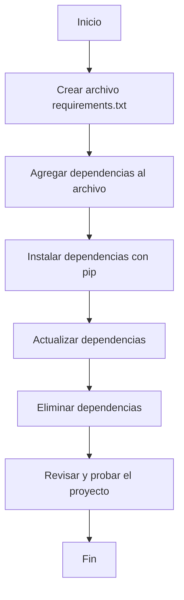

# Unidad: Gestión de dependencias con requirements.txt

## Introducción a la unidad y objetivos de aprendizaje

En esta unidad, exploraremos en profundidad la gestión de dependencias en un proyecto Django utilizando el archivo `requirements.txt`. La gestión adecuada de dependencias es crucial para garantizar que nuestro proyecto sea reproducible y fácil de mantener. Al finalizar esta unidad, los lectores serán capaces de:

1. Comprender la importancia de la gestión de dependencias en proyectos Django.
2. Crear y mantener un archivo `requirements.txt`.
3. Instalar dependencias utilizando `pip`.
4. Actualizar y eliminar dependencias de manera segura.
5. Implementar mejores prácticas para la gestión de dependencias.

## Documento funcional de requerimientos

### Descripción detallada de la funcionalidad

La gestión de dependencias en un proyecto Django se realiza mediante un archivo denominado `requirements.txt`. Este archivo contiene una lista de todas las librerías y sus versiones específicas que el proyecto necesita para funcionar correctamente. La correcta gestión de este archivo asegura que cualquier desarrollador que trabaje en el proyecto pueda instalar todas las dependencias necesarias de manera rápida y eficiente.

### Casos de uso

1. **Instalación inicial de dependencias**: Un desarrollador clona el repositorio del proyecto y necesita instalar todas las dependencias para comenzar a trabajar.
2. **Actualización de dependencias**: Se requiere actualizar una o varias librerías a versiones más recientes sin romper la funcionalidad existente.
3. **Eliminación de dependencias**: Se decide que una librería ya no es necesaria y debe ser eliminada del proyecto.
4. **Reproducción de entorno**: Otro desarrollador o un servidor de producción necesita replicar el entorno de desarrollo para ejecutar el proyecto.

### Diagramas de flujo



### Requisitos no funcionales

1. **Reproducibilidad**: El entorno de desarrollo debe ser replicable en cualquier máquina.
2. **Compatibilidad**: Las versiones de las librerías deben ser compatibles entre sí y con la versión de Django utilizada.
3. **Seguridad**: Las dependencias deben ser seguras y libres de vulnerabilidades conocidas.
4. **Mantenibilidad**: El archivo `requirements.txt` debe ser fácil de leer y mantener.

## Implementación en Python

### Explicación paso a paso del código

#### Paso 1: Crear el archivo `requirements.txt`

El archivo `requirements.txt` se puede crear manualmente o utilizando comandos de `pip`. Para crear el archivo manualmente, simplemente crea un archivo de texto llamado `requirements.txt` en el directorio raíz de tu proyecto Django.

#### Paso 2: Agregar dependencias al archivo

Puedes agregar dependencias al archivo `requirements.txt` especificando el nombre de la librería y opcionalmente la versión que deseas utilizar. Por ejemplo:

```
Django==3.2.5
djangorestframework==3.12.4
```

#### Paso 3: Instalar dependencias utilizando `pip`

Para instalar todas las dependencias listadas en el archivo `requirements.txt`, utiliza el siguiente comando:

```bash
pip install -r requirements.txt
```

#### Paso 4: Actualizar dependencias

Para actualizar una dependencia específica, puedes modificar la versión en el archivo `requirements.txt` y luego ejecutar nuevamente el comando de instalación. También puedes utilizar `pip` para actualizar directamente:

```bash
pip install --upgrade nombre_libreria
```

#### Paso 5: Eliminar dependencias

Para eliminar una dependencia, simplemente remuévela del archivo `requirements.txt` y ejecuta el siguiente comando para desinstalarla:

```bash
pip uninstall nombre_libreria
```

### Código fuente completo y comentado

A continuación, se presenta un ejemplo completo de un archivo `requirements.txt` y los comandos necesarios para su gestión.

#### Archivo `requirements.txt`

```plaintext
# Archivo de dependencias para el proyecto Django
Django==3.2.5
djangorestframework==3.12.4
psycopg2-binary==2.8.6
```

#### Comandos de gestión

```bash
# Instalar todas las dependencias
pip install -r requirements.txt

# Actualizar una dependencia específica
pip install --upgrade djangorestframework

# Eliminar una dependencia
pip uninstall psycopg2-binary
```

### Ejemplos de uso y pruebas unitarias

#### Ejemplo de uso

Supongamos que un nuevo desarrollador se une al proyecto y necesita configurar su entorno de desarrollo. Los pasos serían los siguientes:

1. Clonar el repositorio del proyecto:

```bash
git clone https://github.com/usuario/proyecto-django.git
cd proyecto-django
```

2. Crear un entorno virtual (recomendado):

```bash
python -m venv venv
source venv/bin/activate  # En Windows: venv\Scripts\activate
```

3. Instalar las dependencias:

```bash
pip install -r requirements.txt
```

#### Pruebas unitarias

Para asegurar que las dependencias se instalan correctamente, podemos escribir un script de prueba que verifique la instalación de las librerías necesarias.

```python
import django
import rest_framework
import psycopg2

def test_dependencies():
    assert django.get_version() == '3.2.5'
    assert rest_framework.VERSION == '3.12.4'
    assert psycopg2.__version__ == '2.8.6'

if __name__ == "__main__":
    test_dependencies()
    print("Todas las dependencias están correctamente instaladas.")
```

## Mejores prácticas y consideraciones de diseño

1. **Utilizar entornos virtuales**: Siempre utiliza entornos virtuales para aislar las dependencias del proyecto y evitar conflictos con otras librerías instaladas globalmente.
2. **Fijar versiones específicas**: Fija versiones específicas de las librerías en el archivo `requirements.txt` para asegurar la reproducibilidad del entorno.
3. **Revisar regularmente las dependencias**: Mantén las dependencias actualizadas y revisa regularmente las vulnerabilidades de seguridad.
4. **Documentar las dependencias**: Documenta cualquier cambio en las dependencias y el motivo detrás de la actualización o eliminación de una librería.
5. **Automatizar la instalación**: Utiliza scripts o herramientas de automatización para simplificar la instalación y actualización de dependencias.

### Consideraciones sobre seguridad, rendimiento y escalabilidad

- **Seguridad**: Revisa regularmente las dependencias en busca de vulnerabilidades conocidas utilizando herramientas como `pip-audit` o servicios de análisis de dependencias.
- **Rendimiento**: Algunas librerías pueden tener un impacto significativo en el rendimiento del proyecto. Realiza pruebas de rendimiento después de agregar o actualizar dependencias críticas.
- **Escalabilidad**: Asegúrate de que las dependencias sean escalables y puedan manejar el crecimiento del proyecto sin problemas.

### Consejos para la depuración y solución de problemas comunes

- **Errores de instalación**: Si encuentras errores al instalar dependencias, verifica que el archivo `requirements.txt` no contenga errores tipográficos y que las versiones especificadas sean correctas.
- **Conflictos de versiones**: Si hay conflictos de versiones entre librerías, considera utilizar un archivo `constraints.txt` para fijar versiones compatibles.
- **Entornos virtuales**: Si las dependencias no se instalan correctamente, asegúrate de que el entorno virtual esté activado y configurado correctamente.

Con estos conocimientos y prácticas, estarás bien equipado para gestionar las dependencias de tu proyecto Django de manera eficiente y segura.