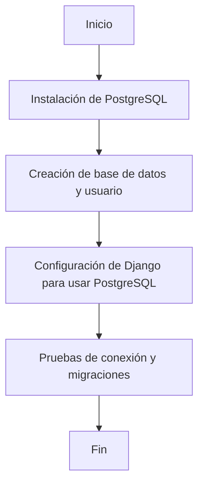

# Unidad: Configuración de base de datos (PostgreSQL recomendado)

## Introducción a la unidad y objetivos de aprendizaje

En esta unidad, nos enfocaremos en la configuración de la base de datos para nuestro proyecto Django, específicamente utilizando PostgreSQL. PostgreSQL es una de las bases de datos relacionales más robustas y populares en la industria, conocida por su rendimiento, escalabilidad y características avanzadas. Al finalizar esta unidad, los lectores estarán capacitados para:

1. Configurar PostgreSQL en su entorno de desarrollo.
2. Integrar PostgreSQL con un proyecto Django.
3. Realizar operaciones básicas de administración de bases de datos.
4. Comprender las mejores prácticas y consideraciones de diseño para el uso de PostgreSQL con Django.

## Documento funcional de requerimientos

### a. Descripción detallada de la funcionalidad

La funcionalidad principal de esta unidad es configurar una base de datos PostgreSQL para un proyecto Django. Esto incluye la instalación de PostgreSQL, la creación de una base de datos y un usuario, y la modificación de la configuración del proyecto Django para utilizar esta base de datos. Además, se abordarán aspectos de seguridad, rendimiento y escalabilidad.

### b. Casos de uso

1. **Caso de uso 1: Instalación de PostgreSQL**
   - **Actor:** Desarrollador
   - **Descripción:** El desarrollador instala PostgreSQL en su entorno de desarrollo.
   - **Precondiciones:** El desarrollador tiene acceso a su entorno de desarrollo.
   - **Postcondiciones:** PostgreSQL está instalado y en funcionamiento.

2. **Caso de uso 2: Creación de base de datos y usuario**
   - **Actor:** Desarrollador
   - **Descripción:** El desarrollador crea una nueva base de datos y un usuario en PostgreSQL.
   - **Precondiciones:** PostgreSQL está instalado y en funcionamiento.
   - **Postcondiciones:** La base de datos y el usuario están creados y configurados.

3. **Caso de uso 3: Configuración de Django para usar PostgreSQL**
   - **Actor:** Desarrollador
   - **Descripción:** El desarrollador configura el proyecto Django para utilizar la base de datos PostgreSQL.
   - **Precondiciones:** La base de datos y el usuario están creados.
   - **Postcondiciones:** Django está configurado para utilizar PostgreSQL como su base de datos.

4. **Caso de uso 4: Pruebas de conexión y migraciones**
   - **Actor:** Desarrollador
   - **Descripción:** El desarrollador prueba la conexión a la base de datos y realiza migraciones.
   - **Precondiciones:** Django está configurado para usar PostgreSQL.
   - **Postcondiciones:** La conexión a la base de datos es exitosa y las migraciones se realizan correctamente.

### c. Diagramas de flujo (en mermaid)



### d. Requisitos no funcionales

1. **Seguridad:**
   - La configuración debe asegurar que las credenciales de la base de datos no se expongan en el código fuente.
   - Se deben seguir las mejores prácticas para la gestión de usuarios y permisos en PostgreSQL.

2. **Rendimiento:**
   - La configuración debe optimizar el rendimiento de las consultas a la base de datos.
   - Se deben considerar índices y particionamiento si es necesario.

3. **Escalabilidad:**
   - La configuración debe permitir la escalabilidad horizontal y vertical de la base de datos.
   - Se debe considerar el uso de réplicas y balanceo de carga.

4. **Mantenibilidad:**
   - La configuración debe ser clara y bien documentada para facilitar el mantenimiento y la actualización.

## Implementación en Python

### a. Explicación paso a paso del código

Para configurar PostgreSQL en un proyecto Django, seguiremos los siguientes pasos:

1. **Instalación de PostgreSQL:**
   - En sistemas basados en Debian/Ubuntu:
     ```bash
     sudo apt update
     sudo apt install postgresql postgresql-contrib
     ```
   - En sistemas basados en Red Hat/Fedora:
     ```bash
     sudo dnf install postgresql-server postgresql-contrib
     sudo postgresql-setup --initdb
     sudo systemctl start postgresql
     sudo systemctl enable postgresql
     ```

2. **Creación de base de datos y usuario:**
   - Acceder a la consola de PostgreSQL:
     ```bash
     sudo -i -u postgres
     psql
     ```
   - Crear una base de datos y un usuario:
     ```sql
     CREATE DATABASE carrito_compras;
     CREATE USER carrito_user WITH PASSWORD 'password123';
     ALTER ROLE carrito_user SET client_encoding TO 'utf8';
     ALTER ROLE carrito_user SET default_transaction_isolation TO 'read committed';
     ALTER ROLE carrito_user SET timezone TO 'UTC';
     GRANT ALL PRIVILEGES ON DATABASE carrito_compras TO carrito_user;
     ```

3. **Configuración de Django para usar PostgreSQL:**
   - Instalar el adaptador de PostgreSQL para Django:
     ```bash
     pip install psycopg2-binary
     ```
   - Modificar el archivo `settings.py` del proyecto Django:
     ```python
     DATABASES = {
         'default': {
             'ENGINE': 'django.db.backends.postgresql',
             'NAME': 'carrito_compras',
             'USER': 'carrito_user',
             'PASSWORD': 'password123',
             'HOST': 'localhost',
             'PORT': '5432',
         }
     }
     ```

4. **Pruebas de conexión y migraciones:**
   - Ejecutar las migraciones de Django:
     ```bash
     python manage.py makemigrations
     python manage.py migrate
     ```

### b. Código fuente completo y comentado

```python
# settings.py

# Configuración de la base de datos PostgreSQL
DATABASES = {
    'default': {
        'ENGINE': 'django.db.backends.postgresql',  # Motor de base de datos
        'NAME': 'carrito_compras',  # Nombre de la base de datos
        'USER': 'carrito_user',  # Usuario de la base de datos
        'PASSWORD': 'password123',  # Contraseña del usuario
        'HOST': 'localhost',  # Dirección del servidor de la base de datos
        'PORT': '5432',  # Puerto del servidor de la base de datos
    }
}

# Otros ajustes de configuración...
```

### c. Ejemplos de uso y pruebas unitarias

#### Ejemplo de uso

Una vez configurada la base de datos, podemos crear un modelo en Django y verificar que las operaciones de base de datos funcionan correctamente.

```python
# models.py

from django.db import models

class Producto(models.Model):
    nombre = models.CharField(max_length=100)
    precio = models.DecimalField(max_digits=10, decimal_places=2)
    descripcion = models.TextField()

    def __str__(self):
        return self.nombre
```

#### Pruebas unitarias

Podemos escribir pruebas unitarias para verificar que la conexión a la base de datos y las operaciones CRUD funcionan correctamente.

```python
# tests.py

from django.test import TestCase
from .models import Producto

class ProductoModelTest(TestCase):

    def setUp(self):
        Producto.objects.create(nombre="Producto 1", precio=100.00, descripcion="Descripción del producto 1")

    def test_producto_creacion(self):
        producto = Producto.objects.get(nombre="Producto 1")
        self.assertEqual(producto.nombre, "Producto 1")
        self.assertEqual(producto.precio, 100.00)
        self.assertEqual(producto.descripcion, "Descripción del producto 1")
```

### d. Mejores prácticas y consideraciones de diseño

1. **Gestión de credenciales:**
   - Utilizar variables de entorno para almacenar las credenciales de la base de datos en lugar de incluirlas directamente en el archivo `settings.py`. Esto mejora la seguridad y facilita la gestión de diferentes entornos (desarrollo, pruebas, producción).

     ```python
     import os

     DATABASES = {
         'default': {
             'ENGINE': 'django.db.backends.postgresql',
             'NAME': os.getenv('DB_NAME', 'carrito_compras'),
             'USER': os.getenv('DB_USER', 'carrito_user'),
             'PASSWORD': os.getenv('DB_PASSWORD', 'password123'),
             'HOST': os.getenv('DB_HOST', 'localhost'),
             'PORT': os.getenv('DB_PORT', '5432'),
         }
     }
     ```

2. **Optimización de consultas:**
   - Utilizar el ORM de Django para realizar consultas eficientes y aprovechar las características avanzadas de PostgreSQL, como índices y particionamiento.
   - Analizar y optimizar las consultas SQL generadas por el ORM utilizando herramientas como `EXPLAIN`.

3. **Escalabilidad:**
   - Considerar el uso de réplicas de lectura para distribuir la carga de trabajo.
   - Implementar particionamiento de tablas para manejar grandes volúmenes de datos.
   - Utilizar herramientas de monitoreo y ajuste de rendimiento, como pgAdmin y pgtune.

4. **Seguridad:**
   - Configurar roles y permisos adecuados en PostgreSQL para limitar el acceso a la base de datos.
   - Utilizar conexiones seguras (SSL/TLS) para proteger la comunicación entre Django y PostgreSQL.
   - Realizar copias de seguridad periódicas de la base de datos y probar los procedimientos de recuperación.

5. **Mantenibilidad:**
   - Documentar la configuración y los procedimientos de administración de la base de datos.
   - Mantener el software actualizado y aplicar parches de seguridad de manera oportuna.
   - Automatizar tareas comunes de administración, como la creación de copias de seguridad y la actualización de índices.

## Conclusión

En esta unidad, hemos cubierto todos los aspectos necesarios para configurar una base de datos PostgreSQL en un proyecto Django. Desde la instalación y configuración inicial hasta la integración con Django y las mejores prácticas para la seguridad, el rendimiento y la escalabilidad. Siguiendo estos pasos y consideraciones, los desarrolladores pueden asegurarse de que su proyecto Django esté bien preparado para manejar datos de manera eficiente y segura.