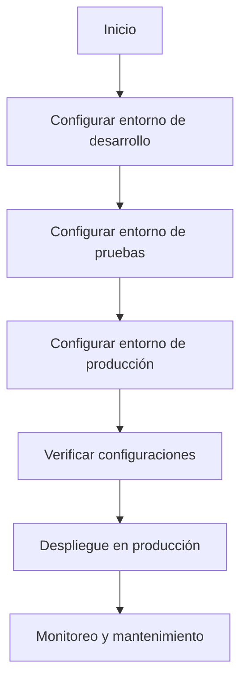

# Unidad: Configuración de entornos de desarrollo, pruebas y producción

## Introducción a la unidad y objetivos de aprendizaje

En esta unidad, nos enfocaremos en la configuración de entornos de desarrollo, pruebas y producción para un proyecto Django, específicamente para un sistema de carrito de compras. La correcta configuración de estos entornos es crucial para garantizar que el desarrollo sea eficiente, las pruebas sean precisas y la producción sea segura y escalable.

### Objetivos de aprendizaje:

1. Comprender la importancia de los diferentes entornos en un proyecto Django.
2. Configurar adecuadamente los entornos de desarrollo, pruebas y producción.
3. Implementar buenas prácticas para la gestión de configuraciones específicas de cada entorno.
4. Desarrollar un flujo de trabajo que facilite la transición entre los diferentes entornos.

## Documento funcional de requerimientos

### Descripción detallada de la funcionalidad

La configuración de entornos de desarrollo, pruebas y producción en Django implica la creación de configuraciones específicas para cada entorno, asegurando que cada uno tenga los ajustes necesarios para su propósito. Esto incluye la configuración de bases de datos, variables de entorno, ajustes de seguridad, y otros parámetros que varían según el entorno.

### Casos de uso

1. **Desarrollo**: Los desarrolladores necesitan un entorno donde puedan escribir y probar código de manera rápida y eficiente. Este entorno debe ser flexible y permitir la depuración fácil.
2. **Pruebas**: Los testers necesitan un entorno que simule la producción lo más fielmente posible para realizar pruebas unitarias, de integración y funcionales.
3. **Producción**: El entorno de producción debe ser seguro, eficiente y escalable, con configuraciones optimizadas para el rendimiento y la seguridad.

### Diagramas de flujo



### Requisitos no funcionales

1. **Seguridad**: Las configuraciones de producción deben incluir medidas de seguridad robustas, como el uso de HTTPS, protección contra ataques CSRF y XSS, y manejo seguro de las credenciales.
2. **Rendimiento**: El entorno de producción debe estar optimizado para manejar grandes volúmenes de tráfico y minimizar el tiempo de respuesta.
3. **Escalabilidad**: La arquitectura debe permitir la fácil escalabilidad horizontal y vertical para adaptarse a un aumento en la carga.
4. **Mantenibilidad**: Las configuraciones deben ser claras y bien documentadas para facilitar el mantenimiento y las actualizaciones.

## Implementación en Python

### Explicación paso a paso del código

Para gestionar las configuraciones de los diferentes entornos, utilizaremos el patrón de configuración basada en entornos. Esto implica tener un archivo de configuración base (`base.py`) y archivos específicos para cada entorno (`development.py`, `testing.py`, `production.py`).

1. **Crear el directorio de configuración**:
   En el directorio del proyecto, crea un directorio llamado `config` donde se almacenarán los archivos de configuración.

2. **Archivo base de configuración (`base.py`)**:
   Este archivo contendrá las configuraciones comunes a todos los entornos.

3. **Archivos específicos de cada entorno**:
   Crea archivos `development.py`, `testing.py` y `production.py` que extiendan la configuración base y añadan o modifiquen configuraciones específicas para cada entorno.

### Código fuente completo y comentado

#### `config/base.py`

```python
# config/base.py

import os
from pathlib import Path

# Ruta base del proyecto
BASE_DIR = Path(__file__).resolve().parent.parent

# Configuración común a todos los entornos
SECRET_KEY = os.getenv('DJANGO_SECRET_KEY', 'default-secret-key')
DEBUG = False
ALLOWED_HOSTS = []

# Aplicaciones instaladas
INSTALLED_APPS = [
    'django.contrib.admin',
    'django.contrib.auth',
    'django.contrib.contenttypes',
    'django.contrib.sessions',
    'django.contrib.messages',
    'django.contrib.staticfiles',
    'shop',  # Aplicación del carrito de compras
]

# Middleware
MIDDLEWARE = [
    'django.middleware.security.SecurityMiddleware',
    'django.contrib.sessions.middleware.SessionMiddleware',
    'django.middleware.common.CommonMiddleware',
    'django.middleware.csrf.CsrfViewMiddleware',
    'django.contrib.auth.middleware.AuthenticationMiddleware',
    'django.contrib.messages.middleware.MessageMiddleware',
    'django.middleware.clickjacking.XFrameOptionsMiddleware',
]

# URL de configuración
ROOT_URLCONF = 'myproject.urls'

# Plantillas
TEMPLATES = [
    {
        'BACKEND': 'django.template.backends.django.DjangoTemplates',
        'DIRS': [BASE_DIR / 'templates'],
        'APP_DIRS': True,
        'OPTIONS': {
            'context_processors': [
                'django.template.context_processors.debug',
                'django.template.context_processors.request',
                'django.contrib.auth.context_processors.auth',
                'django.contrib.messages.context_processors.messages',
            ],
        },
    },
]

# WSGI
WSGI_APPLICATION = 'myproject.wsgi.application'

# Base de datos
DATABASES = {
    'default': {
        'ENGINE': 'django.db.backends.postgresql',
        'NAME': os.getenv('DB_NAME', 'mydatabase'),
        'USER': os.getenv('DB_USER', 'mydatabaseuser'),
        'PASSWORD': os.getenv('DB_PASSWORD', 'mypassword'),
        'HOST': os.getenv('DB_HOST', 'localhost'),
        'PORT': os.getenv('DB_PORT', '5432'),
    }
}

# Validadores de contraseñas
AUTH_PASSWORD_VALIDATORS = [
    {
        'NAME': 'django.contrib.auth.password_validation.UserAttributeSimilarityValidator',
    },
    {
        'NAME': 'django.contrib.auth.password_validation.MinimumLengthValidator',
    },
    {
        'NAME': 'django.contrib.auth.password_validation.CommonPasswordValidator',
    },
    {
        'NAME': 'django.contrib.auth.password_validation.NumericPasswordValidator',
    },
]

# Internacionalización
LANGUAGE_CODE = 'es-ar'
TIME_ZONE = 'America/Argentina/Buenos_Aires'
USE_I18N = True
USE_L10N = True
USE_TZ = True

# Archivos estáticos
STATIC_URL = '/static/'
STATICFILES_DIRS = [BASE_DIR / 'static']

# Archivos multimedia
MEDIA_URL = '/media/'
MEDIA_ROOT = BASE_DIR / 'media'
```

#### `config/development.py`

```python
# config/development.py

from .base import *

# Configuración específica para el entorno de desarrollo
DEBUG = True
ALLOWED_HOSTS = ['localhost', '127.0.0.1']

# Configuración de la base de datos para desarrollo
DATABASES = {
    'default': {
        'ENGINE': 'django.db.backends.postgresql',
        'NAME': 'dev_mydatabase',
        'USER': 'dev_mydatabaseuser',
        'PASSWORD': 'dev_mypassword',
        'HOST': 'localhost',
        'PORT': '5432',
    }
}

# Configuración de correo para desarrollo
EMAIL_BACKEND = 'django.core.mail.backends.console.EmailBackend'
```

#### `config/testing.py`

```python
# config/testing.py

from .base import *

# Configuración específica para el entorno de pruebas
DEBUG = False
ALLOWED_HOSTS = ['testserver']

# Configuración de la base de datos para pruebas
DATABASES = {
    'default': {
        'ENGINE': 'django.db.backends.postgresql',
        'NAME': 'test_mydatabase',
        'USER': 'test_mydatabaseuser',
        'PASSWORD': 'test_mypassword',
        'HOST': 'localhost',
        'PORT': '5432',
    }
}

# Configuración de correo para pruebas
EMAIL_BACKEND = 'django.core.mail.backends.locmem.EmailBackend'
```

#### `config/production.py`

```python
# config/production.py

from .base import *

# Configuración específica para el entorno de producción
DEBUG = False
ALLOWED_HOSTS = ['myproductiondomain.com']

# Configuración de la base de datos para producción
DATABASES = {
    'default': {
        'ENGINE': 'django.db.backends.postgresql',
        'NAME': os.getenv('DB_NAME'),
        'USER': os.getenv('DB_USER'),
        'PASSWORD': os.getenv('DB_PASSWORD'),
        'HOST': os.getenv('DB_HOST'),
        'PORT': os.getenv('DB_PORT'),
    }
}

# Configuración de correo para producción
EMAIL_BACKEND = 'django.core.mail.backends.smtp.EmailBackend'
EMAIL_HOST = os.getenv('EMAIL_HOST')
EMAIL_PORT = os.getenv('EMAIL_PORT')
EMAIL_USE_TLS = os.getenv('EMAIL_USE_TLS', True)
EMAIL_HOST_USER = os.getenv('EMAIL_HOST_USER')
EMAIL_HOST_PASSWORD = os.getenv('EMAIL_HOST_PASSWORD')

# Seguridad adicional para producción
SECURE_SSL_REDIRECT = True
SESSION_COOKIE_SECURE = True
CSRF_COOKIE_SECURE = True
```

### Ejemplos de uso y pruebas unitarias

Para cambiar entre los diferentes entornos, se puede utilizar la variable de entorno `DJANGO_SETTINGS_MODULE` al ejecutar los comandos de Django.

#### Ejemplo de uso en desarrollo

```bash
export DJANGO_SETTINGS_MODULE=config.development
python manage.py runserver
```

#### Ejemplo de uso en pruebas

```bash
export DJANGO_SETTINGS_MODULE=config.testing
python manage.py test
```

#### Ejemplo de uso en producción

```bash
export DJANGO_SETTINGS_MODULE=config.production
gunicorn myproject.wsgi
```

### Pruebas unitarias

Para asegurar que las configuraciones funcionan correctamente, se deben realizar pruebas unitarias. A continuación, se muestra un ejemplo de cómo se pueden realizar pruebas básicas para verificar las configuraciones.

```python
# tests/test_settings.py

from django.conf import settings
from django.test import TestCase

class SettingsTestCase(TestCase):
    def test_development_settings(self):
        self.assertTrue(settings.DEBUG)
        self.assertIn('localhost', settings.ALLOWED_HOSTS)

    def test_testing_settings(self):
        self.assertFalse(settings.DEBUG)
        self.assertIn('testserver', settings.ALLOWED_HOSTS)

    def test_production_settings(self):
        self.assertFalse(settings.DEBUG)
        self.assertIn('myproductiondomain.com', settings.ALLOWED_HOSTS)
        self.assertTrue(settings.SECURE_SSL_REDIRECT)
```

## Mejores prácticas y consideraciones de diseño

### Separación de configuraciones

Es fundamental mantener las configuraciones separadas para cada entorno. Esto no solo facilita la gestión y el mantenimiento, sino que también reduce el riesgo de errores y problemas de seguridad.

### Uso de variables de entorno

Las variables de entorno son una forma segura y flexible de manejar configuraciones sensibles, como credenciales de bases de datos y claves secretas. Utiliza librerías como `python-decouple` o `django-environ` para manejar las variables de entorno de manera eficiente.

### Seguridad en producción

Asegúrate de que las configuraciones de producción incluyan todas las medidas de seguridad necesarias, como el uso de HTTPS, la configuración de cookies seguras y la protección contra ataques comunes.

### Monitoreo y mantenimiento

Implementa herramientas de monitoreo y logging para el entorno de producción. Esto te permitirá detectar y solucionar problemas rápidamente, asegurando la estabilidad y el rendimiento del sistema.

### Automatización del despliegue

Utiliza herramientas de automatización como Docker, Ansible o Terraform para gestionar el despliegue de tu aplicación en producción. Esto no solo facilita el proceso, sino que también reduce el riesgo de errores humanos.

### Depuración y solución de problemas comunes

1. **Errores de configuración**: Verifica que todas las variables de entorno estén correctamente configuradas y que los archivos de configuración sean válidos.
2. **Problemas de conexión a la base de datos**: Asegúrate de que las credenciales y la configuración de la base de datos sean correctas y que el servidor de la base de datos esté accesible.
3. **Problemas de rendimiento**: Utiliza herramientas de profiling y monitoreo para identificar cuellos de botella y optimizar el rendimiento de la aplicación.

Con estas prácticas y consideraciones, estarás bien preparado para configurar y gestionar los entornos de desarrollo, pruebas y producción de tu proyecto Django de manera eficiente y segura.