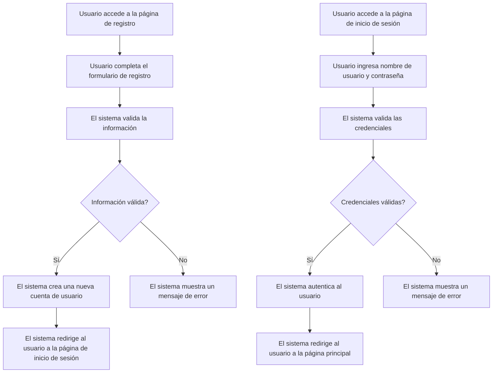

# Unidad: Modelo de Usuario (extensión de AbstractUser) - Sistema de Carrito de Compras con Django

## 1. Introducción a la unidad y objetivos de aprendizaje

En esta unidad, profundizaremos en la creación y personalización de un modelo de usuario en Django mediante la extensión de `AbstractUser`. Este modelo será fundamental para la implementación de un sistema de carrito de compras, ya que permitirá gestionar la autenticación y autorización de los usuarios, así como almacenar información adicional relevante para el sistema.

### Objetivos de aprendizaje

1. Comprender la importancia de personalizar el modelo de usuario en Django.
2. Aprender a extender el modelo `AbstractUser` para añadir campos personalizados.
3. Implementar un modelo de usuario personalizado en un proyecto Django.
4. Configurar adecuadamente el proyecto Django para utilizar el modelo de usuario personalizado.
5. Realizar pruebas unitarias para asegurar el correcto funcionamiento del modelo de usuario.

## 2. Documento funcional de requerimientos

### a. Descripción detallada de la funcionalidad

El modelo de usuario personalizado permitirá gestionar la autenticación y autorización de los usuarios en el sistema de carrito de compras. Además, se añadirán campos adicionales para almacenar información relevante, como la dirección de envío y el número de teléfono. Este modelo será utilizado en todo el sistema para identificar y autenticar a los usuarios, así como para almacenar información personalizada.

### b. Casos de uso

#### Caso de uso 1: Registro de usuario

**Descripción:** Un nuevo usuario se registra en el sistema proporcionando su información personal y de contacto.

**Actores:** Usuario

**Precondiciones:**
- El usuario no debe estar registrado previamente.

**Flujo principal:**
1. El usuario accede a la página de registro.
2. El usuario completa el formulario de registro con su nombre de usuario, contraseña, dirección de correo electrónico, dirección de envío y número de teléfono.
3. El sistema valida la información proporcionada.
4. El sistema crea una nueva cuenta de usuario y almacena la información en la base de datos.
5. El sistema redirige al usuario a la página de inicio de sesión.

**Postcondiciones:**
- El usuario está registrado en el sistema y puede iniciar sesión.

#### Caso de uso 2: Inicio de sesión de usuario

**Descripción:** Un usuario registrado inicia sesión en el sistema proporcionando su nombre de usuario y contraseña.

**Actores:** Usuario

**Precondiciones:**
- El usuario debe estar registrado en el sistema.

**Flujo principal:**
1. El usuario accede a la página de inicio de sesión.
2. El usuario ingresa su nombre de usuario y contraseña.
3. El sistema valida las credenciales proporcionadas.
4. El sistema autentica al usuario y lo redirige a la página principal del sistema.

**Postcondiciones:**
- El usuario está autenticado y puede acceder a las funcionalidades del sistema.

### c. Diagramas de flujo (en mermaid)



### d. Requisitos no funcionales

1. **Seguridad:** El sistema debe asegurar que las contraseñas de los usuarios estén encriptadas y almacenadas de manera segura.
2. **Rendimiento:** El sistema debe ser capaz de manejar múltiples solicitudes de registro e inicio de sesión simultáneamente sin degradar el rendimiento.
3. **Escalabilidad:** El sistema debe ser escalable para soportar un creciente número de usuarios y datos.
4. **Usabilidad:** La interfaz de usuario debe ser intuitiva y fácil de usar, permitiendo a los usuarios registrarse e iniciar sesión sin dificultades.
5. **Mantenibilidad:** El código del modelo de usuario debe ser claro y bien documentado para facilitar su mantenimiento y futuras modificaciones.

## 3. Implementación en Python

### a. Explicación paso a paso del código

Para implementar un modelo de usuario personalizado en Django, seguiremos estos pasos:

1. **Crear una nueva aplicación:** Primero, crearemos una nueva aplicación en nuestro proyecto Django para gestionar el modelo de usuario.
2. **Extender `AbstractUser`:** Crearemos un nuevo modelo que extienda `AbstractUser` y añadiremos los campos personalizados.
3. **Configurar el modelo de usuario en `settings.py`:** Configuraremos el proyecto Django para utilizar nuestro modelo de usuario personalizado.
4. **Migraciones:** Crearemos y aplicaremos las migraciones necesarias para actualizar la base de datos con el nuevo modelo de usuario.
5. **Formularios de registro e inicio de sesión:** Crearemos formularios personalizados para el registro e inicio de sesión de usuarios.
6. **Vistas y URLs:** Implementaremos las vistas y URLs necesarias para gestionar el registro e inicio de sesión de usuarios.

### b. Código fuente completo y comentado

#### Paso 1: Crear una nueva aplicación

```bash
python manage.py startapp usuarios
```

#### Paso 2: Extender `AbstractUser`

En `usuarios/models.py`:

```python
from django.contrib.auth.models import AbstractUser
from django.db import models

class Usuario(AbstractUser):
    direccion_envio = models.CharField(max_length=255, blank=True, null=True)
    telefono = models.CharField(max_length=15, blank=True, null=True)

    def __str__(self):
        return self.username
```

#### Paso 3: Configurar el modelo de usuario en `settings.py`

En `settings.py`:

```python
# Añadir la aplicación 'usuarios' a INSTALLED_APPS
INSTALLED_APPS = [
    ...
    'usuarios',
    ...
]

# Configurar el modelo de usuario personalizado
AUTH_USER_MODEL = 'usuarios.Usuario'
```

#### Paso 4: Migraciones

```bash
python manage.py makemigrations usuarios
python manage.py migrate
```

#### Paso 5: Formularios de registro e inicio de sesión

En `usuarios/forms.py`:

```python
from django import forms
from django.contrib.auth.forms import UserCreationForm, UserChangeForm
from .models import Usuario

class RegistroForm(UserCreationForm):
    class Meta:
        model = Usuario
        fields = ('username', 'email', 'direccion_envio', 'telefono', 'password1', 'password2')

class ActualizarUsuarioForm(UserChangeForm):
    class Meta:
        model = Usuario
        fields = ('username', 'email', 'direccion_envio', 'telefono')
```

#### Paso 6: Vistas y URLs

En `usuarios/views.py`:

```python
from django.urls import reverse_lazy
from django.views import generic
from .forms import RegistroForm

class RegistroView(generic.CreateView):
    form_class = RegistroForm
    success_url = reverse_lazy('login')
    template_name = 'usuarios/registro.html'
```

En `usuarios/urls.py`:

```python
from django.urls import path
from .views import RegistroView

urlpatterns = [
    path('registro/', RegistroView.as_view(), name='registro'),
]
```

En `urls.py` del proyecto principal:

```python
from django.contrib import admin
from django.urls import path, include

urlpatterns = [
    path('admin/', admin.site.urls),
    path('usuarios/', include('usuarios.urls')),
    path('accounts/', include('django.contrib.auth.urls')),
]
```

En `usuarios/templates/usuarios/registro.html`:

```html
<!DOCTYPE html>
<html>
<head>
    <title>Registro</title>
</head>
<body>
    <h2>Registro de Usuario</h2>
    <form method="post">
        
        {{ form.as_p }}
        <button type="submit">Registrarse</button>
    </form>
</body>
</html>
```

### c. Ejemplos de uso y pruebas unitarias

#### Ejemplo de uso

1. **Registro de usuario:**
   - El usuario accede a `http://localhost:8000/usuarios/registro/`.
   - Completa el formulario de registro con su información personal.
   - El sistema crea una nueva cuenta de usuario y redirige al usuario a la página de inicio de sesión.

2. **Inicio de sesión de usuario:**
   - El usuario accede a `http://localhost:8000/accounts/login/`.
   - Ingresa su nombre de usuario y contraseña.
   - El sistema autentica al usuario y lo redirige a la página principal.

#### Pruebas unitarias

En `usuarios/tests.py`:

```python
from django.test import TestCase
from django.urls import reverse
from .models import Usuario

class UsuarioTests(TestCase):

    def test_creacion_usuario(self):
        usuario = Usuario.objects.create_user(
            username='testuser',
            email='testuser@example.com',
            password='testpassword123',
            direccion_envio='123 Calle Falsa',
            telefono='123456789'
        )
        self.assertEqual(usuario.username, 'testuser')
        self.assertEqual(usuario.email, 'testuser@example.com')
        self.assertTrue(usuario.check_password('testpassword123'))
        self.assertEqual(usuario.direccion_envio, '123 Calle Falsa')
        self.assertEqual(usuario.telefono, '123456789')

    def test_registro_usuario(self):
        response = self.client.post(reverse('registro'), {
            'username': 'testuser',
            'email': 'testuser@example.com',
            'password1': 'testpassword123',
            'password2': 'testpassword123',
            'direccion_envio': '123 Calle Falsa',
            'telefono': '123456789'
        })
        self.assertEqual(response.status_code, 302)
        usuario = Usuario.objects.get(username='testuser')
        self.assertEqual(usuario.email, 'testuser@example.com')
        self.assertEqual(usuario.direccion_envio, '123 Calle Falsa')
        self.assertEqual(usuario.telefono, '123456789')
```

## 4. Mejores prácticas y consideraciones de diseño

### Mejores prácticas

1. **Seguridad:** Asegúrate de que las contraseñas de los usuarios estén encriptadas utilizando los mecanismos de seguridad proporcionados por Django.
2. **Validación de datos:** Implementa validaciones adecuadas en los formularios para asegurar que los datos ingresados por los usuarios sean correctos y completos.
3. **Pruebas:** Realiza pruebas unitarias y de integración para asegurar el correcto funcionamiento del modelo de usuario y las funcionalidades relacionadas.
4. **Documentación:** Documenta el código y las funcionalidades del modelo de usuario para facilitar su mantenimiento y futuras modificaciones.
5. **Modularidad:** Mantén el código modular y organizado, separando las funcionalidades en diferentes archivos y aplicaciones según sea necesario.

### Consideraciones de diseño

1. **Extensibilidad:** Diseña el modelo de usuario de manera que sea fácil de extender y personalizar en el futuro.
2. **Reutilización:** Aprovecha las funcionalidades y componentes proporcionados por Django, como los formularios y vistas genéricas, para reducir la cantidad de código personalizado.
3. **Escalabilidad:** Considera el impacto del modelo de usuario en el rendimiento y escalabilidad del sistema, especialmente si se espera un gran número de usuarios.
4. **Usabilidad:** Diseña la interfaz de usuario de manera que sea intuitiva y fácil de usar, facilitando el registro e inicio de sesión de los usuarios.

### Consejos para la depuración y solución de problemas comunes

1. **Errores de migración:** Si encuentras errores al aplicar las migraciones, asegúrate de que el modelo de usuario esté correctamente configurado en `settings.py` y que todas las dependencias estén instaladas.
2. **Problemas de autenticación:** Si los usuarios no pueden iniciar sesión, verifica que las credenciales sean correctas y que el sistema de autenticación esté configurado adecuadamente.
3. **Validación de formularios:** Si los formularios no se validan correctamente, revisa las reglas de validación y asegúrate de que los datos ingresados cumplan con los requisitos.
4. **Mensajes de error:** Proporciona mensajes de error claros y útiles para ayudar a los usuarios a corregir cualquier problema que encuentren durante el registro o inicio de sesión.

Con esto, hemos cubierto de manera exhaustiva la creación y personalización de un modelo de usuario en Django mediante la extensión de `AbstractUser`, así como su integración en un sistema de carrito de compras. Siguiendo estos pasos y mejores prácticas, podrás implementar un sistema de autenticación y gestión de usuarios robusto y escalable en tu proyecto Django.