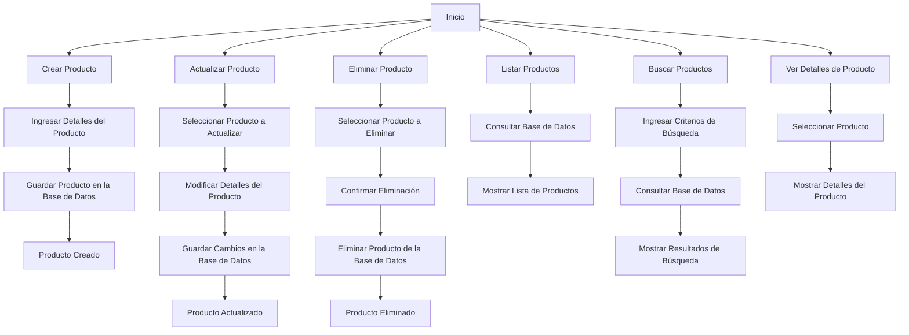

# Unidad: Modelo de Producto en Django

## Introducción a la unidad y objetivos de aprendizaje

Bienvenidos a esta unidad del manual "Sistema de Carrito de Compras con Django". En esta sección, nos enfocaremos en el "Modelo de Producto". Este modelo es crucial para cualquier sistema de comercio electrónico, ya que representa los artículos que los usuarios pueden comprar. Al finalizar esta unidad, los lectores serán capaces de:

1. Comprender la estructura y los componentes del modelo de producto en Django.
2. Implementar un modelo de producto con atributos esenciales.
3. Utilizar técnicas avanzadas para mejorar la funcionalidad y el rendimiento del modelo.
4. Aplicar mejores prácticas en el diseño y la implementación del modelo de producto.

## Documento funcional de requerimientos

### Descripción detallada de la funcionalidad

El modelo de producto en un sistema de carrito de compras debe ser capaz de representar todos los detalles relevantes de un producto que se ofrece a la venta. Esto incluye atributos básicos como el nombre, la descripción, el precio y la disponibilidad, así como atributos más avanzados como categorías, imágenes y variantes de productos.

### Casos de uso

1. **Crear un producto**: Un administrador puede crear un nuevo producto ingresando detalles como nombre, descripción, precio, categoría e imágenes.
2. **Actualizar un producto**: Un administrador puede actualizar los detalles de un producto existente.
3. **Eliminar un producto**: Un administrador puede eliminar un producto del catálogo.
4. **Listar productos**: Los usuarios pueden ver una lista de productos disponibles.
5. **Buscar productos**: Los usuarios pueden buscar productos por nombre, categoría u otros atributos.
6. **Ver detalles de un producto**: Los usuarios pueden ver los detalles completos de un producto específico.

### Diagramas de flujo



### Requisitos no funcionales

1. **Rendimiento**: La consulta y visualización de productos debe ser rápida y eficiente, incluso con una gran cantidad de productos en la base de datos.
2. **Escalabilidad**: El sistema debe ser capaz de manejar un crecimiento en el número de productos sin degradar el rendimiento.
3. **Seguridad**: Solo los administradores autorizados deben poder crear, actualizar o eliminar productos.
4. **Mantenibilidad**: El código debe ser claro y bien documentado para facilitar futuras modificaciones y mejoras.
5. **Usabilidad**: La interfaz de usuario para la gestión de productos debe ser intuitiva y fácil de usar.

## Implementación en Python

### Explicación paso a paso del código

Para implementar el modelo de producto en Django, seguiremos estos pasos:

1. **Definir el modelo de producto**: Crearemos una clase `Product` en el archivo `models.py` que heredará de `models.Model`.
2. **Agregar atributos básicos**: Añadiremos campos como `name`, `description`, `price`, `stock`, `category` e `image`.
3. **Configurar las relaciones**: Definiremos relaciones con otros modelos, como `Category`.
4. **Implementar métodos adicionales**: Añadiremos métodos para calcular descuentos, verificar disponibilidad, etc.
5. **Registrar el modelo en el administrador de Django**: Permitiremos que los administradores gestionen productos desde el panel de administración.

### Código fuente completo y comentado

```python
from django.db import models

class Category(models.Model):
    name = models.CharField(max_length=255)
    description = models.TextField(blank=True, null=True)

    def __str__(self):
        return self.name

class Product(models.Model):
    name = models.CharField(max_length=255)
    description = models.TextField()
    price = models.DecimalField(max_digits=10, decimal_places=2)
    stock = models.PositiveIntegerField()
    category = models.ForeignKey(Category, related_name='products', on_delete=models.CASCADE)
    image = models.ImageField(upload_to='products/', blank=True, null=True)
    created_at = models.DateTimeField(auto_now_add=True)
    updated_at = models.DateTimeField(auto_now=True)

    def __str__(self):
        return self.name

    def is_in_stock(self):
        return self.stock > 0

    def apply_discount(self, percentage):
        discount_amount = self.price * (percentage / 100)
        return self.price - discount_amount

# Registro del modelo en el administrador de Django
from django.contrib import admin

@admin.register(Product)
class ProductAdmin(admin.ModelAdmin):
    list_display = ('name', 'price', 'stock', 'category', 'created_at', 'updated_at')
    search_fields = ('name', 'description')
    list_filter = ('category', 'created_at', 'updated_at')
```

### Ejemplos de uso y pruebas unitarias

#### Ejemplos de uso

1. **Crear un producto**:
   ```python
   from myapp.models import Product, Category

   electronics = Category.objects.create(name='Electronics', description='Electronic items')
   product = Product.objects.create(
       name='Smartphone',
       description='A high-end smartphone with 128GB storage',
       price=699.99,
       stock=50,
       category=electronics
   )
   ```

2. **Actualizar un producto**:
   ```python
   product = Product.objects.get(id=1)
   product.price = 649.99
   product.save()
   ```

3. **Eliminar un producto**:
   ```python
   product = Product.objects.get(id=1)
   product.delete()
   ```

4. **Listar productos**:
   ```python
   products = Product.objects.all()
   for product in products:
       print(product.name, product.price)
   ```

5. **Buscar productos**:
   ```python
   products = Product.objects.filter(name__icontains='smartphone')
   for product in products:
       print(product.name, product.price)
   ```

6. **Verificar disponibilidad**:
   ```python
   product = Product.objects.get(id=1)
   if product.is_in_stock():
       print(f'{product.name} is in stock')
   else:
       print(f'{product.name} is out of stock')
   ```

#### Pruebas unitarias

```python
from django.test import TestCase
from myapp.models import Product, Category

class ProductModelTest(TestCase):

    def setUp(self):
        self.category = Category.objects.create(name='Electronics', description='Electronic items')
        self.product = Product.objects.create(
            name='Smartphone',
            description='A high-end smartphone with 128GB storage',
            price=699.99,
            stock=50,
            category=self.category
        )

    def test_product_creation(self):
        self.assertEqual(self.product.name, 'Smartphone')
        self.assertEqual(self.product.price, 699.99)
        self.assertEqual(self.product.stock, 50)
        self.assertEqual(self.product.category.name, 'Electronics')

    def test_product_is_in_stock(self):
        self.assertTrue(self.product.is_in_stock())

    def test_product_apply_discount(self):
        discounted_price = self.product.apply_discount(10)
        self.assertEqual(discounted_price, 629.99)
```

## Mejores prácticas y consideraciones de diseño

1. **Normalización de la base de datos**: Asegúrate de que los datos estén bien normalizados. Por ejemplo, utiliza una tabla separada para las categorías en lugar de almacenar la categoría como un campo de texto en el modelo de producto.
2. **Validación de datos**: Implementa validaciones en los modelos para asegurar que los datos ingresados sean correctos. Por ejemplo, verifica que el precio no sea negativo.
3. **Optimización de consultas**: Utiliza `select_related` y `prefetch_related` para optimizar las consultas a la base de datos y evitar problemas de rendimiento.
4. **Seguridad**: Asegúrate de que solo los usuarios autorizados puedan realizar operaciones sensibles como la creación, actualización y eliminación de productos.
5. **Documentación**: Mantén tu código bien documentado. Utiliza docstrings y comentarios para explicar la lógica y el propósito de cada parte del código.
6. **Pruebas**: Escribe pruebas unitarias y de integración para asegurarte de que tu modelo de producto funcione correctamente y para facilitar la detección de errores.
7. **Escalabilidad**: Diseña tu modelo pensando en el futuro. Considera cómo manejarás un gran número de productos y cómo escalarás tu aplicación a medida que crezca.

En resumen, el modelo de producto es una parte fundamental de cualquier sistema de carrito de compras. Siguiendo las mejores prácticas y consideraciones de diseño, puedes crear un modelo robusto y eficiente que satisfaga las necesidades de tu aplicación y proporcione una experiencia de usuario excelente.