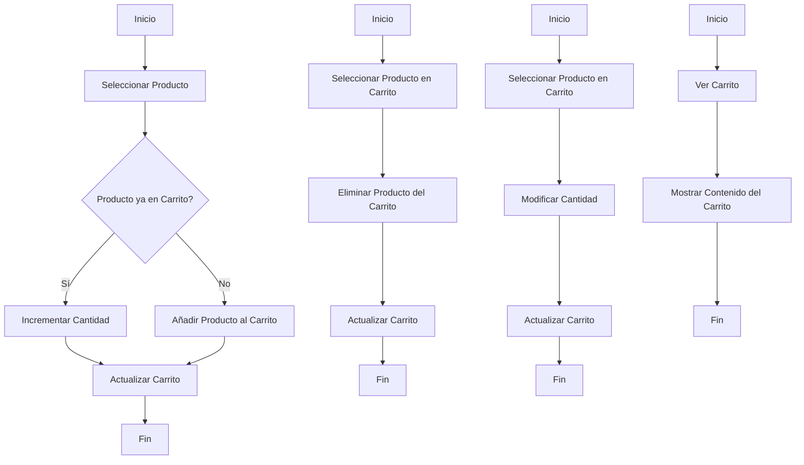

# Unidad: Modelo de Carrito y CarritoItem

## Introducción a la unidad y objetivos de aprendizaje

En esta unidad, profundizaremos en los modelos de Django para la creación de un sistema de carrito de compras, específicamente en los modelos `Carrito` y `CarritoItem`. Estos modelos son fundamentales para gestionar la lógica de un carrito de compras en una aplicación web. Al finalizar esta unidad, serás capaz de:

1. Comprender la estructura y funcionalidad de los modelos `Carrito` y `CarritoItem`.
2. Implementar estos modelos en Django de manera eficiente.
3. Crear y manipular instancias de estos modelos para gestionar un carrito de compras.
4. Aplicar mejores prácticas de diseño y considerar aspectos de seguridad, rendimiento y escalabilidad.

## Documento funcional de requerimientos

### a. Descripción detallada de la funcionalidad

El modelo `Carrito` representa un carrito de compras, que puede contener múltiples productos. Cada producto en el carrito se representa mediante una instancia del modelo `CarritoItem`. Un `CarritoItem` contiene información sobre el producto específico y la cantidad de dicho producto en el carrito.

#### Modelo Carrito
- **Atributos**:
  - `usuario`: Referencia al modelo de usuario que posee el carrito.
  - `fecha_creacion`: Fecha y hora en que se creó el carrito.
  - `activo`: Indica si el carrito está activo o no.

#### Modelo CarritoItem
- **Atributos**:
  - `carrito`: Referencia al carrito al que pertenece el ítem.
  - `producto`: Referencia al modelo de producto.
  - `cantidad`: Cantidad del producto en el carrito.
  - `precio`: Precio del producto en el momento de añadirlo al carrito.

### b. Casos de uso

1. **Añadir un producto al carrito**:
   - Un usuario selecciona un producto y lo añade a su carrito.
   - Si el producto ya está en el carrito, se incrementa la cantidad.

2. **Eliminar un producto del carrito**:
   - Un usuario decide eliminar un producto de su carrito.
   - El ítem correspondiente se elimina del carrito.

3. **Actualizar la cantidad de un producto en el carrito**:
   - Un usuario modifica la cantidad de un producto en su carrito.
   - La cantidad del ítem correspondiente se actualiza.

4. **Visualizar el contenido del carrito**:
   - Un usuario desea ver los productos que ha añadido a su carrito.
   - Se muestra una lista de todos los ítems en el carrito, junto con sus detalles.

### c. Diagramas de flujo (en mermaid)



### d. Requisitos no funcionales

1. **Rendimiento**:
   - Las operaciones de añadir, eliminar y actualizar productos en el carrito deben ser rápidas y eficientes.
   - El sistema debe ser capaz de manejar múltiples carritos simultáneamente sin degradar el rendimiento.

2. **Escalabilidad**:
   - El diseño debe permitir la escalabilidad horizontal, permitiendo que el sistema maneje un número creciente de usuarios y carritos.

3. **Seguridad**:
   - Solo el usuario propietario del carrito debe poder modificar su contenido.
   - Las operaciones deben ser seguras contra ataques de inyección SQL y otros tipos de vulnerabilidades.

4. **Usabilidad**:
   - La interfaz de usuario debe ser intuitiva y fácil de usar.
   - Los mensajes de error y confirmación deben ser claros y útiles.

## Implementación en Python

### a. Explicación paso a paso del código

Para implementar los modelos `Carrito` y `CarritoItem` en Django, seguiremos los siguientes pasos:

1. **Definir el modelo `Carrito`**:
   - Este modelo contendrá una referencia al usuario, la fecha de creación y un campo booleano para indicar si el carrito está activo.

2. **Definir el modelo `CarritoItem`**:
   - Este modelo contendrá una referencia al carrito, una referencia al producto, la cantidad y el precio del producto.

3. **Registrar los modelos en el administrador de Django**:
   - Esto permitirá gestionar los carritos y sus ítems desde la interfaz de administración de Django.

### b. Código fuente completo y comentado

```python
from django.db import models
from django.conf import settings
from productos.models import Producto

class Carrito(models.Model):
    usuario = models.ForeignKey(settings.AUTH_USER_MODEL, on_delete=models.CASCADE)
    fecha_creacion = models.DateTimeField(auto_now_add=True)
    activo = models.BooleanField(default=True)

    def __str__(self):
        return f"Carrito de {self.usuario.username} - {self.fecha_creacion}"

    def total(self):
        return sum(item.subtotal() for item in self.items.all())

class CarritoItem(models.Model):
    carrito = models.ForeignKey(Carrito, related_name='items', on_delete=models.CASCADE)
    producto = models.ForeignKey(Producto, on_delete=models.CASCADE)
    cantidad = models.PositiveIntegerField(default=1)
    precio = models.DecimalField(max_digits=10, decimal_places=2)

    def __str__(self):
        return f"{self.cantidad} x {self.producto.nombre}"

    def subtotal(self):
        return self.cantidad * self.precio

# Registrar los modelos en el administrador de Django
from django.contrib import admin

@admin.register(Carrito)
class CarritoAdmin(admin.ModelAdmin):
    list_display = ('usuario', 'fecha_creacion', 'activo')

@admin.register(CarritoItem)
class CarritoItemAdmin(admin.ModelAdmin):
    list_display = ('carrito', 'producto', 'cantidad', 'precio')
```

### c. Ejemplos de uso y pruebas unitarias

#### Añadir un producto al carrito

```python
from django.test import TestCase
from django.contrib.auth.models import User
from productos.models import Producto
from .models import Carrito, CarritoItem

class CarritoTestCase(TestCase):
    def setUp(self):
        self.usuario = User.objects.create_user(username='testuser', password='12345')
        self.producto = Producto.objects.create(nombre='Producto 1', precio=100.00)
        self.carrito = Carrito.objects.create(usuario=self.usuario)

    def test_añadir_producto_al_carrito(self):
        item = CarritoItem.objects.create(carrito=self.carrito, producto=self.producto, cantidad=2, precio=self.producto.precio)
        self.assertEqual(self.carrito.items.count(), 1)
        self.assertEqual(item.subtotal(), 200.00)
```

#### Eliminar un producto del carrito

```python
    def test_eliminar_producto_del_carrito(self):
        item = CarritoItem.objects.create(carrito=self.carrito, producto=self.producto, cantidad=2, precio=self.producto.precio)
        item.delete()
        self.assertEqual(self.carrito.items.count(), 0)
```

#### Actualizar la cantidad de un producto en el carrito

```python
    def test_actualizar_cantidad_producto_en_carrito(self):
        item = CarritoItem.objects.create(carrito=self.carrito, producto=self.producto, cantidad=2, precio=self.producto.precio)
        item.cantidad = 5
        item.save()
        self.assertEqual(item.cantidad, 5)
        self.assertEqual(item.subtotal(), 500.00)
```

#### Visualizar el contenido del carrito

```python
    def test_visualizar_contenido_del_carrito(self):
        item1 = CarritoItem.objects.create(carrito=self.carrito, producto=self.producto, cantidad=2, precio=self.producto.precio)
        producto2 = Producto.objects.create(nombre='Producto 2', precio=50.00)
        item2 = CarritoItem.objects.create(carrito=self.carrito, producto=producto2, cantidad=3, precio=producto2.precio)
        self.assertEqual(self.carrito.items.count(), 2)
        self.assertEqual(self.carrito.total(), 350.00)
```

## Mejores prácticas y consideraciones de diseño

1. **Uso de señales de Django**:
   - Considera el uso de señales para realizar acciones automáticas, como actualizar el total del carrito cuando se añade o elimina un ítem.

2. **Validaciones y restricciones**:
   - Implementa validaciones para asegurar que la cantidad de productos no sea negativa y que el precio sea válido.

3. **Optimización de consultas**:
   - Utiliza `select_related` y `prefetch_related` para optimizar las consultas a la base de datos y reducir el número de consultas necesarias.

4. **Seguridad**:
   - Asegúrate de que solo el usuario propietario del carrito pueda modificar su contenido.
   - Utiliza transacciones para asegurar la consistencia de los datos en operaciones críticas.

5. **Escalabilidad**:
   - Diseña el sistema para soportar un gran número de usuarios y carritos, utilizando técnicas como el particionamiento de bases de datos si es necesario.

6. **Pruebas exhaustivas**:
   - Implementa pruebas unitarias y de integración para asegurar que todas las funcionalidades del carrito funcionan correctamente.

7. **Documentación**:
   - Documenta el código y las funcionalidades para facilitar el mantenimiento y la extensión del sistema.

En resumen, los modelos `Carrito` y `CarritoItem` son componentes esenciales en la implementación de un sistema de carrito de compras en Django. Siguiendo las mejores prácticas y consideraciones de diseño, puedes crear un sistema robusto, eficiente y seguro que brinde una excelente experiencia de usuario.