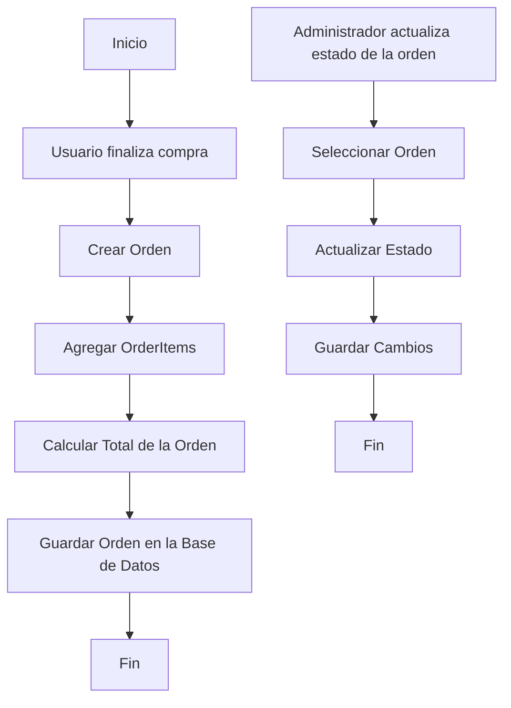

# Unidad: Modelo de Orden y OrderItem

## Introducción a la Unidad y Objetivos de Aprendizaje

En esta unidad, profundizaremos en el desarrollo del Modelo de Orden y OrderItem en Django, parte esencial del capítulo "Modelos de Django" del libro "Sistema de Carrito de Compras con Django". El objetivo es proporcionar una comprensión exhaustiva de cómo estos modelos interactúan con otros componentes del sistema, como el Modelo de Usuario, Producto, Carrito y CarritoItem, y cómo se implementan en Django.

Al finalizar esta unidad, los lectores serán capaces de:

1. Comprender la estructura y funcionalidad del Modelo de Orden y OrderItem.
2. Implementar estos modelos en Django de manera eficiente.
3. Integrar estos modelos con otros componentes del sistema de carrito de compras.
4. Aplicar mejores prácticas en el diseño y desarrollo de modelos en Django.
5. Realizar pruebas unitarias y asegurar la calidad del código.

## Documento Funcional de Requerimientos

### Descripción Detallada de la Funcionalidad

El Modelo de Orden y OrderItem es crucial para gestionar las compras realizadas por los usuarios en el sistema de carrito de compras. La Orden representa una compra completa realizada por un usuario, mientras que OrderItem representa cada producto individual dentro de esa compra.

#### Modelo de Orden

- **ID**: Identificador único de la orden.
- **Usuario**: Referencia al usuario que realizó la orden.
- **Fecha de creación**: Fecha y hora en que se creó la orden.
- **Estado**: Estado actual de la orden (pendiente, procesada, enviada, entregada).
- **Total**: Monto total de la orden.

#### Modelo de OrderItem

- **ID**: Identificador único del item de la orden.
- **Orden**: Referencia a la orden a la que pertenece el item.
- **Producto**: Referencia al producto comprado.
- **Cantidad**: Cantidad del producto comprado.
- **Precio**: Precio del producto en el momento de la compra.

### Casos de Uso

1. **Creación de una Orden**: Un usuario finaliza su compra y se crea una nueva orden con los items correspondientes.
2. **Actualización del Estado de la Orden**: El administrador del sistema actualiza el estado de una orden (por ejemplo, de pendiente a procesada).
3. **Visualización de Historial de Órdenes**: Un usuario visualiza el historial de sus órdenes pasadas.
4. **Cálculo del Total de la Orden**: El sistema calcula el monto total de una orden sumando los precios de todos los items.

### Diagramas de Flujo



### Requisitos No Funcionales

1. **Rendimiento**: El sistema debe ser capaz de manejar múltiples órdenes simultáneamente sin degradar el rendimiento.
2. **Escalabilidad**: La arquitectura debe permitir la fácil adición de nuevas funcionalidades relacionadas con las órdenes.
3. **Seguridad**: Los datos de las órdenes deben estar protegidos y solo accesibles por usuarios autorizados.
4. **Mantenibilidad**: El código debe ser claro y bien documentado para facilitar futuras modificaciones.

## Implementación en Python

### Explicación Paso a Paso del Código

1. **Definición del Modelo de Orden**: Se define una clase `Order` que hereda de `models.Model`. Esta clase contiene campos para almacenar la información de la orden, como el usuario, la fecha de creación, el estado y el total.

2. **Definición del Modelo de OrderItem**: Se define una clase `OrderItem` que también hereda de `models.Model`. Esta clase contiene campos para almacenar la información de cada item de la orden, como la referencia a la orden, el producto, la cantidad y el precio.

3. **Relaciones entre Modelos**: Se utilizan claves foráneas (`ForeignKey`) para establecer relaciones entre `Order`, `OrderItem`, `User` y `Product`.

4. **Métodos Personalizados**: Se implementan métodos personalizados en los modelos para calcular el total de la orden y actualizar el estado.

### Código Fuente Completo y Comentado

```python
from django.db import models
from django.contrib.auth.models import User
from productos.models import Producto

class Order(models.Model):
    PENDIENTE = 'P'
    PROCESADA = 'PR'
    ENVIADA = 'E'
    ENTREGADA = 'EN'

    ESTADO_CHOICES = [
        (PENDIENTE, 'Pendiente'),
        (PROCESADA, 'Procesada'),
        (ENVIADA, 'Enviada'),
        (ENTREGADA, 'Entregada'),
    ]

    usuario = models.ForeignKey(User, on_delete=models.CASCADE)
    fecha_creacion = models.DateTimeField(auto_now_add=True)
    estado = models.CharField(max_length=2, choices=ESTADO_CHOICES, default=PENDIENTE)
    total = models.DecimalField(max_digits=10, decimal_places=2, default=0.00)

    def __str__(self):
        return f'Orden {self.id} - Usuario: {self.usuario.username}'

    def calcular_total(self):
        self.total = sum(item.precio * item.cantidad for item in self.orderitem_set.all())
        self.save()

class OrderItem(models.Model):
    orden = models.ForeignKey(Order, on_delete=models.CASCADE)
    producto = models.ForeignKey(Producto, on_delete=models.CASCADE)
    cantidad = models.PositiveIntegerField(default=1)
    precio = models.DecimalField(max_digits=10, decimal_places=2)

    def __str__(self):
        return f'{self.cantidad} x {self.producto.nombre}'

    def save(self, *args, **kwargs):
        self.precio = self.producto.precio
        super().save(*args, **kwargs)
        self.orden.calcular_total()
```

### Ejemplos de Uso y Pruebas Unitarias

#### Ejemplo de Uso

```python
# Crear una nueva orden
usuario = User.objects.get(username='usuario1')
orden = Order.objects.create(usuario=usuario)

# Agregar items a la orden
producto1 = Producto.objects.get(nombre='Producto 1')
producto2 = Producto.objects.get(nombre='Producto 2')

order_item1 = OrderItem.objects.create(orden=orden, producto=producto1, cantidad=2)
order_item2 = OrderItem.objects.create(orden=orden, producto=producto2, cantidad=1)

# Verificar el total de la orden
print(orden.total)  # Debería mostrar la suma de los precios de los productos
```

#### Pruebas Unitarias

```python
from django.test import TestCase
from django.contrib.auth.models import User
from productos.models import Producto
from .models import Order, OrderItem

class OrderModelTest(TestCase):

    def setUp(self):
        self.usuario = User.objects.create_user(username='testuser', password='12345')
        self.producto1 = Producto.objects.create(nombre='Producto 1', precio=100.00)
        self.producto2 = Producto.objects.create(nombre='Producto 2', precio=200.00)
        self.orden = Order.objects.create(usuario=self.usuario)

    def test_crear_order_item(self):
        order_item = OrderItem.objects.create(orden=self.orden, producto=self.producto1, cantidad=2)
        self.assertEqual(order_item.precio, self.producto1.precio)
        self.assertEqual(self.orden.total, 200.00)

    def test_calcular_total(self):
        OrderItem.objects.create(orden=self.orden, producto=self.producto1, cantidad=2)
        OrderItem.objects.create(orden=self.orden, producto=self.producto2, cantidad=1)
        self.orden.calcular_total()
        self.assertEqual(self.orden.total, 400.00)

    def test_actualizar_estado(self):
        self.orden.estado = Order.PROCESADA
        self.orden.save()
        self.assertEqual(self.orden.estado, Order.PROCESADA)
```

## Mejores Prácticas y Consideraciones de Diseño

1. **Normalización de la Base de Datos**: Asegúrese de que los modelos estén correctamente normalizados para evitar redundancias y mejorar la eficiencia de las consultas.
2. **Uso de Métodos Personalizados**: Implementar métodos personalizados en los modelos para encapsular la lógica de negocio, como el cálculo del total de la orden.
3. **Validaciones y Restricciones**: Utilizar validaciones y restricciones en los modelos para asegurar la integridad de los datos (por ejemplo, cantidad positiva en OrderItem).
4. **Optimización de Consultas**: Utilizar técnicas de optimización de consultas, como `select_related` y `prefetch_related`, para mejorar el rendimiento al acceder a relaciones entre modelos.
5. **Seguridad**: Asegurar que solo los usuarios autorizados puedan acceder y modificar las órdenes. Utilizar permisos y autenticación adecuados.
6. **Pruebas Unitarias**: Escribir pruebas unitarias para validar la funcionalidad de los modelos y asegurar la calidad del código.
7. **Documentación**: Mantener una buena documentación del código para facilitar el mantenimiento y la comprensión por parte de otros desarrolladores.

En resumen, el desarrollo del Modelo de Orden y OrderItem en Django es un componente fundamental para cualquier sistema de carrito de compras. Siguiendo las mejores prácticas y consideraciones de diseño, se puede asegurar una implementación eficiente, segura y escalable.