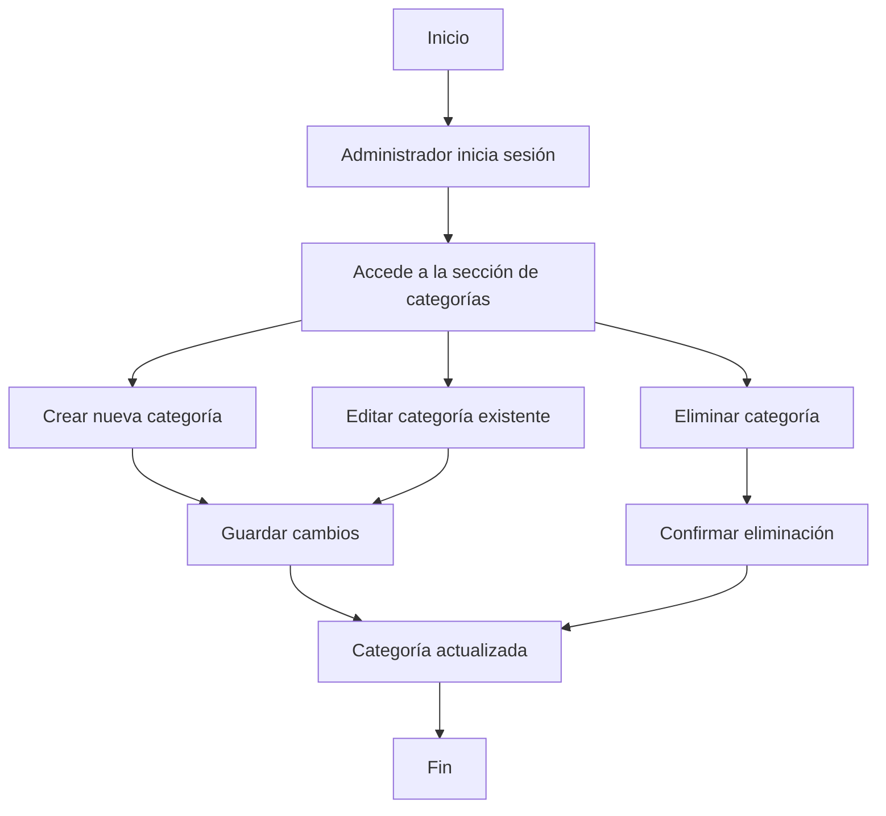

# Unidad: Modelo de Categoría y Modelos Relacionados

## Introducción a la Unidad y Objetivos de Aprendizaje

En esta unidad, exploraremos en profundidad el modelo de Categoría y los modelos relacionados dentro del contexto de un sistema de carrito de compras desarrollado con Django. Este modelo es crucial para organizar y gestionar los productos de manera eficiente, permitiendo a los usuarios navegar y encontrar productos de manera intuitiva. Al finalizar esta unidad, serás capaz de:

1. Comprender la importancia del modelo de Categoría en un sistema de carrito de compras.
2. Diseñar y crear modelos relacionados con Categoría en Django.
3. Implementar relaciones entre modelos y comprender su impacto en la base de datos.
4. Aplicar mejores prácticas en el diseño y desarrollo de modelos en Django.

## Documento Funcional de Requerimientos

### Descripción Detallada de la Funcionalidad

El modelo de Categoría es fundamental para la organización de productos en un sistema de carrito de compras. Este modelo permite clasificar los productos en diferentes categorías, facilitando la navegación y búsqueda para los usuarios. Además, se pueden establecer relaciones jerárquicas entre categorías (por ejemplo, subcategorías), lo que permite una estructura más detallada y organizada.

### Casos de Uso

1. **Administrador del Sistema**:
   - Crear, editar y eliminar categorías y subcategorías.
   - Asignar productos a categorías específicas.
   - Visualizar la jerarquía de categorías y subcategorías.

2. **Usuario Final**:
   - Navegar por las categorías para encontrar productos.
   - Filtrar productos por categoría.

### Diagramas de Flujo



### Requisitos No Funcionales

1. **Rendimiento**: El sistema debe ser capaz de manejar un gran número de categorías y subcategorías sin afectar el rendimiento.
2. **Escalabilidad**: La estructura de categorías debe ser escalable para permitir la adición de nuevas categorías y subcategorías sin necesidad de cambios significativos en la base de datos.
3. **Seguridad**: Solo los administradores autorizados deben tener acceso a la funcionalidad de gestión de categorías.
4. **Usabilidad**: La interfaz de usuario para la gestión de categorías debe ser intuitiva y fácil de usar.

## Implementación en Python

### Explicación Paso a Paso del Código

1. **Definición del Modelo de Categoría**: Crearemos un modelo `Category` que tendrá campos como `name` y `parent` para representar la jerarquía de categorías.
2. **Relaciones entre Modelos**: Estableceremos relaciones entre `Category` y otros modelos como `Product`.
3. **Admin Interface**: Configuraremos la interfaz de administración de Django para gestionar las categorías.

### Código Fuente Completo y Comentado

```python
from django.db import models

class Category(models.Model):
    name = models.CharField(max_length=255, unique=True)
    parent = models.ForeignKey('self', on_delete=models.CASCADE, null=True, blank=True, related_name='subcategories')

    class Meta:
        verbose_name_plural = "Categories"

    def __str__(self):
        return self.name

class Product(models.Model):
    name = models.CharField(max_length=255)
    category = models.ForeignKey(Category, on_delete=models.CASCADE, related_name='products')
    price = models.DecimalField(max_digits=10, decimal_places=2)
    description = models.TextField()

    def __str__(self):
        return self.name
```

### Ejemplos de Uso y Pruebas Unitarias

#### Ejemplo de Uso

```python
# Crear una categoría principal
electronics = Category.objects.create(name="Electronics")

# Crear una subcategoría
smartphones = Category.objects.create(name="Smartphones", parent=electronics)

# Crear un producto y asignarlo a una categoría
iphone = Product.objects.create(name="iPhone 12", category=smartphones, price=999.99, description="Latest Apple iPhone")
```

#### Pruebas Unitarias

```python
from django.test import TestCase
from .models import Category, Product

class CategoryModelTest(TestCase):

    def setUp(self):
        self.electronics = Category.objects.create(name="Electronics")
        self.smartphones = Category.objects.create(name="Smartphones", parent=self.electronics)
        self.iphone = Product.objects.create(name="iPhone 12", category=self.smartphones, price=999.99, description="Latest Apple iPhone")

    def test_category_creation(self):
        self.assertEqual(self.electronics.name, "Electronics")
        self.assertEqual(self.smartphones.parent, self.electronics)

    def test_product_creation(self):
        self.assertEqual(self.iphone.name, "iPhone 12")
        self.assertEqual(self.iphone.category, self.smartphones)
        self.assertEqual(self.iphone.price, 999.99)
```

## Mejores Prácticas y Consideraciones de Diseño

1. **Normalización de la Base de Datos**: Asegúrate de que la base de datos esté normalizada para evitar redundancias y mejorar la integridad de los datos.
2. **Uso de ForeignKey**: Utiliza `ForeignKey` para establecer relaciones entre modelos, lo que facilita la gestión y consulta de datos relacionados.
3. **Optimización de Consultas**: Utiliza `select_related` y `prefetch_related` para optimizar las consultas y mejorar el rendimiento.
4. **Seguridad**: Implementa permisos y autenticación adecuados para asegurar que solo los usuarios autorizados puedan gestionar las categorías.
5. **Escalabilidad**: Diseña la estructura de categorías de manera que pueda escalar fácilmente con el crecimiento del catálogo de productos.

### Consideraciones de Seguridad

- **Autenticación y Autorización**: Implementa un sistema robusto de autenticación y autorización para asegurar que solo los administradores puedan gestionar las categorías.
- **Validación de Datos**: Asegúrate de validar todos los datos de entrada para prevenir ataques de inyección SQL y otros tipos de vulnerabilidades.

### Consideraciones de Rendimiento

- **Índices en la Base de Datos**: Crea índices en los campos que se utilizan frecuentemente en consultas para mejorar el rendimiento.
- **Caching**: Implementa estrategias de caching para reducir la carga en la base de datos y mejorar la velocidad de respuesta.

### Consejos para la Depuración y Solución de Problemas Comunes

1. **Errores de Migración**: Si encuentras errores al aplicar migraciones, revisa las dependencias entre modelos y asegúrate de que todas las migraciones anteriores se hayan aplicado correctamente.
2. **Problemas de Rendimiento**: Utiliza herramientas de profiling para identificar consultas lentas y optimizarlas.
3. **Errores de Relación**: Si encuentras errores relacionados con las relaciones entre modelos, revisa las definiciones de `ForeignKey` y asegúrate de que los datos relacionados existen en la base de datos.

Con esta unidad, hemos cubierto en detalle el modelo de Categoría y los modelos relacionados en Django, proporcionando una base sólida para organizar y gestionar productos en un sistema de carrito de compras. Asegúrate de seguir las mejores prácticas y consideraciones de diseño para crear una aplicación robusta y escalable.