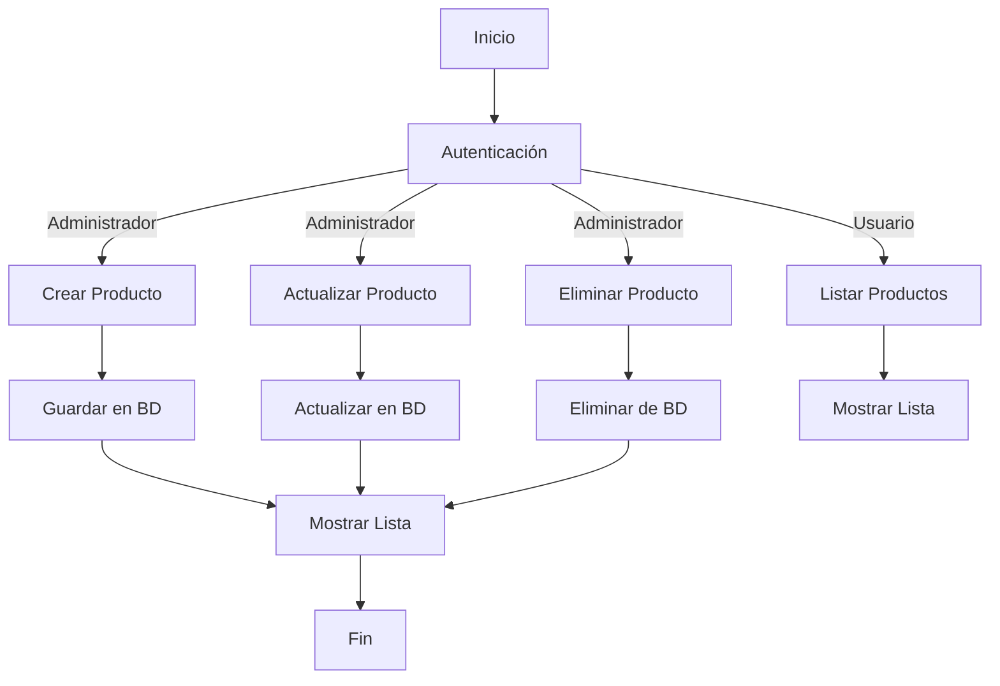

# Unidad: Vistas basadas en clases para operaciones CRUD

## Introducción a la unidad y objetivos de aprendizaje

En esta unidad, nos enfocaremos en el desarrollo de vistas basadas en clases (Class-Based Views, CBVs) para implementar operaciones CRUD (Crear, Leer, Actualizar, Eliminar) en un sistema de carrito de compras utilizando Django. Las vistas basadas en clases proporcionan una manera más estructurada y reutilizable de manejar la lógica de las vistas en comparación con las vistas basadas en funciones (Function-Based Views, FBVs).

Al finalizar esta unidad, los estudiantes serán capaces de:
1. Comprender los conceptos fundamentales de las vistas basadas en clases en Django.
2. Implementar operaciones CRUD utilizando vistas basadas en clases.
3. Utilizar mixins y genéricos para simplificar la implementación de vistas.
4. Aplicar mejores prácticas en el diseño y desarrollo de vistas basadas en clases.
5. Realizar pruebas unitarias para asegurar la funcionalidad de las vistas.

## Documento funcional de requerimientos

### Descripción detallada de la funcionalidad

El objetivo es implementar un conjunto de vistas basadas en clases para manejar las operaciones CRUD de los productos en un sistema de carrito de compras. Estas vistas permitirán a los usuarios realizar las siguientes acciones:
- Crear un nuevo producto.
- Leer (listar y ver detalles) productos existentes.
- Actualizar la información de un producto.
- Eliminar un producto.

### Casos de uso

#### Caso de uso 1: Crear un nuevo producto
- **Actor**: Administrador
- **Descripción**: El administrador puede agregar un nuevo producto al sistema proporcionando detalles como nombre, descripción, precio y cantidad.
- **Precondiciones**: El administrador debe estar autenticado.
- **Postcondiciones**: El nuevo producto se guarda en la base de datos y se muestra en la lista de productos.

#### Caso de uso 2: Leer productos existentes
- **Actor**: Usuario
- **Descripción**: Los usuarios pueden ver una lista de productos disponibles y detalles individuales de cada producto.
- **Precondiciones**: Ninguna.
- **Postcondiciones**: La lista de productos se muestra al usuario, y los detalles de un producto específico se pueden ver al seleccionar un producto de la lista.

#### Caso de uso 3: Actualizar la información de un producto
- **Actor**: Administrador
- **Descripción**: El administrador puede actualizar la información de un producto existente.
- **Precondiciones**: El administrador debe estar autenticado.
- **Postcondiciones**: La información del producto se actualiza en la base de datos y se refleja en la lista de productos.

#### Caso de uso 4: Eliminar un producto
- **Actor**: Administrador
- **Descripción**: El administrador puede eliminar un producto del sistema.
- **Precondiciones**: El administrador debe estar autenticado.
- **Postcondiciones**: El producto se elimina de la base de datos y ya no se muestra en la lista de productos.

### Diagramas de flujo



### Requisitos no funcionales

1. **Seguridad**: Solo los administradores autenticados pueden crear, actualizar o eliminar productos.
2. **Rendimiento**: Las operaciones CRUD deben ser eficientes y no afectar el rendimiento general del sistema.
3. **Escalabilidad**: El sistema debe ser capaz de manejar un gran número de productos sin degradar el rendimiento.
4. **Usabilidad**: La interfaz de usuario debe ser intuitiva y fácil de usar.
5. **Mantenibilidad**: El código debe ser modular y fácil de mantener.

## Implementación en Python

### Explicación paso a paso del código

Para implementar las operaciones CRUD utilizando vistas basadas en clases en Django, seguiremos estos pasos:

1. **Definir el modelo de Producto**: Este modelo representará los productos en nuestro sistema.
2. **Crear formularios para el modelo de Producto**: Utilizaremos formularios de Django para facilitar la creación y actualización de productos.
3. **Implementar vistas basadas en clases**: Utilizaremos vistas genéricas de Django para manejar las operaciones CRUD.
4. **Configurar URLs**: Definiremos las rutas necesarias para acceder a nuestras vistas.
5. **Crear templates**: Diseñaremos las plantillas HTML para mostrar y gestionar los productos.

### Código fuente completo y comentado

#### 1. Definir el modelo de Producto

```python
from django.db import models

class Producto(models.Model):
    nombre = models.CharField(max_length=100)
    descripcion = models.TextField()
    precio = models.DecimalField(max_digits=10, decimal_places=2)
    cantidad = models.PositiveIntegerField()

    def __str__(self):
        return self.nombre
```

#### 2. Crear formularios para el modelo de Producto

```python
from django import forms
from .models import Producto

class ProductoForm(forms.ModelForm):
    class Meta:
        model = Producto
        fields = ['nombre', 'descripcion', 'precio', 'cantidad']
```

#### 3. Implementar vistas basadas en clases

```python
from django.urls import reverse_lazy
from django.views.generic import ListView, DetailView, CreateView, UpdateView, DeleteView
from .models import Producto
from .forms import ProductoForm

class ProductoListView(ListView):
    model = Producto
    template_name = 'productos/producto_list.html'

class ProductoDetailView(DetailView):
    model = Producto
    template_name = 'productos/producto_detail.html'

class ProductoCreateView(CreateView):
    model = Producto
    form_class = ProductoForm
    template_name = 'productos/producto_form.html'
    success_url = reverse_lazy('producto_list')

class ProductoUpdateView(UpdateView):
    model = Producto
    form_class = ProductoForm
    template_name = 'productos/producto_form.html'
    success_url = reverse_lazy('producto_list')

class ProductoDeleteView(DeleteView):
    model = Producto
    template_name = 'productos/producto_confirm_delete.html'
    success_url = reverse_lazy('producto_list')
```

#### 4. Configurar URLs

```python
from django.urls import path
from .views import ProductoListView, ProductoDetailView, ProductoCreateView, ProductoUpdateView, ProductoDeleteView

urlpatterns = [
    path('', ProductoListView.as_view(), name='producto_list'),
    path('<int:pk>/', ProductoDetailView.as_view(), name='producto_detail'),
    path('nuevo/', ProductoCreateView.as_view(), name='producto_create'),
    path('<int:pk>/editar/', ProductoUpdateView.as_view(), name='producto_update'),
    path('<int:pk>/eliminar/', ProductoDeleteView.as_view(), name='producto_delete'),
]
```

#### 5. Crear templates

**producto_list.html**
```html



  <h1>Lista de Productos</h1>
  <ul>
    
      <li>
        <a href="">{{ producto.nombre }}</a>
      </li>
    
  </ul>
  <a href="">Agregar nuevo producto</a>

```

**producto_detail.html**
```html



  <h1>{{ object.nombre }}</h1>
  <p>{{ object.descripcion }}</p>
  <p>Precio: {{ object.precio }}</p>
  <p>Cantidad: {{ object.cantidad }}</p>
  <a href="">Editar</a>
  <a href="">Eliminar</a>

```

**producto_form.html**
```html



  <h1>Editar ProductoAgregar Producto</h1>
  <form method="post">
    
    {{ form.as_p }}
    <button type="submit">Guardar</button>
  </form>

```

**producto_confirm_delete.html**
```html



  <h1>Eliminar Producto</h1>
  <p>¿Estás seguro de que deseas eliminar "{{ object.nombre }}"?</p>
  <form method="post">
    
    <button type="submit">Eliminar</button>
  </form>
  <a href="">Cancelar</a>

```

### Ejemplos de uso y pruebas unitarias

#### Ejemplos de uso

Para probar la funcionalidad de las vistas basadas en clases, podemos seguir estos pasos:

1. **Crear un nuevo producto**: Navegar a la URL `/nuevo/`, completar el formulario y enviar.
2. **Listar productos**: Navegar a la URL `/` para ver la lista de productos.
3. **Ver detalles de un producto**: Hacer clic en el nombre de un producto en la lista para ver sus detalles.
4. **Actualizar un producto**: Hacer clic en "Editar" en la página de detalles de un producto, completar el formulario y enviar.
5. **Eliminar un producto**: Hacer clic en "Eliminar" en la página de detalles de un producto y confirmar la eliminación.

#### Pruebas unitarias

```python
from django.test import TestCase
from django.urls import reverse
from .models import Producto

class ProductoTests(TestCase):

    def setUp(self):
        self.producto = Producto.objects.create(
            nombre='Producto de prueba',
            descripcion='Descripción del producto de prueba',
            precio=100.00,
            cantidad=10
        )

    def test_producto_list_view(self):
        response = self.client.get(reverse('producto_list'))
        self.assertEqual(response.status_code, 200)
        self.assertContains(response, self.producto.nombre)
        self.assertTemplateUsed(response, 'productos/producto_list.html')

    def test_producto_detail_view(self):
        response = self.client.get(reverse('producto_detail', args=[self.producto.id]))
        self.assertEqual(response.status_code, 200)
        self.assertContains(response, self.producto.nombre)
        self.assertTemplateUsed(response, 'productos/producto_detail.html')

    def test_producto_create_view(self):
        response = self.client.post(reverse('producto_create'), {
            'nombre': 'Nuevo Producto',
            'descripcion': 'Descripción del nuevo producto',
            'precio': 200.00,
            'cantidad': 20
        })
        self.assertEqual(response.status_code, 302)
        self.assertEqual(Producto.objects.last().nombre, 'Nuevo Producto')

    def test_producto_update_view(self):
        response = self.client.post(reverse('producto_update', args=[self.producto.id]), {
            'nombre': 'Producto Actualizado',
            'descripcion': 'Descripción actualizada',
            'precio': 150.00,
            'cantidad': 15
        })
        self.assertEqual(response.status_code, 302)
        self.producto.refresh_from_db()
        self.assertEqual(self.producto.nombre, 'Producto Actualizado')

    def test_producto_delete_view(self):
        response = self.client.post(reverse('producto_delete', args=[self.producto.id]))
        self.assertEqual(response.status_code, 302)
        self.assertFalse(Producto.objects.filter(id=self.producto.id).exists())
```

### Mejores prácticas y consideraciones de diseño

1. **Reutilización de código**: Utilizar vistas genéricas y mixins para evitar la duplicación de código y facilitar el mantenimiento.
2. **Seguridad**: Asegurarse de que solo los usuarios autenticados y autorizados puedan realizar operaciones sensibles como crear, actualizar o eliminar productos.
3. **Validación de datos**: Utilizar formularios de Django para validar los datos de entrada y manejar errores de manera adecuada.
4. **Modularidad**: Mantener el código modular y organizado, separando las vistas, modelos, formularios y templates en archivos y directorios adecuados.
5. **Pruebas**: Escribir pruebas unitarias para verificar la funcionalidad de las vistas y asegurar que los cambios futuros no introduzcan errores.
6. **Escalabilidad**: Diseñar el sistema de manera que pueda escalar fácilmente, utilizando técnicas como la paginación para manejar grandes volúmenes de datos.
7. **Rendimiento**: Optimizar las consultas a la base de datos y utilizar técnicas de caché cuando sea necesario para mejorar el rendimiento.

En conclusión, las vistas basadas en clases en Django proporcionan una manera eficiente y estructurada de manejar las operaciones CRUD en un sistema de carrito de compras. Siguiendo las mejores prácticas y consideraciones de diseño, podemos crear un sistema robusto, seguro y fácil de mantener.