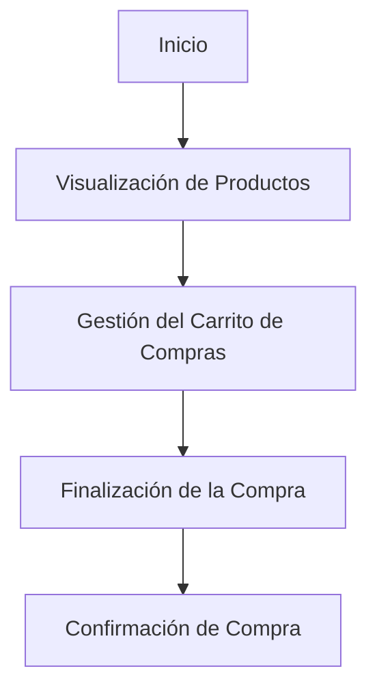

# Unidad: Templates con Django Template Language

## Introducción a la Unidad y Objetivos de Aprendizaje

En esta unidad, exploraremos en profundidad el uso de Django Template Language (DTL) para la creación de templates en un sistema de carrito de compras. Los templates son una parte fundamental de cualquier aplicación web, ya que permiten la separación de la lógica de negocio y la presentación. Al finalizar esta unidad, serás capaz de:

1. Comprender la estructura y sintaxis básica de Django Template Language.
2. Implementar templates dinámicos que interactúan con vistas y modelos.
3. Utilizar filtros y tags de DTL para manipular datos en los templates.
4. Crear layouts reutilizables mediante el uso de herencia de templates.
5. Aplicar buenas prácticas en el diseño y organización de templates.

## Documento Funcional de Requerimientos

### Descripción Detallada de la Funcionalidad

El objetivo de esta sección es proporcionar una guía detallada sobre cómo utilizar Django Template Language para crear y gestionar templates en un sistema de carrito de compras. Los templates deben permitir la visualización de productos, la gestión del carrito de compras y la finalización de la compra. Además, deben ser dinámicos y capaces de interactuar con las vistas y modelos de Django.

### Casos de Uso

1. **Visualización de Productos**:
   - **Actor**: Usuario.
   - **Descripción**: El usuario puede ver una lista de productos disponibles en la tienda.
   - **Precondiciones**: El usuario ha accedido a la página principal de la tienda.
   - **Postcondiciones**: El usuario ve una lista de productos con sus detalles.

2. **Gestión del Carrito de Compras**:
   - **Actor**: Usuario.
   - **Descripción**: El usuario puede añadir productos al carrito, ver los productos en el carrito y eliminar productos del carrito.
   - **Precondiciones**: El usuario ha seleccionado productos para añadir al carrito.
   - **Postcondiciones**: El usuario ve los productos en el carrito y puede modificar la cantidad o eliminar productos.

3. **Finalización de la Compra**:
   - **Actor**: Usuario.
   - **Descripción**: El usuario puede proceder a la compra de los productos en el carrito.
   - **Precondiciones**: El usuario ha revisado los productos en el carrito y desea finalizar la compra.
   - **Postcondiciones**: El usuario completa el proceso de compra y recibe una confirmación.

### Diagramas de Flujo



### Requisitos No Funcionales

1. **Rendimiento**: Los templates deben ser eficientes y no causar demoras perceptibles en la carga de las páginas.
2. **Escalabilidad**: La estructura de los templates debe permitir la fácil adición de nuevas funcionalidades y productos.
3. **Seguridad**: Los templates deben estar diseñados para evitar vulnerabilidades como la inyección de código.
4. **Usabilidad**: La interfaz debe ser intuitiva y fácil de usar para los usuarios.

## Implementación en Python

### Explicación Paso a Paso del Código

Para implementar los templates utilizando Django Template Language, seguiremos los siguientes pasos:

1. **Configuración del Proyecto**: Asegúrate de tener un proyecto Django configurado y funcionando.
2. **Creación de Templates**: Crea templates para las diferentes vistas de la aplicación.
3. **Uso de Filtros y Tags**: Utiliza filtros y tags de DTL para manipular y mostrar datos dinámicamente.
4. **Herencia de Templates**: Implementa la herencia de templates para crear layouts reutilizables.
5. **Integración con Vistas**: Conecta los templates con las vistas para mostrar datos dinámicos.

### Código Fuente Completo y Comentado

#### 1. Configuración del Proyecto

Asegúrate de que tu proyecto Django esté configurado correctamente y que la aplicación `shop` esté incluida en `INSTALLED_APPS` en `settings.py`.

#### 2. Creación de Templates

Crea una carpeta `templates` dentro de tu aplicación `shop` y añade los siguientes templates:

**base.html**:
```html
<!DOCTYPE html>
<html lang="es">
<head>
    <meta charset="UTF-8">
    <title>Tienda Online</title>
    <link rel="stylesheet" href="">
</head>
<body>
    <header>
        <h1>Tienda Online</h1>
        <nav>
            <ul>
                <li><a href="">Productos</a></li>
                <li><a href="">Carrito</a></li>
            </ul>
        </nav>
    </header>
    <main>
        
    </main>
    <footer>
        <p>&copy; 2023 Tienda Online</p>
    </footer>
</body>
</html>
```

**product_list.html**:
```html


Lista de Productos


<h2>Lista de Productos</h2>
<ul>
    
    <li>
        <h3>{{ product.name }}</h3>
        <p>{{ product.description }}</p>
        <p>Precio: ${{ product.price }}</p>
        <form method="post" action="">
            
            <button type="submit">Añadir al Carrito</button>
        </form>
    </li>
    
</ul>

```

**cart_detail.html**:
```html


Detalle del Carrito


<h2>Detalle del Carrito</h2>
<ul>
    
    <li>
        <h3>{{ item.product.name }}</h3>
        <p>Cantidad: {{ item.quantity }}</p>
        <p>Precio: ${{ item.total_price }}</p>
        <form method="post" action="">
            
            <button type="submit">Eliminar</button>
        </form>
    </li>
    
</ul>
<p>Total: ${{ cart.total_price }}</p>
<form method="post" action="">
    
    <button type="submit">Finalizar Compra</button>
</form>

```

#### 3. Uso de Filtros y Tags

En los templates anteriores, hemos utilizado varios filtros y tags de DTL:

- ****: Para heredar de otro template.
- ****: Para definir bloques de contenido que pueden ser sobrescritos en templates hijos.
- ****: Para iterar sobre una lista de objetos.
- **{{ variable }}**: Para mostrar el valor de una variable.
- ****: Para incluir un token CSRF en formularios.
- ****: Para generar URLs dinámicamente.

#### 4. Herencia de Templates

La herencia de templates permite crear un layout base (`base.html`) que puede ser reutilizado en otros templates (`product_list.html`, `cart_detail.html`). Esto facilita la consistencia y el mantenimiento del código.

#### 5. Integración con Vistas

Asegúrate de que las vistas correspondientes estén configuradas para renderizar los templates:

**views.py**:
```python
from django.shortcuts import render, get_object_or_404, redirect
from .models import Product, Cart

def product_list(request):
    products = Product.objects.all()
    return render(request, 'product_list.html', {'products': products})

def cart_detail(request):
    cart = Cart.objects.get(user=request.user)
    return render(request, 'cart_detail.html', {'cart': cart})

def add_to_cart(request, product_id):
    product = get_object_or_404(Product, id=product_id)
    cart = Cart.objects.get(user=request.user)
    cart.add_product(product)
    return redirect('cart_detail')

def remove_from_cart(request, item_id):
    cart = Cart.objects.get(user=request.user)
    cart.remove_item(item_id)
    return redirect('cart_detail')

def checkout(request):
    cart = Cart.objects.get(user=request.user)
    cart.checkout()
    return redirect('confirmation')
```

### Ejemplos de Uso y Pruebas Unitarias

#### Ejemplos de Uso

Para ver la lista de productos, el usuario puede navegar a la URL correspondiente (`/products/`). Para gestionar el carrito de compras, el usuario puede añadir productos desde la lista de productos y ver el detalle del carrito en la URL correspondiente (`/cart/`).

#### Pruebas Unitarias

**tests.py**:
```python
from django.test import TestCase
from django.urls import reverse
from .models import Product, Cart

class CartTests(TestCase):
    def setUp(self):
        self.product = Product.objects.create(name='Producto 1', description='Descripción del producto 1', price=100)
        self.cart = Cart.objects.create(user=self.user)

    def test_add_to_cart(self):
        response = self.client.post(reverse('add_to_cart', args=[self.product.id]))
        self.assertEqual(response.status_code, 302)
        self.assertEqual(self.cart.items.count(), 1)

    def test_remove_from_cart(self):
        self.cart.add_product(self.product)
        item = self.cart.items.first()
        response = self.client.post(reverse('remove_from_cart', args=[item.id]))
        self.assertEqual(response.status_code, 302)
        self.assertEqual(self.cart.items.count(), 0)

    def test_checkout(self):
        self.cart.add_product(self.product)
        response = self.client.post(reverse('checkout'))
        self.assertEqual(response.status_code, 302)
        self.assertEqual(self.cart.items.count(), 0)
```

## Mejores Prácticas y Consideraciones de Diseño

1. **Separación de Concerns**: Mantén la lógica de negocio en las vistas y modelos, y la lógica de presentación en los templates.
2. **Reutilización de Código**: Utiliza la herencia de templates para crear layouts reutilizables y consistentes.
3. **Seguridad**: Siempre utiliza `` en formularios para proteger contra ataques CSRF.
4. **Rendimiento**: Minimiza el uso de consultas a la base de datos en los templates. Prefiere realizar las consultas en las vistas y pasar los datos necesarios a los templates.
5. **Legibilidad**: Mantén los templates limpios y bien organizados. Utiliza comentarios y nombres descriptivos para las variables y bloques.

En resumen, Django Template Language es una herramienta poderosa para crear templates dinámicos y reutilizables en una aplicación web. Siguiendo las mejores prácticas y utilizando las funcionalidades de DTL, puedes crear una interfaz de usuario eficiente y mantenible para tu sistema de carrito de compras.