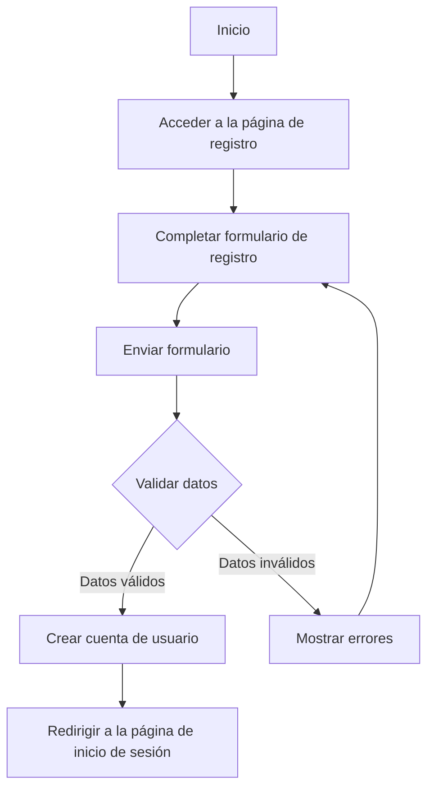
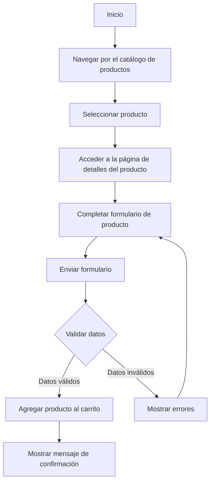

# Unidad: Uso de Formularios de Django

## 1. Introducción a la Unidad y Objetivos de Aprendizaje

En esta unidad, profundizaremos en el uso de formularios en Django, un aspecto crucial para la creación de aplicaciones web dinámicas y funcionales. Los formularios permiten a los usuarios interactuar con la aplicación, enviar datos y realizar diversas operaciones, como agregar productos al carrito de compras, registrarse, iniciar sesión, y más.

### Objetivos de Aprendizaje

Al finalizar esta unidad, serás capaz de:

1. Comprender la estructura y funcionamiento de los formularios en Django.
2. Crear formularios personalizados utilizando `forms.Form` y `forms.ModelForm`.
3. Validar datos de formularios y manejar errores.
4. Integrar formularios en vistas y templates.
5. Implementar formularios avanzados con widgets y validaciones personalizadas.
6. Aplicar mejores prácticas en el diseño y uso de formularios en Django.

## 2. Documento Funcional de Requerimientos

### a. Descripción Detallada de la Funcionalidad

Los formularios en Django son una herramienta poderosa que permite la interacción entre el usuario y la aplicación. En el contexto de un sistema de carrito de compras, los formularios pueden ser utilizados para diversas funcionalidades, tales como:

- Registro de usuarios.
- Inicio de sesión.
- Agregar productos al carrito.
- Actualizar la cantidad de productos en el carrito.
- Realizar el checkout y procesar pagos.

### b. Casos de Uso

#### Caso de Uso 1: Registro de Usuarios

**Descripción**: Permitir a los nuevos usuarios registrarse en la plataforma proporcionando su información personal.

**Actores**: Usuario

**Flujo Principal**:
1. El usuario accede a la página de registro.
2. El usuario completa el formulario con su información personal (nombre, correo electrónico, contraseña).
3. El usuario envía el formulario.
4. El sistema valida los datos y crea una nueva cuenta de usuario.
5. El sistema redirige al usuario a la página de inicio de sesión.

#### Caso de Uso 2: Agregar Productos al Carrito

**Descripción**: Permitir a los usuarios agregar productos al carrito de compras.

**Actores**: Usuario

**Flujo Principal**:
1. El usuario navega por el catálogo de productos.
2. El usuario selecciona un producto y accede a su página de detalles.
3. El usuario completa el formulario para especificar la cantidad y otras opciones del producto.
4. El usuario envía el formulario.
5. El sistema valida los datos y agrega el producto al carrito de compras.
6. El sistema muestra un mensaje de confirmación y actualiza el carrito.

### c. Diagramas de Flujo

#### Diagrama de Flujo para el Registro de Usuarios



#### Diagrama de Flujo para Agregar Productos al Carrito



### d. Requisitos No Funcionales

1. **Usabilidad**: Los formularios deben ser intuitivos y fáciles de usar, con mensajes de error claros y útiles.
2. **Seguridad**: Los datos enviados a través de los formularios deben ser validados y sanitizados para evitar ataques como la inyección SQL y el cross-site scripting (XSS).
3. **Rendimiento**: La validación de formularios debe ser eficiente para no afectar la experiencia del usuario.
4. **Escalabilidad**: El sistema debe ser capaz de manejar un gran número de formularios enviados simultáneamente.

## 3. Implementación en Python

### a. Explicación Paso a Paso del Código

Para implementar los formularios en Django, seguiremos los siguientes pasos:

1. **Crear Formularios**: Utilizaremos `forms.Form` y `forms.ModelForm` para crear formularios personalizados.
2. **Validar Datos**: Implementaremos validaciones personalizadas para asegurar que los datos ingresados sean correctos.
3. **Integrar Formularios en Vistas**: Utilizaremos vistas basadas en clases para manejar la lógica de los formularios.
4. **Renderizar Formularios en Templates**: Utilizaremos Django Template Language (DTL) para mostrar los formularios en las páginas web.

### b. Código Fuente Completo y Comentado

#### Formulario de Registro de Usuarios

**forms.py**
```python
from django import forms
from django.contrib.auth.models import User
from django.core.exceptions import ValidationError

class RegistroUsuarioForm(forms.ModelForm):
    password = forms.CharField(widget=forms.PasswordInput)
    password_confirm = forms.CharField(widget=forms.PasswordInput, label="Confirmar contraseña")

    class Meta:
        model = User
        fields = ['username', 'email', 'password']

    def clean_password_confirm(self):
        password = self.cleaned_data.get('password')
        password_confirm = self.cleaned_data.get('password_confirm')
        if password and password_confirm and password != password_confirm:
            raise ValidationError("Las contraseñas no coinciden")
        return password_confirm
```

**views.py**
```python
from django.shortcuts import render, redirect
from django.contrib.auth import login, authenticate
from .forms import RegistroUsuarioForm

def registro(request):
    if request.method == 'POST':
        form = RegistroUsuarioForm(request.POST)
        if form.is_valid():
            user = form.save(commit=False)
            user.set_password(form.cleaned_data['password'])
            user.save()
            login(request, user)
            return redirect('inicio')
    else:
        form = RegistroUsuarioForm()
    return render(request, 'registro.html', {'form': form})
```

**registro.html**
```html



  <h2>Registro de Usuario</h2>
  <form method="post">
    
    {{ form.as_p }}
    <button type="submit">Registrarse</button>
  </form>

```

#### Formulario para Agregar Productos al Carrito

**forms.py**
```python
from django import forms
from .models import Producto

class AgregarProductoForm(forms.Form):
    cantidad = forms.IntegerField(min_value=1, label="Cantidad")

    def __init__(self, *args, **kwargs):
        self.producto = kwargs.pop('producto')
        super().__init__(*args, **kwargs)

    def clean_cantidad(self):
        cantidad = self.cleaned_data.get('cantidad')
        if cantidad > self.producto.stock:
            raise forms.ValidationError("No hay suficiente stock disponible")
        return cantidad
```

**views.py**
```python
from django.shortcuts import render, get_object_or_404, redirect
from .models import Producto
from .forms import AgregarProductoForm

def agregar_al_carrito(request, producto_id):
    producto = get_object_or_404(Producto, id=producto_id)
    if request.method == 'POST':
        form = AgregarProductoForm(request.POST, producto=producto)
        if form.is_valid():
            # Lógica para agregar el producto al carrito
            return redirect('carrito')
    else:
        form = AgregarProductoForm(producto=producto)
    return render(request, 'agregar_al_carrito.html', {'form': form, 'producto': producto})
```

**agregar_al_carrito.html**
```html



  <h2>Agregar {{ producto.nombre }} al Carrito</h2>
  <form method="post">
    
    {{ form.as_p }}
    <button type="submit">Agregar al Carrito</button>
  </form>

```

### c. Ejemplos de Uso y Pruebas Unitarias

**Ejemplo de Uso: Registro de Usuarios**

Para probar el formulario de registro de usuarios, sigue estos pasos:

1. Accede a la URL `/registro/`.
2. Completa el formulario con un nombre de usuario, correo electrónico y contraseña.
3. Envía el formulario.
4. Verifica que el usuario ha sido creado y redirigido a la página de inicio de sesión.

**Pruebas Unitarias**

**tests.py**
```python
from django.test import TestCase
from django.urls import reverse
from django.contrib.auth.models import User

class RegistroUsuarioTest(TestCase):
    def test_registro_usuario(self):
        response = self.client.post(reverse('registro'), {
            'username': 'testuser',
            'email': 'testuser@example.com',
            'password': 'password123',
            'password_confirm': 'password123'
        })
        self.assertEqual(response.status_code, 302)
        self.assertTrue(User.objects.filter(username='testuser').exists())
```

**Ejemplo de Uso: Agregar Productos al Carrito**

Para probar el formulario de agregar productos al carrito, sigue estos pasos:

1. Accede a la página de detalles de un producto.
2. Completa el formulario con la cantidad deseada.
3. Envía el formulario.
4. Verifica que el producto ha sido agregado al carrito y se muestra un mensaje de confirmación.

**Pruebas Unitarias**

**tests.py**
```python
from django.test import TestCase
from django.urls import reverse
from .models import Producto

class AgregarProductoCarritoTest(TestCase):
    def setUp(self):
        self.producto = Producto.objects.create(nombre='Producto Test', stock=10, precio=100)

    def test_agregar_producto_carrito(self):
        response = self.client.post(reverse('agregar_al_carrito', args=[self.producto.id]), {
            'cantidad': 2
        })
        self.assertEqual(response.status_code, 302)
        # Verificar lógica de agregar al carrito
```

## 4. Mejores Prácticas y Consideraciones de Diseño

### Mejores Prácticas

1. **Validación de Datos**: Siempre valida los datos de los formularios tanto en el lado del cliente como en el servidor para asegurar la integridad y seguridad de los datos.
2. **Mensajes de Error**: Proporciona mensajes de error claros y específicos para ayudar a los usuarios a corregir sus entradas.
3. **Uso de Widgets**: Utiliza widgets personalizados para mejorar la experiencia del usuario y hacer los formularios más intuitivos.
4. **Reutilización de Formularios**: Define formularios reutilizables para evitar la duplicación de código y facilitar el mantenimiento.

### Consideraciones de Diseño

1. **Seguridad**: Asegúrate de proteger los formularios contra ataques comunes como CSRF (Cross-Site Request Forgery) utilizando el token CSRF de Django.
2. **Rendimiento**: Optimiza la validación de formularios para minimizar el impacto en el rendimiento de la aplicación.
3. **Escalabilidad**: Diseña los formularios y la lógica de validación para manejar un gran número de solicitudes simultáneas sin degradar el rendimiento.
4. **Accesibilidad**: Asegúrate de que los formularios sean accesibles para todos los usuarios, incluyendo aquellos con discapacidades.

### Consejos para la Depuración y Solución de Problemas Comunes

1. **Mensajes de Error**: Revisa los mensajes de error proporcionados por Django para identificar problemas específicos con los formularios.
2. **Pruebas Unitarias**: Implementa pruebas unitarias para verificar la funcionalidad y validación de los formularios.
3. **Depuración en el Navegador**: Utiliza herramientas de desarrollo del navegador para inspeccionar y depurar formularios en el lado del cliente.
4. **Logs del Servidor**: Revisa los logs del servidor para identificar y solucionar problemas con la lógica de los formularios en el lado del servidor.

Con estos conocimientos y prácticas, estarás bien equipado para implementar formularios efectivos y seguros en tu aplicación Django, mejorando la interacción del usuario y la funcionalidad del sistema de carrito de compras.