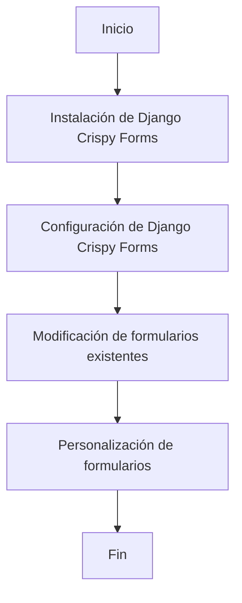

# Unidad: Integración de Django Crispy Forms para mejorar la UI

## 1. Introducción a la unidad y objetivos de aprendizaje

En esta unidad, nos enfocaremos en la integración de Django Crispy Forms para mejorar la interfaz de usuario (UI) de nuestro sistema de carrito de compras. Django Crispy Forms es una biblioteca que facilita la creación de formularios atractivos y funcionales, permitiendo a los desarrolladores personalizar la presentación de los formularios de Django sin necesidad de escribir HTML adicional. Al finalizar esta unidad, serás capaz de:

1. Comprender la importancia de una buena UI en formularios.
2. Integrar Django Crispy Forms en un proyecto Django.
3. Personalizar formularios utilizando Crispy Forms.
4. Implementar formularios mejorados en el contexto de un sistema de carrito de compras.

## 2. Documento funcional de requerimientos

### a. Descripción detallada de la funcionalidad

La funcionalidad principal de esta unidad es mejorar la interfaz de usuario de los formularios en nuestro sistema de carrito de compras utilizando Django Crispy Forms. Esto incluye:

- Instalación y configuración de Django Crispy Forms en el proyecto.
- Modificación de formularios existentes para utilizar Crispy Forms.
- Personalización de la apariencia de los formularios mediante el uso de layouts y helpers de Crispy Forms.

### b. Casos de uso

#### Caso de uso 1: Instalación y configuración de Django Crispy Forms

**Actor:** Desarrollador

**Descripción:** El desarrollador instala y configura Django Crispy Forms en el proyecto Django.

**Precondiciones:** El proyecto Django está configurado y funcionando.

**Postcondiciones:** Django Crispy Forms está instalado y configurado correctamente.

#### Caso de uso 2: Modificación de formularios existentes

**Actor:** Desarrollador

**Descripción:** El desarrollador modifica los formularios existentes para utilizar Django Crispy Forms.

**Precondiciones:** Los formularios están definidos y funcionando en el proyecto.

**Postcondiciones:** Los formularios utilizan Django Crispy Forms y tienen una mejor apariencia.

#### Caso de uso 3: Personalización de formularios

**Actor:** Desarrollador

**Descripción:** El desarrollador personaliza la apariencia de los formularios utilizando layouts y helpers de Crispy Forms.

**Precondiciones:** Django Crispy Forms está integrado en los formularios.

**Postcondiciones:** Los formularios tienen una apariencia personalizada y mejorada.

### c. Diagramas de flujo (en mermaid)



### d. Requisitos no funcionales

1. **Usabilidad:** Los formularios deben ser intuitivos y fáciles de usar para los usuarios finales.
2. **Rendimiento:** La integración de Crispy Forms no debe afectar negativamente el rendimiento del sistema.
3. **Mantenibilidad:** El código debe ser fácil de mantener y extender.
4. **Compatibilidad:** Los formularios deben ser compatibles con los principales navegadores web.

## 3. Implementación en Python

### a. Explicación paso a paso del código

#### Paso 1: Instalación de Django Crispy Forms

Para instalar Django Crispy Forms, ejecuta el siguiente comando en tu terminal:

```bash
pip install django-crispy-forms
```

#### Paso 2: Configuración de Django Crispy Forms

Agrega `crispy_forms` a la lista de aplicaciones instaladas en `settings.py`:

```python
INSTALLED_APPS = [
    ...
    'crispy_forms',
]
```

Configura el paquete de CSS que deseas usar. Por ejemplo, para Bootstrap 4:

```python
CRISPY_TEMPLATE_PACK = 'bootstrap4'
```

#### Paso 3: Modificación de formularios existentes

Supongamos que tenemos un formulario de registro de usuario en `forms.py`:

```python
from django import forms

class UserRegistrationForm(forms.Form):
    username = forms.CharField(max_length=100)
    email = forms.EmailField()
    password = forms.CharField(widget=forms.PasswordInput)
```

Para utilizar Django Crispy Forms, modifica el formulario de la siguiente manera:

```python
from crispy_forms.helper import FormHelper
from crispy_forms.layout import Submit

class UserRegistrationForm(forms.Form):
    username = forms.CharField(max_length=100)
    email = forms.EmailField()
    password = forms.CharField(widget=forms.PasswordInput)

    def __init__(self, *args, **kwargs):
        super().__init__(*args, **kwargs)
        self.helper = FormHelper()
        self.helper.form_method = 'post'
        self.helper.add_input(Submit('submit', 'Register'))
```

#### Paso 4: Personalización de formularios

Puedes personalizar aún más el formulario utilizando layouts y helpers de Crispy Forms. Por ejemplo:

```python
from crispy_forms.layout import Layout, Fieldset, ButtonHolder, Submit

class UserRegistrationForm(forms.Form):
    username = forms.CharField(max_length=100)
    email = forms.EmailField()
    password = forms.CharField(widget=forms.PasswordInput)

    def __init__(self, *args, **kwargs):
        super().__init__(*args, **kwargs)
        self.helper = FormHelper()
        self.helper.form_method = 'post'
        self.helper.layout = Layout(
            Fieldset(
                'Register',
                'username',
                'email',
                'password',
            ),
            ButtonHolder(
                Submit('submit', 'Register')
            )
        )
```

### b. Código fuente completo y comentado

```python
# forms.py

from django import forms
from crispy_forms.helper import FormHelper
from crispy_forms.layout import Layout, Fieldset, ButtonHolder, Submit

class UserRegistrationForm(forms.Form):
    username = forms.CharField(max_length=100)
    email = forms.EmailField()
    password = forms.CharField(widget=forms.PasswordInput)

    def __init__(self, *args, **kwargs):
        super().__init__(*args, **kwargs)
        # Inicializa el FormHelper
        self.helper = FormHelper()
        self.helper.form_method = 'post'
        # Define el layout del formulario
        self.helper.layout = Layout(
            Fieldset(
                'Register',
                'username',
                'email',
                'password',
            ),
            ButtonHolder(
                Submit('submit', 'Register')
            )
        )
```

### c. Ejemplos de uso y pruebas unitarias

#### Ejemplo de uso

Para renderizar el formulario en una vista, puedes hacer lo siguiente:

```python
# views.py

from django.shortcuts import render
from .forms import UserRegistrationForm

def register(request):
    if request.method == 'POST':
        form = UserRegistrationForm(request.POST)
        if form.is_valid():
            # Procesar el formulario
            pass
    else:
        form = UserRegistrationForm()

    return render(request, 'register.html', {'form': form})
```

En el template `register.html`, renderiza el formulario utilizando Crispy Forms:

```html
<!-- register.html -->



<form method="post">
    
    {{ form|crispy }}
</form>
```

#### Pruebas unitarias

```python
# tests.py

from django.test import TestCase
from .forms import UserRegistrationForm

class UserRegistrationFormTest(TestCase):

    def test_form_fields(self):
        form = UserRegistrationForm()
        self.assertIn('username', form.fields)
        self.assertIn('email', form.fields)
        self.assertIn('password', form.fields)

    def test_form_helper(self):
        form = UserRegistrationForm()
        self.assertIsNotNone(form.helper)
        self.assertEqual(form.helper.form_method, 'post')
```

## 4. Mejores prácticas y consideraciones de diseño

### Usabilidad

- **Consistencia:** Mantén una apariencia consistente en todos los formularios de la aplicación.
- **Accesibilidad:** Asegúrate de que los formularios sean accesibles para todos los usuarios, incluyendo aquellos con discapacidades.

### Rendimiento

- **Carga asíncrona:** Considera cargar formularios de manera asíncrona para mejorar el rendimiento.
- **Minimización de recursos:** Utiliza solo los recursos necesarios para evitar sobrecargar la página.

### Mantenibilidad

- **Modularidad:** Mantén el código modular y reutilizable.
- **Documentación:** Documenta el código y las configuraciones para facilitar el mantenimiento.

### Compatibilidad

- **Pruebas cruzadas:** Realiza pruebas en diferentes navegadores y dispositivos para asegurar la compatibilidad.
- **Actualizaciones:** Mantén Crispy Forms y sus dependencias actualizadas para evitar problemas de compatibilidad.

### Seguridad

- **Protección CSRF:** Asegúrate de incluir tokens CSRF en los formularios.
- **Validación:** Valida y sanitiza todos los datos de entrada para prevenir ataques de inyección.

### Depuración y solución de problemas

- **Logs:** Utiliza logs para rastrear y solucionar problemas.
- **Pruebas:** Implementa pruebas unitarias y funcionales para asegurar que los formularios funcionen correctamente.
- **Feedback del usuario:** Proporciona mensajes de error claros y útiles para los usuarios.

Con esta unidad, hemos cubierto la integración de Django Crispy Forms para mejorar la UI de los formularios en nuestro sistema de carrito de compras. Siguiendo estos pasos y mejores prácticas, podrás crear formularios atractivos y funcionales que mejoren la experiencia del usuario en tu aplicación Django.