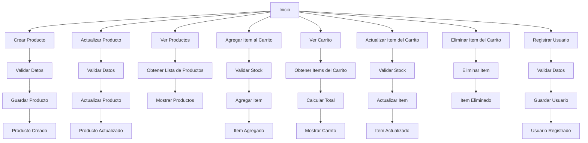

# Unidad: Serializers para Modelos Principales

## Introducción a la Unidad y Objetivos de Aprendizaje

En esta unidad, nos enfocaremos en el desarrollo y uso de serializers para los modelos principales en una API REST utilizando Django REST Framework (DRF). Los serializers son componentes esenciales en DRF que permiten convertir instancias de modelos Django en formatos de datos JSON, XML, o cualquier otro formato, y viceversa. Esto es fundamental para la comunicación entre el frontend y el backend en aplicaciones web modernas.

### Objetivos de Aprendizaje

1. Comprender el propósito y la funcionalidad de los serializers en Django REST Framework.
2. Aprender a crear y configurar serializers para modelos principales en un sistema de carrito de compras.
3. Implementar serializers personalizados para manejar casos de uso específicos.
4. Realizar validaciones y transformaciones de datos utilizando serializers.
5. Integrar serializers con vistas y endpoints de la API.
6. Aplicar mejores prácticas y consideraciones de diseño al trabajar con serializers.

## Documento Funcional de Requerimientos

### Descripción Detallada de la Funcionalidad

En un sistema de carrito de compras, los modelos principales suelen incluir `Producto`, `Carrito`, `ItemCarrito`, y `Usuario`. Los serializers para estos modelos deben manejar la serialización y deserialización de datos, así como realizar validaciones y transformaciones necesarias para asegurar la integridad y consistencia de los datos.

#### Modelo Producto
- **Campos**: id, nombre, descripción, precio, stock, categoría.
- **Funcionalidad del Serializer**: Convertir instancias de Producto a JSON y viceversa, validar datos de entrada.

#### Modelo Carrito
- **Campos**: id, usuario, items, total.
- **Funcionalidad del Serializer**: Convertir instancias de Carrito a JSON y viceversa, calcular el total del carrito.

#### Modelo ItemCarrito
- **Campos**: id, carrito, producto, cantidad.
- **Funcionalidad del Serializer**: Convertir instancias de ItemCarrito a JSON y viceversa, validar la cantidad disponible en stock.

#### Modelo Usuario
- **Campos**: id, nombre, email, contraseña.
- **Funcionalidad del Serializer**: Convertir instancias de Usuario a JSON y viceversa, manejar la creación y actualización de usuarios de manera segura.

### Casos de Uso

1. **Crear un Producto**: Un administrador puede crear un nuevo producto proporcionando los datos necesarios.
2. **Actualizar un Producto**: Un administrador puede actualizar la información de un producto existente.
3. **Ver Productos**: Los usuarios pueden ver la lista de productos disponibles.
4. **Agregar Item al Carrito**: Un usuario puede agregar un producto a su carrito.
5. **Ver Carrito**: Un usuario puede ver los items en su carrito y el total.
6. **Actualizar Item del Carrito**: Un usuario puede cambiar la cantidad de un producto en su carrito.
7. **Eliminar Item del Carrito**: Un usuario puede eliminar un producto de su carrito.
8. **Registrar Usuario**: Un nuevo usuario puede registrarse proporcionando su información.

### Diagramas de Flujo



### Requisitos No Funcionales

1. **Rendimiento**: Los serializers deben ser eficientes en términos de tiempo de procesamiento y uso de memoria.
2. **Seguridad**: Los serializers deben manejar la validación de datos de manera segura para evitar inyecciones y otros ataques.
3. **Escalabilidad**: La implementación debe ser capaz de manejar un gran número de solicitudes concurrentes.
4. **Mantenibilidad**: El código debe ser claro y bien documentado para facilitar futuras modificaciones y mantenimiento.

## Implementación en Python

### Explicación Paso a Paso del Código

#### Instalación de Django y Django REST Framework

Antes de comenzar con la implementación, asegúrate de tener Django y Django REST Framework instalados. Puedes instalarlos utilizando pip:

```sh
pip install django djangorestframework
```

#### Configuración Inicial

Crea un nuevo proyecto de Django y una aplicación para el carrito de compras:

```sh
django-admin startproject carrito_compras
cd carrito_compras
django-admin startapp tienda
```

Añade `rest_framework` y `tienda` a la lista de aplicaciones instaladas en `settings.py`:

```python
INSTALLED_APPS = [
    ...
    'rest_framework',
    'tienda',
]
```

#### Modelos

Define los modelos principales en `models.py` de la aplicación `tienda`:

```python
from django.db import models
from django.contrib.auth.models import User

class Categoria(models.Model):
    nombre = models.CharField(max_length=100)

    def __str__(self):
        return self.nombre

class Producto(models.Model):
    nombre = models.CharField(max_length=100)
    descripcion = models.TextField()
    precio = models.DecimalField(max_digits=10, decimal_places=2)
    stock = models.IntegerField()
    categoria = models.ForeignKey(Categoria, on_delete=models.CASCADE)

    def __str__(self):
        return self.nombre

class Carrito(models.Model):
    usuario = models.OneToOneField(User, on_delete=models.CASCADE)
    total = models.DecimalField(max_digits=10, decimal_places=2, default=0.00)

class ItemCarrito(models.Model):
    carrito = models.ForeignKey(Carrito, related_name='items', on_delete=models.CASCADE)
    producto = models.ForeignKey(Producto, on_delete=models.CASCADE)
    cantidad = models.IntegerField()

    def __str__(self):
        return f'{self.cantidad} x {self.producto.nombre}'
```

#### Serializers

Crea un archivo `serializers.py` en la aplicación `tienda` y define los serializers para los modelos:

```python
from rest_framework import serializers
from .models import Producto, Carrito, ItemCarrito, Categoria
from django.contrib.auth.models import User

class CategoriaSerializer(serializers.ModelSerializer):
    class Meta:
        model = Categoria
        fields = ['id', 'nombre']

class ProductoSerializer(serializers.ModelSerializer):
    categoria = CategoriaSerializer()

    class Meta:
        model = Producto
        fields = ['id', 'nombre', 'descripcion', 'precio', 'stock', 'categoria']

    def create(self, validated_data):
        categoria_data = validated_data.pop('categoria')
        categoria, created = Categoria.objects.get_or_create(**categoria_data)
        producto = Producto.objects.create(categoria=categoria, **validated_data)
        return producto

    def update(self, instance, validated_data):
        categoria_data = validated_data.pop('categoria')
        categoria, created = Categoria.objects.get_or_create(**categoria_data)
        instance.nombre = validated_data.get('nombre', instance.nombre)
        instance.descripcion = validated_data.get('descripcion', instance.descripcion)
        instance.precio = validated_data.get('precio', instance.precio)
        instance.stock = validated_data.get('stock', instance.stock)
        instance.categoria = categoria
        instance.save()
        return instance

class ItemCarritoSerializer(serializers.ModelSerializer):
    producto = ProductoSerializer()

    class Meta:
        model = ItemCarrito
        fields = ['id', 'producto', 'cantidad']

    def create(self, validated_data):
        producto_data = validated_data.pop('producto')
        producto = Producto.objects.get(**producto_data)
        item_carrito = ItemCarrito.objects.create(producto=producto, **validated_data)
        return item_carrito

class CarritoSerializer(serializers.ModelSerializer):
    items = ItemCarritoSerializer(many=True)

    class Meta:
        model = Carrito
        fields = ['id', 'usuario', 'items', 'total']

    def create(self, validated_data):
        items_data = validated_data.pop('items')
        carrito = Carrito.objects.create(**validated_data)
        for item_data in items_data:
            ItemCarrito.objects.create(carrito=carrito, **item_data)
        return carrito

    def update(self, instance, validated_data):
        items_data = validated_data.pop('items')
        instance.usuario = validated_data.get('usuario', instance.usuario)
        instance.total = validated_data.get('total', instance.total)
        instance.save()

        for item_data in items_data:
            item = ItemCarrito.objects.get(id=item_data['id'])
            item.producto = item_data.get('producto', item.producto)
            item.cantidad = item_data.get('cantidad', item.cantidad)
            item.save()
        return instance

class UsuarioSerializer(serializers.ModelSerializer):
    class Meta:
        model = User
        fields = ['id', 'username', 'email', 'password']
        extra_kwargs = {'password': {'write_only': True}}

    def create(self, validated_data):
        user = User.objects.create_user(**validated_data)
        return user
```

### Código Fuente Completo y Comentado

```python
# serializers.py

from rest_framework import serializers
from .models import Producto, Carrito, ItemCarrito, Categoria
from django.contrib.auth.models import User

class CategoriaSerializer(serializers.ModelSerializer):
    class Meta:
        model = Categoria
        fields = ['id', 'nombre']

class ProductoSerializer(serializers.ModelSerializer):
    categoria = CategoriaSerializer()

    class Meta:
        model = Producto
        fields = ['id', 'nombre', 'descripcion', 'precio', 'stock', 'categoria']

    def create(self, validated_data):
        categoria_data = validated_data.pop('categoria')
        categoria, created = Categoria.objects.get_or_create(**categoria_data)
        producto = Producto.objects.create(categoria=categoria, **validated_data)
        return producto

    def update(self, instance, validated_data):
        categoria_data = validated_data.pop('categoria')
        categoria, created = Categoria.objects.get_or_create(**categoria_data)
        instance.nombre = validated_data.get('nombre', instance.nombre)
        instance.descripcion = validated_data.get('descripcion', instance.descripcion)
        instance.precio = validated_data.get('precio', instance.precio)
        instance.stock = validated_data.get('stock', instance.stock)
        instance.categoria = categoria
        instance.save()
        return instance

class ItemCarritoSerializer(serializers.ModelSerializer):
    producto = ProductoSerializer()

    class Meta:
        model = ItemCarrito
        fields = ['id', 'producto', 'cantidad']

    def create(self, validated_data):
        producto_data = validated_data.pop('producto')
        producto = Producto.objects.get(**producto_data)
        item_carrito = ItemCarrito.objects.create(producto=producto, **validated_data)
        return item_carrito

class CarritoSerializer(serializers.ModelSerializer):
    items = ItemCarritoSerializer(many=True)

    class Meta:
        model = Carrito
        fields = ['id', 'usuario', 'items', 'total']

    def create(self, validated_data):
        items_data = validated_data.pop('items')
        carrito = Carrito.objects.create(**validated_data)
        for item_data in items_data:
            ItemCarrito.objects.create(carrito=carrito, **item_data)
        return carrito

    def update(self, instance, validated_data):
        items_data = validated_data.pop('items')
        instance.usuario = validated_data.get('usuario', instance.usuario)
        instance.total = validated_data.get('total', instance.total)
        instance.save()

        for item_data in items_data:
            item = ItemCarrito.objects.get(id=item_data['id'])
            item.producto = item_data.get('producto', item.producto)
            item.cantidad = item_data.get('cantidad', item.cantidad)
            item.save()
        return instance

class UsuarioSerializer(serializers.ModelSerializer):
    class Meta:
        model = User
        fields = ['id', 'username', 'email', 'password']
        extra_kwargs = {'password': {'write_only': True}}

    def create(self, validated_data):
        user = User.objects.create_user(**validated_data)
        return user
```

### Ejemplos de Uso y Pruebas Unitarias

Para probar los serializers, puedes utilizar el shell de Django o escribir pruebas unitarias. Aquí hay un ejemplo de cómo probar los serializers en el shell de Django:

```sh
python manage.py shell
```

```python
from tienda.models import Producto, Categoria, Carrito, ItemCarrito
from tienda.serializers import ProductoSerializer, CarritoSerializer, ItemCarritoSerializer, UsuarioSerializer
from django.contrib.auth.models import User

# Crear una categoría
categoria_data = {'nombre': 'Electrónica'}
categoria_serializer = CategoriaSerializer(data=categoria_data)
categoria_serializer.is_valid(raise_exception=True)
categoria = categoria_serializer.save()

# Crear un producto
producto_data = {
    'nombre': 'Laptop',
    'descripcion': 'Laptop de alta gama',
    'precio': 1500.00,
    'stock': 10,
    'categoria': categoria_data
}
producto_serializer = ProductoSerializer(data=producto_data)
producto_serializer.is_valid(raise_exception=True)
producto = producto_serializer.save()

# Crear un usuario
usuario_data = {'username': 'usuario1', 'email': 'usuario1@example.com', 'password': 'password123'}
usuario_serializer = UsuarioSerializer(data=usuario_data)
usuario_serializer.is_valid(raise_exception=True)
usuario = usuario_serializer.save()

# Crear un carrito
carrito_data = {'usuario': usuario.id, 'total': 0.00}
carrito_serializer = CarritoSerializer(data=carrito_data)
carrito_serializer.is_valid(raise_exception=True)
carrito = carrito_serializer.save()

# Agregar un item al carrito
item_carrito_data = {'carrito': carrito.id, 'producto': producto_data, 'cantidad': 1}
item_carrito_serializer = ItemCarritoSerializer(data=item_carrito_data)
item_carrito_serializer.is_valid(raise_exception=True)
item_carrito = item_carrito_serializer.save()

# Verificar el carrito
carrito_serializer = CarritoSerializer(carrito)
print(carrito_serializer.data)
```

### Pruebas Unitarias

Crea un archivo `tests.py` en la aplicación `tienda` y añade las siguientes pruebas unitarias:

```python
from django.test import TestCase
from tienda.models import Producto, Categoria, Carrito, ItemCarrito
from tienda.serializers import ProductoSerializer, CarritoSerializer, ItemCarritoSerializer, UsuarioSerializer
from django.contrib.auth.models import User

class SerializerTestCase(TestCase):
    def setUp(self):
        self.categoria = Categoria.objects.create(nombre='Electrónica')
        self.producto = Producto.objects.create(
            nombre='Laptop',
            descripcion='Laptop de alta gama',
            precio=1500.00,
            stock=10,
            categoria=self.categoria
        )
        self.usuario = User.objects.create_user(username='usuario1', email='usuario1@example.com', password='password123')
        self.carrito = Carrito.objects.create(usuario=self.usuario, total=0.00)
        self.item_carrito = ItemCarrito.objects.create(carrito=self.carrito, producto=self.producto, cantidad=1)

    def test_producto_serializer(self):
        serializer = ProductoSerializer(self.producto)
        data = serializer.data
        self.assertEqual(data['nombre'], 'Laptop')
        self.assertEqual(data['descripcion'], 'Laptop de alta gama')
        self.assertEqual(data['precio'], '1500.00')
        self.assertEqual(data['stock'], 10)
        self.assertEqual(data['categoria']['nombre'], 'Electrónica')

    def test_carrito_serializer(self):
        serializer = CarritoSerializer(self.carrito)
        data = serializer.data
        self.assertEqual(data['usuario'], self.usuario.id)
        self.assertEqual(data['total'], '0.00')
        self.assertEqual(len(data['items']), 1)

    def test_item_carrito_serializer(self):
        serializer = ItemCarritoSerializer(self.item_carrito)
        data = serializer.data
        self.assertEqual(data['producto']['nombre'], 'Laptop')
        self.assertEqual(data['cantidad'], 1)

    def test_usuario_serializer(self):
        serializer = UsuarioSerializer(self.usuario)
        data = serializer.data
        self.assertEqual(data['username'], 'usuario1')
        self.assertEqual(data['email'], 'usuario1@example.com')
```

## Mejores Prácticas y Consideraciones de Diseño

1. **Validaciones**: Realiza validaciones exhaustivas en los serializers para asegurar la integridad de los datos. Utiliza validadores personalizados cuando sea necesario.
2. **Optimización**: Evita consultas innecesarias a la base de datos utilizando select_related y prefetch_related en los serializers.
3. **Seguridad**: Asegúrate de que los datos sensibles, como contraseñas, se manejen de manera segura. Utiliza el campo `write_only` para evitar exponer datos sensibles.
4. **Reutilización**: Crea serializers reutilizables y componibles para evitar duplicación de código.
5. **Documentación**: Documenta claramente el propósito y la funcionalidad de cada serializer para facilitar el mantenimiento y la colaboración.
6. **Pruebas**: Escribe pruebas unitarias para cada serializer para asegurar que funcionen correctamente y manejen todos los casos de borde.

Con esta unidad, has aprendido a crear y utilizar serializers en Django REST Framework para los modelos principales de un sistema de carrito de compras. Los serializers son una herramienta poderosa para manejar la serialización y deserialización de datos, así como para realizar validaciones y transformaciones necesarias. Aplicando las mejores prácticas y consideraciones de diseño, puedes construir una API REST robusta y eficiente.