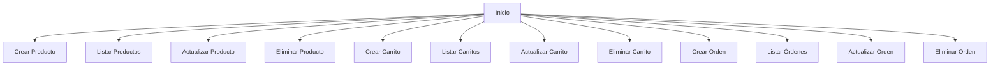

# Unidad: ViewSets y Routers para la API

## Introducción a la Unidad y Objetivos de Aprendizaje

En esta unidad, profundizaremos en el uso de ViewSets y Routers en Django REST framework (DRF) para construir una API REST eficiente y escalable para un sistema de carrito de compras. Los ViewSets y Routers son componentes esenciales que permiten simplificar y organizar el código de nuestras vistas y rutas de la API, respectivamente. Al final de esta unidad, los lectores serán capaces de:

1. Comprender la funcionalidad y ventajas de los ViewSets y Routers en DRF.
2. Implementar ViewSets para manejar operaciones CRUD de manera eficiente.
3. Configurar Routers para enrutar automáticamente las URLs de la API.
4. Aplicar mejores prácticas y consideraciones de diseño para optimizar el rendimiento y la mantenibilidad de la API.

## Documento Funcional de Requerimientos

### Descripción Detallada de la Funcionalidad

En esta sección, describiremos cómo los ViewSets y Routers se integran en el sistema de carrito de compras para manejar las operaciones CRUD (Crear, Leer, Actualizar, Eliminar) de los recursos principales, como productos, carritos y órdenes.

#### ViewSets

Un ViewSet es una clase que combina la lógica de múltiples vistas en una sola clase. En lugar de definir vistas individuales para cada operación (listar, crear, actualizar, eliminar), un ViewSet permite agrupar estas operaciones en una sola clase, lo que reduce la redundancia y mejora la organización del código.

#### Routers

Un Router es una clase que automáticamente enruta las URLs de la API a los métodos correspondientes de los ViewSets. Los Routers simplifican la configuración de las rutas y aseguran que las URLs de la API sigan un patrón coherente y predecible.

### Casos de Uso

1. **Gestión de Productos:**
   - **Crear Producto:** Permitir a los administradores agregar nuevos productos al catálogo.
   - **Listar Productos:** Permitir a los usuarios ver todos los productos disponibles.
   - **Actualizar Producto:** Permitir a los administradores modificar los detalles de un producto existente.
   - **Eliminar Producto:** Permitir a los administradores eliminar un producto del catálogo.

2. **Gestión de Carritos:**
   - **Crear Carrito:** Permitir a los usuarios crear un nuevo carrito de compras.
   - **Listar Carritos:** Permitir a los usuarios ver sus carritos de compras.
   - **Actualizar Carrito:** Permitir a los usuarios agregar o eliminar productos de su carrito.
   - **Eliminar Carrito:** Permitir a los usuarios eliminar un carrito de compras.

3. **Gestión de Órdenes:**
   - **Crear Orden:** Permitir a los usuarios realizar una compra y crear una nueva orden.
   - **Listar Órdenes:** Permitir a los usuarios ver sus órdenes pasadas.
   - **Actualizar Orden:** Permitir a los administradores actualizar el estado de una orden.
   - **Eliminar Orden:** Permitir a los administradores cancelar una orden.

### Diagramas de Flujo



### Requisitos No Funcionales

1. **Rendimiento:**
   - La API debe ser capaz de manejar múltiples solicitudes concurrentes sin degradar el rendimiento.
   - Las operaciones CRUD deben ser rápidas y eficientes.

2. **Seguridad:**
   - La API debe implementar autenticación y autorización para proteger los recursos.
   - Los datos sensibles deben ser manejados de manera segura.

3. **Escalabilidad:**
   - La arquitectura de la API debe permitir la fácil adición de nuevos recursos y funcionalidades.
   - La API debe ser capaz de escalar horizontalmente para manejar un aumento en la carga de trabajo.

4. **Mantenibilidad:**
   - El código debe ser modular y seguir las mejores prácticas de desarrollo para facilitar el mantenimiento y la evolución del sistema.
   - La documentación del código debe ser clara y completa.

## Implementación en Python

### Explicación Paso a Paso del Código

#### Instalación de Django REST framework

Antes de comenzar con la implementación, asegúrate de tener Django y Django REST framework instalados. Puedes instalarlos usando pip:

```bash
pip install django djangorestframework
```

#### Configuración Inicial

Primero, asegúrate de que `rest_framework` esté incluido en la lista de aplicaciones instaladas en tu archivo `settings.py`:

```python
INSTALLED_APPS = [
    ...
    'rest_framework',
    ...
]
```

#### Definición de Modelos

Para esta unidad, asumiremos que ya tienes definidos los modelos `Producto`, `Carrito` y `Orden`. Aquí hay un ejemplo simplificado:

```python
from django.db import models

class Producto(models.Model):
    nombre = models.CharField(max_length=100)
    descripcion = models.TextField()
    precio = models.DecimalField(max_digits=10, decimal_places=2)

class Carrito(models.Model):
    productos = models.ManyToManyField(Producto)
    total = models.DecimalField(max_digits=10, decimal_places=2, default=0.00)

class Orden(models.Model):
    carrito = models.OneToOneField(Carrito, on_delete=models.CASCADE)
    fecha = models.DateTimeField(auto_now_add=True)
    estado = models.CharField(max_length=20, choices=[('pendiente', 'Pendiente'), ('completada', 'Completada')])
```

#### Serializers

A continuación, definimos los serializers para estos modelos. Los serializers se encargan de convertir las instancias de los modelos a formatos JSON y viceversa.

```python
from rest_framework import serializers
from .models import Producto, Carrito, Orden

class ProductoSerializer(serializers.ModelSerializer):
    class Meta:
        model = Producto
        fields = '__all__'

class CarritoSerializer(serializers.ModelSerializer):
    class Meta:
        model = Carrito
        fields = '__all__'

class OrdenSerializer(serializers.ModelSerializer):
    class Meta:
        model = Orden
        fields = '__all__'
```

#### ViewSets

Ahora, definimos los ViewSets para manejar las operaciones CRUD de los modelos.

```python
from rest_framework import viewsets
from .models import Producto, Carrito, Orden
from .serializers import ProductoSerializer, CarritoSerializer, OrdenSerializer

class ProductoViewSet(viewsets.ModelViewSet):
    queryset = Producto.objects.all()
    serializer_class = ProductoSerializer

class CarritoViewSet(viewsets.ModelViewSet):
    queryset = Carrito.objects.all()
    serializer_class = CarritoSerializer

class OrdenViewSet(viewsets.ModelViewSet):
    queryset = Orden.objects.all()
    serializer_class = OrdenSerializer
```

#### Routers

Finalmente, configuramos los Routers para enrutar automáticamente las URLs de la API a los métodos correspondientes de los ViewSets.

```python
from rest_framework.routers import DefaultRouter
from django.urls import path, include
from .views import ProductoViewSet, CarritoViewSet, OrdenViewSet

router = DefaultRouter()
router.register(r'productos', ProductoViewSet)
router.register(r'carritos', CarritoViewSet)
router.register(r'ordenes', OrdenViewSet)

urlpatterns = [
    path('', include(router.urls)),
]
```

### Código Fuente Completo y Comentado

A continuación, se presenta el código fuente completo y comentado para la implementación de los ViewSets y Routers en la API.

#### models.py

```python
from django.db import models

class Producto(models.Model):
    nombre = models.CharField(max_length=100)
    descripcion = models.TextField()
    precio = models.DecimalField(max_digits=10, decimal_places=2)

    def __str__(self):
        return self.nombre

class Carrito(models.Model):
    productos = models.ManyToManyField(Producto)
    total = models.DecimalField(max_digits=10, decimal_places=2, default=0.00)

    def __str__(self):
        return f"Carrito {self.id}"

class Orden(models.Model):
    carrito = models.OneToOneField(Carrito, on_delete=models.CASCADE)
    fecha = models.DateTimeField(auto_now_add=True)
    estado = models.CharField(max_length=20, choices=[('pendiente', 'Pendiente'), ('completada', 'Completada')])

    def __str__(self):
        return f"Orden {self.id}"
```

#### serializers.py

```python
from rest_framework import serializers
from .models import Producto, Carrito, Orden

class ProductoSerializer(serializers.ModelSerializer):
    class Meta:
        model = Producto
        fields = '__all__'

class CarritoSerializer(serializers.ModelSerializer):
    class Meta:
        model = Carrito
        fields = '__all__'

class OrdenSerializer(serializers.ModelSerializer):
    class Meta:
        model = Orden
        fields = '__all__'
```

#### views.py

```python
from rest_framework import viewsets
from .models import Producto, Carrito, Orden
from .serializers import ProductoSerializer, CarritoSerializer, OrdenSerializer

class ProductoViewSet(viewsets.ModelViewSet):
    queryset = Producto.objects.all()
    serializer_class = ProductoSerializer

class CarritoViewSet(viewsets.ModelViewSet):
    queryset = Carrito.objects.all()
    serializer_class = CarritoSerializer

class OrdenViewSet(viewsets.ModelViewSet):
    queryset = Orden.objects.all()
    serializer_class = OrdenSerializer
```

#### urls.py

```python
from rest_framework.routers import DefaultRouter
from django.urls import path, include
from .views import ProductoViewSet, CarritoViewSet, OrdenViewSet

router = DefaultRouter()
router.register(r'productos', ProductoViewSet)
router.register(r'carritos', CarritoViewSet)
router.register(r'ordenes', OrdenViewSet)

urlpatterns = [
    path('', include(router.urls)),
]
```

### Ejemplos de Uso y Pruebas Unitarias

Para probar la funcionalidad de la API, puedes usar herramientas como Postman o cURL. A continuación, se presentan algunos ejemplos de uso y pruebas unitarias.

#### Ejemplo de Uso con cURL

1. **Crear Producto:**

```bash
curl -X POST http://localhost:8000/productos/ -H "Content-Type: application/json" -d '{"nombre": "Producto 1", "descripcion": "Descripción del Producto 1", "precio": 100.00}'
```

2. **Listar Productos:**

```bash
curl -X GET http://localhost:8000/productos/
```

3. **Actualizar Producto:**

```bash
curl -X PUT http://localhost:8000/productos/1/ -H "Content-Type: application/json" -d '{"nombre": "Producto 1 Actualizado", "descripcion": "Descripción actualizada", "precio": 150.00}'
```

4. **Eliminar Producto:**

```bash
curl -X DELETE http://localhost:8000/productos/1/
```

#### Pruebas Unitarias

Para asegurar que la API funciona correctamente, es importante escribir pruebas unitarias. Aquí hay un ejemplo de cómo hacerlo usando el framework de pruebas de Django.

```python
from django.test import TestCase
from rest_framework.test import APIClient
from rest_framework import status
from .models import Producto

class ProductoAPITestCase(TestCase):
    def setUp(self):
        self.client = APIClient()
        self.producto_data = {'nombre': 'Producto Test', 'descripcion': 'Descripción Test', 'precio': 50.00}
        self.producto = Producto.objects.create(**self.producto_data)

    def test_crear_producto(self):
        response = self.client.post('/productos/', self.producto_data, format='json')
        self.assertEqual(response.status_code, status.HTTP_201_CREATED)

    def test_listar_productos(self):
        response = self.client.get('/productos/')
        self.assertEqual(response.status_code, status.HTTP_200_OK)
        self.assertEqual(len(response.data), 1)

    def test_actualizar_producto(self):
        updated_data = {'nombre': 'Producto Actualizado', 'descripcion': 'Descripción Actualizada', 'precio': 60.00}
        response = self.client.put(f'/productos/{self.producto.id}/', updated_data, format='json')
        self.assertEqual(response.status_code, status.HTTP_200_OK)
        self.producto.refresh_from_db()
        self.assertEqual(self.producto.nombre, updated_data['nombre'])

    def test_eliminar_producto(self):
        response = self.client.delete(f'/productos/{self.producto.id}/')
        self.assertEqual(response.status_code, status.HTTP_204_NO_CONTENT)
        self.assertEqual(Producto.objects.count(), 0)
```

## Mejores Prácticas y Consideraciones de Diseño

1. **Modularidad:**
   - Mantén el código modular separando las definiciones de modelos, serializers, views y rutas en archivos separados. Esto facilita la mantenibilidad y escalabilidad del proyecto.

2. **Autenticación y Autorización:**
   - Implementa mecanismos de autenticación y autorización para proteger los recursos de la API. Django REST framework ofrece varios métodos de autenticación, como tokens y JWT.

3. **Validación de Datos:**
   - Asegúrate de que los serializers validen correctamente los datos de entrada para evitar errores y garantizar la integridad de los datos.

4. **Documentación:**
   - Documenta el código y la API utilizando herramientas como Swagger o la documentación automática de Django REST framework. Esto facilita la comprensión y el uso de la API por parte de otros desarrolladores.

5. **Pruebas:**
   - Escribe pruebas unitarias y de integración para asegurar que la API funcione correctamente y detectar posibles errores antes de que lleguen a producción.

6. **Optimización de Consultas:**
   - Utiliza técnicas de optimización de consultas, como `select_related` y `prefetch_related`, para reducir el número de consultas a la base de datos y mejorar el rendimiento de la API.

7. **Manejo de Errores:**
   - Implementa un manejo adecuado de errores para proporcionar respuestas claras y útiles a los clientes de la API en caso de fallos.

8. **Versionado de la API:**
   - Considera versionar la API para facilitar la introducción de cambios y nuevas funcionalidades sin romper la compatibilidad con versiones anteriores.

9. **Seguridad:**
   - Asegúrate de que la API esté protegida contra vulnerabilidades comunes, como inyecciones SQL, ataques CSRF y XSS. Utiliza las herramientas y configuraciones de seguridad proporcionadas por Django y Django REST framework.

10. **Escalabilidad:**
    - Diseña la API pensando en la escalabilidad. Utiliza técnicas como la paginación para manejar grandes volúmenes de datos y considera el uso de caché para mejorar el rendimiento.

Siguiendo estas mejores prácticas y consideraciones de diseño, podrás construir una API REST robusta, segura y eficiente para tu sistema de carrito de compras con Django y Django REST framework.