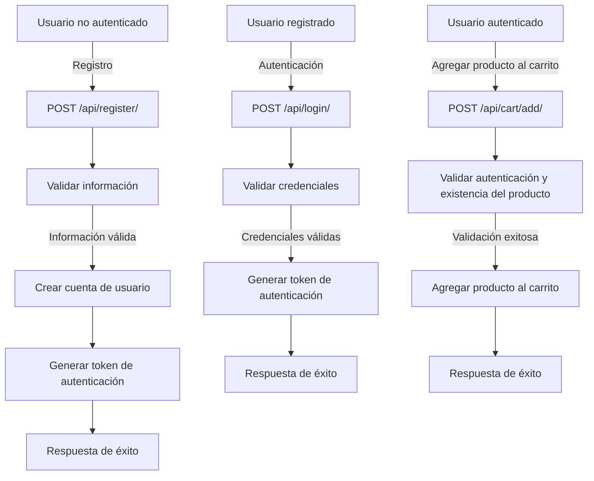

# Unidad: Autenticación y permisos en la API

## Introducción a la unidad y objetivos de aprendizaje

En esta unidad, profundizaremos en el tema de la autenticación y permisos en la API, específicamente en el contexto de un sistema de carrito de compras desarrollado con Django y Django REST framework (DRF). La autenticación y los permisos son componentes críticos para garantizar que solo los usuarios autorizados puedan acceder y manipular los recursos de la API. Al finalizar esta unidad, los lectores serán capaces de:

1. Comprender los conceptos fundamentales de autenticación y permisos en Django REST framework.
2. Implementar distintos métodos de autenticación, como token-based y session-based.
3. Configurar permisos personalizados para controlar el acceso a los endpoints de la API.
4. Integrar y probar la autenticación y los permisos en el sistema de carrito de compras.

## Documento funcional de requerimientos

### a. Descripción detallada de la funcionalidad

La autenticación y permisos en la API del sistema de carrito de compras deben garantizar que solo los usuarios autenticados puedan realizar ciertas acciones, como agregar productos al carrito, realizar compras, y gestionar sus perfiles. Los objetivos específicos incluyen:

- Implementar autenticación basada en tokens para la API.
- Configurar permisos para restringir el acceso a ciertos endpoints según el rol del usuario (por ejemplo, administrador, cliente).
- Proveer endpoints para el registro y autenticación de usuarios.
- Asegurar que las operaciones sensibles requieran autenticación y permisos adecuados.

### b. Casos de uso

#### Caso de uso 1: Registro de usuario

**Actor:** Usuario no autenticado

**Descripción:** Un usuario se registra en el sistema proporcionando su información básica (nombre, email, contraseña).

**Precondiciones:** Ninguna

**Flujo principal:**
1. El usuario envía una solicitud POST al endpoint `/api/register/` con su información.
2. El sistema valida la información y crea una nueva cuenta de usuario.
3. El sistema devuelve una respuesta de éxito con un token de autenticación.

**Postcondiciones:** El usuario está registrado y autenticado.

#### Caso de uso 2: Autenticación de usuario

**Actor:** Usuario registrado

**Descripción:** Un usuario registrado se autentica en el sistema proporcionando sus credenciales (email y contraseña).

**Precondiciones:** El usuario debe estar registrado.

**Flujo principal:**
1. El usuario envía una solicitud POST al endpoint `/api/login/` con sus credenciales.
2. El sistema valida las credenciales.
3. El sistema devuelve una respuesta de éxito con un token de autenticación.

**Postcondiciones:** El usuario está autenticado y recibe un token de autenticación.

#### Caso de uso 3: Agregar producto al carrito

**Actor:** Usuario autenticado

**Descripción:** Un usuario autenticado agrega un producto a su carrito de compras.

**Precondiciones:** El usuario debe estar autenticado y el producto debe existir.

**Flujo principal:**
1. El usuario envía una solicitud POST al endpoint `/api/cart/add/` con el ID del producto.
2. El sistema valida la autenticación del usuario y la existencia del producto.
3. El sistema agrega el producto al carrito del usuario.
4. El sistema devuelve una respuesta de éxito.

**Postcondiciones:** El producto está agregado al carrito del usuario.

### c. Diagramas de flujo (en mermaid)



### d. Requisitos no funcionales

- **Seguridad:** Los tokens de autenticación deben ser seguros y difíciles de adivinar. La API debe protegerse contra ataques comunes como inyección SQL, XSS y CSRF.
- **Rendimiento:** La autenticación y verificación de permisos deben ser eficientes para no afectar el rendimiento general de la API.
- **Escalabilidad:** El sistema debe ser capaz de manejar un gran número de solicitudes concurrentes sin degradar el rendimiento.
- **Usabilidad:** Los endpoints de autenticación y permisos deben ser fáciles de usar y bien documentados.

## Implementación en Python

### a. Explicación paso a paso del código

1. **Configuración del proyecto y aplicaciones necesarias:**
   - Asegúrate de tener Django y Django REST framework instalados.
   - Crea una nueva aplicación llamada `authentication` para manejar el registro y autenticación de usuarios.

2. **Modelos de usuario:**
   - Utiliza el modelo de usuario predeterminado de Django o extiéndelo según sea necesario.

3. **Serializers:**
   - Crea serializers para manejar la validación y serialización de datos de usuario.

4. **Views:**
   - Implementa vistas para los endpoints de registro y autenticación.

5. **URLs:**
   - Configura las rutas para los endpoints de autenticación.

6. **Permisos personalizados:**
   - Define permisos personalizados para controlar el acceso a los endpoints de la API.

### b. Código fuente completo y comentado

#### Configuración del proyecto

```python
# settings.py
INSTALLED_APPS = [
    ...
    'rest_framework',
    'rest_framework.authtoken',
    'authentication',
]

REST_FRAMEWORK = {
    'DEFAULT_AUTHENTICATION_CLASSES': [
        'rest_framework.authentication.TokenAuthentication',
    ],
    'DEFAULT_PERMISSION_CLASSES': [
        'rest_framework.permissions.IsAuthenticated',
    ],
}
```

#### Modelos de usuario

```python
# models.py (en la aplicación authentication)
from django.contrib.auth.models import AbstractUser

class CustomUser(AbstractUser):
    # Puedes agregar campos adicionales si es necesario
    pass
```

#### Serializers

```python
# serializers.py (en la aplicación authentication)
from rest_framework import serializers
from django.contrib.auth.models import User

class RegisterSerializer(serializers.ModelSerializer):
    class Meta:
        model = User
        fields = ('username', 'password', 'email')
        extra_kwargs = {'password': {'write_only': True}}

    def create(self, validated_data):
        user = User.objects.create_user(
            username=validated_data['username'],
            password=validated_data['password'],
            email=validated_data['email']
        )
        return user

class LoginSerializer(serializers.Serializer):
    username = serializers.CharField()
    password = serializers.CharField(write_only=True)
```

#### Views

```python
# views.py (en la aplicación authentication)
from rest_framework import generics, status
from rest_framework.response import Response
from rest_framework.authtoken.models import Token
from rest_framework.permissions import AllowAny
from django.contrib.auth.models import User
from django.contrib.auth import authenticate
from .serializers import RegisterSerializer, LoginSerializer

class RegisterView(generics.CreateAPIView):
    queryset = User.objects.all()
    serializer_class = RegisterSerializer
    permission_classes = [AllowAny]

    def create(self, request, *args, **kwargs):
        serializer = self.get_serializer(data=request.data)
        serializer.is_valid(raise_exception=True)
        user = serializer.save()
        token, created = Token.objects.get_or_create(user=user)
        return Response({
            'token': token.key,
            'user': serializer.data
        }, status=status.HTTP_201_CREATED)

class LoginView(generics.GenericAPIView):
    serializer_class = LoginSerializer
    permission_classes = [AllowAny]

    def post(self, request, *args, **kwargs):
        serializer = self.get_serializer(data=request.data)
        serializer.is_valid(raise_exception=True)
        user = authenticate(
            username=serializer.validated_data['username'],
            password=serializer.validated_data['password']
        )
        if user is not None:
            token, created = Token.objects.get_or_create(user=user)
            return Response({
                'token': token.key,
                'user': {
                    'username': user.username,
                    'email': user.email
                }
            }, status=status.HTTP_200_OK)
        return Response({'error': 'Invalid credentials'}, status=status.HTTP_400_BAD_REQUEST)
```

#### URLs

```python
# urls.py (en la aplicación authentication)
from django.urls import path
from .views import RegisterView, LoginView

urlpatterns = [
    path('register/', RegisterView.as_view(), name='register'),
    path('login/', LoginView.as_view(), name='login'),
]
```

#### Permisos personalizados

```python
# permissions.py (en la aplicación principal)
from rest_framework.permissions import BasePermission

class IsAdminOrReadOnly(BasePermission):
    def has_permission(self, request, view):
        if request.method in ['GET', 'HEAD', 'OPTIONS']:
            return True
        return request.user and request.user.is_staff
```

### c. Ejemplos de uso y pruebas unitarias

#### Ejemplo de uso: Registro de usuario

```bash
curl -X POST http://127.0.0.1:8000/api/register/ \
-H "Content-Type: application/json" \
-d '{"username": "newuser", "password": "password123", "email": "newuser@example.com"}'
```

#### Ejemplo de uso: Autenticación de usuario

```bash
curl -X POST http://127.0.0.1:8000/api/login/ \
-H "Content-Type: application/json" \
-d '{"username": "newuser", "password": "password123"}'
```

#### Pruebas unitarias

```python
# tests.py (en la aplicación authentication)
from rest_framework.test import APITestCase
from django.contrib.auth.models import User
from rest_framework.authtoken.models import Token

class AuthenticationTests(APITestCase):
    def test_register_user(self):
        data = {
            'username': 'testuser',
            'password': 'testpassword',
            'email': 'testuser@example.com'
        }
        response = self.client.post('/api/register/', data)
        self.assertEqual(response.status_code, 201)
        self.assertIn('token', response.data)

    def test_login_user(self):
        user = User.objects.create_user(username='testuser', password='testpassword')
        data = {
            'username': 'testuser',
            'password': 'testpassword'
        }
        response = self.client.post('/api/login/', data)
        self.assertEqual(response.status_code, 200)
        self.assertIn('token', response.data)
```

### d. Mejores prácticas y consideraciones de diseño

1. **Seguridad:** Asegúrate de utilizar HTTPS para todas las comunicaciones con la API para proteger los tokens de autenticación. Implementa medidas adicionales como la rotación de tokens y la invalidación de tokens comprometidos.

2. **Manejo de errores:** Proporciona mensajes de error claros y útiles para los usuarios. Maneja adecuadamente las excepciones y errores comunes, como credenciales inválidas o usuarios no encontrados.

3. **Escalabilidad:** Considera el uso de soluciones de caché y balanceo de carga para manejar un gran número de solicitudes concurrentes. Utiliza bases de datos distribuidas si es necesario.

4. **Pruebas:** Implementa pruebas unitarias y de integración para asegurar que la autenticación y los permisos funcionen correctamente. Utiliza herramientas de prueba automatizadas para mantener la calidad del código.

5. **Documentación:** Proporciona documentación clara y detallada para los endpoints de autenticación y permisos. Utiliza herramientas como Swagger o Postman para generar y mantener la documentación de la API.

6. **Permisos granulares:** Define permisos granulares para controlar el acceso a los recursos de la API de manera más precisa. Considera el uso de roles y grupos de usuarios para simplificar la gestión de permisos.

7. **Auditoría y monitoreo:** Implementa mecanismos de auditoría y monitoreo para rastrear el uso de la API y detectar posibles intentos de acceso no autorizado. Utiliza herramientas de monitoreo como Prometheus y Grafana para obtener información en tiempo real sobre el rendimiento y la seguridad de la API.

En resumen, la autenticación y los permisos son componentes esenciales para cualquier API segura y robusta. Siguiendo las mejores prácticas y consideraciones de diseño, puedes asegurar que tu sistema de carrito de compras con Django REST framework sea seguro, escalable y fácil de usar.