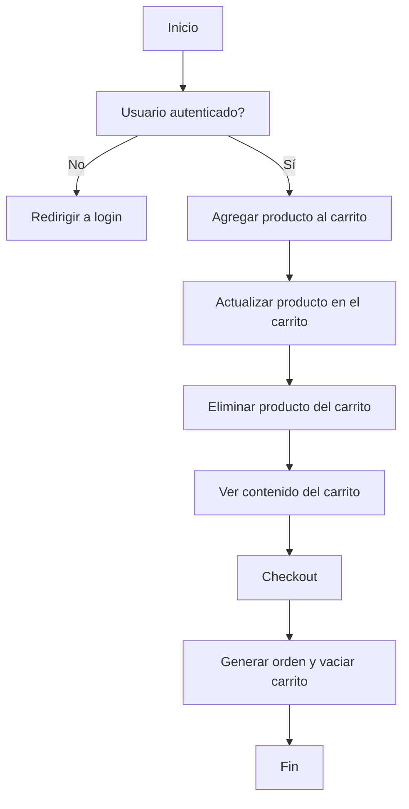

# Unidad: Endpoints para gestión de carrito y checkout

## Introducción a la unidad y objetivos de aprendizaje

En esta unidad, abordaremos la implementación de endpoints para la gestión de carritos de compras y el proceso de checkout en una API REST utilizando Django REST Framework (DRF). Este capítulo es fundamental para completar la funcionalidad de un sistema de carrito de compras, permitiendo a los usuarios agregar, actualizar y eliminar productos en su carrito, así como proceder al pago y finalizar la compra.

### Objetivos de aprendizaje

1. Comprender la estructura y funcionalidad de los endpoints para la gestión de carritos de compras.
2. Implementar endpoints para agregar, actualizar y eliminar productos del carrito.
3. Desarrollar el proceso de checkout, incluyendo la creación de órdenes y el manejo de pagos.
4. Aplicar mejores prácticas y consideraciones de diseño en la implementación de estos endpoints.
5. Realizar pruebas unitarias para asegurar la correcta funcionalidad de los endpoints.

## Documento funcional de requerimientos

### Descripción detallada de la funcionalidad

La gestión de carritos de compras y el proceso de checkout son componentes esenciales en cualquier sistema de comercio electrónico. La funcionalidad principal incluye:

- **Agregar productos al carrito:** Permitir a los usuarios agregar productos a su carrito de compras.
- **Actualizar productos en el carrito:** Permitir a los usuarios modificar la cantidad de productos en su carrito.
- **Eliminar productos del carrito:** Permitir a los usuarios eliminar productos de su carrito.
- **Ver el contenido del carrito:** Permitir a los usuarios ver los productos que han agregado a su carrito.
- **Checkout:** Permitir a los usuarios proceder al pago y finalizar la compra, generando una orden.

### Casos de uso

1. **Agregar producto al carrito:**
   - **Actor:** Usuario autenticado.
   - **Descripción:** El usuario selecciona un producto y lo agrega a su carrito de compras.
   - **Precondiciones:** El usuario debe estar autenticado.
   - **Postcondiciones:** El producto se agrega al carrito del usuario.

2. **Actualizar producto en el carrito:**
   - **Actor:** Usuario autenticado.
   - **Descripción:** El usuario modifica la cantidad de un producto en su carrito.
   - **Precondiciones:** El usuario debe estar autenticado y el producto debe estar en el carrito.
   - **Postcondiciones:** La cantidad del producto en el carrito se actualiza.

3. **Eliminar producto del carrito:**
   - **Actor:** Usuario autenticado.
   - **Descripción:** El usuario elimina un producto de su carrito.
   - **Precondiciones:** El usuario debe estar autenticado y el producto debe estar en el carrito.
   - **Postcondiciones:** El producto se elimina del carrito del usuario.

4. **Ver contenido del carrito:**
   - **Actor:** Usuario autenticado.
   - **Descripción:** El usuario visualiza los productos en su carrito.
   - **Precondiciones:** El usuario debe estar autenticado.
   - **Postcondiciones:** Se muestra el contenido del carrito.

5. **Checkout:**
   - **Actor:** Usuario autenticado.
   - **Descripción:** El usuario procede al pago y finaliza la compra.
   - **Precondiciones:** El usuario debe estar autenticado y tener productos en su carrito.
   - **Postcondiciones:** Se genera una orden y se vacía el carrito del usuario.

### Diagramas de flujo



### Requisitos no funcionales

1. **Seguridad:** Los endpoints deben estar protegidos mediante autenticación y permisos adecuados para asegurar que solo los usuarios autenticados puedan acceder y modificar su propio carrito.
2. **Rendimiento:** La API debe ser capaz de manejar múltiples solicitudes concurrentes sin degradar el rendimiento.
3. **Escalabilidad:** La arquitectura debe permitir la fácil escalabilidad para manejar un aumento en el número de usuarios y transacciones.
4. **Mantenibilidad:** El código debe ser claro y bien documentado para facilitar futuras modificaciones y mantenimiento.
5. **Pruebas:** Se deben implementar pruebas unitarias y de integración para asegurar la correcta funcionalidad de los endpoints.

## Implementación en Python

### Explicación paso a paso del código

Para implementar los endpoints de gestión de carritos y checkout, utilizaremos Django REST Framework. A continuación, se describe cada paso de la implementación.

#### 1. Crear modelos para Carrito y Orden

Primero, definimos los modelos `Cart` y `Order` en `models.py`.

```python
from django.db import models
from django.contrib.auth.models import User
from shop.models import Product

class Cart(models.Model):
    user = models.OneToOneField(User, on_delete=models.CASCADE)
    created_at = models.DateTimeField(auto_now_add=True)
    updated_at = models.DateTimeField(auto_now=True)

class CartItem(models.Model):
    cart = models.ForeignKey(Cart, related_name='items', on_delete=models.CASCADE)
    product = models.ForeignKey(Product, on_delete=models.CASCADE)
    quantity = models.PositiveIntegerField(default=1)

class Order(models.Model):
    user = models.ForeignKey(User, on_delete=models.CASCADE)
    total = models.DecimalField(max_digits=10, decimal_places=2)
    created_at = models.DateTimeField(auto_now_add=True)
    updated_at = models.DateTimeField(auto_now=True)
```

#### 2. Crear Serializers

Definimos los serializers para los modelos `Cart`, `CartItem` y `Order` en `serializers.py`.

```python
from rest_framework import serializers
from .models import Cart, CartItem, Order

class CartItemSerializer(serializers.ModelSerializer):
    class Meta:
        model = CartItem
        fields = ['id', 'product', 'quantity']

class CartSerializer(serializers.ModelSerializer):
    items = CartItemSerializer(many=True, read_only=True)

    class Meta:
        model = Cart
        fields = ['id', 'user', 'items', 'created_at', 'updated_at']

class OrderSerializer(serializers.ModelSerializer):
    class Meta:
        model = Order
        fields = ['id', 'user', 'total', 'created_at', 'updated_at']
```

#### 3. Crear ViewSets

Implementamos los ViewSets para manejar las operaciones CRUD en `views.py`.

```python
from rest_framework import viewsets, status
from rest_framework.response import Response
from rest_framework.permissions import IsAuthenticated
from .models import Cart, CartItem, Order
from .serializers import CartSerializer, CartItemSerializer, OrderSerializer

class CartViewSet(viewsets.ModelViewSet):
    serializer_class = CartSerializer
    permission_classes = [IsAuthenticated]

    def get_queryset(self):
        return Cart.objects.filter(user=self.request.user)

    def create(self, request, *args, **kwargs):
        cart, created = Cart.objects.get_or_create(user=request.user)
        return Response(CartSerializer(cart).data)

class CartItemViewSet(viewsets.ModelViewSet):
    serializer_class = CartItemSerializer
    permission_classes = [IsAuthenticated]

    def get_queryset(self):
        return CartItem.objects.filter(cart__user=self.request.user)

    def create(self, request, *args, **kwargs):
        cart = Cart.objects.get(user=request.user)
        product = request.data.get('product')
        quantity = request.data.get('quantity', 1)
        cart_item, created = CartItem.objects.get_or_create(cart=cart, product_id=product, defaults={'quantity': quantity})
        if not created:
            cart_item.quantity += int(quantity)
            cart_item.save()
        return Response(CartItemSerializer(cart_item).data)

    def update(self, request, *args, **kwargs):
        cart_item = self.get_object()
        cart_item.quantity = request.data.get('quantity', cart_item.quantity)
        cart_item.save()
        return Response(CartItemSerializer(cart_item).data)

    def destroy(self, request, *args, **kwargs):
        cart_item = self.get_object()
        cart_item.delete()
        return Response(status=status.HTTP_204_NO_CONTENT)

class OrderViewSet(viewsets.ModelViewSet):
    serializer_class = OrderSerializer
    permission_classes = [IsAuthenticated]

    def get_queryset(self):
        return Order.objects.filter(user=self.request.user)

    def create(self, request, *args, **kwargs):
        cart = Cart.objects.get(user=request.user)
        total = sum(item.product.price * item.quantity for item in cart.items.all())
        order = Order.objects.create(user=request.user, total=total)
        cart.items.all().delete()
        return Response(OrderSerializer(order).data)
```

#### 4. Configurar URLs

Configuramos las URLs para los ViewSets en `urls.py`.

```python
from django.urls import path, include
from rest_framework.routers import DefaultRouter
from .views import CartViewSet, CartItemViewSet, OrderViewSet

router = DefaultRouter()
router.register(r'cart', CartViewSet, basename='cart')
router.register(r'cart-items', CartItemViewSet, basename='cartitem')
router.register(r'orders', OrderViewSet, basename='order')

urlpatterns = [
    path('', include(router.urls)),
]
```

### Código fuente completo y comentado

A continuación, se presenta el código fuente completo y comentado para la implementación de los endpoints de gestión de carritos y checkout.

```python
# models.py
from django.db import models
from django.contrib.auth.models import User
from shop.models import Product

class Cart(models.Model):
    user = models.OneToOneField(User, on_delete=models.CASCADE)
    created_at = models.DateTimeField(auto_now_add=True)
    updated_at = models.DateTimeField(auto_now=True)

class CartItem(models.Model):
    cart = models.ForeignKey(Cart, related_name='items', on_delete=models.CASCADE)
    product = models.ForeignKey(Product, on_delete=models.CASCADE)
    quantity = models.PositiveIntegerField(default=1)

class Order(models.Model):
    user = models.ForeignKey(User, on_delete=models.CASCADE)
    total = models.DecimalField(max_digits=10, decimal_places=2)
    created_at = models.DateTimeField(auto_now_add=True)
    updated_at = models.DateTimeField(auto_now=True)

# serializers.py
from rest_framework import serializers
from .models import Cart, CartItem, Order

class CartItemSerializer(serializers.ModelSerializer):
    class Meta:
        model = CartItem
        fields = ['id', 'product', 'quantity']

class CartSerializer(serializers.ModelSerializer):
    items = CartItemSerializer(many=True, read_only=True)

    class Meta:
        model = Cart
        fields = ['id', 'user', 'items', 'created_at', 'updated_at']

class OrderSerializer(serializers.ModelSerializer):
    class Meta:
        model = Order
        fields = ['id', 'user', 'total', 'created_at', 'updated_at']

# views.py
from rest_framework import viewsets, status
from rest_framework.response import Response
from rest_framework.permissions import IsAuthenticated
from .models import Cart, CartItem, Order
from .serializers import CartSerializer, CartItemSerializer, OrderSerializer

class CartViewSet(viewsets.ModelViewSet):
    serializer_class = CartSerializer
    permission_classes = [IsAuthenticated]

    def get_queryset(self):
        return Cart.objects.filter(user=self.request.user)

    def create(self, request, *args, **kwargs):
        cart, created = Cart.objects.get_or_create(user=request.user)
        return Response(CartSerializer(cart).data)

class CartItemViewSet(viewsets.ModelViewSet):
    serializer_class = CartItemSerializer
    permission_classes = [IsAuthenticated]

    def get_queryset(self):
        return CartItem.objects.filter(cart__user=self.request.user)

    def create(self, request, *args, **kwargs):
        cart = Cart.objects.get(user=request.user)
        product = request.data.get('product')
        quantity = request.data.get('quantity', 1)
        cart_item, created = CartItem.objects.get_or_create(cart=cart, product_id=product, defaults={'quantity': quantity})
        if not created:
            cart_item.quantity += int(quantity)
            cart_item.save()
        return Response(CartItemSerializer(cart_item).data)

    def update(self, request, *args, **kwargs):
        cart_item = self.get_object()
        cart_item.quantity = request.data.get('quantity', cart_item.quantity)
        cart_item.save()
        return Response(CartItemSerializer(cart_item).data)

    def destroy(self, request, *args, **kwargs):
        cart_item = self.get_object()
        cart_item.delete()
        return Response(status=status.HTTP_204_NO_CONTENT)

class OrderViewSet(viewsets.ModelViewSet):
    serializer_class = OrderSerializer
    permission_classes = [IsAuthenticated]

    def get_queryset(self):
        return Order.objects.filter(user=self.request.user)

    def create(self, request, *args, **kwargs):
        cart = Cart.objects.get(user=request.user)
        total = sum(item.product.price * item.quantity for item in cart.items.all())
        order = Order.objects.create(user=request.user, total=total)
        cart.items.all().delete()
        return Response(OrderSerializer(order).data)

# urls.py
from django.urls import path, include
from rest_framework.routers import DefaultRouter
from .views import CartViewSet, CartItemViewSet, OrderViewSet

router = DefaultRouter()
router.register(r'cart', CartViewSet, basename='cart')
router.register(r'cart-items', CartItemViewSet, basename='cartitem')
router.register(r'orders', OrderViewSet, basename='order')

urlpatterns = [
    path('', include(router.urls)),
]
```

### Ejemplos de uso y pruebas unitarias

#### Ejemplos de uso

1. **Agregar producto al carrito:**

```bash
POST /cart-items/
{
    "product": 1,
    "quantity": 2
}
```

2. **Actualizar producto en el carrito:**

```bash
PUT /cart-items/1/
{
    "quantity": 3
}
```

3. **Eliminar producto del carrito:**

```bash
DELETE /cart-items/1/
```

4. **Ver contenido del carrito:**

```bash
GET /cart/
```

5. **Checkout:**

```bash
POST /orders/
```

#### Pruebas unitarias

A continuación, se presentan algunas pruebas unitarias para los endpoints implementados.

```python
from django.urls import reverse
from rest_framework import status
from rest_framework.test import APITestCase
from django.contrib.auth.models import User
from shop.models import Product
from .models import Cart, CartItem, Order

class CartTests(APITestCase):
    def setUp(self):
        self.user = User.objects.create_user(username='testuser', password='testpass')
        self.product = Product.objects.create(name='Test Product', price=100.00)
        self.client.login(username='testuser', password='testpass')

    def test_add_product_to_cart(self):
        url = reverse('cartitem-list')
        data = {'product': self.product.id, 'quantity': 2}
        response = self.client.post(url, data, format='json')
        self.assertEqual(response.status_code, status.HTTP_201_CREATED)
        self.assertEqual(CartItem.objects.count(), 1)
        self.assertEqual(CartItem.objects.get().quantity, 2)

    def test_update_product_in_cart(self):
        cart = Cart.objects.create(user=self.user)
        cart_item = CartItem.objects.create(cart=cart, product=self.product, quantity=2)
        url = reverse('cartitem-detail', args=[cart_item.id])
        data = {'quantity': 3}
        response = self.client.put(url, data, format='json')
        self.assertEqual(response.status_code, status.HTTP_200_OK)
        self.assertEqual(CartItem.objects.get().quantity, 3)

    def test_delete_product_from_cart(self):
        cart = Cart.objects.create(user=self.user)
        cart_item = CartItem.objects.create(cart=cart, product=self.product, quantity=2)
        url = reverse('cartitem-detail', args=[cart_item.id])
        response = self.client.delete(url)
        self.assertEqual(response.status_code, status.HTTP_204_NO_CONTENT)
        self.assertEqual(CartItem.objects.count(), 0)

    def test_checkout(self):
        cart = Cart.objects.create(user=self.user)
        CartItem.objects.create(cart=cart, product=self.product, quantity=2)
        url = reverse('order-list')
        response = self.client.post(url, format='json')
        self.assertEqual(response.status_code, status.HTTP_201_CREATED)
        self.assertEqual(Order.objects.count(), 1)
        self.assertEqual(CartItem.objects.count(), 0)

```

## Mejores prácticas y consideraciones de diseño

### Seguridad

1. **Autenticación y permisos:** Asegurarse de que solo los usuarios autenticados puedan acceder y modificar su propio carrito.
2. **Validación de datos:** Validar los datos de entrada para evitar inyecciones de código y otros ataques.

### Rendimiento

1. **Consultas eficientes:** Utilizar consultas eficientes para evitar sobrecargar la base de datos.
2. **Caché:** Implementar caché para mejorar el rendimiento de la API.

### Escalabilidad

1. **Microservicios:** Considerar la arquitectura de microservicios para permitir la escalabilidad horizontal.
2. **Balanceo de carga:** Implementar balanceo de carga para distribuir las solicitudes entre múltiples servidores.

### Mantenibilidad

1. **Código limpio y documentado:** Escribir código claro y bien documentado para facilitar el mantenimiento.
2. **Pruebas:** Implementar pruebas unitarias y de integración para asegurar la correcta funcionalidad de la API.

### Depuración y solución de problemas comunes

1. **Logs:** Implementar logging para facilitar la depuración y el monitoreo de la API.
2. **Manejo de errores:** Manejar adecuadamente los errores y proporcionar mensajes de error claros y útiles.

En resumen, la implementación de endpoints para la gestión de carritos y checkout en una API REST con Django REST Framework es un proceso que requiere atención a la seguridad, rendimiento, escalabilidad y mantenibilidad. Siguiendo las mejores prácticas y realizando pruebas exhaustivas, se puede asegurar una funcionalidad robusta y eficiente para los usuarios.