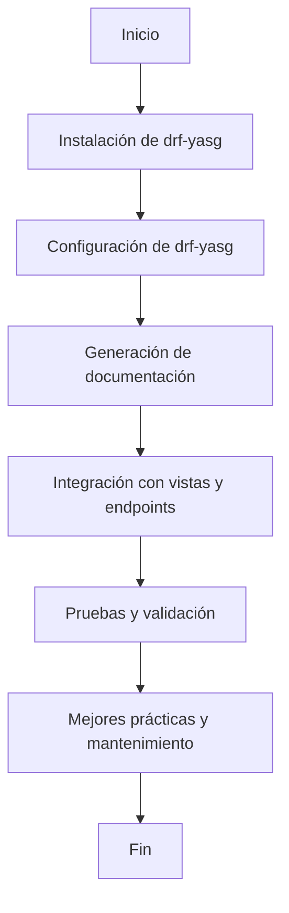

# Unidad: Documentación de la API con drf-yasg

## Introducción a la unidad y objetivos de aprendizaje

En esta unidad, nos enfocaremos en la documentación de la API utilizando `drf-yasg`, una herramienta poderosa y flexible para generar documentación de API en Django REST Framework (DRF). La documentación de API es crucial para el desarrollo y mantenimiento de aplicaciones, ya que facilita la comprensión y el uso de la API tanto para desarrolladores internos como externos. Al finalizar esta unidad, los lectores serán capaces de:

1. Comprender la importancia de la documentación de API.
2. Instalar y configurar `drf-yasg` en un proyecto Django.
3. Generar documentación interactiva y personalizable para la API.
4. Integrar la documentación con las vistas y endpoints existentes.
5. Aplicar mejores prácticas para mantener la documentación actualizada y precisa.

## Documento funcional de requerimientos

### a. Descripción detallada de la funcionalidad

La funcionalidad principal de esta unidad es la generación automática de documentación para la API REST utilizando `drf-yasg`. Esta herramienta permite crear una interfaz interactiva basada en Swagger/OpenAPI que facilita la exploración y prueba de los endpoints disponibles en la API. La documentación generada debe ser clara, precisa y reflejar fielmente los endpoints, métodos HTTP, parámetros y respuestas de la API.

### b. Casos de uso

1. **Desarrollador interno**: Un desarrollador que trabaja en el proyecto necesita entender cómo interactuar con la API para implementar nuevas funcionalidades o corregir errores.
2. **Desarrollador externo**: Un desarrollador externo que desea integrar su aplicación con la API necesita una referencia completa y precisa de los endpoints disponibles.
3. **Tester**: Un tester necesita explorar y probar los diferentes endpoints de la API para asegurar su correcto funcionamiento.
4. **Cliente**: Un cliente que utiliza la API para sus propias aplicaciones necesita comprender cómo realizar solicitudes y qué respuestas esperar.

### c. Diagramas de flujo (en mermaid)



### d. Requisitos no funcionales

1. **Rendimiento**: La generación de la documentación no debe afectar significativamente el rendimiento de la API.
2. **Escalabilidad**: La solución debe ser capaz de manejar un aumento en la cantidad de endpoints y usuarios sin degradar la calidad de la documentación.
3. **Seguridad**: La documentación debe estar protegida y accesible solo para usuarios autorizados.
4. **Usabilidad**: La interfaz de la documentación debe ser intuitiva y fácil de navegar.
5. **Mantenibilidad**: La configuración y el código relacionado con la documentación deben ser fáciles de mantener y actualizar.

## Implementación en Python

### a. Explicación paso a paso del código

#### Paso 1: Instalación de `drf-yasg`

Primero, necesitamos instalar la librería `drf-yasg`. Esto se puede hacer utilizando `pip`:

```bash
pip install drf-yasg
```

#### Paso 2: Configuración de `drf-yasg`

Una vez instalada la librería, debemos configurarla en nuestro proyecto Django. Para ello, editamos el archivo `settings.py` para incluir `drf_yasg` en la lista de aplicaciones instaladas:

```python
# settings.py

INSTALLED_APPS = [
    ...
    'rest_framework',
    'drf_yasg',
    ...
]
```

#### Paso 3: Generación de la documentación

A continuación, configuramos las rutas para la documentación en el archivo `urls.py`:

```python
# urls.py

from django.urls import path, re_path
from rest_framework import permissions
from drf_yasg.views import get_schema_view
from drf_yasg import openapi

schema_view = get_schema_view(
    openapi.Info(
        title="API de Carrito de Compras",
        default_version='v1',
        description="Documentación de la API para el sistema de carrito de compras",
        terms_of_service="https://www.google.com/policies/terms/",
        contact=openapi.Contact(email="contacto@carritocompras.local"),
        license=openapi.License(name="BSD License"),
    ),
    public=True,
    permission_classes=(permissions.AllowAny,),
)

urlpatterns = [
    ...
    re_path(r'^swagger(?P<format>\.json|\.yaml)$', schema_view.without_ui(cache_timeout=0), name='schema-json'),
    path('swagger/', schema_view.with_ui('swagger', cache_timeout=0), name='schema-swagger-ui'),
    path('redoc/', schema_view.with_ui('redoc', cache_timeout=0), name='schema-redoc'),
    ...
]
```

#### Paso 4: Integración con vistas y endpoints

`drf-yasg` automáticamente genera la documentación basada en las vistas y serializers definidos en el proyecto. Asegúrate de que tus vistas y serializers estén correctamente configurados y documentados.

#### Paso 5: Pruebas y validación

Una vez configurada la documentación, accede a las URLs `/swagger/` y `/redoc/` en tu navegador para verificar que la documentación se genera correctamente y es precisa.

### b. Código fuente completo y comentado

```python
# settings.py

INSTALLED_APPS = [
    ...
    'rest_framework',
    'drf_yasg',
    ...
]

# urls.py

from django.urls import path, re_path
from rest_framework import permissions
from drf_yasg.views import get_schema_view
from drf_yasg import openapi

# Configuración de la vista del esquema
schema_view = get_schema_view(
    openapi.Info(
        title="API de Carrito de Compras",
        default_version='v1',
        description="Documentación de la API para el sistema de carrito de compras",
        terms_of_service="https://www.google.com/policies/terms/",
        contact=openapi.Contact(email="contacto@carritocompras.local"),
        license=openapi.License(name="BSD License"),
    ),
    public=True,
    permission_classes=(permissions.AllowAny,),
)

# Definición de las rutas para la documentación
urlpatterns = [
    ...
    re_path(r'^swagger(?P<format>\.json|\.yaml)$', schema_view.without_ui(cache_timeout=0), name='schema-json'),
    path('swagger/', schema_view.with_ui('swagger', cache_timeout=0), name='schema-swagger-ui'),
    path('redoc/', schema_view.with_ui('redoc', cache_timeout=0), name='schema-redoc'),
    ...
]
```

### c. Ejemplos de uso y pruebas unitarias

#### Ejemplo de uso

Para acceder a la documentación de la API, abre tu navegador y navega a las siguientes URLs:

- Swagger UI: `http://localhost:8000/swagger/`
- Redoc: `http://localhost:8000/redoc/`

#### Pruebas unitarias

Podemos crear pruebas unitarias para asegurarnos de que las rutas de la documentación están funcionando correctamente.

```python
# tests.py

from django.test import TestCase
from django.urls import reverse

class DocumentationTests(TestCase):
    def test_swagger_ui(self):
        response = self.client.get(reverse('schema-swagger-ui'))
        self.assertEqual(response.status_code, 200)

    def test_redoc_ui(self):
        response = self.client.get(reverse('schema-redoc'))
        self.assertEqual(response.status_code, 200)
```

## Mejores prácticas y consideraciones de diseño

1. **Mantener la documentación actualizada**: Cada vez que se agreguen o modifiquen endpoints, asegúrate de que la documentación refleje estos cambios.
2. **Documentar parámetros y respuestas**: Proporciona descripciones claras y detalladas para los parámetros de entrada y las respuestas de cada endpoint.
3. **Seguridad**: Protege la documentación de la API para que solo usuarios autorizados puedan acceder a ella, especialmente en entornos de producción.
4. **Usabilidad**: Utiliza descripciones y ejemplos claros para facilitar la comprensión y el uso de la API.
5. **Automatización**: Considera la integración de la generación de documentación en el pipeline de CI/CD para asegurar que siempre esté actualizada.

### Consideraciones adicionales

- **Rendimiento**: La generación de la documentación no debe afectar el rendimiento de la API en producción. Considera el uso de caché para mejorar el rendimiento.
- **Escalabilidad**: A medida que la API crece, asegúrate de que la documentación siga siendo manejable y fácil de navegar.
- **Depuración**: Utiliza herramientas de depuración para identificar y solucionar problemas en la generación de la documentación.

Con estas prácticas y consideraciones, podrás mantener una documentación de API clara, precisa y útil, facilitando el trabajo de desarrolladores, testers y clientes que interactúan con tu sistema de carrito de compras.