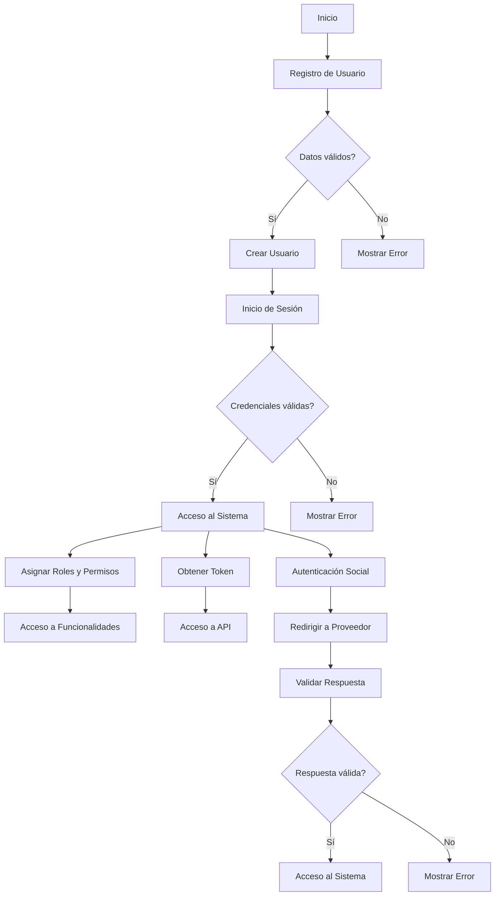

# Unidad: Implementación de registro y login de usuarios

## Introducción a la unidad y objetivos de aprendizaje

En esta unidad, profundizaremos en la implementación de un sistema de autenticación y autorización para un sistema de carrito de compras utilizando Django. Aunque ya hemos cubierto los temas de registro y login de usuarios, en esta sección nos enfocaremos en aspectos más avanzados y específicos de la autenticación y autorización. Los objetivos de aprendizaje incluyen:

1. Comprender la importancia de la autenticación y autorización en aplicaciones web.
2. Implementar un sistema de roles y permisos para usuarios.
3. Configurar autenticación basada en tokens para APIs.
4. Integrar autenticación social (Google, Facebook).
5. Aplicar mejores prácticas de seguridad en la autenticación y autorización.

## Documento funcional de requerimientos

### Descripción detallada de la funcionalidad

El sistema de autenticación y autorización debe permitir a los usuarios registrarse, iniciar sesión, y acceder a diferentes funcionalidades del sistema de carrito de compras según sus roles y permisos. Además, debe soportar autenticación mediante tokens para APIs y permitir el inicio de sesión a través de proveedores de autenticación social como Google y Facebook.

### Casos de uso

1. **Registro de usuario**: Un nuevo usuario se registra proporcionando su correo electrónico, nombre de usuario y contraseña.
2. **Inicio de sesión**: Un usuario registrado inicia sesión proporcionando su nombre de usuario y contraseña.
3. **Roles y permisos**: Los usuarios tienen roles (administrador, cliente) que determinan su acceso a diferentes funcionalidades.
4. **Autenticación basada en tokens**: Usuarios autenticados pueden obtener un token para acceder a la API.
5. **Autenticación social**: Usuarios pueden iniciar sesión utilizando sus cuentas de Google o Facebook.

### Diagramas de flujo (en mermaid)



### Requisitos no funcionales

1. **Seguridad**: Las contraseñas deben almacenarse de manera segura utilizando hashing. Las comunicaciones deben estar cifradas mediante HTTPS.
2. **Escalabilidad**: El sistema debe ser capaz de manejar un gran número de usuarios y solicitudes simultáneas.
3. **Rendimiento**: Las operaciones de autenticación deben ser rápidas y eficientes.
4. **Usabilidad**: La interfaz de usuario debe ser intuitiva y fácil de usar.
5. **Compatibilidad**: El sistema debe ser compatible con diferentes navegadores y dispositivos.

## Implementación en Python

### Explicación paso a paso del código

En esta sección, implementaremos las funcionalidades descritas utilizando Django. Comenzaremos configurando el sistema de roles y permisos, luego implementaremos la autenticación basada en tokens y finalmente la autenticación social.

#### Configuración de roles y permisos

1. **Crear modelo de roles**: Definimos un modelo `Role` para almacenar los diferentes roles de usuario.

```python
from django.db import models
from django.contrib.auth.models import User

class Role(models.Model):
    name = models.CharField(max_length=50)
    users = models.ManyToManyField(User, related_name='roles')

    def __str__(self):
        return self.name
```

2. **Asignar roles a usuarios**: Creamos una vista para asignar roles a los usuarios.

```python
from django.shortcuts import render, get_object_or_404
from django.contrib.auth.models import User
from .models import Role

def assign_role(request, user_id, role_name):
    user = get_object_or_404(User, id=user_id)
    role = get_object_or_404(Role, name=role_name)
    user.roles.add(role)
    return render(request, 'assign_role.html', {'user': user, 'role': role})
```

3. **Configurar permisos**: Definimos permisos específicos para cada rol.

```python
from django.contrib.auth.decorators import user_passes_test

def role_required(role_name):
    def decorator(view_func):
        def _wrapped_view(request, *args, **kwargs):
            if request.user.roles.filter(name=role_name).exists():
                return view_func(request, *args, **kwargs)
            else:
                return render(request, 'access_denied.html')
        return _wrapped_view
    return decorator
```

#### Autenticación basada en tokens

1. **Instalar Django REST framework**: Instalamos el paquete necesario.

```bash
pip install djangorestframework
pip install djangorestframework-simplejwt
```

2. **Configurar Django REST framework**: Añadimos la configuración en `settings.py`.

```python
INSTALLED_APPS = [
    ...
    'rest_framework',
    'rest_framework_simplejwt',
]

REST_FRAMEWORK = {
    'DEFAULT_AUTHENTICATION_CLASSES': (
        'rest_framework_simplejwt.authentication.JWTAuthentication',
    ),
}
```

3. **Crear vistas para obtener tokens**: Definimos las vistas para manejar la autenticación basada en tokens.

```python
from rest_framework_simplejwt.views import TokenObtainPairView, TokenRefreshView

urlpatterns = [
    ...
    path('api/token/', TokenObtainPairView.as_view(), name='token_obtain_pair'),
    path('api/token/refresh/', TokenRefreshView.as_view(), name='token_refresh'),
]
```

#### Autenticación social

1. **Instalar paquetes necesarios**: Instalamos los paquetes para autenticación social.

```bash
pip install social-auth-app-django
```

2. **Configurar autenticación social**: Añadimos la configuración en `settings.py`.

```python
INSTALLED_APPS = [
    ...
    'social_django',
]

AUTHENTICATION_BACKENDS = (
    'social_core.backends.google.GoogleOAuth2',
    'social_core.backends.facebook.FacebookOAuth2',
    'django.contrib.auth.backends.ModelBackend',
)

SOCIAL_AUTH_GOOGLE_OAUTH2_KEY = '<your-client-id>'
SOCIAL_AUTH_GOOGLE_OAUTH2_SECRET = '<your-client-secret>'
SOCIAL_AUTH_FACEBOOK_KEY = '<your-app-id>'
SOCIAL_AUTH_FACEBOOK_SECRET = '<your-app-secret>'
```

3. **Configurar URLs y vistas**: Definimos las URLs y vistas para manejar la autenticación social.

```python
from django.urls import path, include

urlpatterns = [
    ...
    path('oauth/', include('social_django.urls', namespace='social')),
]
```

### Código fuente completo y comentado

```python
# models.py
from django.db import models
from django.contrib.auth.models import User

class Role(models.Model):
    name = models.CharField(max_length=50)
    users = models.ManyToManyField(User, related_name='roles')

    def __str__(self):
        return self.name

# views.py
from django.shortcuts import render, get_object_or_404
from django.contrib.auth.models import User
from .models import Role
from rest_framework_simplejwt.views import TokenObtainPairView, TokenRefreshView

def assign_role(request, user_id, role_name):
    user = get_object_or_404(User, id=user_id)
    role = get_object_or_404(Role, name=role_name)
    user.roles.add(role)
    return render(request, 'assign_role.html', {'user': user, 'role': role})

# urls.py
from django.urls import path, include
from .views import assign_role

urlpatterns = [
    path('assign_role/<int:user_id>/<str:role_name>/', assign_role, name='assign_role'),
    path('api/token/', TokenObtainPairView.as_view(), name='token_obtain_pair'),
    path('api/token/refresh/', TokenRefreshView.as_view(), name='token_refresh'),
    path('oauth/', include('social_django.urls', namespace='social')),
]

# settings.py
INSTALLED_APPS = [
    ...
    'rest_framework',
    'rest_framework_simplejwt',
    'social_django',
]

AUTHENTICATION_BACKENDS = (
    'social_core.backends.google.GoogleOAuth2',
    'social_core.backends.facebook.FacebookOAuth2',
    'django.contrib.auth.backends.ModelBackend',
)

SOCIAL_AUTH_GOOGLE_OAUTH2_KEY = '<your-client-id>'
SOCIAL_AUTH_GOOGLE_OAUTH2_SECRET = '<your-client-secret>'
SOCIAL_AUTH_FACEBOOK_KEY = '<your-app-id>'
SOCIAL_AUTH_FACEBOOK_SECRET = '<your-app-secret>'

REST_FRAMEWORK = {
    'DEFAULT_AUTHENTICATION_CLASSES': (
        'rest_framework_simplejwt.authentication.JWTAuthentication',
    ),
}
```

### Ejemplos de uso y pruebas unitarias

#### Ejemplos de uso

1. **Asignar roles a usuarios**: Para asignar un rol a un usuario, podemos hacer una solicitud GET a la URL `/assign_role/<user_id>/<role_name>/`.

2. **Obtener token**: Para obtener un token, hacemos una solicitud POST a la URL `/api/token/` con el nombre de usuario y la contraseña.

3. **Autenticación social**: Para iniciar sesión con Google, redirigimos al usuario a la URL `/oauth/login/google-oauth2/`.

#### Pruebas unitarias

```python
from django.test import TestCase
from django.contrib.auth.models import User
from .models import Role

class RoleTestCase(TestCase):
    def setUp(self):
        self.user = User.objects.create_user(username='testuser', password='12345')
        self.role = Role.objects.create(name='admin')

    def test_assign_role(self):
        self.user.roles.add(self.role)
        self.assertIn(self.role, self.user.roles.all())

    def test_token_authentication(self):
        response = self.client.post('/api/token/', {'username': 'testuser', 'password': '12345'})
        self.assertEqual(response.status_code, 200)
        self.assertIn('access', response.data)

    def test_social_authentication(self):
        # This test would require mocking the social authentication process
        pass
```

## Mejores prácticas y consideraciones de diseño

1. **Seguridad**: Asegúrate de utilizar HTTPS para todas las comunicaciones. Almacena las contraseñas de manera segura utilizando hashing (por ejemplo, con `bcrypt`).
2. **Roles y permisos**: Define claramente los roles y permisos necesarios para cada funcionalidad del sistema. Utiliza decoradores para verificar los permisos antes de acceder a las vistas.
3. **Autenticación basada en tokens**: Utiliza tokens JWT para la autenticación en APIs. Asegúrate de manejar correctamente la expiración y renovación de tokens.
4. **Autenticación social**: Facilita el inicio de sesión mediante proveedores de autenticación social. Asegúrate de manejar correctamente los tokens y la información del usuario.
5. **Pruebas**: Implementa pruebas unitarias y de integración para verificar que el sistema de autenticación y autorización funciona correctamente.
6. **Escalabilidad**: Diseña el sistema para manejar un gran número de usuarios y solicitudes simultáneas. Considera el uso de caché y balanceo de carga.
7. **Depuración**: Utiliza herramientas de depuración y logging para identificar y solucionar problemas rápidamente. Asegúrate de manejar correctamente los errores y excepciones.

Con esto, hemos cubierto de manera exhaustiva la implementación de un sistema de autenticación y autorización avanzado en Django, incluyendo roles y permisos, autenticación basada en tokens y autenticación social.