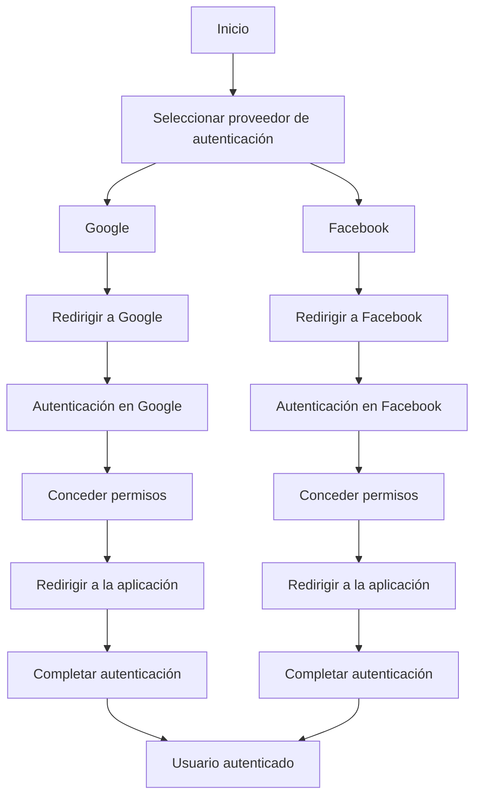

# Unidad: Uso de Django Allauth para autenticación social

## Introducción a la unidad y objetivos de aprendizaje

En esta unidad, profundizaremos en el uso de Django Allauth para la autenticación social dentro de un sistema de carrito de compras desarrollado con Django. Django Allauth es una biblioteca poderosa y versátil que simplifica la integración de múltiples proveedores de autenticación social, como Google, Facebook y Twitter, en aplicaciones Django. El objetivo de esta unidad es proporcionar una comprensión completa de cómo configurar y utilizar Django Allauth para permitir a los usuarios autenticarse mediante sus cuentas de redes sociales.

### Objetivos de aprendizaje:
1. Comprender los conceptos básicos de la autenticación social y su importancia en aplicaciones web.
2. Configurar Django Allauth en un proyecto Django.
3. Integrar múltiples proveedores de autenticación social utilizando Django Allauth.
4. Personalizar el flujo de autenticación y las vistas proporcionadas por Django Allauth.
5. Implementar pruebas unitarias para asegurar la funcionalidad correcta de la autenticación social.
6. Aplicar mejores prácticas y consideraciones de diseño para la autenticación social.

## Documento funcional de requerimientos

### Descripción detallada de la funcionalidad

La autenticación social permite a los usuarios registrarse e iniciar sesión en nuestra aplicación de carrito de compras utilizando sus cuentas de redes sociales. Esto no solo mejora la experiencia del usuario al reducir la fricción en el proceso de registro, sino que también aumenta la seguridad al delegar la autenticación a proveedores confiables. Django Allauth facilita la integración de múltiples proveedores de autenticación social, gestionando la complejidad de las diferentes APIs y flujos de autenticación.

### Casos de uso

1. **Registro e inicio de sesión con Google**:
   - **Actor**: Usuario
   - **Descripción**: Un usuario puede registrarse o iniciar sesión en la aplicación utilizando su cuenta de Google.
   - **Precondiciones**: El usuario debe tener una cuenta de Google.
   - **Flujo principal**:
     1. El usuario selecciona "Iniciar sesión con Google" en la página de inicio de sesión.
     2. El usuario es redirigido a la página de autenticación de Google.
     3. El usuario ingresa sus credenciales de Google y concede permisos a la aplicación.
     4. El usuario es redirigido de vuelta a la aplicación, donde se completa el proceso de autenticación.

2. **Registro e inicio de sesión con Facebook**:
   - **Actor**: Usuario
   - **Descripción**: Un usuario puede registrarse o iniciar sesión en la aplicación utilizando su cuenta de Facebook.
   - **Precondiciones**: El usuario debe tener una cuenta de Facebook.
   - **Flujo principal**:
     1. El usuario selecciona "Iniciar sesión con Facebook" en la página de inicio de sesión.
     2. El usuario es redirigido a la página de autenticación de Facebook.
     3. El usuario ingresa sus credenciales de Facebook y concede permisos a la aplicación.
     4. El usuario es redirigido de vuelta a la aplicación, donde se completa el proceso de autenticación.

### Diagramas de flujo



### Requisitos no funcionales

1. **Seguridad**: La autenticación social debe ser segura y proteger los datos del usuario. Se deben utilizar conexiones HTTPS y seguir las mejores prácticas de seguridad recomendadas por los proveedores de autenticación.
2. **Rendimiento**: El proceso de autenticación debe ser rápido y eficiente, minimizando el tiempo de redirección y carga.
3. **Escalabilidad**: La solución debe ser capaz de manejar un gran número de usuarios simultáneos sin degradar el rendimiento.
4. **Usabilidad**: La interfaz de usuario debe ser intuitiva y fácil de usar, proporcionando una experiencia fluida para el usuario.

## Implementación en Python

### Explicación paso a paso del código

Para implementar la autenticación social utilizando Django Allauth, seguiremos estos pasos:

1. **Instalación de Django Allauth**:
   Primero, instalaremos Django Allauth y sus dependencias utilizando pip:
   ```bash
   pip install django-allauth
   ```

2. **Configuración de Django Allauth**:
   Luego, añadiremos `allauth` y sus aplicaciones relacionadas a nuestro archivo `settings.py`:
   ```python
   INSTALLED_APPS = [
       ...
       'django.contrib.sites',
       'allauth',
       'allauth.account',
       'allauth.socialaccount',
       'allauth.socialaccount.providers.google',
       'allauth.socialaccount.providers.facebook',
       ...
   ]

   SITE_ID = 1

   AUTHENTICATION_BACKENDS = (
       ...
       'allauth.account.auth_backends.AuthenticationBackend',
       ...
   )

   LOGIN_REDIRECT_URL = '/'
   ```

3. **Configuración de URLs**:
   Añadiremos las URLs de Allauth a nuestro archivo `urls.py`:
   ```python
   from django.urls import path, include

   urlpatterns = [
       ...
       path('accounts/', include('allauth.urls')),
       ...
   ]
   ```

4. **Configuración de proveedores de autenticación**:
   Configuraremos los proveedores de autenticación en el panel de administración de Django. Para Google, necesitaremos las credenciales de la API de Google. Para Facebook, necesitaremos una aplicación de Facebook configurada.

### Código fuente completo y comentado

A continuación, se presenta el código fuente completo y comentado para la configuración de Django Allauth:

#### settings.py

```python
import os
from pathlib import Path

# Build paths inside the project like this: BASE_DIR / 'subdir'.
BASE_DIR = Path(__file__).resolve().parent.parent

# Quick-start development settings - unsuitable for production
# See https://docs.djangoproject.com/en/3.2/howto/deployment/checklist/

# SECURITY WARNING: keep the secret key used in production secret!
SECRET_KEY = 'your-secret-key'

# SECURITY WARNING: don't run with debug turned on in production!
DEBUG = True

ALLOWED_HOSTS = []

# Application definition
INSTALLED_APPS = [
    ...
    'django.contrib.sites',
    'allauth',
    'allauth.account',
    'allauth.socialaccount',
    'allauth.socialaccount.providers.google',
    'allauth.socialaccount.providers.facebook',
    ...
]

MIDDLEWARE = [
    ...
]

ROOT_URLCONF = 'myproject.urls'

TEMPLATES = [
    ...
]

WSGI_APPLICATION = 'myproject.wsgi.application'

# Database
# https://docs.djangoproject.com/en/3.2/ref/settings/#databases
DATABASES = {
    ...
}

# Password validation
# https://docs.djangoproject.com/en/3.2/ref/settings/#auth-password-validators
AUTH_PASSWORD_VALIDATORS = [
    ...
]

# Internationalization
# https://docs.djangoproject.com/en/3.2/topics/i18n/
LANGUAGE_CODE = 'en-us'

TIME_ZONE = 'UTC'

USE_I18N = True

USE_L10N = True

USE_TZ = True

# Static files (CSS, JavaScript, Images)
# https://docs.djangoproject.com/en/3.2/howto/static-files/
STATIC_URL = '/static/'

# Default primary key field type
# https://docs.djangoproject.com/en/3.2/ref/settings/#default-auto-field
DEFAULT_AUTO_FIELD = 'django.db.models.BigAutoField'

# Django Allauth configuration
SITE_ID = 1

AUTHENTICATION_BACKENDS = (
    'django.contrib.auth.backends.ModelBackend',
    'allauth.account.auth_backends.AuthenticationBackend',
)

LOGIN_REDIRECT_URL = '/'

# Social account providers
SOCIALACCOUNT_PROVIDERS = {
    'google': {
        'SCOPE': [
            'profile',
            'email',
        ],
        'AUTH_PARAMS': {
            'access_type': 'online',
        }
    },
    'facebook': {
        'METHOD': 'oauth2',
        'SCOPE': ['email', 'public_profile'],
        'FIELDS': [
            'id',
            'email',
            'name',
            'first_name',
            'last_name',
            'verified',
            'locale',
            'timezone',
            'link',
            'gender',
            'updated_time',
        ],
        'EXCHANGE_TOKEN': True,
        'LOCALE_FUNC': lambda request: 'en_US',
        'VERIFIED_EMAIL': False,
        'VERSION': 'v7.0',
    }
}
```

#### urls.py

```python
from django.contrib import admin
from django.urls import path, include

urlpatterns = [
    path('admin/', admin.site.urls),
    path('accounts/', include('allauth.urls')),
    ...
]
```

### Ejemplos de uso y pruebas unitarias

Para asegurarnos de que la autenticación social funciona correctamente, implementaremos pruebas unitarias utilizando Django's `TestCase`.

#### tests.py

```python
from django.test import TestCase
from django.urls import reverse

class SocialAuthTests(TestCase):
    def test_google_login(self):
        response = self.client.get(reverse('socialaccount_login', args=['google']))
        self.assertEqual(response.status_code, 302)
        self.assertIn('accounts.google.com', response.url)

    def test_facebook_login(self):
        response = self.client.get(reverse('socialaccount_login', args=['facebook']))
        self.assertEqual(response.status_code, 302)
        self.assertIn('facebook.com', response.url)
```

### Mejores prácticas y consideraciones de diseño

1. **Seguridad**: Asegúrate de utilizar HTTPS en todas las comunicaciones entre el cliente y el servidor para proteger los datos del usuario. Configura correctamente las credenciales de la API y sigue las mejores prácticas de seguridad recomendadas por los proveedores de autenticación.
2. **Usabilidad**: Proporciona una interfaz de usuario intuitiva y fácil de usar para el proceso de autenticación social. Asegúrate de que los botones de inicio de sesión social sean claramente visibles y accesibles.
3. **Escalabilidad**: Diseña tu aplicación para manejar un gran número de usuarios simultáneos. Utiliza técnicas de caché y optimización de consultas para mejorar el rendimiento.
4. **Pruebas**: Implementa pruebas unitarias y de integración para asegurar que la autenticación social funcione correctamente en diferentes escenarios. Considera el uso de herramientas de prueba automatizadas para mejorar la cobertura de pruebas.
5. **Mantenimiento**: Mantén las dependencias de tu proyecto actualizadas y sigue las actualizaciones de seguridad y mejoras de Django Allauth y los proveedores de autenticación.

En conclusión, la integración de Django Allauth para la autenticación social en un sistema de carrito de compras no solo mejora la experiencia del usuario, sino que también proporciona una solución segura y escalable para la gestión de usuarios. Siguiendo los pasos y mejores prácticas descritos en esta unidad, podrás implementar una autenticación social robusta y eficiente en tu aplicación Django.