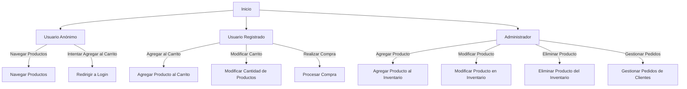

# Unidad: Personalización de Permisos de Django

## Introducción a la Unidad y Objetivos de Aprendizaje

En esta unidad, exploraremos en profundidad la personalización de permisos en Django, una funcionalidad crucial para cualquier sistema de carrito de compras. Los permisos permiten controlar el acceso a diferentes partes de la aplicación, asegurando que solo los usuarios autorizados puedan realizar ciertas acciones. Al finalizar esta unidad, serás capaz de:

1. Comprender los conceptos básicos de permisos en Django.
2. Crear y gestionar permisos personalizados.
3. Implementar permisos a nivel de vista y modelo.
4. Utilizar decoradores y mixins para la autorización.
5. Integrar permisos personalizados en un sistema de carrito de compras.

## Documento Funcional de Requerimientos

### Descripción Detallada de la Funcionalidad

La personalización de permisos en Django permite definir reglas específicas sobre quién puede acceder a qué recursos y realizar qué acciones dentro de la aplicación. En el contexto de un sistema de carrito de compras, esto puede incluir permisos para agregar productos, modificar el carrito, realizar compras, y administrar el inventario.

### Casos de Uso

1. **Administrador del Sistema**: Puede agregar, modificar y eliminar productos del inventario, así como gestionar los pedidos de los clientes.
2. **Cliente Registrado**: Puede agregar productos al carrito, modificar la cantidad de productos en el carrito y realizar compras.
3. **Usuario Anónimo**: Puede navegar por los productos, pero no puede agregar productos al carrito ni realizar compras.

### Diagramas de Flujo



### Requisitos No Funcionales

1. **Seguridad**: Los permisos deben ser seguros y no deben permitir el acceso no autorizado a las funcionalidades críticas del sistema.
2. **Rendimiento**: La verificación de permisos debe ser eficiente y no debe afectar el rendimiento general de la aplicación.
3. **Escalabilidad**: El sistema de permisos debe ser escalable para manejar un gran número de usuarios y roles.
4. **Mantenibilidad**: El código relacionado con la gestión de permisos debe ser fácil de mantener y extender.

## Implementación en Python

### Explicación Paso a Paso del Código

#### Paso 1: Definir Permisos Personalizados

Primero, definiremos los permisos personalizados en nuestros modelos. Django permite agregar permisos personalizados utilizando la opción `permissions` en la clase `Meta` de un modelo.

```python
from django.db import models
from django.contrib.auth.models import User

class Producto(models.Model):
    nombre = models.CharField(max_length=100)
    descripcion = models.TextField()
    precio = models.DecimalField(max_digits=10, decimal_places=2)
    stock = models.IntegerField()

    class Meta:
        permissions = [
            ("puede_agregar_producto", "Puede agregar producto"),
            ("puede_modificar_producto", "Puede modificar producto"),
            ("puede_eliminar_producto", "Puede eliminar producto"),
        ]
```

#### Paso 2: Asignar Permisos a Usuarios y Grupos

Asignar permisos a usuarios y grupos es esencial para la gestión de roles. Esto se puede hacer en el archivo `admin.py` o mediante señales.

```python
from django.contrib import admin
from django.contrib.auth.models import Group, Permission
from django.contrib.contenttypes.models import ContentType
from .models import Producto

class ProductoAdmin(admin.ModelAdmin):
    list_display = ('nombre', 'precio', 'stock')

admin.site.register(Producto, ProductoAdmin)

# Asignar permisos a un grupo
content_type = ContentType.objects.get_for_model(Producto)
permiso_agregar = Permission.objects.get(
    codename='puede_agregar_producto',
    content_type=content_type,
)
permiso_modificar = Permission.objects.get(
    codename='puede_modificar_producto',
    content_type=content_type,
)
permiso_eliminar = Permission.objects.get(
    codename='puede_eliminar_producto',
    content_type=content_type,
)

grupo_administrador = Group.objects.get(name='Administrador')
grupo_administrador.permissions.add(permiso_agregar, permiso_modificar, permiso_eliminar)
```

#### Paso 3: Verificar Permisos en Vistas

Para verificar permisos en las vistas, utilizamos los decoradores `permission_required` o mixins como `PermissionRequiredMixin`.

```python
from django.contrib.auth.decorators import permission_required
from django.shortcuts import render, redirect
from .models import Producto

@permission_required('app.puede_agregar_producto', raise_exception=True)
def agregar_producto(request):
    if request.method == 'POST':
        nombre = request.POST['nombre']
        descripcion = request.POST['descripcion']
        precio = request.POST['precio']
        stock = request.POST['stock']
        Producto.objects.create(nombre=nombre, descripcion=descripcion, precio=precio, stock=stock)
        return redirect('lista_productos')
    return render(request, 'agregar_producto.html')
```

#### Paso 4: Implementar Permisos en el Sistema de Carrito de Compras

En el contexto de un carrito de compras, los permisos pueden ser utilizados para controlar el acceso a la funcionalidad de agregar productos al carrito, modificar el carrito y realizar compras.

```python
from django.contrib.auth.decorators import login_required
from django.contrib.auth.mixins import PermissionRequiredMixin
from django.views.generic import View
from django.shortcuts import render, redirect
from .models import Producto, Carrito

@login_required
def agregar_al_carrito(request, producto_id):
    producto = Producto.objects.get(id=producto_id)
    carrito, created = Carrito.objects.get_or_create(usuario=request.user, activo=True)
    carrito.productos.add(producto)
    return redirect('ver_carrito')

class ModificarCarritoView(PermissionRequiredMixin, View):
    permission_required = 'app.puede_modificar_carrito'

    def post(self, request, *args, **kwargs):
        producto_id = request.POST['producto_id']
        cantidad = request.POST['cantidad']
        carrito = Carrito.objects.get(usuario=request.user, activo=True)
        carrito.modificar_producto(producto_id, cantidad)
        return redirect('ver_carrito')
```

### Código Fuente Completo y Comentado

```python
# models.py
from django.db import models
from django.contrib.auth.models import User

class Producto(models.Model):
    nombre = models.CharField(max_length=100)
    descripcion = models.TextField()
    precio = models.DecimalField(max_digits=10, decimal_places=2)
    stock = models.IntegerField()

    class Meta:
        permissions = [
            ("puede_agregar_producto", "Puede agregar producto"),
            ("puede_modificar_producto", "Puede modificar producto"),
            ("puede_eliminar_producto", "Puede eliminar producto"),
        ]

class Carrito(models.Model):
    usuario = models.ForeignKey(User, on_delete=models.CASCADE)
    productos = models.ManyToManyField(Producto)
    activo = models.BooleanField(default=True)

    def modificar_producto(self, producto_id, cantidad):
        # Lógica para modificar la cantidad de un producto en el carrito
        pass

# admin.py
from django.contrib import admin
from django.contrib.auth.models import Group, Permission
from django.contrib.contenttypes.models import ContentType
from .models import Producto

class ProductoAdmin(admin.ModelAdmin):
    list_display = ('nombre', 'precio', 'stock')

admin.site.register(Producto, ProductoAdmin)

# Asignar permisos a un grupo
content_type = ContentType.objects.get_for_model(Producto)
permiso_agregar = Permission.objects.get(
    codename='puede_agregar_producto',
    content_type=content_type,
)
permiso_modificar = Permission.objects.get(
    codename='puede_modificar_producto',
    content_type=content_type,
)
permiso_eliminar = Permission.objects.get(
    codename='puede_eliminar_producto',
    content_type=content_type,
)

grupo_administrador = Group.objects.get(name='Administrador')
grupo_administrador.permissions.add(permiso_agregar, permiso_modificar, permiso_eliminar)

# views.py
from django.contrib.auth.decorators import permission_required, login_required
from django.contrib.auth.mixins import PermissionRequiredMixin
from django.views.generic import View
from django.shortcuts import render, redirect
from .models import Producto, Carrito

@permission_required('app.puede_agregar_producto', raise_exception=True)
def agregar_producto(request):
    if request.method == 'POST':
        nombre = request.POST['nombre']
        descripcion = request.POST['descripcion']
        precio = request.POST['precio']
        stock = request.POST['stock']
        Producto.objects.create(nombre=nombre, descripcion=descripcion, precio=precio, stock=stock)
        return redirect('lista_productos')
    return render(request, 'agregar_producto.html')

@login_required
def agregar_al_carrito(request, producto_id):
    producto = Producto.objects.get(id=producto_id)
    carrito, created = Carrito.objects.get_or_create(usuario=request.user, activo=True)
    carrito.productos.add(producto)
    return redirect('ver_carrito')

class ModificarCarritoView(PermissionRequiredMixin, View):
    permission_required = 'app.puede_modificar_carrito'

    def post(self, request, *args, **kwargs):
        producto_id = request.POST['producto_id']
        cantidad = request.POST['cantidad']
        carrito = Carrito.objects.get(usuario=request.user, activo=True)
        carrito.modificar_producto(producto_id, cantidad)
        return redirect('ver_carrito')
```

### Ejemplos de Uso y Pruebas Unitarias

#### Ejemplo de Uso

Para probar la funcionalidad de permisos personalizados, primero asegúrate de que los permisos estén asignados correctamente a los usuarios y grupos. Luego, intenta realizar acciones que requieran permisos específicos.

```python
# Crear un usuario y asignar permisos
from django.contrib.auth.models import User, Group

usuario = User.objects.create_user('usuario_test', 'test@example.com', 'password123')
grupo_administrador = Group.objects.get(name='Administrador')
usuario.groups.add(grupo_administrador)

# Intentar agregar un producto
from django.test import Client

client = Client()
client.login(username='usuario_test', password='password123')
response = client.post('/agregar_producto/', {'nombre': 'Producto Test', 'descripcion': 'Descripción del producto', 'precio': '100.00', 'stock': '10'})
assert response.status_code == 302  # Redirige a la lista de productos
```

#### Pruebas Unitarias

Las pruebas unitarias aseguran que los permisos funcionan como se espera.

```python
from django.test import TestCase
from django.contrib.auth.models import User, Group
from .models import Producto

class PermisosTestCase(TestCase):
    def setUp(self):
        self.usuario = User.objects.create_user('usuario_test', 'test@example.com', 'password123')
        self.grupo_administrador = Group.objects.create(name='Administrador')
        self.usuario.groups.add(self.grupo_administrador)
        self.producto = Producto.objects.create(nombre='Producto Test', descripcion='Descripción del producto', precio=100.00, stock=10)

    def test_agregar_producto(self):
        self.client.login(username='usuario_test', password='password123')
        response = self.client.post('/agregar_producto/', {'nombre': 'Nuevo Producto', 'descripcion': 'Nueva descripción', 'precio': '200.00', 'stock': '20'})
        self.assertEqual(response.status_code, 302)
        self.assertTrue(Producto.objects.filter(nombre='Nuevo Producto').exists())

    def test_modificar_producto(self):
        self.client.login(username='usuario_test', password='password123')
        response = self.client.post('/modificar_producto/', {'producto_id': self.producto.id, 'nombre': 'Producto Modificado', 'descripcion': 'Descripción modificada', 'precio': '150.00', 'stock': '15'})
        self.assertEqual(response.status_code, 302)
        self.producto.refresh_from_db()
        self.assertEqual(self.producto.nombre, 'Producto Modificado')
```

## Mejores Prácticas y Consideraciones de Diseño

1. **Principio de Menor Privilegio**: Asigna solo los permisos necesarios a cada usuario o grupo para minimizar el riesgo de accesos no autorizados.
2. **Revisión Regular de Permisos**: Revisa y actualiza los permisos regularmente para asegurar que siguen siendo relevantes y seguros.
3. **Uso de Decoradores y Mixins**: Utiliza decoradores y mixins para implementar permisos de manera consistente y reutilizable.
4. **Pruebas Exhaustivas**: Implementa pruebas unitarias y de integración para asegurar que los permisos funcionan correctamente en todos los escenarios.
5. **Documentación**: Documenta claramente los permisos y su propósito para facilitar el mantenimiento y la extensión del sistema.

En resumen, la personalización de permisos en Django es una herramienta poderosa para controlar el acceso a diferentes partes de una aplicación. Al seguir las mejores prácticas y considerar aspectos de seguridad, rendimiento y escalabilidad, puedes crear un sistema robusto y seguro para tu aplicación de carrito de compras.