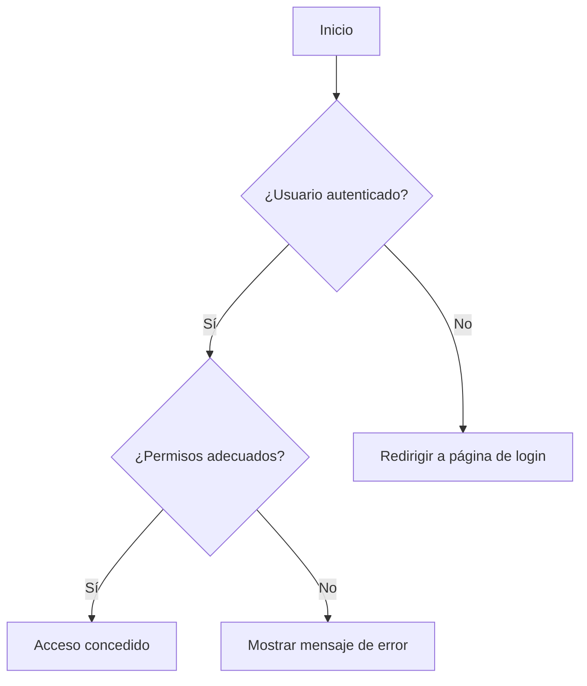

# Unidad: Protección de Vistas y API Endpoints

## Introducción a la Unidad y Objetivos de Aprendizaje

En esta unidad, nos enfocaremos en la protección de vistas y API endpoints dentro de un sistema de carrito de compras desarrollado con Django. Este tema es crucial para garantizar que solo usuarios autenticados y autorizados puedan acceder a ciertas funcionalidades y datos sensibles de la aplicación. Al finalizar esta unidad, los lectores serán capaces de:

1. Comprender la importancia de proteger vistas y API endpoints.
2. Implementar mecanismos de protección en vistas y API endpoints utilizando Django.
3. Configurar permisos específicos para diferentes tipos de usuarios.
4. Utilizar decoradores y mixins para simplificar la protección de vistas.
5. Realizar pruebas unitarias para verificar la seguridad de las vistas y API endpoints.

## Documento Funcional de Requerimientos

### Descripción Detallada de la Funcionalidad

La protección de vistas y API endpoints implica restringir el acceso a ciertas partes de la aplicación web basada en Django. Esto se logra mediante la implementación de mecanismos de autenticación y autorización que aseguran que solo los usuarios con los permisos adecuados puedan acceder a recursos específicos. En el contexto de un sistema de carrito de compras, esto puede incluir:

- Restringir el acceso a la vista del carrito de compras solo a usuarios autenticados.
- Permitir que solo los administradores puedan acceder a vistas de administración de productos.
- Proteger los endpoints de la API para que solo usuarios autenticados puedan realizar operaciones CRUD (Crear, Leer, Actualizar, Eliminar).

### Casos de Uso

1. **Acceso al Carrito de Compras**:
   - **Actor**: Usuario autenticado.
   - **Descripción**: Un usuario autenticado puede acceder a su carrito de compras.
   - **Precondición**: El usuario debe estar autenticado.
   - **Postcondición**: El usuario puede ver y modificar los productos en su carrito de compras.

2. **Administración de Productos**:
   - **Actor**: Administrador.
   - **Descripción**: Un administrador puede acceder a las vistas de administración de productos para agregar, editar o eliminar productos.
   - **Precondición**: El usuario debe tener permisos de administrador.
   - **Postcondición**: El administrador puede gestionar los productos en la tienda.

3. **Acceso a Endpoints de la API**:
   - **Actor**: Usuario autenticado.
   - **Descripción**: Un usuario autenticado puede realizar operaciones CRUD a través de los endpoints de la API.
   - **Precondición**: El usuario debe estar autenticado y tener los permisos necesarios.
   - **Postcondición**: El usuario puede interactuar con los recursos de la API según sus permisos.

### Diagramas de Flujo



### Requisitos No Funcionales

1. **Seguridad**: La protección de vistas y API endpoints debe ser robusta para prevenir accesos no autorizados.
2. **Rendimiento**: La implementación de protección no debe afectar significativamente el rendimiento de la aplicación.
3. **Escalabilidad**: La solución debe ser escalable para soportar un gran número de usuarios y solicitudes.
4. **Mantenibilidad**: El código debe ser claro y fácil de mantener, permitiendo futuras modificaciones y mejoras.

## Implementación en Python

### Explicación Paso a Paso del Código

Para proteger vistas y API endpoints en Django, utilizaremos varias herramientas y técnicas, incluyendo decoradores, mixins y permisos personalizados.

1. **Protección de Vistas con Decoradores**:
   Django proporciona decoradores como `login_required` y `permission_required` que se pueden usar para proteger vistas basadas en funciones.

2. **Protección de Vistas con Mixins**:
   Para vistas basadas en clases, Django ofrece mixins como `LoginRequiredMixin` y `PermissionRequiredMixin`.

3. **Protección de Endpoints de la API**:
   Utilizaremos Django REST Framework (DRF) para proteger los endpoints de la API mediante permisos y autenticación basada en tokens.

### Código Fuente Completo y Comentado

#### Protección de Vistas Basadas en Funciones

```python
from django.contrib.auth.decorators import login_required, permission_required
from django.shortcuts import render, redirect

@login_required
def carrito_de_compras(request):
    # Lógica para mostrar el carrito de compras del usuario
    return render(request, 'carrito.html')

@permission_required('is_staff')
def administrar_productos(request):
    # Lógica para administrar productos
    return render(request, 'admin_productos.html')
```

#### Protección de Vistas Basadas en Clases

```python
from django.contrib.auth.mixins import LoginRequiredMixin, PermissionRequiredMixin
from django.views.generic import ListView, CreateView
from .models import Producto

class CarritoDeComprasView(LoginRequiredMixin, ListView):
    model = Producto
    template_name = 'carrito.html'

class AdministrarProductosView(PermissionRequiredMixin, ListView):
    permission_required = 'is_staff'
    model = Producto
    template_name = 'admin_productos.html'
```

#### Protección de Endpoints de la API

```python
from rest_framework.permissions import IsAuthenticated, IsAdminUser
from rest_framework.views import APIView
from rest_framework.response import Response
from rest_framework import status
from .models import Producto
from .serializers import ProductoSerializer

class ProductoListCreate(APIView):
    permission_classes = [IsAuthenticated]

    def get(self, request):
        productos = Producto.objects.all()
        serializer = ProductoSerializer(productos, many=True)
        return Response(serializer.data)

    def post(self, request):
        serializer = ProductoSerializer(data=request.data)
        if serializer.is_valid():
            serializer.save()
            return Response(serializer.data, status=status.HTTP_201_CREATED)
        return Response(serializer.errors, status=status.HTTP_400_BAD_REQUEST)

class ProductoAdmin(APIView):
    permission_classes = [IsAdminUser]

    def delete(self, request, pk):
        try:
            producto = Producto.objects.get(pk=pk)
            producto.delete()
            return Response(status=status.HTTP_204_NO_CONTENT)
        except Producto.DoesNotExist:
            return Response(status=status.HTTP_404_NOT_FOUND)
```

### Ejemplos de Uso y Pruebas Unitarias

#### Ejemplo de Uso

Para probar la protección de vistas y endpoints, podemos crear usuarios con diferentes permisos y verificar el acceso a las vistas y endpoints.

```python
from django.test import TestCase
from django.urls import reverse
from django.contrib.auth.models import User

class ProteccionVistasTest(TestCase):

    def setUp(self):
        self.user = User.objects.create_user(username='usuario', password='password')
        self.admin = User.objects.create_superuser(username='admin', password='password')

    def test_acceso_carrito_sin_autenticar(self):
        response = self.client.get(reverse('carrito_de_compras'))
        self.assertRedirects(response, '/accounts/login/?next=/carrito/')

    def test_acceso_carrito_autenticado(self):
        self.client.login(username='usuario', password='password')
        response = self.client.get(reverse('carrito_de_compras'))
        self.assertEqual(response.status_code, 200)

    def test_acceso_admin_productos_sin_permisos(self):
        self.client.login(username='usuario', password='password')
        response = self.client.get(reverse('administrar_productos'))
        self.assertEqual(response.status_code, 403)

    def test_acceso_admin_productos_con_permisos(self):
        self.client.login(username='admin', password='password')
        response = self.client.get(reverse('administrar_productos'))
        self.assertEqual(response.status_code, 200)
```

### Mejores Prácticas y Consideraciones de Diseño

1. **Principio de Menor Privilegio**: Asigne solo los permisos necesarios a cada usuario para minimizar el riesgo de acceso no autorizado.
2. **Uso de Decoradores y Mixins**: Utilice decoradores y mixins para simplificar la protección de vistas y evitar la repetición de código.
3. **Pruebas de Seguridad**: Realice pruebas exhaustivas para asegurar que las vistas y endpoints están adecuadamente protegidos.
4. **Manejo de Errores**: Proporcione mensajes de error claros y seguros cuando un usuario no tenga acceso a una vista o endpoint.
5. **Monitoreo y Auditoría**: Implemente mecanismos de monitoreo y auditoría para detectar y responder a intentos de acceso no autorizado.

## Conclusión

La protección de vistas y API endpoints es un aspecto crítico en el desarrollo de aplicaciones web seguras. A través de esta unidad, hemos explorado diversas técnicas y herramientas que Django ofrece para implementar mecanismos de autenticación y autorización robustos. Al seguir las mejores prácticas y realizar pruebas exhaustivas, podemos asegurar que nuestra aplicación de carrito de compras es segura y confiable para todos los usuarios.