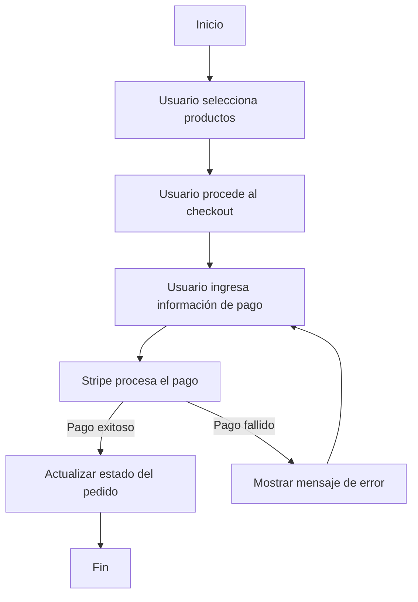

# Unidad: Integración con Pasarela de Pagos (e.g., Stripe)

## Introducción a la Unidad y Objetivos de Aprendizaje

En esta unidad, profundizaremos en la integración de una pasarela de pagos, específicamente Stripe, en un sistema de carrito de compras desarrollado con Django. Stripe es una de las plataformas de pagos más populares y ofrece una API robusta y fácil de usar para procesar pagos en línea. Al finalizar esta unidad, los lectores serán capaces de:

1. Comprender los conceptos básicos de una pasarela de pagos.
2. Configurar y utilizar la API de Stripe en un proyecto Django.
3. Implementar un flujo de pago seguro y eficiente.
4. Realizar pruebas y manejar errores comunes en la integración de Stripe.

## Documento Funcional de Requerimientos

### Descripción Detallada de la Funcionalidad

La funcionalidad principal de esta unidad es integrar Stripe como pasarela de pagos en un sistema de carrito de compras desarrollado con Django. Esto incluye la configuración de Stripe, la creación de una interfaz de usuario para el pago, la gestión de transacciones y la actualización del estado del pedido una vez que el pago se haya completado.

### Casos de Uso

1. **Caso de Uso 1: Configuración de Stripe**
   - **Actor:** Administrador del sistema.
   - **Descripción:** El administrador configura las credenciales de Stripe en el sistema Django.
   - **Precondición:** El administrador debe tener una cuenta de Stripe y las credenciales de API.
   - **Postcondición:** Las credenciales de Stripe se almacenan de manera segura en el sistema.

2. **Caso de Uso 2: Proceso de Pago**
   - **Actor:** Usuario final.
   - **Descripción:** El usuario final selecciona productos, procede al checkout y realiza el pago utilizando Stripe.
   - **Precondición:** El usuario debe tener productos en su carrito y estar autenticado.
   - **Postcondición:** El pago se procesa exitosamente y el estado del pedido se actualiza.

3. **Caso de Uso 3: Manejo de Errores de Pago**
   - **Actor:** Usuario final.
   - **Descripción:** El sistema maneja errores de pago y proporciona retroalimentación al usuario.
   - **Precondición:** El usuario intenta realizar un pago.
   - **Postcondición:** El sistema muestra un mensaje de error adecuado y permite al usuario intentar nuevamente.

### Diagramas de Flujo



### Requisitos No Funcionales

1. **Seguridad:** La información de pago debe ser manejada de manera segura utilizando HTTPS y las mejores prácticas de seguridad.
2. **Rendimiento:** El proceso de pago debe ser rápido y eficiente, minimizando el tiempo de espera del usuario.
3. **Escalabilidad:** El sistema debe ser capaz de manejar un gran volumen de transacciones sin degradación del rendimiento.
4. **Usabilidad:** La interfaz de usuario debe ser intuitiva y fácil de usar, proporcionando una experiencia de pago fluida.

## Implementación en Python

### Explicación Paso a Paso del Código

#### Paso 1: Instalación y Configuración de Stripe

Primero, necesitamos instalar la biblioteca de Stripe para Python. Esto se puede hacer utilizando pip:

```bash
pip install stripe
```

Luego, configuramos las credenciales de Stripe en nuestro archivo `settings.py` de Django:

```python
# settings.py
STRIPE_SECRET_KEY = 'tu_clave_secreta_de_stripe'
STRIPE_PUBLISHABLE_KEY = 'tu_clave_publicable_de_stripe'
```

#### Paso 2: Creación del Formulario de Pago

Creamos un formulario de pago en Django utilizando `forms.py`:

```python
# forms.py
from django import forms

class PaymentForm(forms.Form):
    stripe_token = forms.CharField(widget=forms.HiddenInput())
```

#### Paso 3: Vista para Procesar el Pago

Creamos una vista en `views.py` para manejar el proceso de pago:

```python
# views.py
import stripe
from django.conf import settings
from django.shortcuts import render, redirect
from django.contrib import messages
from .forms import PaymentForm

stripe.api_key = settings.STRIPE_SECRET_KEY

def process_payment(request):
    if request.method == 'POST':
        form = PaymentForm(request.POST)
        if form.is_valid():
            stripe_token = form.cleaned_data['stripe_token']
            try:
                charge = stripe.Charge.create(
                    amount=5000,  # Monto en centavos
                    currency='usd',
                    description='Descripción del producto',
                    source=stripe_token
                )
                messages.success(request, 'Pago realizado con éxito')
                return redirect('success')
            except stripe.error.CardError as e:
                messages.error(request, f'Error en el pago: {e.error.message}')
                return redirect('checkout')
    else:
        form = PaymentForm()
    return render(request, 'checkout.html', {'form': form})
```

#### Paso 4: Plantilla de Checkout

Creamos una plantilla `checkout.html` para el formulario de pago:

```html
<!-- checkout.html -->
<!DOCTYPE html>
<html lang="es">
<head>
    <meta charset="UTF-8">
    <title>Checkout</title>
    <script src="https://js.stripe.com/v3/"></script>
</head>
<body>
    <h1>Checkout</h1>
    <form action="" method="post" id="payment-form">
        
        {{ form }}
        <button type="submit">Pagar</button>
    </form>
    <script>
        var stripe = Stripe('{{ stripe_publishable_key }}');
        var elements = stripe.elements();
        var card = elements.create('card');
        card.mount('#card-element');

        var form = document.getElementById('payment-form');
        form.addEventListener('submit', function(event) {
            event.preventDefault();
            stripe.createToken(card).then(function(result) {
                if (result.error) {
                    // Mostrar error en la interfaz de usuario
                } else {
                    var hiddenInput = document.createElement('input');
                    hiddenInput.setAttribute('type', 'hidden');
                    hiddenInput.setAttribute('name', 'stripe_token');
                    hiddenInput.setAttribute('value', result.token.id);
                    form.appendChild(hiddenInput);
                    form.submit();
                }
            });
        });
    </script>
</body>
</html>
```

### Código Fuente Completo y Comentado

```python
# settings.py
# Configuración de Stripe
STRIPE_SECRET_KEY = 'tu_clave_secreta_de_stripe'
STRIPE_PUBLISHABLE_KEY = 'tu_clave_publicable_de_stripe'

# forms.py
from django import forms

class PaymentForm(forms.Form):
    stripe_token = forms.CharField(widget=forms.HiddenInput())

# views.py
import stripe
from django.conf import settings
from django.shortcuts import render, redirect
from django.contrib import messages
from .forms import PaymentForm

stripe.api_key = settings.STRIPE_SECRET_KEY

def process_payment(request):
    if request.method == 'POST':
        form = PaymentForm(request.POST)
        if form.is_valid():
            stripe_token = form.cleaned_data['stripe_token']
            try:
                charge = stripe.Charge.create(
                    amount=5000,  # Monto en centavos
                    currency='usd',
                    description='Descripción del producto',
                    source=stripe_token
                )
                messages.success(request, 'Pago realizado con éxito')
                return redirect('success')
            except stripe.error.CardError as e:
                messages.error(request, f'Error en el pago: {e.error.message}')
                return redirect('checkout')
    else:
        form = PaymentForm()
    return render(request, 'checkout.html', {'form': form})

# checkout.html
<!DOCTYPE html>
<html lang="es">
<head>
    <meta charset="UTF-8">
    <title>Checkout</title>
    <script src="https://js.stripe.com/v3/"></script>
</head>
<body>
    <h1>Checkout</h1>
    <form action="" method="post" id="payment-form">
        
        {{ form }}
        <button type="submit">Pagar</button>
    </form>
    <script>
        var stripe = Stripe('{{ stripe_publishable_key }}');
        var elements = stripe.elements();
        var card = elements.create('card');
        card.mount('#card-element');

        var form = document.getElementById('payment-form');
        form.addEventListener('submit', function(event) {
            event.preventDefault();
            stripe.createToken(card).then(function(result) {
                if (result.error) {
                    // Mostrar error en la interfaz de usuario
                } else {
                    var hiddenInput = document.createElement('input');
                    hiddenInput.setAttribute('type', 'hidden');
                    hiddenInput.setAttribute('name', 'stripe_token');
                    hiddenInput.setAttribute('value', result.token.id);
                    form.appendChild(hiddenInput);
                    form.submit();
                }
            });
        });
    </script>
</body>
</html>
```

### Ejemplos de Uso y Pruebas Unitarias

#### Ejemplo de Uso

Para probar la integración, primero asegúrate de que el servidor de Django esté en ejecución. Luego, navega a la página de checkout, ingresa los detalles de la tarjeta de crédito y realiza un pago. Si todo está configurado correctamente, deberías ver un mensaje de éxito.

#### Pruebas Unitarias

Podemos escribir pruebas unitarias para verificar que la integración de Stripe funciona correctamente:

```python
# tests.py
from django.test import TestCase
from django.urls import reverse
from django.conf import settings
import stripe

class PaymentTestCase(TestCase):
    def setUp(self):
        stripe.api_key = settings.STRIPE_SECRET_KEY

    def test_payment_success(self):
        response = self.client.post(reverse('process_payment'), {
            'stripe_token': 'tok_visa',  # Token de prueba de Stripe
        })
        self.assertEqual(response.status_code, 302)
        self.assertRedirects(response, reverse('success'))

    def test_payment_failure(self):
        response = self.client.post(reverse('process_payment'), {
            'stripe_token': 'tok_chargeDeclined',  # Token de prueba de Stripe para fallo
        })
        self.assertEqual(response.status_code, 302)
        self.assertRedirects(response, reverse('checkout'))
```

## Mejores Prácticas y Consideraciones de Diseño

### Seguridad

1. **HTTPS:** Asegúrate de que tu sitio web esté utilizando HTTPS para proteger la información de pago.
2. **Manejo de Errores:** Implementa un manejo de errores robusto para capturar y manejar cualquier problema durante el proceso de pago.
3. **Validación de Datos:** Valida todos los datos de entrada para evitar ataques de inyección y otros tipos de vulnerabilidades.

### Rendimiento

1. **Optimización del Código:** Asegúrate de que el código esté optimizado para minimizar el tiempo de procesamiento.
2. **Carga Asíncrona:** Utiliza técnicas de carga asíncrona para mejorar la experiencia del usuario.

### Escalabilidad

1. **Balanceo de Carga:** Implementa balanceo de carga para manejar un gran volumen de transacciones.
2. **Monitoreo:** Utiliza herramientas de monitoreo para supervisar el rendimiento y la disponibilidad del sistema.

### Usabilidad

1. **Interfaz Intuitiva:** Diseña una interfaz de usuario intuitiva y fácil de usar.
2. **Retroalimentación al Usuario:** Proporciona retroalimentación clara y concisa al usuario durante el proceso de pago.

### Depuración y Solución de Problemas Comunes

1. **Logs:** Utiliza logs para registrar eventos importantes y errores.
2. **Pruebas:** Realiza pruebas exhaustivas para asegurar que el sistema funcione correctamente bajo diferentes condiciones.
3. **Documentación:** Mantén una documentación clara y actualizada sobre la configuración y el uso del sistema.

En conclusión, la integración de Stripe en un sistema de carrito de compras desarrollado con Django es un proceso que requiere atención a los detalles y una comprensión profunda de los conceptos de seguridad, rendimiento y usabilidad. Siguiendo las mejores prácticas y las consideraciones de diseño presentadas en esta unidad, podrás implementar una solución de pago robusta y eficiente que mejorará la experiencia del usuario y la seguridad de las transacciones.