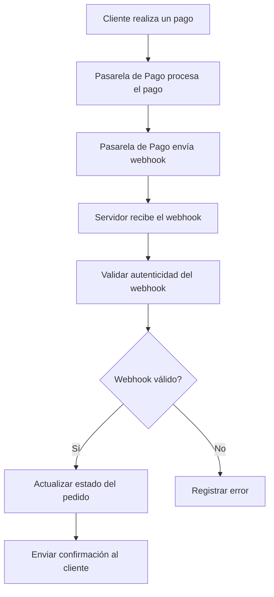

# Unidad: Manejo de Webhooks para Actualizaciones de Pago

## 1. Introducción a la Unidad y Objetivos de Aprendizaje

En esta unidad, nos enfocaremos en el manejo de webhooks para actualizaciones de pago dentro del contexto de un sistema de carrito de compras desarrollado con Django. Los webhooks son una herramienta poderosa que permite a las aplicaciones recibir notificaciones en tiempo real sobre eventos específicos, como actualizaciones de pagos. Al final de esta unidad, los estudiantes serán capaces de:

1. Comprender el concepto y la importancia de los webhooks en la integración de pagos.
2. Configurar y manejar webhooks en Django.
3. Implementar lógica de negocio basada en eventos de pago recibidos a través de webhooks.
4. Asegurar y validar las solicitudes de webhook para evitar fraudes y errores.
5. Realizar pruebas y depuración de webhooks.

## 2. Documento Funcional de Requerimientos

### a. Descripción Detallada de la Funcionalidad

Los webhooks permiten a las aplicaciones recibir notificaciones automáticas de eventos importantes, como actualizaciones de pagos, directamente desde la pasarela de pagos (e.g., Stripe). En el contexto de nuestro sistema de carrito de compras, los webhooks se utilizarán para:

- Recibir notificaciones cuando un pago es exitoso.
- Actualizar el estado del pedido en la base de datos.
- Enviar confirmaciones de pedido al cliente.
- Manejar reembolsos y disputas de pagos.

### b. Casos de Uso

#### Caso de Uso 1: Notificación de Pago Exitoso

**Actor:** Pasarela de Pago (Stripe)

**Descripción:** Cuando un pago es exitoso, la pasarela de pago envía una notificación a nuestro sistema a través de un webhook. Nuestro sistema debe actualizar el estado del pedido a "Pagado" y enviar una confirmación al cliente.

**Flujo Principal:**

1. El cliente realiza un pago en la pasarela de pago.
2. La pasarela de pago envía un webhook a nuestro sistema.
3. Nuestro sistema valida la autenticidad del webhook.
4. Si el webhook es válido, se actualiza el estado del pedido a "Pagado".
5. Se envía una confirmación de pedido al cliente.

#### Caso de Uso 2: Manejo de Reembolsos

**Actor:** Pasarela de Pago (Stripe)

**Descripción:** Cuando se procesa un reembolso, la pasarela de pago envía una notificación a nuestro sistema a través de un webhook. Nuestro sistema debe actualizar el estado del pedido a "Reembolsado" y notificar al cliente.

**Flujo Principal:**

1. Un reembolso es procesado en la pasarela de pago.
2. La pasarela de pago envía un webhook a nuestro sistema.
3. Nuestro sistema valida la autenticidad del webhook.
4. Si el webhook es válido, se actualiza el estado del pedido a "Reembolsado".
5. Se envía una notificación de reembolso al cliente.

### c. Diagramas de Flujo



### d. Requisitos No Funcionales

1. **Seguridad:** Los webhooks deben ser validados para asegurar que provienen de una fuente confiable. Esto incluye la verificación de firmas y la autenticación.
2. **Rendimiento:** El manejo de webhooks debe ser eficiente para no afectar el rendimiento del sistema.
3. **Escalabilidad:** El sistema debe ser capaz de manejar un alto volumen de webhooks sin degradar su rendimiento.
4. **Disponibilidad:** El endpoint de los webhooks debe estar disponible en todo momento para recibir notificaciones en tiempo real.
5. **Registro y Monitoreo:** Todos los eventos de webhook deben ser registrados para auditoría y monitoreo.

## 3. Implementación en Python

### a. Explicación Paso a Paso del Código

Para implementar el manejo de webhooks en Django, seguiremos los siguientes pasos:

1. **Configuración del Endpoint de Webhook:** Crearemos una vista en Django para recibir las notificaciones de webhook.
2. **Validación del Webhook:** Implementaremos la lógica para validar la autenticidad del webhook.
3. **Procesamiento del Webhook:** Actualizaremos el estado del pedido y realizaremos las acciones necesarias basadas en el evento recibido.
4. **Notificación al Cliente:** Enviaremos confirmaciones o notificaciones al cliente según corresponda.

### b. Código Fuente Completo y Comentado

#### Configuración del Endpoint de Webhook

Primero, configuramos una URL en `urls.py` para recibir los webhooks:

```python
# urls.py
from django.urls import path
from . import views

urlpatterns = [
    path('webhook/', views.webhook, name='webhook'),
]
```

#### Implementación de la Vista para Recibir Webhooks

En `views.py`, implementamos la vista para manejar los webhooks:

```python
# views.py
import json
import stripe
from django.conf import settings
from django.http import JsonResponse, HttpResponse
from django.views.decorators.csrf import csrf_exempt
from .models import Order

# Desactivar la protección CSRF para esta vista
@csrf_exempt
def webhook(request):
    payload = request.body
    sig_header = request.META['HTTP_STRIPE_SIGNATURE']
    event = None

    try:
        event = stripe.Webhook.construct_event(
            payload, sig_header, settings.STRIPE_WEBHOOK_SECRET
        )
    except ValueError as e:
        # Invalid payload
        return HttpResponse(status=400)
    except stripe.error.SignatureVerificationError as e:
        # Invalid signature
        return HttpResponse(status=400)

    # Handle the event
    if event['type'] == 'payment_intent.succeeded':
        payment_intent = event['data']['object']
        handle_payment_intent_succeeded(payment_intent)
    elif event['type'] == 'charge.refunded':
        charge = event['data']['object']
        handle_charge_refunded(charge)
    # ... handle other event types

    return JsonResponse({'status': 'success'})

def handle_payment_intent_succeeded(payment_intent):
    # Implementar la lógica para manejar el pago exitoso
    order_id = payment_intent['metadata']['order_id']
    order = Order.objects.get(id=order_id)
    order.status = 'Paid'
    order.save()
    # Enviar confirmación al cliente
    send_order_confirmation(order)

def handle_charge_refunded(charge):
    # Implementar la lógica para manejar el reembolso
    order_id = charge['metadata']['order_id']
    order = Order.objects.get(id=order_id)
    order.status = 'Refunded'
    order.save()
    # Notificar al cliente sobre el reembolso
    send_refund_notification(order)

def send_order_confirmation(order):
    # Implementar el envío de confirmación de pedido
    pass

def send_refund_notification(order):
    # Implementar el envío de notificación de reembolso
    pass
```

### c. Ejemplos de Uso y Pruebas Unitarias

#### Ejemplo de Uso

Para probar el webhook, podemos utilizar la herramienta de pruebas de Stripe para enviar eventos de prueba a nuestro endpoint:

```bash
stripe trigger payment_intent.succeeded
stripe trigger charge.refunded
```

#### Pruebas Unitarias

Implementamos pruebas unitarias para asegurar que nuestra lógica de manejo de webhooks funciona correctamente:

```python
# tests.py
from django.test import TestCase
from django.urls import reverse
from .models import Order

class WebhookTests(TestCase):
    def test_payment_intent_succeeded(self):
        order = Order.objects.create(id=1, status='Pending')
        payload = {
            'type': 'payment_intent.succeeded',
            'data': {
                'object': {
                    'metadata': {
                        'order_id': order.id
                    }
                }
            }
        }
        response = self.client.post(reverse('webhook'), data=json.dumps(payload), content_type='application/json')
        self.assertEqual(response.status_code, 200)
        order.refresh_from_db()
        self.assertEqual(order.status, 'Paid')

    def test_charge_refunded(self):
        order = Order.objects.create(id=1, status='Paid')
        payload = {
            'type': 'charge.refunded',
            'data': {
                'object': {
                    'metadata': {
                        'order_id': order.id
                    }
                }
            }
        }
        response = self.client.post(reverse('webhook'), data=json.dumps(payload), content_type='application/json')
        self.assertEqual(response.status_code, 200)
        order.refresh_from_db()
        self.assertEqual(order.status, 'Refunded')
```

## 4. Mejores Prácticas y Consideraciones de Diseño

### Seguridad

1. **Validación de Firmas:** Siempre validar la firma del webhook para asegurarse de que proviene de una fuente confiable.
2. **Protección CSRF:** Desactivar la protección CSRF solo para el endpoint de webhook.
3. **Registro y Monitoreo:** Registrar todos los eventos de webhook para auditoría y monitoreo.

### Rendimiento

1. **Asincronía:** Considerar el uso de tareas asincrónicas para manejar la lógica de negocio pesada, como el envío de correos electrónicos.
2. **Optimización de Consultas:** Optimizar las consultas a la base de datos para evitar cuellos de botella.

### Escalabilidad

1. **Colas de Mensajes:** Utilizar colas de mensajes para procesar webhooks de manera eficiente y escalable.
2. **Balanceo de Carga:** Implementar balanceo de carga para distribuir el tráfico de webhooks entre múltiples servidores.

### Depuración y Solución de Problemas

1. **Logs Detallados:** Mantener logs detallados de todos los eventos de webhook para facilitar la depuración.
2. **Herramientas de Prueba:** Utilizar herramientas de prueba proporcionadas por la pasarela de pago para simular eventos de webhook.
3. **Alertas:** Configurar alertas para detectar y responder rápidamente a cualquier problema con los webhooks.

Con estos conocimientos y prácticas, estarás bien equipado para manejar webhooks de manera efectiva en tu sistema de carrito de compras con Django.