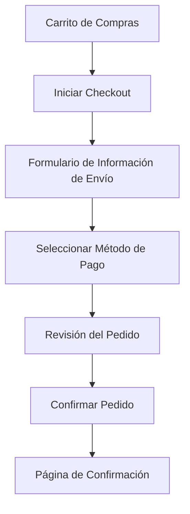

### Unidad: Implementación de Proceso de Checkout

#### Introducción a la Unidad y Objetivos de Aprendizaje

En esta unidad, nos enfocaremos en la implementación del proceso de checkout dentro de un sistema de carrito de compras utilizando Django. El objetivo principal es proporcionar una guía detallada para desarrollar un flujo de checkout eficiente y seguro, que permita a los usuarios completar sus compras de manera intuitiva y sin fricciones. Al finalizar esta unidad, los lectores serán capaces de:

1. Comprender los componentes esenciales de un proceso de checkout.
2. Implementar un flujo de checkout en Django.
3. Integrar el proceso de checkout con una pasarela de pagos (e.g., Stripe).
4. Manejar errores y excepciones durante el proceso de checkout.
5. Aplicar mejores prácticas de seguridad y rendimiento en el flujo de checkout.

#### Documento Funcional de Requerimientos

##### Descripción Detallada de la Funcionalidad

El proceso de checkout es una secuencia de pasos que un usuario sigue para completar una compra en línea. Este proceso incluye la recopilación de información de envío, selección de métodos de pago, confirmación del pedido y finalización de la transacción. Los componentes clave de este flujo son:

1. **Página de Carrito de Compras**: Muestra los productos seleccionados por el usuario.
2. **Formulario de Información de Envío**: Recopila la dirección de envío y otros detalles relevantes.
3. **Selección de Método de Pago**: Permite al usuario elegir entre diferentes opciones de pago.
4. **Revisión del Pedido**: Muestra un resumen del pedido antes de la confirmación.
5. **Confirmación del Pedido**: Finaliza la transacción y muestra un mensaje de confirmación al usuario.

##### Casos de Uso

1. **Caso de Uso 1: Iniciar Proceso de Checkout**
   - **Actor**: Usuario
   - **Descripción**: El usuario inicia el proceso de checkout desde la página del carrito de compras.
   - **Precondiciones**: El usuario ha agregado al menos un producto al carrito.
   - **Flujo Principal**:
     1. El usuario hace clic en el botón "Checkout".
     2. El sistema redirige al formulario de información de envío.

2. **Caso de Uso 2: Completar Información de Envío**
   - **Actor**: Usuario
   - **Descripción**: El usuario completa el formulario de información de envío.
   - **Precondiciones**: El usuario ha iniciado el proceso de checkout.
   - **Flujo Principal**:
     1. El usuario ingresa la dirección de envío y otros detalles.
     2. El usuario hace clic en "Continuar".
     3. El sistema valida la información y redirige a la selección de método de pago.

3. **Caso de Uso 3: Seleccionar Método de Pago**
   - **Actor**: Usuario
   - **Descripción**: El usuario selecciona un método de pago.
   - **Precondiciones**: El usuario ha completado la información de envío.
   - **Flujo Principal**:
     1. El usuario elige un método de pago (e.g., tarjeta de crédito).
     2. El usuario hace clic en "Continuar".
     3. El sistema redirige a la revisión del pedido.

4. **Caso de Uso 4: Revisar y Confirmar Pedido**
   - **Actor**: Usuario
   - **Descripción**: El usuario revisa y confirma el pedido.
   - **Precondiciones**: El usuario ha seleccionado un método de pago.
   - **Flujo Principal**:
     1. El usuario revisa el resumen del pedido.
     2. El usuario hace clic en "Confirmar Pedido".
     3. El sistema procesa el pago y muestra una página de confirmación.

##### Diagramas de Flujo



##### Requisitos No Funcionales

1. **Seguridad**: El proceso de checkout debe cumplir con los estándares de seguridad, incluyendo el uso de HTTPS y la protección de datos sensibles.
2. **Rendimiento**: El sistema debe ser capaz de manejar múltiples transacciones simultáneamente sin degradar el rendimiento.
3. **Usabilidad**: La interfaz de usuario debe ser intuitiva y fácil de usar, minimizando la fricción durante el proceso de checkout.
4. **Escalabilidad**: El sistema debe ser escalable para soportar un aumento en el volumen de transacciones.
5. **Disponibilidad**: El proceso de checkout debe estar disponible 24/7 con un tiempo de inactividad mínimo.

#### Implementación en Python

##### Explicación Paso a Paso del Código

Para implementar el proceso de checkout en Django, seguiremos estos pasos:

1. **Crear Modelos para la Información de Envío y Pedido**: Definiremos modelos para almacenar la información de envío y los detalles del pedido.
2. **Crear Formularios para la Información de Envío y Pago**: Utilizaremos formularios de Django para recopilar la información de envío y los detalles de pago.
3. **Desarrollar Vistas para Cada Paso del Checkout**: Implementaremos vistas basadas en clases para manejar cada paso del proceso de checkout.
4. **Integrar con la Pasarela de Pagos**: Utilizaremos la API de Stripe para procesar los pagos.
5. **Manejar Errores y Excepciones**: Implementaremos manejo de errores para asegurar una experiencia de usuario fluida.

##### Código Fuente Completo y Comentado

1. **Modelos**

```python
from django.db import models
from django.contrib.auth.models import User

class ShippingAddress(models.Model):
    user = models.ForeignKey(User, on_delete=models.CASCADE)
    address = models.CharField(max_length=255)
    city = models.CharField(max_length=100)
    state = models.CharField(max_length=100)
    postal_code = models.CharField(max_length=20)
    country = models.CharField(max_length=100)

    def __str__(self):
        return f"{self.address}, {self.city}, {self.state}, {self.postal_code}, {self.country}"

class Order(models.Model):
    user = models.ForeignKey(User, on_delete=models.CASCADE)
    shipping_address = models.ForeignKey(ShippingAddress, on_delete=models.SET_NULL, null=True)
    total_amount = models.DecimalField(max_digits=10, decimal_places=2)
    created_at = models.DateTimeField(auto_now_add=True)
    updated_at = models.DateTimeField(auto_now=True)
    is_paid = models.BooleanField(default=False)

    def __str__(self):
        return f"Order {self.id} by {self.user.username}"
```

2. **Formularios**

```python
from django import forms
from .models import ShippingAddress

class ShippingAddressForm(forms.ModelForm):
    class Meta:
        model = ShippingAddress
        fields = ['address', 'city', 'state', 'postal_code', 'country']

class PaymentForm(forms.Form):
    card_number = forms.CharField(max_length=16, required=True)
    expiry_date = forms.CharField(max_length=5, required=True)
    cvv = forms.CharField(max_length=3, required=True)
```

3. **Vistas**

```python
from django.shortcuts import render, redirect
from django.views import View
from .models import Order, ShippingAddress
from .forms import ShippingAddressForm, PaymentForm
import stripe

stripe.api_key = "tu_clave_secreta_de_stripe"

class CheckoutView(View):
    def get(self, request):
        form = ShippingAddressForm()
        return render(request, 'checkout/shipping.html', {'form': form})

    def post(self, request):
        form = ShippingAddressForm(request.POST)
        if form.is_valid():
            shipping_address = form.save(commit=False)
            shipping_address.user = request.user
            shipping_address.save()
            request.session['shipping_address_id'] = shipping_address.id
            return redirect('payment')
        return render(request, 'checkout/shipping.html', {'form': form})

class PaymentView(View):
    def get(self, request):
        form = PaymentForm()
        return render(request, 'checkout/payment.html', {'form': form})

    def post(self, request):
        form = PaymentForm(request.POST)
        if form.is_valid():
            shipping_address_id = request.session.get('shipping_address_id')
            shipping_address = ShippingAddress.objects.get(id=shipping_address_id)
            order = Order.objects.create(
                user=request.user,
                shipping_address=shipping_address,
                total_amount=100.00  # Este valor debe calcularse dinámicamente
            )
            try:
                charge = stripe.Charge.create(
                    amount=int(order.total_amount * 100),  # Stripe maneja centavos
                    currency='usd',
                    description=f'Order {order.id}',
                    source=request.POST['stripeToken']
                )
                order.is_paid = True
                order.save()
                return redirect('confirmation')
            except stripe.error.StripeError:
                order.delete()
                return render(request, 'checkout/payment.html', {'form': form, 'error': 'Error al procesar el pago'})
        return render(request, 'checkout/payment.html', {'form': form})

class ConfirmationView(View):
    def get(self, request):
        return render(request, 'checkout/confirmation.html')
```

4. **Plantillas**

- **shipping.html**

```html
<!DOCTYPE html>
<html>
<head>
    <title>Información de Envío</title>
</head>
<body>
    <h1>Información de Envío</h1>
    <form method="post">
        
        {{ form.as_p }}
        <button type="submit">Continuar</button>
    </form>
</body>
</html>
```

- **payment.html**

```html
<!DOCTYPE html>
<html>
<head>
    <title>Pago</title>
</head>
<body>
    <h1>Pago</h1>
    <form method="post">
        
        {{ form.as_p }}
        <button type="submit">Pagar</button>
    </form>
    
        <p style="color: red;">{{ error }}</p>
    
</body>
</html>
```

- **confirmation.html**

```html
<!DOCTYPE html>
<html>
<head>
    <title>Confirmación de Pedido</title>
</head>
<body>
    <h1>¡Gracias por tu compra!</h1>
    <p>Tu pedido ha sido procesado con éxito.</p>
</body>
</html>
```

##### Ejemplos de Uso y Pruebas Unitarias

1. **Ejemplo de Uso**

Para probar el flujo de checkout, sigue estos pasos:

1. Inicia sesión como un usuario registrado.
2. Agrega productos al carrito de compras.
3. Navega a la página del carrito y haz clic en "Checkout".
4. Completa el formulario de información de envío y haz clic en "Continuar".
5. Completa el formulario de pago y haz clic en "Pagar".
6. Verifica que se redirige a la página de confirmación.

2. **Pruebas Unitarias**

```python
from django.test import TestCase
from django.urls import reverse
from django.contrib.auth.models import User
from .models import ShippingAddress, Order

class CheckoutTestCase(TestCase):
    def setUp(self):
        self.user = User.objects.create_user(username='testuser', password='12345')
        self.client.login(username='testuser', password='12345')

    def test_shipping_address_form(self):
        response = self.client.post(reverse('checkout'), {
            'address': '123 Main St',
            'city': 'Springfield',
            'state': 'IL',
            'postal_code': '62701',
            'country': 'USA'
        })
        self.assertEqual(response.status_code, 302)
        self.assertTrue(ShippingAddress.objects.filter(user=self.user).exists())

    def test_payment_form(self):
        shipping_address = ShippingAddress.objects.create(
            user=self.user,
            address='123 Main St',
            city='Springfield',
            state='IL',
            postal_code='62701',
            country='USA'
        )
        self.client.session['shipping_address_id'] = shipping_address.id
        self.client.session.save()
        response = self.client.post(reverse('payment'), {
            'card_number': '4242424242424242',
            'expiry_date': '12/23',
            'cvv': '123',
            'stripeToken': 'tok_visa'
        })
        self.assertEqual(response.status_code, 302)
        self.assertTrue(Order.objects.filter(user=self.user, is_paid=True).exists())
```

#### Mejores Prácticas y Consideraciones de Diseño

1. **Seguridad**: Asegúrate de que todas las páginas del proceso de checkout utilicen HTTPS para proteger la información sensible del usuario. Además, valida y sanitiza todos los datos de entrada para prevenir ataques de inyección.

2. **Rendimiento**: Optimiza las consultas a la base de datos y utiliza técnicas de caché para mejorar el rendimiento del sistema. Considera el uso de colas de tareas para manejar procesos intensivos en segundo plano.

3. **Usabilidad**: Diseña una interfaz de usuario intuitiva y fácil de usar. Proporciona mensajes de error claros y útiles para guiar al usuario en caso de problemas durante el proceso de checkout.

4. **Escalabilidad**: Asegúrate de que el sistema sea escalable para manejar un aumento en el volumen de transacciones. Utiliza servicios de alojamiento escalables y considera la implementación de balanceadores de carga.

5. **Disponibilidad**: Implementa estrategias de alta disponibilidad para minimizar el tiempo de inactividad. Utiliza servicios de monitoreo para detectar y resolver problemas rápidamente.

6. **Depuración y Solución de Problemas**: Implementa un sistema de registro de errores para facilitar la depuración y solución de problemas. Proporciona una página de error amigable para el usuario en caso de fallos durante el proceso de checkout.

Al seguir estas mejores prácticas y consideraciones de diseño, podrás implementar un proceso de checkout eficiente, seguro y escalable en tu sistema de carrito de compras con Django.