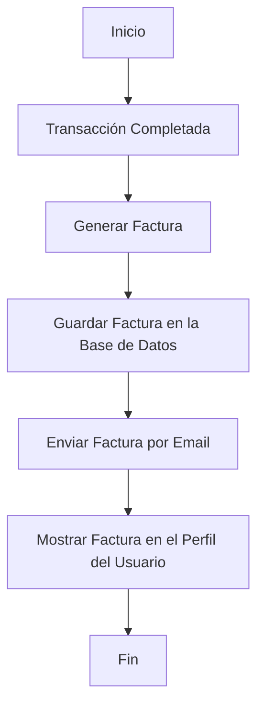

# Unidad: Generación de Facturas con django-invoicing

## Introducción a la Unidad y Objetivos de Aprendizaje

En esta unidad, nos enfocaremos en la generación de facturas utilizando la librería `django-invoicing` dentro del contexto de un sistema de carrito de compras desarrollado con Django. Este tema es crucial para cualquier aplicación de comercio electrónico, ya que las facturas son documentos esenciales que registran las transacciones entre el vendedor y el comprador. Al finalizar esta unidad, los lectores estarán capacitados para:

1. Comprender la importancia de la generación de facturas en un sistema de comercio electrónico.
2. Configurar y utilizar la librería `django-invoicing` para generar facturas.
3. Integrar la generación de facturas en el flujo de trabajo del sistema de carrito de compras.
4. Implementar pruebas unitarias para asegurar la correcta generación de facturas.
5. Aplicar mejores prácticas y consideraciones de diseño en la generación de facturas.

## Documento Funcional de Requerimientos

### Descripción Detallada de la Funcionalidad

La funcionalidad de generación de facturas permitirá al sistema de carrito de compras crear y gestionar facturas para cada transacción completada. Las facturas deben incluir información detallada sobre los productos comprados, precios, impuestos, descuentos aplicados, y los datos del comprador y vendedor. La librería `django-invoicing` será utilizada para facilitar esta tarea.

### Casos de Uso

1. **Generación Automática de Facturas**: Al completar una transacción, el sistema debe generar automáticamente una factura y enviarla al correo electrónico del comprador.
2. **Visualización de Facturas**: Los usuarios deben poder visualizar y descargar sus facturas desde su cuenta.
3. **Administración de Facturas**: Los administradores deben poder acceder a todas las facturas generadas, filtrarlas por fecha, cliente, etc., y exportarlas en formato PDF o CSV.

### Diagramas de Flujo



### Requisitos No Funcionales

1. **Seguridad**: Las facturas deben ser accesibles solo por los usuarios autorizados. La información contenida en las facturas debe estar protegida.
2. **Rendimiento**: La generación de facturas debe ser rápida y no afectar el rendimiento general del sistema.
3. **Escalabilidad**: El sistema debe ser capaz de manejar un gran volumen de facturas sin degradar su rendimiento.
4. **Mantenibilidad**: El código debe ser claro y bien documentado para facilitar futuras modificaciones y mejoras.

## Implementación en Python

### Explicación Paso a Paso del Código

1. **Instalación de django-invoicing**:
   Para comenzar, necesitamos instalar la librería `django-invoicing`. Esto se puede hacer utilizando pip:
   ```bash
   pip install django-invoicing
   ```

2. **Configuración Inicial**:
   Agregamos `django-invoicing` a la lista de aplicaciones instaladas en `settings.py`:
   ```python
   INSTALLED_APPS = [
       ...
       'django_invoicing',
   ]
   ```

3. **Modelos de Factura**:
   Definimos los modelos necesarios para almacenar la información de las facturas. `django-invoicing` proporciona modelos predefinidos que podemos extender si es necesario.

4. **Generación de Facturas**:
   Implementamos la lógica para generar una factura cuando se completa una transacción. Esto puede hacerse en la vista o señal correspondiente.

5. **Envío de Facturas por Email**:
   Utilizamos el sistema de correo de Django para enviar la factura generada al correo electrónico del comprador.

6. **Visualización y Administración de Facturas**:
   Creamos vistas y plantillas para que los usuarios puedan ver y descargar sus facturas, y para que los administradores puedan gestionar todas las facturas.

### Código Fuente Completo y Comentado

```python
# models.py
from django.db import models
from django_invoicing.models import Invoice

class CustomInvoice(Invoice):
    # Podemos extender el modelo de Invoice si necesitamos campos adicionales
    pass

# signals.py
from django.db.models.signals import post_save
from django.dispatch import receiver
from .models import Order, CustomInvoice

@receiver(post_save, sender=Order)
def generate_invoice(sender, instance, created, **kwargs):
    if created and instance.status == 'completed':
        invoice = CustomInvoice.objects.create(
            order=instance,
            customer=instance.customer,
            total_amount=instance.total_amount,
            # Otros campos necesarios
        )
        invoice.save()
        send_invoice_email(invoice)

# utils.py
from django.core.mail import send_mail
from django.template.loader import render_to_string
from .models import CustomInvoice

def send_invoice_email(invoice):
    subject = 'Su factura de compra'
    message = render_to_string('invoice_email.html', {'invoice': invoice})
    send_mail(subject, message, 'from@example.com', [invoice.customer.email])

# views.py
from django.shortcuts import render, get_object_or_404
from django.contrib.auth.decorators import login_required
from .models import CustomInvoice

@login_required
def view_invoice(request, invoice_id):
    invoice = get_object_or_404(CustomInvoice, id=invoice_id, customer=request.user)
    return render(request, 'invoice_detail.html', {'invoice': invoice})

# admin.py
from django.contrib import admin
from .models import CustomInvoice

@admin.register(CustomInvoice)
class CustomInvoiceAdmin(admin.ModelAdmin):
    list_display = ('id', 'customer', 'total_amount', 'created_at')
    search_fields = ('customer__name', 'id')
    list_filter = ('created_at',)
```

### Ejemplos de Uso y Pruebas Unitarias

#### Ejemplo de Uso

1. **Generación de Factura**:
   Cuando un usuario completa una compra, se genera automáticamente una factura y se envía por correo electrónico.

2. **Visualización de Factura**:
   El usuario puede acceder a su perfil y ver todas las facturas generadas para sus compras.

#### Pruebas Unitarias

```python
# tests.py
from django.test import TestCase
from django.contrib.auth.models import User
from .models import Order, CustomInvoice

class InvoiceGenerationTest(TestCase):
    def setUp(self):
        self.user = User.objects.create_user(username='testuser', password='12345')
        self.order = Order.objects.create(customer=self.user, total_amount=100.0, status='completed')

    def test_invoice_creation(self):
        self.assertEqual(CustomInvoice.objects.count(), 1)
        invoice = CustomInvoice.objects.first()
        self.assertEqual(invoice.customer, self.user)
        self.assertEqual(invoice.total_amount, 100.0)

    def test_invoice_email(self):
        # Aquí podríamos simular el envío de correo y verificar que se envió correctamente
        pass
```

## Mejores Prácticas y Consideraciones de Diseño

1. **Seguridad**:
   - Asegúrese de que solo los usuarios autenticados puedan acceder a sus facturas.
   - Utilice HTTPS para proteger la transmisión de datos sensibles.

2. **Rendimiento**:
   - Optimice las consultas a la base de datos para evitar cargas innecesarias.
   - Utilice caché para almacenar temporalmente las facturas generadas si es necesario.

3. **Escalabilidad**:
   - Diseñe el sistema para manejar un gran volumen de transacciones y facturas.
   - Considere el uso de servicios de almacenamiento externo para las facturas.

4. **Mantenibilidad**:
   - Mantenga el código bien documentado y organizado.
   - Escriba pruebas unitarias para asegurar la correcta funcionalidad del sistema.

5. **Depuración y Solución de Problemas**:
   - Utilice herramientas de logging para rastrear errores y problemas en la generación de facturas.
   - Realice pruebas exhaustivas en un entorno de desarrollo antes de desplegar cambios en producción.

Al seguir estas mejores prácticas y consideraciones de diseño, podrá implementar un sistema robusto y eficiente para la generación de facturas en su aplicación de carrito de compras con Django.