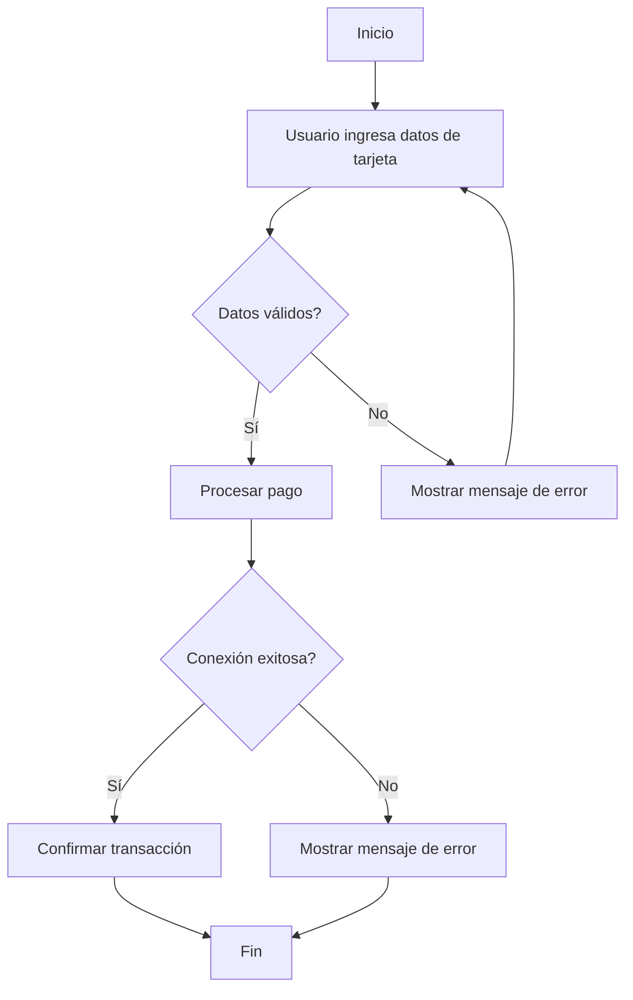

# Unidad: Manejo de errores y casos de borde en pagos

## Introducción a la unidad y objetivos de aprendizaje

En esta unidad, nos enfocaremos en el manejo de errores y casos de borde en el proceso de pagos dentro de un sistema de carrito de compras desarrollado con Django. A lo largo de esta unidad, aprenderás a identificar y gestionar errores comunes que pueden ocurrir durante el proceso de pago, así como a manejar casos de borde que podrían afectar la experiencia del usuario y la integridad de los datos. Al finalizar esta unidad, estarás capacitado para:

1. Identificar y categorizar errores comunes en el proceso de pagos.
2. Implementar estrategias de manejo de errores en Django.
3. Gestionar casos de borde para garantizar la robustez del sistema.
4. Utilizar técnicas de depuración y pruebas unitarias para asegurar la calidad del código.

## Documento funcional de requerimientos

### Descripción detallada de la funcionalidad

El manejo de errores y casos de borde en pagos es crucial para garantizar una experiencia de usuario fluida y la integridad de los datos en un sistema de carrito de compras. Esta funcionalidad incluye la detección, registro y manejo de errores que pueden ocurrir durante el proceso de pago, así como la gestión de situaciones excepcionales que podrían comprometer la transacción.

#### Funcionalidades clave:

1. **Detección de errores en tiempo real**: Identificar errores durante el proceso de pago y proporcionar retroalimentación inmediata al usuario.
2. **Registro de errores**: Almacenar información detallada sobre los errores ocurridos para su análisis posterior.
3. **Manejo de casos de borde**: Gestionar situaciones excepcionales como pagos duplicados, transacciones fallidas, y problemas de conectividad.
4. **Notificaciones**: Informar al usuario y al administrador del sistema sobre errores críticos y casos de borde.

### Casos de uso

#### Caso de uso 1: Error de validación de tarjeta de crédito

**Descripción**: Un usuario intenta realizar un pago con una tarjeta de crédito inválida.

**Actor principal**: Usuario

**Flujo principal**:
1. El usuario ingresa los datos de su tarjeta de crédito en el formulario de pago.
2. El sistema valida los datos de la tarjeta.
3. Si los datos son inválidos, el sistema muestra un mensaje de error al usuario y solicita la corrección de los datos.

**Flujo alternativo**:
1. El usuario ingresa los datos de su tarjeta de crédito en el formulario de pago.
2. El sistema valida los datos de la tarjeta.
3. Si los datos son válidos, el sistema procede con la transacción.

#### Caso de uso 2: Problema de conectividad con la pasarela de pagos

**Descripción**: Durante el proceso de pago, se pierde la conexión con la pasarela de pagos.

**Actor principal**: Usuario

**Flujo principal**:
1. El usuario confirma el pago.
2. El sistema intenta comunicarse con la pasarela de pagos.
3. Si la conexión falla, el sistema muestra un mensaje de error al usuario y sugiere intentar nuevamente más tarde.

**Flujo alternativo**:
1. El usuario confirma el pago.
2. El sistema se comunica exitosamente con la pasarela de pagos.
3. La transacción se completa y el usuario recibe una confirmación.

### Diagramas de flujo



### Requisitos no funcionales

1. **Rendimiento**: El sistema debe manejar errores y casos de borde sin afectar significativamente el tiempo de respuesta del proceso de pago.
2. **Escalabilidad**: El sistema debe ser capaz de manejar un aumento en la cantidad de transacciones y errores sin degradar su rendimiento.
3. **Seguridad**: Los datos de pago y los errores deben ser manejados de manera segura para proteger la información sensible del usuario.
4. **Mantenibilidad**: El código debe ser claro y modular para facilitar su mantenimiento y actualización.

## Implementación en Python

### Explicación paso a paso del código

Para implementar el manejo de errores y casos de borde en pagos, utilizaremos Django y algunas librerías adicionales como `requests` para manejar la comunicación con la pasarela de pagos. A continuación, se presenta una explicación detallada del código.

1. **Configuración del entorno**: Asegúrate de tener Django instalado y configurado. Además, instala la librería `requests` si aún no lo has hecho.

```bash
pip install django requests
```

2. **Modelo de errores**: Crea un modelo para registrar los errores en la base de datos.

```python
# models.py
from django.db import models

class PaymentError(models.Model):
    timestamp = models.DateTimeField(auto_now_add=True)
    error_message = models.TextField()
    user = models.ForeignKey('auth.User', on_delete=models.CASCADE)
    transaction_id = models.CharField(max_length=100, null=True, blank=True)

    def __str__(self):
        return f"{self.timestamp} - {self.user} - {self.error_message}"
```

3. **Vista para manejar el pago**: Implementa una vista que maneje el proceso de pago y capture los errores.

```python
# views.py
from django.shortcuts import render, redirect
from django.contrib import messages
from .models import PaymentError
import requests

def process_payment(request):
    if request.method == 'POST':
        card_number = request.POST.get('card_number')
        expiry_date = request.POST.get('expiry_date')
        cvv = request.POST.get('cvv')
        amount = request.POST.get('amount')

        # Validar datos de la tarjeta
        if not validate_card(card_number, expiry_date, cvv):
            messages.error(request, "Datos de tarjeta inválidos.")
            return redirect('payment_page')

        try:
            # Intentar procesar el pago
            response = requests.post('https://api.pasarela-de-pagos.com/pagar', data={
                'card_number': card_number,
                'expiry_date': expiry_date,
                'cvv': cvv,
                'amount': amount
            })
            response.raise_for_status()
        except requests.exceptions.RequestException as e:
            # Registrar error en la base de datos
            PaymentError.objects.create(
                error_message=str(e),
                user=request.user
            )
            messages.error(request, "Hubo un problema con la pasarela de pagos. Por favor, intente nuevamente.")
            return redirect('payment_page')

        # Verificar respuesta de la pasarela de pagos
        if response.json().get('status') != 'success':
            PaymentError.objects.create(
                error_message=response.json().get('message'),
                user=request.user,
                transaction_id=response.json().get('transaction_id')
            )
            messages.error(request, "El pago no se pudo completar. Por favor, intente nuevamente.")
            return redirect('payment_page')

        # Pago exitoso
        messages.success(request, "Pago realizado con éxito.")
        return redirect('success_page')

    return render(request, 'payment_page.html')

def validate_card(card_number, expiry_date, cvv):
    # Implementar lógica de validación de tarjeta
    if len(card_number) != 16 or not card_number.isdigit():
        return False
    if len(cvv) != 3 or not cvv.isdigit():
        return False
    # Validar fecha de expiración (formato MM/AA)
    try:
        month, year = map(int, expiry_date.split('/'))
        if month < 1 or month > 12:
            return False
        if year < 22:  # Asumiendo que el año actual es 2022
            return False
    except ValueError:
        return False
    return True
```

### Código fuente completo y comentado

```python
# models.py
from django.db import models

class PaymentError(models.Model):
    timestamp = models.DateTimeField(auto_now_add=True)
    error_message = models.TextField()
    user = models.ForeignKey('auth.User', on_delete=models.CASCADE)
    transaction_id = models.CharField(max_length=100, null=True, blank=True)

    def __str__(self):
        return f"{self.timestamp} - {self.user} - {self.error_message}"

# views.py
from django.shortcuts import render, redirect
from django.contrib import messages
from .models import PaymentError
import requests

def process_payment(request):
    if request.method == 'POST':
        card_number = request.POST.get('card_number')
        expiry_date = request.POST.get('expiry_date')
        cvv = request.POST.get('cvv')
        amount = request.POST.get('amount')

        # Validar datos de la tarjeta
        if not validate_card(card_number, expiry_date, cvv):
            messages.error(request, "Datos de tarjeta inválidos.")
            return redirect('payment_page')

        try:
            # Intentar procesar el pago
            response = requests.post('https://api.pasarela-de-pagos.com/pagar', data={
                'card_number': card_number,
                'expiry_date': expiry_date,
                'cvv': cvv,
                'amount': amount
            })
            response.raise_for_status()
        except requests.exceptions.RequestException as e:
            # Registrar error en la base de datos
            PaymentError.objects.create(
                error_message=str(e),
                user=request.user
            )
            messages.error(request, "Hubo un problema con la pasarela de pagos. Por favor, intente nuevamente.")
            return redirect('payment_page')

        # Verificar respuesta de la pasarela de pagos
        if response.json().get('status') != 'success':
            PaymentError.objects.create(
                error_message=response.json().get('message'),
                user=request.user,
                transaction_id=response.json().get('transaction_id')
            )
            messages.error(request, "El pago no se pudo completar. Por favor, intente nuevamente.")
            return redirect('payment_page')

        # Pago exitoso
        messages.success(request, "Pago realizado con éxito.")
        return redirect('success_page')

    return render(request, 'payment_page.html')

def validate_card(card_number, expiry_date, cvv):
    # Implementar lógica de validación de tarjeta
    if len(card_number) != 16 or not card_number.isdigit():
        return False
    if len(cvv) != 3 or not cvv.isdigit():
        return False
    # Validar fecha de expiración (formato MM/AA)
    try:
        month, year = map(int, expiry_date.split('/'))
        if month < 1 or month > 12:
            return False
        if year < 22:  # Asumiendo que el año actual es 2022
            return False
    except ValueError:
        return False
    return True
```

### Ejemplos de uso y pruebas unitarias

Para asegurarnos de que nuestra implementación es robusta, es fundamental realizar pruebas unitarias. Utilizaremos el framework de pruebas de Django para este propósito.

```python
# tests.py
from django.test import TestCase
from django.contrib.auth.models import User
from .models import PaymentError
from .views import validate_card

class PaymentTests(TestCase):

    def setUp(self):
        self.user = User.objects.create_user(username='testuser', password='12345')

    def test_validate_card(self):
        self.assertTrue(validate_card('1234567812345678', '12/23', '123'))
        self.assertFalse(validate_card('12345678', '12/23', '123'))
        self.assertFalse(validate_card('1234567812345678', '13/23', '123'))
        self.assertFalse(validate_card('1234567812345678', '12/21', '123'))
        self.assertFalse(validate_card('1234567812345678', '12/23', '12'))

    def test_process_payment_invalid_card(self):
        self.client.login(username='testuser', password='12345')
        response = self.client.post('/process_payment/', {
            'card_number': '12345678',
            'expiry_date': '12/23',
            'cvv': '123',
            'amount': '100'
        })
        self.assertEqual(response.status_code, 302)
        self.assertEqual(PaymentError.objects.count(), 0)

    def test_process_payment_valid_card(self):
        self.client.login(username='testuser', password='12345')
        with self.assertRaises(requests.exceptions.RequestException):
            self.client.post('/process_payment/', {
                'card_number': '1234567812345678',
                'expiry_date': '12/23',
                'cvv': '123',
                'amount': '100'
            })
        self.assertEqual(PaymentError.objects.count(), 1)
```

## Mejores prácticas y consideraciones de diseño

1. **Registro exhaustivo de errores**: Asegúrate de registrar todos los errores relevantes, incluyendo detalles como el usuario afectado y el contexto de la transacción. Esto facilitará la depuración y el análisis posterior.

2. **Retroalimentación al usuario**: Proporciona mensajes de error claros y útiles al usuario. Evita mensajes técnicos y enfócate en instrucciones que el usuario pueda seguir para corregir el problema.

3. **Pruebas unitarias y de integración**: Implementa pruebas unitarias y de integración para asegurar que el manejo de errores y casos de borde funcione correctamente. Esto incluye pruebas para diferentes escenarios de error y casos de borde.

4. **Seguridad**: Asegúrate de que los datos de pago y los errores se manejen de manera segura. Evita registrar información sensible como números de tarjeta de crédito en los registros de errores.

5. **Mantenibilidad**: Mantén el código modular y bien documentado. Esto facilitará su mantenimiento y actualización en el futuro.

6. **Monitoreo y alertas**: Implementa un sistema de monitoreo y alertas para detectar y responder rápidamente a errores críticos y casos de borde. Esto puede incluir el uso de herramientas de monitoreo de aplicaciones y servicios de notificación.

En resumen, el manejo de errores y casos de borde en pagos es una parte esencial de cualquier sistema de carrito de compras. Al seguir las mejores prácticas y utilizar un enfoque sistemático para la detección, registro y manejo de errores, puedes garantizar una experiencia de usuario fluida y la integridad de los datos en tu aplicación.