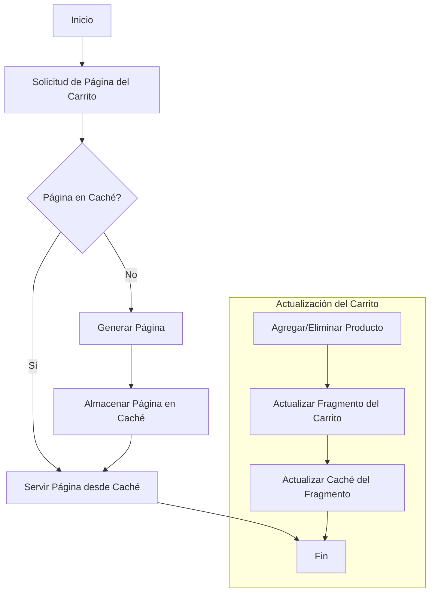

# Unidad: Implementación de Caché con Django's Cache Framework

## 1. Introducción a la Unidad y Objetivos de Aprendizaje

En esta unidad, exploraremos en profundidad cómo implementar y optimizar el uso de caché en un sistema de carrito de compras desarrollado con Django. La caché es una técnica esencial para mejorar el rendimiento y la escalabilidad de aplicaciones web, permitiendo almacenar temporalmente datos frecuentemente solicitados para reducir la carga en el servidor y acelerar los tiempos de respuesta.

### Objetivos de Aprendizaje

Al finalizar esta unidad, los lectores serán capaces de:
1. Comprender los conceptos básicos y avanzados del uso de caché en Django.
2. Implementar diferentes estrategias de caché en un sistema de carrito de compras.
3. Configurar y utilizar el framework de caché de Django para optimizar el rendimiento.
4. Realizar pruebas y validaciones para asegurar la correcta implementación de la caché.
5. Aplicar mejores prácticas y consideraciones de diseño para el uso eficiente de la caché.

## 2. Documento Funcional de Requerimientos

### a. Descripción Detallada de la Funcionalidad

La funcionalidad de caché en un sistema de carrito de compras tiene como objetivo principal mejorar el rendimiento del sistema, reduciendo el tiempo de carga de las páginas y la carga en el servidor. La implementación de caché en Django se puede realizar en varios niveles, incluyendo caché de vistas, caché de fragmentos y caché de datos.

**Caché de Vistas:** Almacena el resultado de una vista completa, de modo que las solicitudes posteriores pueden ser servidas directamente desde la caché.

**Caché de Fragmentos:** Permite almacenar partes específicas de una página, como el contenido de un carrito de compras, para evitar la regeneración completa de la página.

**Caché de Datos:** Almacena datos específicos, como resultados de consultas a la base de datos, para reducir el tiempo de acceso a estos datos.

### b. Casos de Uso

1. **Caché de Vistas para la Página Principal del Carrito:**
   - **Actor:** Usuario
   - **Descripción:** Cuando un usuario accede a la página principal del carrito de compras, el sistema debe servir la página desde la caché si está disponible, reduciendo el tiempo de carga.
   - **Precondiciones:** La página debe haber sido visitada previamente y almacenada en la caché.
   - **Postcondiciones:** El usuario ve la página del carrito de compras rápidamente.

2. **Caché de Fragmentos para el Contenido del Carrito:**
   - **Actor:** Usuario
   - **Descripción:** Al agregar o eliminar productos del carrito, solo el fragmento del carrito debe actualizarse en la caché, mientras que el resto de la página permanece sin cambios.
   - **Precondiciones:** El usuario debe estar interactuando con el carrito de compras.
   - **Postcondiciones:** El contenido del carrito se actualiza rápidamente sin recargar toda la página.

3. **Caché de Datos para Consultas de Productos:**
   - **Actor:** Sistema
   - **Descripción:** Las consultas frecuentes a la base de datos para obtener información de productos deben ser almacenadas en la caché para reducir el tiempo de acceso.
   - **Precondiciones:** Los datos de productos deben ser solicitados frecuentemente.
   - **Postcondiciones:** Las consultas a la base de datos se reducen, mejorando el rendimiento del sistema.

### c. Diagramas de Flujo (en mermaid)



### d. Requisitos No Funcionales

1. **Rendimiento:** La implementación de la caché debe mejorar significativamente los tiempos de respuesta de las páginas del carrito de compras.
2. **Escalabilidad:** El sistema debe ser capaz de manejar un aumento en el número de usuarios concurrentes sin degradar el rendimiento.
3. **Consistencia:** La caché debe ser actualizada adecuadamente para reflejar los cambios en los datos del carrito de compras.
4. **Seguridad:** La caché no debe almacenar información sensible sin las debidas medidas de seguridad.
5. **Mantenibilidad:** El código relacionado con la caché debe ser fácil de entender y mantener.

## 3. Implementación en Python

### a. Explicación Paso a Paso del Código

Para implementar la caché en nuestro sistema de carrito de compras con Django, seguiremos los siguientes pasos:

1. **Configuración de la Caché en Django:**
   - Django soporta varios backends de caché, como Memcached, Redis y caché en memoria local. Configuraremos el backend de caché en el archivo `settings.py`.

2. **Implementación de Caché de Vistas:**
   - Utilizaremos los decoradores de caché de Django para almacenar el resultado de vistas completas.

3. **Implementación de Caché de Fragmentos:**
   - Utilizaremos la plantilla de caché de Django para almacenar partes específicas de una página.

4. **Implementación de Caché de Datos:**
   - Utilizaremos la API de caché de Django para almacenar y recuperar datos específicos.

### b. Código Fuente Completo y Comentado

#### Configuración de la Caché en `settings.py`

```python
# settings.py

# Configuración del backend de caché
CACHES = {
    'default': {
        'BACKEND': 'django.core.cache.backends.memcached.MemcachedCache',
        'LOCATION': '127.0.0.1:11211',
    }
}
```

#### Implementación de Caché de Vistas

```python
# views.py
from django.views.decorators.cache import cache_page
from django.shortcuts import render

@cache_page(60 * 15)  # Cachear la vista por 15 minutos
def carrito_view(request):
    # Lógica para obtener los datos del carrito
    productos = obtener_productos_del_carrito(request)
    return render(request, 'carrito.html', {'productos': productos})
```

#### Implementación de Caché de Fragmentos

```html
<!-- carrito.html -->


<div id="carrito">
    
        <div class="producto">
            <h2>{{ producto.nombre }}</h2>
            <p>{{ producto.precio }}</p>
        </div>
    
</div>

```

#### Implementación de Caché de Datos

```python
# utils.py
from django.core.cache import cache

def obtener_productos():
    productos = cache.get('productos')
    if not productos:
        productos = Producto.objects.all()
        cache.set('productos', productos, 60 * 15)  # Cachear por 15 minutos
    return productos
```

### c. Ejemplos de Uso y Pruebas Unitarias

#### Ejemplo de Uso

```python
# views.py
from django.shortcuts import render
from .utils import obtener_productos

def productos_view(request):
    productos = obtener_productos()
    return render(request, 'productos.html', {'productos': productos})
```

#### Pruebas Unitarias

```python
# tests.py
from django.test import TestCase
from django.core.cache import cache
from .models import Producto

class CacheTests(TestCase):
    def setUp(self):
        Producto.objects.create(nombre="Producto 1", precio=100)
        Producto.objects.create(nombre="Producto 2", precio=200)

    def test_obtener_productos(self):
        productos = obtener_productos()
        self.assertEqual(len(productos), 2)
        cache.clear()
        productos = obtener_productos()
        self.assertEqual(len(productos), 2)
```

## 4. Mejores Prácticas y Consideraciones de Diseño

### Mejores Prácticas

1. **Elegir el Backend de Caché Adecuado:** Seleccionar el backend de caché que mejor se adapte a las necesidades de la aplicación. Memcached y Redis son opciones populares para aplicaciones de alta concurrencia.
2. **Configurar el Tiempo de Expiración:** Establecer tiempos de expiración adecuados para los datos en caché para asegurar que la información no se vuelva obsoleta.
3. **Invalidación de Caché:** Implementar mecanismos para invalidar la caché cuando los datos subyacentes cambian, asegurando la consistencia de la información.
4. **Monitoreo y Análisis:** Utilizar herramientas de monitoreo para analizar el rendimiento de la caché y ajustar la configuración según sea necesario.

### Consideraciones de Diseño

1. **Consistencia de Datos:** Asegurar que los datos en caché sean consistentes con los datos en la base de datos, especialmente en aplicaciones que manejan transacciones.
2. **Seguridad:** No almacenar información sensible en la caché sin las debidas medidas de seguridad, como cifrado.
3. **Escalabilidad:** Diseñar la caché para que pueda escalar horizontalmente, distribuyendo la carga entre múltiples servidores de caché.
4. **Mantenibilidad:** Escribir código de caché que sea fácil de entender y mantener, documentando claramente las estrategias de caché utilizadas.

### Consejos para la Depuración y Solución de Problemas Comunes

1. **Verificar la Configuración del Backend:** Asegurarse de que el backend de caché esté correctamente configurado y en funcionamiento.
2. **Revisar los Tiempos de Expiración:** Ajustar los tiempos de expiración si los datos en caché se vuelven obsoletos demasiado rápido o permanecen en caché por demasiado tiempo.
3. **Monitorear el Uso de la Caché:** Utilizar herramientas de monitoreo para identificar cuellos de botella y ajustar la configuración de la caché en consecuencia.
4. **Probar la Invalidación de Caché:** Asegurarse de que los mecanismos de invalidación de caché funcionen correctamente para mantener la consistencia de los datos.

Con esta unidad, hemos cubierto en detalle cómo implementar y optimizar el uso de caché en un sistema de carrito de compras con Django. Al seguir estas prácticas y consideraciones, los desarrolladores pueden mejorar significativamente el rendimiento y la escalabilidad de sus aplicaciones.