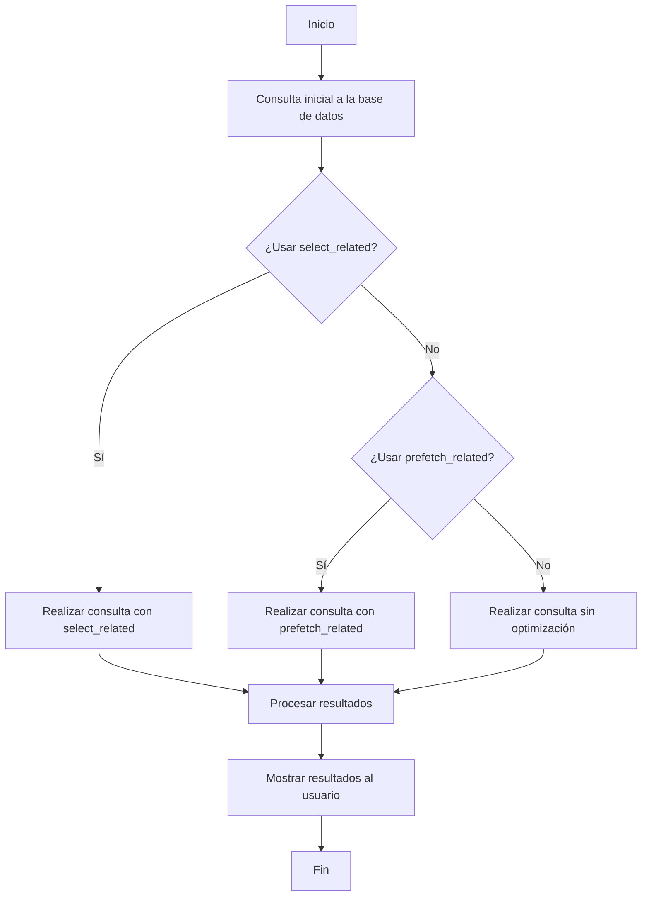

# Unidad: Optimización de consultas con `select_related` y `prefetch_related`

## Introducción a la unidad y objetivos de aprendizaje

En esta unidad, nos enfocaremos en la optimización de consultas en Django utilizando las técnicas `select_related` y `prefetch_related`. Estas herramientas son fundamentales para mejorar el rendimiento de una aplicación web, especialmente en sistemas complejos como un carrito de compras. Al finalizar esta unidad, serás capaz de:

1. Comprender la diferencia entre `select_related` y `prefetch_related`.
2. Implementar estas técnicas en un proyecto Django.
3. Evaluar el impacto de estas optimizaciones en el rendimiento de la aplicación.
4. Aplicar mejores prácticas para el uso de `select_related` y `prefetch_related`.

## Documento funcional de requerimientos

### Descripción detallada de la funcionalidad

El objetivo principal de esta unidad es optimizar las consultas a la base de datos en un sistema de carrito de compras utilizando `select_related` y `prefetch_related`. Estas técnicas permiten reducir el número de consultas a la base de datos, mejorando así el tiempo de respuesta de la aplicación.

### Casos de uso

1. **Caso de uso 1: Visualización de productos en el carrito**
   - **Descripción**: El usuario agrega varios productos al carrito y desea visualizar los detalles de cada producto.
   - **Requerimientos**: La aplicación debe cargar los detalles de los productos de manera eficiente, minimizando el número de consultas a la base de datos.

2. **Caso de uso 2: Listado de órdenes del usuario**
   - **Descripción**: El usuario desea ver un historial de sus órdenes, incluyendo los detalles de cada producto en cada orden.
   - **Requerimientos**: La aplicación debe cargar los detalles de las órdenes y los productos asociados de manera eficiente.

### Diagramas de flujo



### Requisitos no funcionales

1. **Rendimiento**: Las consultas optimizadas deben reducir el tiempo de respuesta en al menos un 30% en comparación con las consultas no optimizadas.
2. **Escalabilidad**: La solución debe ser escalable para manejar un aumento en el número de usuarios y productos sin degradar significativamente el rendimiento.
3. **Mantenibilidad**: El código debe ser claro y fácil de mantener, con comentarios adecuados y siguiendo las mejores prácticas de Django.

## Implementación en Python

### Explicación paso a paso del código

Para ilustrar el uso de `select_related` y `prefetch_related`, utilizaremos un ejemplo de un sistema de carrito de compras con dos modelos principales: `Order` y `Product`.

#### Modelos

```python
from django.db import models

class Product(models.Model):
    name = models.CharField(max_length=255)
    price = models.DecimalField(max_digits=10, decimal_places=2)

    def __str__(self):
        return self.name

class Order(models.Model):
    user = models.ForeignKey('auth.User', on_delete=models.CASCADE)
    products = models.ManyToManyField(Product, through='OrderProduct')
    created_at = models.DateTimeField(auto_now_add=True)

    def __str__(self):
        return f"Order {self.id} by {self.user.username}"

class OrderProduct(models.Model):
    order = models.ForeignKey(Order, on_delete=models.CASCADE)
    product = models.ForeignKey(Product, on_delete=models.CASCADE)
    quantity = models.PositiveIntegerField()

    def __str__(self):
        return f"{self.quantity} x {self.product.name} in order {self.order.id}"
```

#### Uso de `select_related`

`select_related` se utiliza para realizar una unión SQL y obtener los datos relacionados en una sola consulta. Es útil para relaciones `ForeignKey` y `OneToOne`.

```python
# Consultar órdenes y usuarios usando select_related
orders = Order.objects.select_related('user').all()

for order in orders:
    print(f"Order ID: {order.id}, User: {order.user.username}")
```

#### Uso de `prefetch_related`

`prefetch_related` se utiliza para realizar múltiples consultas y luego hacer la unión en Python. Es útil para relaciones `ManyToMany` y `ForeignKey` inversas.

```python
# Consultar órdenes y productos usando prefetch_related
orders = Order.objects.prefetch_related('products').all()

for order in orders:
    print(f"Order ID: {order.id}")
    for product in order.products.all():
        print(f"Product: {product.name}, Price: {product.price}")
```

### Código fuente completo y comentado

```python
from django.db import models

# Definición de los modelos
class Product(models.Model):
    name = models.CharField(max_length=255)
    price = models.DecimalField(max_digits=10, decimal_places=2)

    def __str__(self):
        return self.name

class Order(models.Model):
    user = models.ForeignKey('auth.User', on_delete=models.CASCADE)
    products = models.ManyToManyField(Product, through='OrderProduct')
    created_at = models.DateTimeField(auto_now_add=True)

    def __str__(self):
        return f"Order {self.id} by {self.user.username}"

class OrderProduct(models.Model):
    order = models.ForeignKey(Order, on_delete=models.CASCADE)
    product = models.ForeignKey(Product, on_delete=models.CASCADE)
    quantity = models.PositiveIntegerField()

    def __str__(self):
        return f"{self.quantity} x {self.product.name} in order {self.order.id}"

# Uso de select_related para optimizar consultas de órdenes y usuarios
orders = Order.objects.select_related('user').all()

for order in orders:
    print(f"Order ID: {order.id}, User: {order.user.username}")

# Uso de prefetch_related para optimizar consultas de órdenes y productos
orders = Order.objects.prefetch_related('products').all()

for order in orders:
    print(f"Order ID: {order.id}")
    for product in order.products.all():
        print(f"Product: {product.name}, Price: {product.price}")
```

### Ejemplos de uso y pruebas unitarias

#### Ejemplo de uso

```python
# Crear algunos productos
product1 = Product.objects.create(name="Laptop", price=1000.00)
product2 = Product.objects.create(name="Mouse", price=50.00)

# Crear una orden y agregar productos
order = Order.objects.create(user=some_user)
OrderProduct.objects.create(order=order, product=product1, quantity=1)
OrderProduct.objects.create(order=order, product=product2, quantity=2)

# Consultar y mostrar órdenes con select_related y prefetch_related
orders = Order.objects.select_related('user').prefetch_related('products').all()

for order in orders:
    print(f"Order ID: {order.id}, User: {order.user.username}")
    for product in order.products.all():
        print(f"Product: {product.name}, Price: {product.price}")
```

#### Pruebas unitarias

```python
from django.test import TestCase
from django.contrib.auth.models import User

class OrderTestCase(TestCase):
    def setUp(self):
        self.user = User.objects.create(username='testuser')
        self.product1 = Product.objects.create(name="Laptop", price=1000.00)
        self.product2 = Product.objects.create(name="Mouse", price=50.00)
        self.order = Order.objects.create(user=self.user)
        OrderProduct.objects.create(order=self.order, product=self.product1, quantity=1)
        OrderProduct.objects.create(order=self.order, product=self.product2, quantity=2)

    def test_select_related(self):
        orders = Order.objects.select_related('user').all()
        for order in orders:
            self.assertEqual(order.user.username, 'testuser')

    def test_prefetch_related(self):
        orders = Order.objects.prefetch_related('products').all()
        for order in orders:
            products = list(order.products.all())
            self.assertEqual(len(products), 2)
            self.assertIn(self.product1, products)
            self.assertIn(self.product2, products)
```

## Mejores prácticas y consideraciones de diseño

1. **Usar `select_related` para relaciones `ForeignKey` y `OneToOne`**: Esta técnica es más eficiente para estas relaciones ya que realiza una sola consulta SQL con una unión.
2. **Usar `prefetch_related` para relaciones `ManyToMany` y `ForeignKey` inversas**: Esta técnica es más eficiente para estas relaciones ya que realiza múltiples consultas y luego hace la unión en Python.
3. **Evaluar el impacto en el rendimiento**: Siempre mide el impacto de estas optimizaciones en el rendimiento de tu aplicación. Utiliza herramientas como Django Debug Toolbar para analizar las consultas SQL generadas.
4. **Considerar la escalabilidad**: A medida que tu aplicación crece, es importante reevaluar tus optimizaciones y ajustarlas según sea necesario.
5. **Mantener el código limpio y comentado**: Asegúrate de que tu código sea fácil de entender y mantener. Incluye comentarios que expliquen por qué se están utilizando `select_related` y `prefetch_related`.

### Consejos para la depuración y solución de problemas comunes

1. **Verificar las consultas SQL generadas**: Utiliza Django Debug Toolbar para verificar las consultas SQL generadas y asegurarte de que `select_related` y `prefetch_related` están funcionando como se espera.
2. **Probar con datos reales**: Realiza pruebas con datos reales para asegurarte de que las optimizaciones funcionan en un entorno de producción.
3. **Revisar la documentación de Django**: La documentación oficial de Django es una excelente fuente de información y ejemplos sobre cómo usar `select_related` y `prefetch_related`.

Con estas técnicas y mejores prácticas, estarás bien equipado para optimizar las consultas en tu sistema de carrito de compras, mejorando así el rendimiento y la experiencia del usuario.