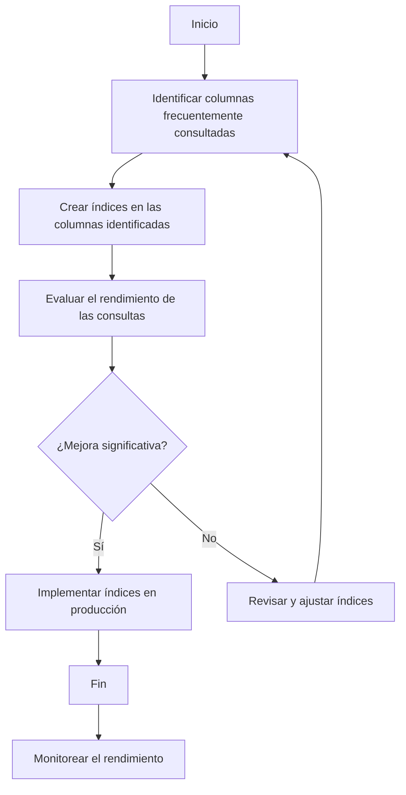

# Unidad: Uso de índices de base de datos

## Introducción a la unidad y objetivos de aprendizaje

En esta unidad, exploraremos en detalle el uso de índices de base de datos en el contexto de un sistema de carrito de compras desarrollado con Django. Los índices son una herramienta crucial para mejorar el rendimiento de las consultas en bases de datos, especialmente cuando se manejan grandes volúmenes de datos. Al finalizar esta unidad, los estudiantes serán capaces de:

1. Comprender qué son los índices de base de datos y cómo funcionan.
2. Identificar cuándo y dónde utilizar índices en una base de datos.
3. Implementar índices en Django utilizando modelos y migraciones.
4. Evaluar el impacto de los índices en el rendimiento de las consultas.
5. Aplicar mejores prácticas para el uso de índices en bases de datos.

## Documento funcional de requerimientos

### a. Descripción detallada de la funcionalidad

Los índices de base de datos son estructuras que mejoran la velocidad de las operaciones de consulta en tablas de bases de datos. Un índice se crea en una columna o un conjunto de columnas de una tabla, y permite a la base de datos encontrar rápidamente las filas que coinciden con los criterios de búsqueda.

En el contexto de un sistema de carrito de compras, los índices pueden ser utilizados para optimizar consultas frecuentes, como la búsqueda de productos, la recuperación de detalles de pedidos y la gestión de usuarios. Implementar índices de manera efectiva puede reducir significativamente el tiempo de respuesta de estas operaciones, mejorando la experiencia del usuario.

### b. Casos de uso

#### Caso de uso 1: Búsqueda de productos

**Descripción**: Un usuario busca productos en la tienda en línea utilizando palabras clave.

**Requerimientos**:
- Crear un índice en la columna `nombre` de la tabla `Producto` para acelerar las búsquedas por nombre.
- Crear un índice en la columna `categoria` de la tabla `Producto` para acelerar las búsquedas por categoría.

#### Caso de uso 2: Recuperación de detalles de pedidos

**Descripción**: Un usuario consulta los detalles de un pedido específico.

**Requerimientos**:
- Crear un índice en la columna `usuario_id` de la tabla `Pedido` para acelerar la recuperación de pedidos por usuario.
- Crear un índice en la columna `fecha_creacion` de la tabla `Pedido` para acelerar la recuperación de pedidos por fecha.

#### Caso de uso 3: Gestión de usuarios

**Descripción**: Un administrador gestiona la información de los usuarios registrados.

**Requerimientos**:
- Crear un índice en la columna `email` de la tabla `Usuario` para acelerar las búsquedas por correo electrónico.
- Crear un índice en la columna `fecha_registro` de la tabla `Usuario` para acelerar la recuperación de usuarios por fecha de registro.

### c. Diagramas de flujo (en mermaid)



### d. Requisitos no funcionales

1. **Rendimiento**: Los índices deben mejorar significativamente el tiempo de respuesta de las consultas sin afectar negativamente el rendimiento de las operaciones de inserción, actualización y eliminación.
2. **Escalabilidad**: La solución debe ser escalable y capaz de manejar un aumento en el volumen de datos sin degradar el rendimiento.
3. **Seguridad**: La implementación de índices no debe comprometer la seguridad de los datos.
4. **Mantenibilidad**: El código y las configuraciones relacionadas con los índices deben ser fáciles de mantener y actualizar.

## Implementación en Python

### a. Explicación paso a paso del código

Para implementar índices en Django, utilizaremos los modelos y las migraciones. Django proporciona varias opciones para definir índices en los modelos, incluyendo índices únicos, índices compuestos y más.

### b. Código fuente completo y comentado

A continuación, se presenta el código fuente completo y comentado para implementar los índices en el sistema de carrito de compras.

```python
from django.db import models

class Producto(models.Model):
    nombre = models.CharField(max_length=255)
    categoria = models.CharField(max_length=255)
    precio = models.DecimalField(max_digits=10, decimal_places=2)
    descripcion = models.TextField()

    class Meta:
        indexes = [
            models.Index(fields=['nombre'], name='idx_producto_nombre'),
            models.Index(fields=['categoria'], name='idx_producto_categoria'),
        ]

class Pedido(models.Model):
    usuario = models.ForeignKey('Usuario', on_delete=models.CASCADE)
    fecha_creacion = models.DateTimeField(auto_now_add=True)
    total = models.DecimalField(max_digits=10, decimal_places=2)

    class Meta:
        indexes = [
            models.Index(fields=['usuario'], name='idx_pedido_usuario'),
            models.Index(fields=['fecha_creacion'], name='idx_pedido_fecha_creacion'),
        ]

class Usuario(models.Model):
    nombre = models.CharField(max_length=255)
    email = models.EmailField(unique=True)
    fecha_registro = models.DateTimeField(auto_now_add=True)

    class Meta:
        indexes = [
            models.Index(fields=['email'], name='idx_usuario_email'),
            models.Index(fields=['fecha_registro'], name='idx_usuario_fecha_registro'),
        ]
```

### c. Ejemplos de uso y pruebas unitarias

Para verificar que los índices se han creado correctamente y están mejorando el rendimiento de las consultas, podemos utilizar las siguientes pruebas unitarias.

```python
from django.test import TestCase
from .models import Producto, Pedido, Usuario

class IndicesTestCase(TestCase):
    def setUp(self):
        # Crear usuarios de prueba
        self.usuario = Usuario.objects.create(nombre='Juan Perez', email='juan@example.com')

        # Crear productos de prueba
        for i in range(1000):
            Producto.objects.create(nombre=f'Producto {i}', categoria='Categoria 1', precio=100.0, descripcion='Descripción del producto')

        # Crear pedidos de prueba
        for i in range(100):
            Pedido.objects.create(usuario=self.usuario, total=1000.0)

    def test_busqueda_producto_por_nombre(self):
        with self.assertNumQueries(1):
            productos = Producto.objects.filter(nombre__icontains='Producto 1')
            self.assertTrue(productos.exists())

    def test_recuperacion_pedidos_por_usuario(self):
        with self.assertNumQueries(1):
            pedidos = Pedido.objects.filter(usuario=self.usuario)
            self.assertTrue(pedidos.exists())

    def test_busqueda_usuario_por_email(self):
        with self.assertNumQueries(1):
            usuario = Usuario.objects.get(email='juan@example.com')
            self.assertIsNotNone(usuario)
```

## Mejores prácticas y consideraciones de diseño

1. **Evaluar el impacto de los índices**: Antes de implementar un índice, es importante evaluar su impacto en el rendimiento de las consultas y en las operaciones de escritura. Utilizar herramientas de monitoreo y análisis de rendimiento para tomar decisiones informadas.

2. **Evitar índices redundantes**: Crear índices innecesarios puede aumentar el tiempo de inserción y actualización de datos. Asegúrate de que cada índice tenga un propósito claro y mejore el rendimiento de consultas específicas.

3. **Índices compuestos**: En algunos casos, puede ser beneficioso crear índices compuestos en múltiples columnas. Por ejemplo, un índice en las columnas `usuario_id` y `fecha_creacion` de la tabla `Pedido` puede acelerar consultas que filtran por ambos campos.

4. **Mantener los índices actualizados**: A medida que cambian los patrones de uso y las consultas, es posible que los índices existentes necesiten ser ajustados o eliminados. Realiza revisiones periódicas del rendimiento de los índices y ajusta según sea necesario.

5. **Consideraciones de seguridad**: Asegúrate de que los índices no expongan información sensible. Por ejemplo, evita crear índices en columnas que contengan datos sensibles como contraseñas o información personal identificable.

6. **Documentación y mantenimiento**: Mantén una documentación clara de los índices creados y su propósito. Esto facilitará el mantenimiento y la actualización de la base de datos en el futuro.

7. **Pruebas y monitoreo**: Realiza pruebas exhaustivas para asegurarte de que los índices están mejorando el rendimiento como se espera. Utiliza herramientas de monitoreo para rastrear el impacto de los índices en el rendimiento de la base de datos a lo largo del tiempo.

### Consideraciones adicionales

- **Depuración**: Si experimentas problemas de rendimiento después de crear índices, utiliza herramientas de depuración y análisis de consultas para identificar y resolver los problemas.
- **Escalabilidad**: A medida que la base de datos crece, es posible que necesites ajustar los índices para mantener un rendimiento óptimo. Considera el uso de particionamiento de tablas y otras técnicas de escalabilidad.
- **Rendimiento**: Los índices pueden mejorar significativamente el rendimiento de las consultas, pero también pueden aumentar el tiempo de inserción y actualización de datos. Encuentra un equilibrio adecuado entre el rendimiento de las consultas y las operaciones de escritura.

Al seguir estas mejores prácticas y consideraciones de diseño, podrás implementar índices de manera efectiva en tu sistema de carrito de compras con Django, mejorando el rendimiento y la experiencia del usuario.

---

Esta unidad proporciona una guía exhaustiva para el uso de índices de base de datos en un sistema de carrito de compras desarrollado con Django. Al aplicar los conceptos y técnicas presentados, los desarrolladores podrán optimizar el rendimiento de sus aplicaciones y ofrecer una mejor experiencia a los usuarios.