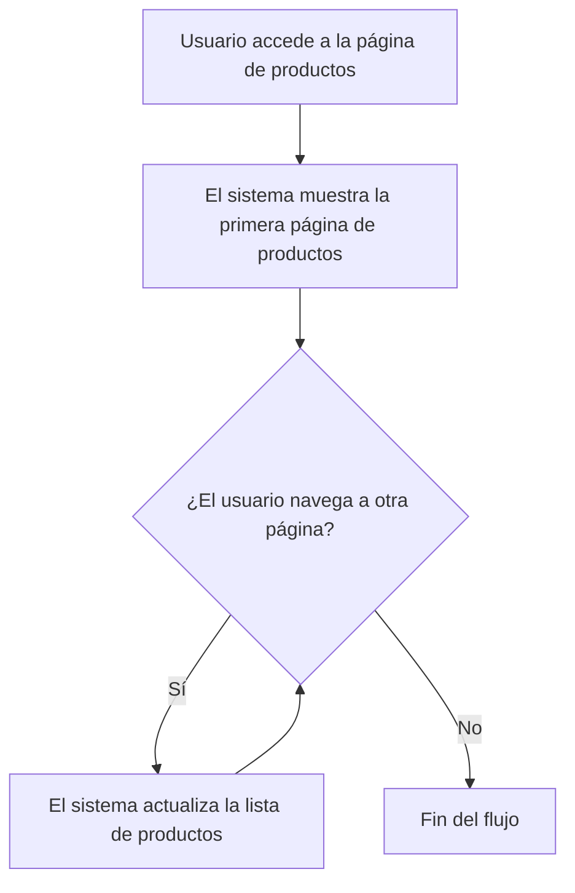
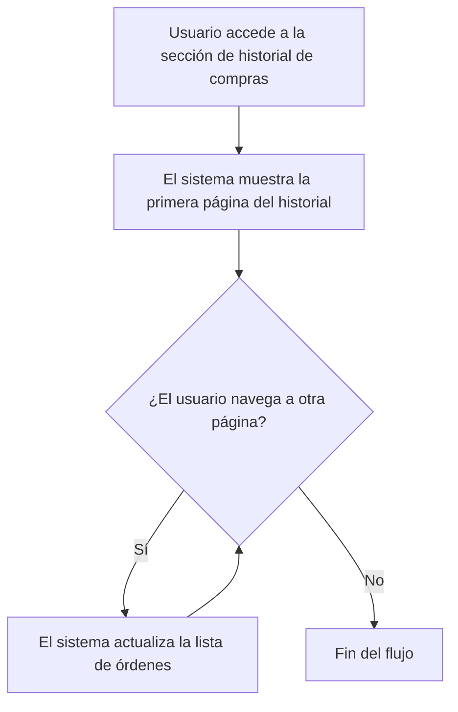

# Unidad: Paginación de Resultados en Listados

## 1. Introducción a la Unidad y Objetivos de Aprendizaje

En esta unidad, nos enfocaremos en la paginación de resultados en listados dentro del contexto de un sistema de carrito de compras desarrollado con Django. La paginación es una técnica esencial para mejorar la experiencia del usuario y optimizar el rendimiento del sistema al dividir grandes conjuntos de datos en páginas más manejables. Al final de esta unidad, los estudiantes serán capaces de:

1. Comprender la importancia de la paginación en aplicaciones web.
2. Implementar la paginación en Django utilizando las herramientas y métodos proporcionados por el framework.
3. Diseñar interfaces de usuario que soporten la navegación paginada.
4. Optimizar la paginación para mejorar el rendimiento y la escalabilidad.
5. Realizar pruebas unitarias y de integración para asegurar la correcta implementación de la paginación.

## 2. Documento Funcional de Requerimientos

### a. Descripción Detallada de la Funcionalidad

La paginación de resultados en listados es una funcionalidad que permite a los usuarios navegar a través de grandes conjuntos de datos de manera eficiente. En un sistema de carrito de compras, esto puede aplicarse a listados de productos, órdenes, historial de compras, entre otros. La paginación divide el conjunto de datos en páginas más pequeñas, cada una de las cuales contiene un número fijo de elementos. Los usuarios pueden navegar entre estas páginas utilizando controles de navegación.

### b. Casos de Uso

#### Caso de Uso 1: Visualización de Productos

**Actor:** Usuario

**Descripción:** El usuario navega a la página de productos y visualiza una lista paginada de productos disponibles.

**Precondiciones:** El usuario debe estar en la página de productos.

**Postcondiciones:** El usuario puede navegar entre las páginas de productos utilizando los controles de navegación.

**Flujo Principal:**
1. El usuario accede a la página de productos.
2. El sistema muestra la primera página de productos.
3. El usuario utiliza los controles de navegación para moverse a la siguiente o anterior página.
4. El sistema actualiza la lista de productos según la página seleccionada.

#### Caso de Uso 2: Historial de Compras

**Actor:** Usuario registrado

**Descripción:** El usuario registrado accede a su historial de compras y visualiza una lista paginada de sus órdenes anteriores.

**Precondiciones:** El usuario debe estar autenticado y tener órdenes en su historial.

**Postcondiciones:** El usuario puede navegar entre las páginas de su historial de compras utilizando los controles de navegación.

**Flujo Principal:**
1. El usuario accede a la sección de historial de compras.
2. El sistema muestra la primera página del historial de compras.
3. El usuario utiliza los controles de navegación para moverse a la siguiente o anterior página.
4. El sistema actualiza la lista de órdenes según la página seleccionada.

### c. Diagramas de Flujo





### d. Requisitos No Funcionales

1. **Rendimiento:** La paginación debe ser eficiente y no debe causar una carga significativa en el servidor.
2. **Usabilidad:** Los controles de navegación deben ser intuitivos y fáciles de usar.
3. **Escalabilidad:** La implementación debe ser capaz de manejar un gran número de elementos sin degradar el rendimiento.
4. **Seguridad:** La paginación no debe exponer datos sensibles ni permitir la manipulación de parámetros para acceder a datos no autorizados.

## 3. Implementación en Python

### a. Explicación Paso a Paso del Código

Para implementar la paginación en Django, utilizaremos la clase `Paginator` proporcionada por el framework. A continuación, se detalla el proceso paso a paso:

1. **Importar la clase Paginator:**
   Primero, importamos la clase `Paginator` y otras utilidades necesarias desde `django.core.paginator`.

2. **Crear una vista para listar los productos:**
   En la vista, obtendremos todos los productos y los pasaremos a la clase `Paginator` para dividirlos en páginas.

3. **Obtener la página solicitada:**
   Utilizaremos el parámetro GET `page` para determinar qué página mostrar al usuario.

4. **Renderizar la plantilla con los productos paginados:**
   Pasaremos los objetos paginados a la plantilla para su visualización.

### b. Código Fuente Completo y Comentado

```python
from django.core.paginator import Paginator
from django.shortcuts import render
from .models import Producto

def listar_productos(request):
    # Obtener todos los productos
    productos = Producto.objects.all()
    
    # Crear un objeto Paginator con 10 productos por página
    paginator = Paginator(productos, 10)
    
    # Obtener el número de página desde la solicitud GET
    page_number = request.GET.get('page')
    
    # Obtener la página solicitada
    page_obj = paginator.get_page(page_number)
    
    # Renderizar la plantilla con los productos paginados
    return render(request, 'productos/lista.html', {'page_obj': page_obj})
```

### c. Ejemplos de Uso y Pruebas Unitarias

#### Ejemplo de Uso

En la plantilla `productos/lista.html`, podemos iterar sobre los productos paginados y mostrar los controles de navegación:

```html

  <div>{{ producto.nombre }} - {{ producto.precio }}</div>


<div class="pagination">
  <span class="step-links">
    
      <a href="?page=1">&laquo; primera</a>
      <a href="?page={{ page_obj.previous_page_number }}">anterior</a>
    

    <span class="current">
      Página {{ page_obj.number }} de {{ page_obj.paginator.num_pages }}.
    </span>

    
      <a href="?page={{ page_obj.next_page_number }}">siguiente</a>
      <a href="?page={{ page_obj.paginator.num_pages }}">última &raquo;</a>
    
  </span>
</div>
```

#### Pruebas Unitarias

Para asegurar que la paginación funciona correctamente, podemos escribir pruebas unitarias utilizando el framework de pruebas de Django.

```python
from django.test import TestCase
from django.urls import reverse
from .models import Producto

class PaginacionTestCase(TestCase):
    def setUp(self):
        # Crear 30 productos para probar la paginación
        for i in range(30):
            Producto.objects.create(nombre=f'Producto {i}', precio=10.0)

    def test_paginacion_lista_productos(self):
        response = self.client.get(reverse('listar_productos'))
        self.assertEqual(response.status_code, 200)
        self.assertContains(response, 'Producto 0')
        self.assertContains(response, 'Producto 9')
        self.assertNotContains(response, 'Producto 10')

        response = self.client.get(reverse('listar_productos') + '?page=2')
        self.assertContains(response, 'Producto 10')
        self.assertContains(response, 'Producto 19')
        self.assertNotContains(response, 'Producto 20')
```

## 4. Mejores Prácticas y Consideraciones de Diseño

### Mejores Prácticas

1. **Limitar el Número de Elementos por Página:** Mantener un número razonable de elementos por página (por ejemplo, 10-20) para asegurar una carga rápida y una buena experiencia de usuario.
2. **Manejo de Errores:** Implementar manejo de errores para casos en los que el número de página solicitado no exista.
3. **Optimización de Consultas:** Utilizar técnicas de optimización como `select_related` y `prefetch_related` para reducir el número de consultas a la base de datos.
4. **Caché:** Considerar el uso de caché para almacenar resultados de paginación y reducir la carga en la base de datos.

### Consideraciones de Diseño

1. **Interfaz de Usuario:** Diseñar controles de navegación que sean intuitivos y accesibles. Considerar el uso de paginación infinita (carga automática de más elementos al desplazarse) si es apropiado para la aplicación.
2. **Seguridad:** Validar y sanitizar los parámetros de paginación para prevenir ataques como la inyección de SQL.
3. **Escalabilidad:** Asegurarse de que la implementación pueda manejar un gran número de elementos sin degradar el rendimiento. Utilizar índices en la base de datos para mejorar la velocidad de las consultas.

### Consejos para la Depuración y Solución de Problemas Comunes

1. **Verificar Parámetros de Paginación:** Asegurarse de que los parámetros de paginación se reciben correctamente en la vista.
2. **Revisar Consultas SQL:** Utilizar herramientas como `django-debug-toolbar` para revisar las consultas SQL generadas y optimizarlas si es necesario.
3. **Pruebas Extensivas:** Realizar pruebas unitarias y de integración para cubrir diferentes escenarios de paginación, incluyendo bordes como la primera y última página.
4. **Monitoreo de Rendimiento:** Utilizar herramientas de monitoreo para identificar y resolver problemas de rendimiento relacionados con la paginación.

Con esta unidad, hemos cubierto de manera exhaustiva la paginación de resultados en listados dentro de un sistema de carrito de compras en Django. La implementación de paginación no solo mejora la experiencia del usuario, sino que también optimiza el rendimiento del sistema, asegurando que la aplicación sea escalable y eficiente.