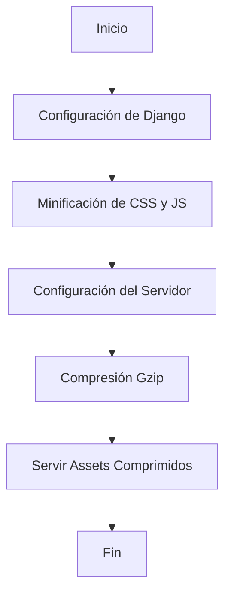

# Unidad: Compresión de Assets Estáticos

## Introducción y Objetivos de Aprendizaje

En esta unidad, abordaremos la compresión de assets estáticos en el contexto de un sistema de carrito de compras desarrollado con Django. Los assets estáticos incluyen archivos como imágenes, hojas de estilo (CSS) y scripts de JavaScript, que son esenciales para la apariencia y funcionalidad de una aplicación web. La compresión de estos archivos puede mejorar significativamente el rendimiento de la aplicación al reducir el tiempo de carga de las páginas y el uso de ancho de banda.

### Objetivos de Aprendizaje

1. Comprender la importancia de la compresión de assets estáticos en aplicaciones web.
2. Aprender a configurar Django para la compresión de archivos estáticos.
3. Implementar técnicas de compresión utilizando herramientas y librerías específicas.
4. Evaluar el impacto de la compresión en el rendimiento de la aplicación.
5. Aplicar mejores prácticas y consideraciones de diseño para la compresión de assets estáticos.

## Documento Funcional de Requerimientos

### Descripción Detallada de la Funcionalidad

La compresión de assets estáticos implica reducir el tamaño de archivos como CSS, JavaScript e imágenes antes de servirlos a los usuarios. Esto se logra mediante técnicas como la minificación y la compresión gzip. La minificación elimina caracteres innecesarios (como espacios y comentarios) del código fuente, mientras que la compresión gzip reduce el tamaño del archivo mediante algoritmos de compresión.

### Casos de Uso

1. **Caso de Uso 1: Minificación de CSS y JavaScript**
   - **Actor**: Desarrollador web.
   - **Descripción**: El desarrollador configura el proyecto Django para minificar los archivos CSS y JavaScript antes de servirlos a los usuarios.
   - **Resultado Esperado**: Los archivos CSS y JavaScript se sirven en su forma minificada, reduciendo el tiempo de carga de la página.

2. **Caso de Uso 2: Compresión Gzip de Assets Estáticos**
   - **Actor**: Administrador del servidor.
   - **Descripción**: El administrador configura el servidor web para servir archivos estáticos comprimidos con gzip.
   - **Resultado Esperado**: Los archivos estáticos se sirven comprimidos, reduciendo el uso de ancho de banda y mejorando el tiempo de carga.

### Diagramas de Flujo



### Requisitos No Funcionales

1. **Rendimiento**: La compresión de assets estáticos debe mejorar el tiempo de carga de las páginas sin afectar negativamente el rendimiento del servidor.
2. **Escalabilidad**: La solución debe ser escalable para manejar un gran número de solicitudes concurrentes.
3. **Seguridad**: La compresión no debe introducir vulnerabilidades de seguridad en la aplicación.
4. **Mantenibilidad**: La configuración y el código deben ser fáciles de mantener y actualizar.

## Implementación en Python

### Explicación Paso a Paso del Código

Para implementar la compresión de assets estáticos en un proyecto Django, seguiremos estos pasos:

1. **Configuración de Django para Minificación de CSS y JavaScript**: Utilizaremos la librería `django-compressor` para minificar y combinar archivos CSS y JavaScript.
2. **Configuración del Servidor para Compresión Gzip**: Configuraremos el servidor web (por ejemplo, Nginx) para servir archivos comprimidos con gzip.

### Código Fuente Completo y Comentado

#### Paso 1: Instalación de `django-compressor`

Primero, instalamos la librería `django-compressor`:

```bash
pip install django-compressor
```

#### Paso 2: Configuración de `django-compressor` en Django

Modificamos el archivo `settings.py` para incluir la configuración de `django-compressor`:

```python
# settings.py

INSTALLED_APPS = [
    ...
    'compressor',
    ...
]

STATICFILES_FINDERS = [
    ...
    'compressor.finders.CompressorFinder',
    ...
]

COMPRESS_ENABLED = True
COMPRESS_OFFLINE = True
```

#### Paso 3: Uso de `django-compressor` en Plantillas

Modificamos nuestras plantillas para utilizar `django-compressor`:

```html
<!-- base.html -->


<!DOCTYPE html>
<html lang="es">
<head>
    <meta charset="UTF-8">
    <title>Carrito de Compras</title>
    
    <link rel="stylesheet" href="">
    
</head>
<body>
    ...
    
    <script src=""></script>
    
</body>
</html>
```

#### Paso 4: Configuración del Servidor para Compresión Gzip

Configuramos Nginx para servir archivos comprimidos con gzip:

```nginx
# nginx.conf

http {
    ...
    gzip on;
    gzip_types text/plain text/css application/json application/javascript text/xml application/xml application/xml+rss text/javascript;
    gzip_proxied any;
    gzip_vary on;
    gzip_min_length 256;
    ...
}
```

### Ejemplos de Uso y Pruebas Unitarias

#### Ejemplo de Uso

Después de configurar `django-compressor` y Nginx, los archivos CSS y JavaScript se servirán minificados y comprimidos. Podemos verificar esto inspeccionando los archivos servidos en el navegador:

1. Abrimos la consola del navegador (F12).
2. Navegamos a la pestaña "Network" (Red).
3. Recargamos la página y observamos los archivos CSS y JavaScript servidos. Deberían estar minificados y comprimidos.

#### Pruebas Unitarias

Podemos escribir pruebas unitarias para verificar que los archivos estáticos se sirven correctamente:

```python
# tests.py

from django.test import TestCase
from django.conf import settings

class StaticFilesCompressionTest(TestCase):
    def test_css_minification(self):
        response = self.client.get(settings.STATIC_URL + 'css/styles.css')
        self.assertEqual(response.status_code, 200)
        self.assertTrue(len(response.content) < 1000)  # Ejemplo de tamaño reducido

    def test_js_minification(self):
        response = self.client.get(settings.STATIC_URL + 'js/scripts.js')
        self.assertEqual(response.status_code, 200)
        self.assertTrue(len(response.content) < 1000)  # Ejemplo de tamaño reducido
```

## Mejores Prácticas y Consideraciones de Diseño

1. **Automatización**: Utilizar herramientas de automatización como `django-compressor` para manejar la minificación y compresión de archivos estáticos.
2. **Monitoreo**: Implementar herramientas de monitoreo para evaluar el impacto de la compresión en el rendimiento de la aplicación.
3. **Actualización Regular**: Mantener las librerías y herramientas de compresión actualizadas para aprovechar las últimas mejoras y correcciones de seguridad.
4. **Pruebas**: Realizar pruebas exhaustivas para asegurarse de que la compresión no introduce errores en la aplicación.
5. **Documentación**: Documentar la configuración y el proceso de compresión para facilitar el mantenimiento y la actualización del sistema.

### Consideraciones de Seguridad

1. **Validación de Entradas**: Asegurarse de que los archivos estáticos no contengan código malicioso.
2. **Configuración del Servidor**: Configurar correctamente el servidor para evitar vulnerabilidades relacionadas con la compresión, como los ataques de descompresión (zip bomb).

### Consideraciones de Rendimiento

1. **Tamaño de los Archivos**: Evaluar regularmente el tamaño de los archivos comprimidos para asegurarse de que la compresión está siendo efectiva.
2. **Carga del Servidor**: Monitorear la carga del servidor para asegurarse de que la compresión no está afectando negativamente el rendimiento.

### Consejos para la Depuración

1. **Verificación Visual**: Utilizar herramientas de desarrollo del navegador para verificar que los archivos están siendo servidos correctamente.
2. **Logs del Servidor**: Revisar los logs del servidor para identificar posibles errores en la configuración de la compresión.
3. **Pruebas Unitarias**: Implementar pruebas unitarias para verificar que los archivos estáticos se sirven correctamente después de la compresión.

Con esto, concluimos la unidad sobre la compresión de assets estáticos en el contexto de un sistema de carrito de compras con Django. Hemos cubierto desde la configuración inicial hasta las mejores prácticas y consideraciones de diseño, proporcionando una guía completa para optimizar el rendimiento de la aplicación mediante la compresión de archivos estáticos.