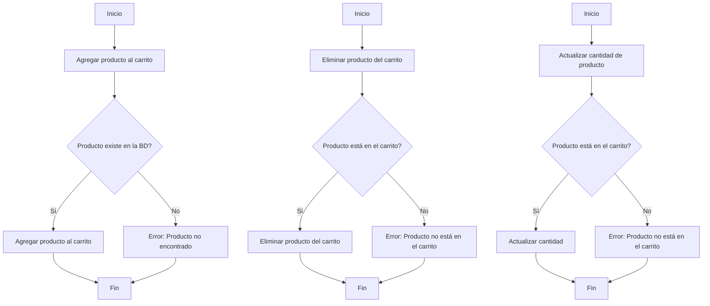

# Unidad: Tests unitarios con Django's TestCase

## Introducción a la unidad y objetivos de aprendizaje

En esta unidad, profundizaremos en el uso de `TestCase` de Django para realizar tests unitarios en el contexto de un sistema de carrito de compras. Los tests unitarios son esenciales para garantizar que cada componente de nuestra aplicación funcione correctamente de forma aislada. Al finalizar esta unidad, los lectores serán capaces de:

1. Comprender la importancia de los tests unitarios en el desarrollo de aplicaciones web.
2. Configurar y utilizar `TestCase` de Django para escribir y ejecutar tests unitarios.
3. Implementar tests unitarios para las funcionalidades clave de un sistema de carrito de compras.
4. Aplicar mejores prácticas en la escritura de tests unitarios.
5. Depurar y solucionar problemas comunes en los tests unitarios.

## Documento funcional de requerimientos

### a. Descripción detallada de la funcionalidad

El objetivo de esta unidad es proporcionar una guía exhaustiva sobre cómo escribir y ejecutar tests unitarios utilizando `TestCase` de Django. Nos enfocaremos en las funcionalidades clave del sistema de carrito de compras, incluyendo la adición de productos al carrito, la eliminación de productos, y la actualización de cantidades.

### b. Casos de uso

1. **Agregar producto al carrito**:
    - **Descripción**: Verificar que un producto se puede agregar correctamente al carrito.
    - **Precondiciones**: El producto debe existir en la base de datos.
    - **Postcondiciones**: El producto aparece en el carrito con la cantidad especificada.

2. **Eliminar producto del carrito**:
    - **Descripción**: Verificar que un producto se puede eliminar correctamente del carrito.
    - **Precondiciones**: El producto debe estar en el carrito.
    - **Postcondiciones**: El producto ya no aparece en el carrito.

3. **Actualizar cantidad de producto en el carrito**:
    - **Descripción**: Verificar que la cantidad de un producto en el carrito se puede actualizar correctamente.
    - **Precondiciones**: El producto debe estar en el carrito.
    - **Postcondiciones**: La cantidad del producto en el carrito se actualiza a la nueva cantidad especificada.

### c. Diagramas de flujo (en mermaid)



### d. Requisitos no funcionales

1. **Rendimiento**: Los tests unitarios deben ejecutarse rápidamente para no afectar el flujo de desarrollo.
2. **Escalabilidad**: La suite de tests debe ser fácilmente extensible para incluir nuevas funcionalidades.
3. **Mantenibilidad**: El código de los tests debe ser claro y bien documentado para facilitar su mantenimiento.
4. **Seguridad**: Los tests no deben comprometer la seguridad de la aplicación ni exponer datos sensibles.

## Implementación en Python

### a. Explicación paso a paso del código

Para implementar los tests unitarios en Django, utilizaremos la clase `TestCase` de Django, que nos proporciona un entorno de prueba aislado y herramientas útiles para verificar el comportamiento de nuestra aplicación.

#### Paso 1: Configuración inicial

Primero, debemos asegurarnos de que nuestra aplicación esté configurada para ejecutar tests unitarios. Django incluye una configuración predeterminada para esto, pero es importante verificar que todo esté en orden.

#### Paso 2: Creación de la clase de prueba

Crearemos una clase de prueba que herede de `TestCase`. Dentro de esta clase, definiremos métodos de prueba para cada caso de uso identificado.

#### Paso 3: Definición de métodos de prueba

Cada método de prueba debe comenzar con el prefijo `test_` para que Django lo reconozca como un test. Utilizaremos métodos como `self.client.post` y `self.client.get` para simular solicitudes HTTP y verificar las respuestas.

### b. Código fuente completo y comentado

```python
from django.test import TestCase
from django.urls import reverse
from .models import Producto, Carrito

class CarritoTestCase(TestCase):
    
    def setUp(self):
        # Crear productos de prueba
        self.producto1 = Producto.objects.create(nombre="Producto 1", precio=100)
        self.producto2 = Producto.objects.create(nombre="Producto 2", precio=200)
        
    def test_agregar_producto_al_carrito(self):
        # Agregar producto al carrito
        response = self.client.post(reverse('agregar_al_carrito'), {'producto_id': self.producto1.id, 'cantidad': 1})
        self.assertEqual(response.status_code, 200)
        
        # Verificar que el producto está en el carrito
        carrito = Carrito.objects.get()
        self.assertIn(self.producto1, carrito.productos.all())
        self.assertEqual(carrito.productos.get(id=self.producto1.id).cantidad, 1)
    
    def test_eliminar_producto_del_carrito(self):
        # Agregar producto al carrito
        self.client.post(reverse('agregar_al_carrito'), {'producto_id': self.producto1.id, 'cantidad': 1})
        
        # Eliminar producto del carrito
        response = self.client.post(reverse('eliminar_del_carrito'), {'producto_id': self.producto1.id})
        self.assertEqual(response.status_code, 200)
        
        # Verificar que el producto ya no está en el carrito
        carrito = Carrito.objects.get()
        self.assertNotIn(self.producto1, carrito.productos.all())
    
    def test_actualizar_cantidad_producto(self):
        # Agregar producto al carrito
        self.client.post(reverse('agregar_al_carrito'), {'producto_id': self.producto1.id, 'cantidad': 1})
        
        # Actualizar cantidad del producto en el carrito
        response = self.client.post(reverse('actualizar_cantidad'), {'producto_id': self.producto1.id, 'cantidad': 3})
        self.assertEqual(response.status_code, 200)
        
        # Verificar que la cantidad se ha actualizado
        carrito = Carrito.objects.get()
        self.assertEqual(carrito.productos.get(id=self.producto1.id).cantidad, 3)
```

### c. Ejemplos de uso y pruebas unitarias

#### Ejemplo de uso: Agregar producto al carrito

```python
# Simular la adición de un producto al carrito
response = self.client.post(reverse('agregar_al_carrito'), {'producto_id': self.producto1.id, 'cantidad': 1})
assert response.status_code == 200
```

#### Pruebas unitarias

```python
class CarritoTestCase(TestCase):
    
    def setUp(self):
        self.producto1 = Producto.objects.create(nombre="Producto 1", precio=100)
        self.producto2 = Producto.objects.create(nombre="Producto 2", precio=200)
        
    def test_agregar_producto_al_carrito(self):
        response = self.client.post(reverse('agregar_al_carrito'), {'producto_id': self.producto1.id, 'cantidad': 1})
        self.assertEqual(response.status_code, 200)
        carrito = Carrito.objects.get()
        self.assertIn(self.producto1, carrito.productos.all())
        self.assertEqual(carrito.productos.get(id=self.producto1.id).cantidad, 1)
    
    def test_eliminar_producto_del_carrito(self):
        self.client.post(reverse('agregar_al_carrito'), {'producto_id': self.producto1.id, 'cantidad': 1})
        response = self.client.post(reverse('eliminar_del_carrito'), {'producto_id': self.producto1.id})
        self.assertEqual(response.status_code, 200)
        carrito = Carrito.objects.get()
        self.assertNotIn(self.producto1, carrito.productos.all())
    
    def test_actualizar_cantidad_producto(self):
        self.client.post(reverse('agregar_al_carrito'), {'producto_id': self.producto1.id, 'cantidad': 1})
        response = self.client.post(reverse('actualizar_cantidad'), {'producto_id': self.producto1.id, 'cantidad': 3})
        self.assertEqual(response.status_code, 200)
        carrito = Carrito.objects.get()
        self.assertEqual(carrito.productos.get(id=self.producto1.id).cantidad, 3)
```

## Mejores prácticas y consideraciones de diseño

1. **Aislamiento de pruebas**: Cada prueba debe ser independiente y no depender de otras pruebas. Utiliza `setUp` y `tearDown` para preparar y limpiar el entorno de prueba.
2. **Nombres descriptivos**: Utiliza nombres descriptivos para los métodos de prueba para que sea claro qué funcionalidad están verificando.
3. **Cobertura de pruebas**: Asegúrate de que todas las funcionalidades clave estén cubiertas por pruebas unitarias.
4. **Ejecución frecuente**: Ejecuta las pruebas unitarias con frecuencia durante el desarrollo para detectar errores lo antes posible.
5. **Documentación**: Documenta las pruebas para que otros desarrolladores puedan entender fácilmente qué se está verificando y por qué.

### Consideraciones de seguridad

1. **Datos sensibles**: Asegúrate de que los datos sensibles no se expongan en los mensajes de error o en los logs de las pruebas.
2. **Acceso controlado**: Verifica que las pruebas no comprometan la seguridad de la aplicación, especialmente en entornos de producción.

### Rendimiento y escalabilidad

1. **Optimización**: Optimiza las pruebas para que se ejecuten rápidamente, utilizando técnicas como la paralelización si es necesario.
2. **Extensibilidad**: Diseña las pruebas de manera que sea fácil agregar nuevas pruebas a medida que se desarrollan nuevas funcionalidades.

### Depuración y solución de problemas comunes

1. **Mensajes de error claros**: Asegúrate de que los mensajes de error sean claros y proporcionen suficiente información para identificar el problema.
2. **Logs detallados**: Utiliza logs detallados para rastrear el flujo de ejecución y detectar dónde ocurren los errores.
3. **Herramientas de depuración**: Utiliza herramientas de depuración como breakpoints y depuradores interactivos para investigar problemas complejos.

Con esta unidad, los desarrolladores estarán equipados con las habilidades y conocimientos necesarios para escribir y ejecutar tests unitarios efectivos utilizando `TestCase` de Django, asegurando así la calidad y confiabilidad del sistema de carrito de compras.