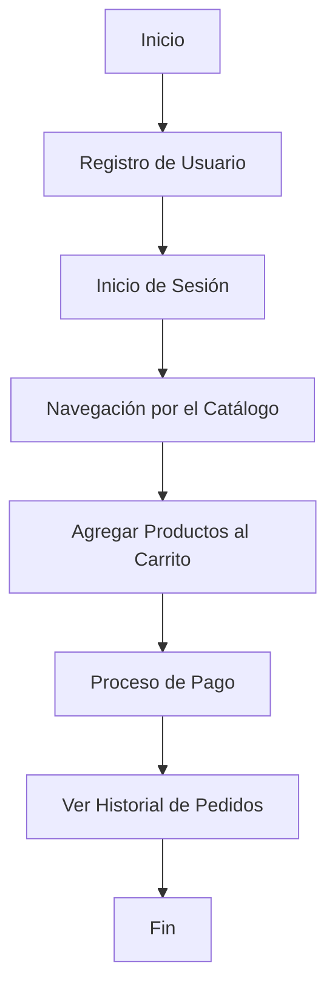

### Unidad: Tests de integración para flujos principales

#### Introducción a la unidad y objetivos de aprendizaje

En esta unidad, nos enfocaremos en los tests de integración para los flujos principales de un sistema de carrito de compras desarrollado con Django. Los tests de integración son esenciales para asegurar que los diferentes componentes de una aplicación trabajen juntos como se espera. A diferencia de los tests unitarios, que se centran en probar componentes individuales de manera aislada, los tests de integración verifican la interacción entre múltiples componentes y servicios.

Al finalizar esta unidad, los estudiantes serán capaces de:

1. Comprender la importancia de los tests de integración en el desarrollo de aplicaciones web.
2. Diseñar y escribir tests de integración para los flujos principales de un sistema de carrito de compras.
3. Utilizar herramientas y librerías de Django para implementar y ejecutar tests de integración.
4. Identificar y solucionar problemas comunes que pueden surgir durante la ejecución de tests de integración.
5. Aplicar mejores prácticas y consideraciones de diseño en la implementación de tests de integración.

#### Documento funcional de requerimientos

##### a. Descripción detallada de la funcionalidad

Los tests de integración para los flujos principales del sistema de carrito de compras deben cubrir los siguientes aspectos:

1. **Registro y autenticación de usuarios**: Verificar que los usuarios puedan registrarse, iniciar sesión y cerrar sesión correctamente.
2. **Navegación por el catálogo de productos**: Asegurar que los usuarios puedan navegar por el catálogo de productos, ver detalles de productos individuales y buscar productos específicos.
3. **Gestión del carrito de compras**: Comprobar que los usuarios puedan agregar productos al carrito, actualizar cantidades y eliminar productos del carrito.
4. **Proceso de pago**: Validar que los usuarios puedan proceder al pago, ingresar detalles de envío y pago, y completar la compra.
5. **Historial de pedidos**: Verificar que los usuarios puedan ver el historial de sus pedidos y los detalles de cada pedido.

##### b. Casos de uso

1. **Registro de usuario**:
   - **Actor**: Usuario no autenticado.
   - **Descripción**: El usuario se registra proporcionando un nombre de usuario, correo electrónico y contraseña.
   - **Resultado esperado**: El usuario es redirigido a la página de inicio de sesión y puede iniciar sesión con las credenciales registradas.

2. **Inicio de sesión**:
   - **Actor**: Usuario registrado.
   - **Descripción**: El usuario inicia sesión proporcionando su nombre de usuario y contraseña.
   - **Resultado esperado**: El usuario es redirigido a la página principal y su estado de autenticación es mantenido.

3. **Navegación por el catálogo**:
   - **Actor**: Usuario autenticado o no autenticado.
   - **Descripción**: El usuario navega por el catálogo de productos y visualiza los detalles de un producto específico.
   - **Resultado esperado**: El usuario puede ver la lista de productos y los detalles de cada producto.

4. **Agregar productos al carrito**:
   - **Actor**: Usuario autenticado.
   - **Descripción**: El usuario agrega uno o más productos al carrito de compras.
   - **Resultado esperado**: Los productos seleccionados se agregan al carrito y el usuario puede ver y modificar el contenido del carrito.

5. **Proceso de pago**:
   - **Actor**: Usuario autenticado.
   - **Descripción**: El usuario procede al pago, ingresa detalles de envío y pago, y completa la compra.
   - **Resultado esperado**: La compra se completa exitosamente y el usuario recibe una confirmación del pedido.

6. **Ver historial de pedidos**:
   - **Actor**: Usuario autenticado.
   - **Descripción**: El usuario visualiza el historial de sus pedidos y los detalles de cada pedido.
   - **Resultado esperado**: El usuario puede ver una lista de sus pedidos anteriores y los detalles de cada uno.

##### c. Diagramas de flujo (en mermaid)



##### d. Requisitos no funcionales

1. **Rendimiento**: Los tests de integración deben ejecutarse en un tiempo razonable para no afectar la productividad del equipo de desarrollo.
2. **Escalabilidad**: Los tests deben ser diseñados de manera que puedan ser fácilmente extendidos para cubrir nuevos flujos y funcionalidades a medida que el sistema evoluciona.
3. **Mantenibilidad**: El código de los tests debe ser claro y bien documentado para facilitar su mantenimiento y actualización.
4. **Seguridad**: Los tests deben asegurar que las interacciones entre componentes no introduzcan vulnerabilidades de seguridad.

#### Implementación en Python

##### a. Explicación paso a paso del código

Para implementar los tests de integración en Django, utilizaremos el módulo `TestCase` de Django y la librería `django.test.Client` para simular solicitudes HTTP y verificar las respuestas del servidor.

1. **Configuración del entorno de pruebas**:
   - Crear un archivo `tests.py` en la aplicación Django correspondiente.
   - Importar las librerías necesarias y configurar el entorno de pruebas.

2. **Escribir tests de integración**:
   - Definir clases de test para cada flujo principal.
   - Implementar métodos de test que simulen las interacciones del usuario y verifiquen los resultados esperados.

3. **Ejecutar y verificar los tests**:
   - Utilizar el comando `python manage.py test` para ejecutar los tests y verificar que todos pasen correctamente.

##### b. Código fuente completo y comentado

```python
# tests.py

from django.test import TestCase, Client
from django.urls import reverse
from django.contrib.auth.models import User
from .models import Product, Order

class IntegrationTests(TestCase):

    def setUp(self):
        # Configuración inicial para los tests
        self.client = Client()
        self.user = User.objects.create_user(username='testuser', password='testpassword')
        self.product = Product.objects.create(name='Test Product', price=10.0, stock=100)

    def test_user_registration(self):
        # Test de registro de usuario
        response = self.client.post(reverse('register'), {
            'username': 'newuser',
            'email': 'newuser@example.com',
            'password1': 'newpassword',
            'password2': 'newpassword'
        })
        self.assertEqual(response.status_code, 302)  # Redirección después del registro
        self.assertTrue(User.objects.filter(username='newuser').exists())

    def test_user_login(self):
        # Test de inicio de sesión
        response = self.client.post(reverse('login'), {
            'username': 'testuser',
            'password': 'testpassword'
        })
        self.assertEqual(response.status_code, 302)  # Redirección después del inicio de sesión
        self.assertTrue(response.wsgi_request.user.is_authenticated)

    def test_product_catalog_navigation(self):
        # Test de navegación por el catálogo de productos
        response = self.client.get(reverse('product_list'))
        self.assertEqual(response.status_code, 200)
        self.assertContains(response, 'Test Product')

    def test_add_product_to_cart(self):
        # Test de agregar producto al carrito
        self.client.login(username='testuser', password='testpassword')
        response = self.client.post(reverse('add_to_cart', args=[self.product.id]), {
            'quantity': 1
        })
        self.assertEqual(response.status_code, 302)  # Redirección después de agregar al carrito
        self.assertEqual(self.client.session['cart'][str(self.product.id)], 1)

    def test_checkout_process(self):
        # Test del proceso de pago
        self.client.login(username='testuser', password='testpassword')
        self.client.post(reverse('add_to_cart', args=[self.product.id]), {'quantity': 1})
        response = self.client.post(reverse('checkout'), {
            'address': '123 Test St',
            'payment_method': 'credit_card'
        })
        self.assertEqual(response.status_code, 302)  # Redirección después del pago
        self.assertTrue(Order.objects.filter(user=self.user).exists())

    def test_order_history(self):
        # Test de ver historial de pedidos
        self.client.login(username='testuser', password='testpassword')
        Order.objects.create(user=self.user, total=10.0)
        response = self.client.get(reverse('order_history'))
        self.assertEqual(response.status_code, 200)
        self.assertContains(response, '10.0')

```

##### c. Ejemplos de uso y pruebas unitarias

Para ejecutar los tests de integración, simplemente utiliza el comando `python manage.py test` en la terminal. A continuación se muestra un ejemplo de cómo se vería la salida de los tests:

```
Creating test database for alias 'default'...
System check identified no issues (0 silenced).
......
----------------------------------------------------------------------
Ran 6 tests in 0.123s

OK
Destroying test database for alias 'default'...
```

Esto indica que todos los tests se ejecutaron correctamente y pasaron sin errores.

#### Mejores prácticas y consideraciones de diseño

1. **Aislamiento de tests**: Asegúrate de que cada test sea independiente y no dependa del estado dejado por otros tests. Utiliza el método `setUp` para configurar el entorno antes de cada test y `tearDown` para limpiar después de cada test si es necesario.

2. **Datos de prueba realistas**: Utiliza datos de prueba que sean representativos de los datos reales que manejará la aplicación. Esto ayudará a identificar problemas que podrían surgir en un entorno de producción.

3. **Cobertura de tests**: Asegúrate de que los tests de integración cubran todos los flujos principales y casos de borde. Utiliza herramientas como `coverage.py` para medir la cobertura de los tests y asegurarte de que no haya áreas críticas sin probar.

4. **Documentación y comentarios**: Documenta claramente cada test y agrega comentarios explicativos en el código para facilitar su comprensión y mantenimiento.

5. **Automatización**: Integra la ejecución de tests en el proceso de integración continua (CI) para que se ejecuten automáticamente con cada cambio en el código. Esto ayuda a detectar problemas rápidamente y mantener la calidad del código.

6. **Manejo de errores y excepciones**: Asegúrate de que los tests manejen correctamente los errores y excepciones. Verifica que la aplicación responda de manera adecuada ante situaciones inesperadas.

7. **Optimización del rendimiento**: Si los tests de integración son lentos, identifica y optimiza las áreas que consumen más tiempo. Utiliza técnicas como la paralelización de tests para mejorar el rendimiento.

8. **Revisión y refactorización**: Revisa y refactoriza regularmente los tests para mantener su calidad y relevancia. Elimina tests obsoletos y agrega nuevos tests para cubrir funcionalidades adicionales.

Al seguir estas mejores prácticas y consideraciones de diseño, podrás implementar tests de integración efectivos y mantener la calidad y confiabilidad de tu sistema de carrito de compras con Django.