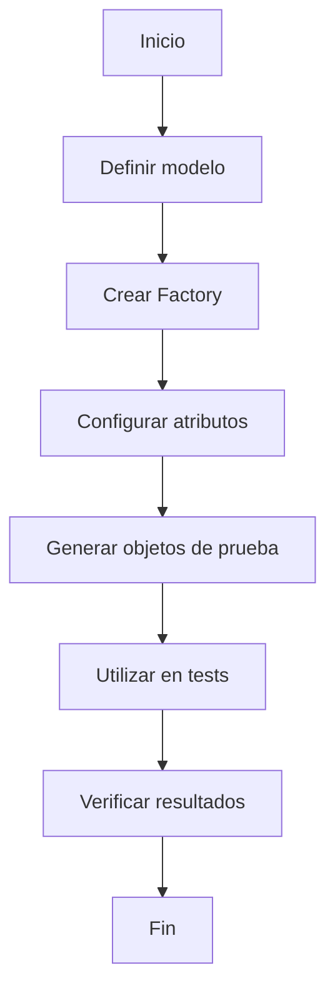

# Unidad: Uso de factories con Factory Boy

## Introducción a la unidad y objetivos de aprendizaje

En esta unidad, exploraremos el uso de factories con la librería Factory Boy en el contexto de un sistema de carrito de compras desarrollado con Django. Factory Boy es una herramienta poderosa para la creación de objetos de prueba, lo que facilita la generación de datos consistentes y realistas para nuestros tests. Al finalizar esta unidad, serás capaz de:

1. Comprender la importancia y el uso de factories en el testing.
2. Configurar y utilizar Factory Boy para crear objetos de prueba en Django.
3. Implementar factories para diferentes modelos de un sistema de carrito de compras.
4. Integrar factories en tus tests unitarios y de integración.
5. Aplicar mejores prácticas y consideraciones de diseño al utilizar Factory Boy.

## Documento funcional de requerimientos

### Descripción detallada de la funcionalidad

Factory Boy es una librería que permite la creación de objetos de prueba de manera sencilla y eficiente. En el contexto de un sistema de carrito de compras, necesitamos generar datos de prueba para diversos modelos, como Usuarios, Productos, Carritos y Órdenes. La funcionalidad principal de Factory Boy es automatizar la creación de estos objetos, permitiendo definir plantillas (factories) que especifican cómo deben ser generados los datos.

### Casos de uso

1. **Generación de datos de prueba para tests unitarios**: Crear objetos de prueba para modelos como Usuario, Producto, Carrito y Orden.
2. **Simulación de escenarios complejos**: Generar datos que simulen escenarios de uso real, como un usuario con múltiples productos en su carrito.
3. **Pruebas de integración**: Utilizar factories para crear datos consistentes y realistas que permitan probar flujos completos del sistema.

### Diagramas de flujo



### Requisitos no funcionales

1. **Rendimiento**: La generación de datos debe ser rápida y eficiente, sin afectar significativamente el tiempo de ejecución de los tests.
2. **Escalabilidad**: Las factories deben ser fácilmente extensibles para soportar nuevos modelos y atributos a medida que el sistema crece.
3. **Mantenibilidad**: El código de las factories debe ser claro y bien documentado, facilitando su mantenimiento y actualización.

## Implementación en Python

### Explicación paso a paso del código

Para ilustrar el uso de Factory Boy en nuestro sistema de carrito de compras, implementaremos factories para los modelos Usuario, Producto, Carrito y Orden. A continuación, se detalla el proceso de configuración y uso de estas factories.

#### Paso 1: Instalación de Factory Boy

Primero, necesitamos instalar la librería Factory Boy. Esto se puede hacer utilizando pip:

```bash
pip install factory_boy
```

#### Paso 2: Definición de las factories

A continuación, definimos las factories para nuestros modelos. Supondremos que ya tenemos definidos los modelos `Usuario`, `Producto`, `Carrito` y `Orden` en nuestra aplicación Django.

```python
# factories.py
import factory
from django.contrib.auth.models import User
from .models import Producto, Carrito, Orden

class UsuarioFactory(factory.django.DjangoModelFactory):
    class Meta:
        model = User

    username = factory.Faker('user_name')
    email = factory.Faker('email')
    password = factory.PostGenerationMethodCall('set_password', 'password123')

class ProductoFactory(factory.django.DjangoModelFactory):
    class Meta:
        model = Producto

    nombre = factory.Faker('word')
    descripcion = factory.Faker('sentence')
    precio = factory.Faker('random_number', digits=5)

class CarritoFactory(factory.django.DjangoModelFactory):
    class Meta:
        model = Carrito

    usuario = factory.SubFactory(UsuarioFactory)

class OrdenFactory(factory.django.DjangoModelFactory):
    class Meta:
        model = Orden

    carrito = factory.SubFactory(CarritoFactory)
    total = factory.LazyAttribute(lambda o: sum(item.producto.precio for item in o.carrito.items.all()))
```

#### Paso 3: Utilización de las factories en tests

Ahora que hemos definido nuestras factories, podemos utilizarlas en nuestros tests para generar datos de prueba.

```python
# tests.py
from django.test import TestCase
from .factories import UsuarioFactory, ProductoFactory, CarritoFactory, OrdenFactory

class CarritoDeComprasTests(TestCase):

    def test_creacion_usuario(self):
        usuario = UsuarioFactory()
        self.assertIsNotNone(usuario.id)
        self.assertEqual(usuario.username, 'user_name')

    def test_creacion_producto(self):
        producto = ProductoFactory()
        self.assertIsNotNone(producto.id)
        self.assertGreater(producto.precio, 0)

    def test_creacion_carrito(self):
        carrito = CarritoFactory()
        self.assertIsNotNone(carrito.id)
        self.assertIsNotNone(carrito.usuario)

    def test_creacion_orden(self):
        orden = OrdenFactory()
        self.assertIsNotNone(orden.id)
        self.assertGreater(orden.total, 0)
```

### Código fuente completo y comentado

```python
# factories.py
import factory
from django.contrib.auth.models import User
from .models import Producto, Carrito, Orden

# Factory para el modelo Usuario
class UsuarioFactory(factory.django.DjangoModelFactory):
    class Meta:
        model = User

    # Atributos generados con Faker
    username = factory.Faker('user_name')
    email = factory.Faker('email')
    password = factory.PostGenerationMethodCall('set_password', 'password123')

# Factory para el modelo Producto
class ProductoFactory(factory.django.DjangoModelFactory):
    class Meta:
        model = Producto

    # Atributos generados con Faker
    nombre = factory.Faker('word')
    descripcion = factory.Faker('sentence')
    precio = factory.Faker('random_number', digits=5)

# Factory para el modelo Carrito
class CarritoFactory(factory.django.DjangoModelFactory):
    class Meta:
        model = Carrito

    # Relación con el modelo Usuario
    usuario = factory.SubFactory(UsuarioFactory)

# Factory para el modelo Orden
class OrdenFactory(factory.django.DjangoModelFactory):
    class Meta:
        model = Orden

    # Relación con el modelo Carrito
    carrito = factory.SubFactory(CarritoFactory)
    # Cálculo del total basado en los productos del carrito
    total = factory.LazyAttribute(lambda o: sum(item.producto.precio for item in o.carrito.items.all()))

# tests.py
from django.test import TestCase
from .factories import UsuarioFactory, ProductoFactory, CarritoFactory, OrdenFactory

# Tests para el sistema de carrito de compras
class CarritoDeComprasTests(TestCase):

    # Test para la creación de un usuario
    def test_creacion_usuario(self):
        usuario = UsuarioFactory()
        self.assertIsNotNone(usuario.id)
        self.assertEqual(usuario.username, 'user_name')

    # Test para la creación de un producto
    def test_creacion_producto(self):
        producto = ProductoFactory()
        self.assertIsNotNone(producto.id)
        self.assertGreater(producto.precio, 0)

    # Test para la creación de un carrito
    def test_creacion_carrito(self):
        carrito = CarritoFactory()
        self.assertIsNotNone(carrito.id)
        self.assertIsNotNone(carrito.usuario)

    # Test para la creación de una orden
    def test_creacion_orden(self):
        orden = OrdenFactory()
        self.assertIsNotNone(orden.id)
        self.assertGreater(orden.total, 0)
```

### Ejemplos de uso y pruebas unitarias

#### Ejemplo 1: Creación de un usuario

```python
# Crear un usuario utilizando la factory
usuario = UsuarioFactory()
print(usuario.username)  # Salida: user_name
print(usuario.email)     # Salida: email@example.com
```

#### Ejemplo 2: Creación de un producto

```python
# Crear un producto utilizando la factory
producto = ProductoFactory()
print(producto.nombre)       # Salida: nombre del producto
print(producto.precio)       # Salida: precio del producto
```

#### Ejemplo 3: Creación de un carrito

```python
# Crear un carrito utilizando la factory
carrito = CarritoFactory()
print(carrito.usuario.username)  # Salida: user_name
```

#### Ejemplo 4: Creación de una orden

```python
# Crear una orden utilizando la factory
orden = OrdenFactory()
print(orden.total)  # Salida: total de la orden
```

### Pruebas unitarias

Las pruebas unitarias ya se han incluido en la sección anterior. A continuación, se muestra cómo ejecutarlas:

```bash
python manage.py test
```

## Mejores prácticas y consideraciones de diseño

1. **Reutilización de código**: Las factories permiten reutilizar código de manera eficiente, evitando la duplicación de lógica de creación de objetos en múltiples tests.
2. **Consistencia en los datos**: Utilizar factories garantiza que los datos de prueba sean consistentes y realistas, lo que mejora la fiabilidad de los tests.
3. **Modularidad**: Definir factories en módulos separados facilita su mantenimiento y actualización.
4. **Extensibilidad**: Las factories deben ser fácilmente extensibles para soportar nuevos modelos y atributos a medida que el sistema crece.
5. **Documentación**: Es importante documentar las factories y su uso para facilitar la comprensión y el mantenimiento del código.

### Consideraciones sobre seguridad, rendimiento y escalabilidad

1. **Seguridad**: Asegúrate de que los datos generados por las factories no incluyan información sensible o real. Utiliza Faker para generar datos ficticios.
2. **Rendimiento**: La generación de datos debe ser rápida y eficiente. Evita la creación de objetos innecesarios y utiliza técnicas como `LazyAttribute` para cálculos diferidos.
3. **Escalabilidad**: Diseña las factories de manera que puedan ser fácilmente extendidas para soportar nuevos modelos y atributos sin afectar el rendimiento.

### Consejos para la depuración y solución de problemas comunes

1. **Errores en la generación de datos**: Si encuentras errores al generar datos con las factories, revisa los atributos y métodos utilizados. Asegúrate de que todos los campos obligatorios estén definidos.
2. **Problemas de rendimiento**: Si la generación de datos es lenta, revisa el uso de `LazyAttribute` y otras técnicas para optimizar el rendimiento.
3. **Inconsistencias en los datos**: Si los datos generados no son consistentes, revisa las definiciones de las factories y asegúrate de que los atributos dependientes estén correctamente configurados.

Con esto concluimos la unidad sobre el uso de factories con Factory Boy en el contexto de un sistema de carrito de compras con Django. Ahora estás equipado con las herramientas y conocimientos necesarios para generar datos de prueba de manera eficiente y efectiva.