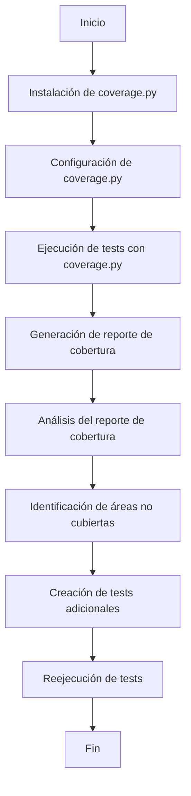

# Unidad: Cobertura de código con coverage.py

## 1. Introducción a la unidad y objetivos de aprendizaje

En esta unidad, nos enfocaremos en la cobertura de código utilizando la herramienta `coverage.py` dentro del contexto de un sistema de carrito de compras desarrollado con Django. La cobertura de código es una métrica esencial en el desarrollo de software que nos permite evaluar qué partes de nuestro código están siendo ejecutadas por nuestros tests. Un alto porcentaje de cobertura de código no garantiza la ausencia de errores, pero sí proporciona una mayor confianza en la calidad del software.

### Objetivos de aprendizaje

1. Comprender la importancia de la cobertura de código en el desarrollo de software.
2. Aprender a instalar y configurar `coverage.py` en un proyecto Django.
3. Ejecutar y analizar reportes de cobertura de código.
4. Integrar `coverage.py` con herramientas de CI/CD.
5. Aplicar mejores prácticas para mejorar la cobertura de código.

## 2. Documento funcional de requerimientos

### a. Descripción detallada de la funcionalidad

La funcionalidad principal de esta unidad es implementar y utilizar `coverage.py` para medir la cobertura de código en un sistema de carrito de compras desarrollado con Django. Esto incluye la instalación y configuración de `coverage.py`, la ejecución de tests para generar reportes de cobertura, y el análisis de dichos reportes para identificar áreas del código que requieren más pruebas.

### b. Casos de uso

1. **Caso de uso 1: Instalación y configuración de coverage.py**
   - **Actor**: Desarrollador
   - **Descripción**: El desarrollador instala y configura `coverage.py` en el entorno de desarrollo del proyecto Django.
   - **Precondiciones**: El proyecto Django está correctamente configurado y funcional.
   - **Postcondiciones**: `coverage.py` está instalado y configurado para su uso en el proyecto.

2. **Caso de uso 2: Ejecución de tests y generación de reportes de cobertura**
   - **Actor**: Desarrollador
   - **Descripción**: El desarrollador ejecuta los tests del proyecto utilizando `coverage.py` y genera un reporte de cobertura.
   - **Precondiciones**: `coverage.py` está instalado y configurado.
   - **Postcondiciones**: Se genera un reporte de cobertura que muestra qué partes del código fueron ejecutadas por los tests.

3. **Caso de uso 3: Análisis de reportes de cobertura**
   - **Actor**: Desarrollador
   - **Descripción**: El desarrollador analiza el reporte de cobertura para identificar áreas del código que no están cubiertas por los tests.
   - **Precondiciones**: Se ha generado un reporte de cobertura.
   - **Postcondiciones**: El desarrollador identifica áreas del código que requieren más pruebas y planifica la creación de tests adicionales.

### c. Diagramas de flujo (en mermaid)



### d. Requisitos no funcionales

1. **Rendimiento**: La ejecución de `coverage.py` no debe afectar significativamente el tiempo de ejecución de los tests.
2. **Escalabilidad**: La herramienta debe ser capaz de manejar proyectos de gran tamaño sin problemas de rendimiento.
3. **Seguridad**: La configuración de `coverage.py` no debe introducir vulnerabilidades de seguridad en el proyecto.
4. **Compatibilidad**: `coverage.py` debe ser compatible con la versión de Django y Python utilizada en el proyecto.
5. **Mantenibilidad**: La configuración y uso de `coverage.py` debe ser documentada claramente para facilitar su mantenimiento y actualización.

## 3. Implementación en Python

### a. Explicación paso a paso del código

#### Paso 1: Instalación de coverage.py

Para instalar `coverage.py`, utilizamos `pip`, el gestor de paquetes de Python. Ejecutamos el siguiente comando en la terminal:

```bash
pip install coverage
```

#### Paso 2: Configuración de coverage.py

Una vez instalado, debemos configurar `coverage.py` para que funcione correctamente con nuestro proyecto Django. Creamos un archivo `.coveragerc` en el directorio raíz del proyecto con la siguiente configuración:

```ini
[run]
source = .
omit = 
    */migrations/*
    */tests/*
    manage.py

[report]
show_missing = True
```

Esta configuración indica que queremos medir la cobertura de todo el código fuente del proyecto, excluyendo las migraciones y los archivos de tests, y que queremos que se muestren las líneas de código que no están cubiertas por los tests.

#### Paso 3: Ejecución de tests con coverage.py

Para ejecutar los tests del proyecto utilizando `coverage.py`, utilizamos el siguiente comando:

```bash
coverage run manage.py test
```

Este comando ejecuta los tests del proyecto y recopila datos de cobertura.

#### Paso 4: Generación de reportes de cobertura

Una vez ejecutados los tests, generamos un reporte de cobertura con el siguiente comando:

```bash
coverage report -m
```

Este comando muestra un reporte en la terminal con el porcentaje de cobertura de cada archivo y las líneas de código que no están cubiertas.

Para generar un reporte en formato HTML, utilizamos el siguiente comando:

```bash
coverage html
```

Este comando crea un directorio `htmlcov` con un reporte en formato HTML que podemos abrir en un navegador para una visualización más detallada.

### b. Código fuente completo y comentado

A continuación, se presenta el código fuente completo y comentado para la configuración y uso de `coverage.py` en un proyecto Django.

```python
# Instalación de coverage.py
# Ejecutar en la terminal:
# pip install coverage

# Configuración de coverage.py
# Crear un archivo .coveragerc en el directorio raíz del proyecto con el siguiente contenido:
"""
[run]
source = .
omit = 
    */migrations/*
    */tests/*
    manage.py

[report]
show_missing = True
"""

# Ejecución de tests con coverage.py
# Ejecutar en la terminal:
# coverage run manage.py test

# Generación de reportes de cobertura
# Para un reporte en la terminal:
# coverage report -m

# Para un reporte en formato HTML:
# coverage html
```

### c. Ejemplos de uso y pruebas unitarias

#### Ejemplo de uso

Supongamos que tenemos un proyecto Django con una aplicación llamada `shop` que contiene el siguiente archivo `models.py`:

```python
from django.db import models

class Product(models.Model):
    name = models.CharField(max_length=255)
    price = models.DecimalField(max_digits=10, decimal_places=2)
```

Y el siguiente archivo `tests.py`:

```python
from django.test import TestCase
from .models import Product

class ProductTestCase(TestCase):
    def test_product_creation(self):
        product = Product.objects.create(name="Test Product", price=10.00)
        self.assertEqual(product.name, "Test Product")
        self.assertEqual(product.price, 10.00)
```

Para medir la cobertura de código, seguimos los pasos descritos anteriormente:

1. Instalamos `coverage.py`:
   ```bash
   pip install coverage
   ```

2. Configuramos `coverage.py` creando el archivo `.coveragerc`:

   ```ini
   [run]
   source = .
   omit = 
       */migrations/*
       */tests/*
       manage.py

   [report]
   show_missing = True
   ```

3. Ejecutamos los tests con `coverage.py`:
   ```bash
   coverage run manage.py test
   ```

4. Generamos un reporte de cobertura en la terminal:
   ```bash
   coverage report -m
   ```

5. Generamos un reporte de cobertura en formato HTML:
   ```bash
   coverage html
   ```

#### Pruebas unitarias

Para asegurar que `coverage.py` está funcionando correctamente, podemos escribir pruebas unitarias que verifiquen la generación de reportes de cobertura. Sin embargo, dado que `coverage.py` es una herramienta externa, las pruebas unitarias se enfocarán en verificar que los comandos se ejecutan correctamente y que los reportes se generan.

```python
import os
import subprocess
from django.test import TestCase

class CoverageTestCase(TestCase):
    def test_coverage_report_generation(self):
        # Ejecutar los tests con coverage.py
        result = subprocess.run(['coverage', 'run', 'manage.py', 'test'], capture_output=True, text=True)
        self.assertEqual(result.returncode, 0, msg="Coverage run failed")

        # Generar el reporte de cobertura en la terminal
        result = subprocess.run(['coverage', 'report', '-m'], capture_output=True, text=True)
        self.assertEqual(result.returncode, 0, msg="Coverage report generation failed")

        # Generar el reporte de cobertura en formato HTML
        result = subprocess.run(['coverage', 'html'], capture_output=True, text=True)
        self.assertEqual(result.returncode, 0, msg="Coverage HTML report generation failed")

        # Verificar que el directorio htmlcov fue creado
        self.assertTrue(os.path.isdir('htmlcov'), msg="htmlcov directory not created")
```

## 4. Mejores prácticas y consideraciones de diseño

### Mejores prácticas

1. **Configurar correctamente `coverage.py`**: Asegúrate de que el archivo `.coveragerc` excluya archivos que no son relevantes para la cobertura, como migraciones y archivos de tests.
2. **Ejecutar cobertura de código regularmente**: Integra `coverage.py` en tu flujo de trabajo de CI/CD para asegurarte de que la cobertura de código se mide en cada commit.
3. **Analizar los reportes de cobertura**: Revisa regularmente los reportes de cobertura para identificar áreas del código que no están cubiertas por los tests y planifica la creación de tests adicionales.
4. **No obsesionarse con el 100% de cobertura**: Aunque un alto porcentaje de cobertura es deseable, no es necesario alcanzar el 100%. Enfócate en cubrir las partes críticas del código y en escribir tests significativos.

### Consideraciones de diseño

1. **Modularidad**: Diseña tu código de manera modular para facilitar la escritura de tests y la medición de cobertura.
2. **Simplicidad**: Mantén tu configuración de `coverage.py` simple y fácil de entender. Documenta cualquier configuración adicional que sea necesaria.
3. **Documentación**: Documenta el uso de `coverage.py` en tu proyecto para que otros desarrolladores puedan entender cómo utilizarlo y mantenerlo.
4. **Rendimiento**: Asegúrate de que la ejecución de `coverage.py` no afecte significativamente el tiempo de ejecución de los tests. Si es necesario, optimiza tus tests para mejorar el rendimiento.

### Consejos para la depuración y solución de problemas comunes

1. **Problema: `coverage.py` no mide la cobertura de algunos archivos**
   - **Solución**: Verifica la configuración en el archivo `.coveragerc` para asegurarte de que los archivos relevantes están incluidos en la medición de cobertura.

2. **Problema: La generación del reporte HTML falla**
   - **Solución**: Asegúrate de que tienes permisos de escritura en el directorio donde se generará el reporte. Verifica también que `coverage.py` está correctamente instalado.

3. **Problema: La cobertura de código es baja**
   - **Solución**: Revisa los reportes de cobertura para identificar áreas del código que no están cubiertas por los tests. Escribe tests adicionales para cubrir estas áreas.

4. **Problema: `coverage.py` afecta el rendimiento de los tests**
   - **Solución**: Optimiza tus tests para mejorar el rendimiento. Considera ejecutar `coverage.py` solo en entornos de CI/CD si el impacto en el rendimiento es significativo.

Al seguir estas mejores prácticas y consideraciones de diseño, podrás utilizar `coverage.py` de manera efectiva para medir y mejorar la cobertura de código en tu proyecto Django, asegurando así una mayor calidad y confiabilidad del software.